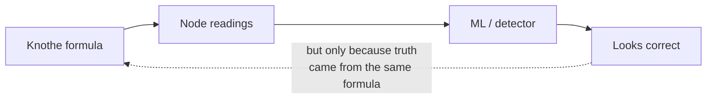
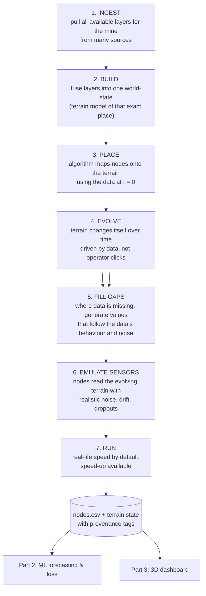
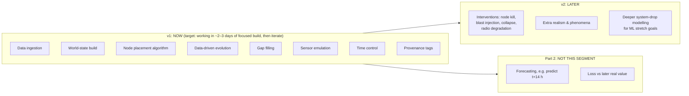
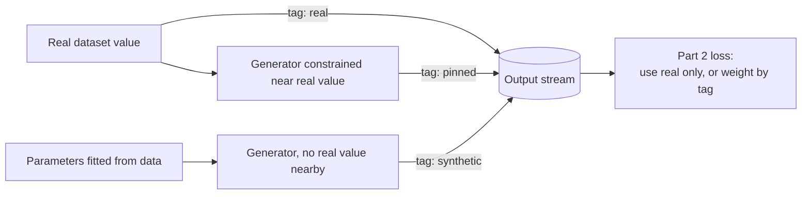

# 08 — Data-Driven Mine Terrain Simulator: Concept Lock & Handoff

**Project:** SIH 2025/26, Problem Statement 26025 (Coal India / Ministry of Coal): AI-enabled, low-cost, real-time mine subsidence monitoring, prediction and early warning for underground coal mines
**Owner of this segment:** Part 1 (simulation & synthetic data), Adarsh
**Status:** Concept agreed. Detailed design not started.
**Date locked:** 12 Sep 2026
**Purpose of this file:** Single self-contained record of everything decided so far about the new simulator direction, so a fresh chat can continue without re-explaining anything.

---

## 0. How to use this file in a new chat

Paste or upload this file and say what you want to work on next (e.g. "design the node placement algorithm" or "write the data feasibility script"). Everything below is the agreed baseline. Items marked **[OPEN]** still need a decision. Items marked **[VERIFY]** are facts not yet checked against the live source.

---

## 1. Project context (short)

| Item | Value |
|---|---|
| Team | 6 people, three owned parts |
| Part 1 | Simulation + synthetic data generation (**this document**) |
| Part 2 | Backend ML / signal processing, including forecasting and its loss |
| Part 3 | Frontend dashboard (React + TypeScript + react-three-fiber) |
| Baseline mine | Adriyala Longwall Project (SCCL, Godavari Valley, near Ramagundam, Telangana) |
| Baseline panel | 250 m × 2500 m, ~375 m depth |
| Sensor network | LoRa mesh (ESP32 + SX1262), IN865 band, 28–31 nodes demo / 39 field sizing |
| Backend stack | Python, FastAPI + WebSocket, NumPy (vectorised, no time-domain loops) |
| Integration artifact | `nodes.csv` written on a fixed cadence (60 simulated seconds in current build) |

### Correction to earlier records
The **current build contains no PINN**. The live pipeline is: operator clicks subsidence on terrain → closed-form Knothe response → node readings → numbers streamed to frontend → ML model processes them. Earlier spec files (00–07) describe a PINN; treat those references as superseded for the current build unless the team re-adds it.

---

## 2. The problem this redesign solves

The current simulator has **one phenomenon** (Knothe subsidence bowl) and **one source of truth** (the formula). Every sensor reading is derived from that formula, and anything downstream that learns or fits from those readings is being tested against the same math that produced them.

This is a **closed loop**: the system looks correct because it is grading its own homework. A judge who understands modelling will spot it.

The goal is to break this loop by making **real data** the thing that shapes the terrain and constrains every generated value.

---

## 3. How the idea evolved (so nobody re-litigates it)

| Step | Proposal | Outcome |
|---|---|---|
| 1 | Simulate "everything that happens in a mine" (gas, fire, roof fall, inundation…) | **Rejected.** Those hazards are underground; our nodes are on the surface and cannot sense them. Would need intrinsically-safe underground hardware under DGMS rules and effectively changes the problem statement. |
| 2 | Keep Knothe, add a swappable "replay truth" that feeds real measured surfaces (satellite InSAR) into the sensor models for validation | Useful sub-idea, **absorbed** into step 4 as the "pinning" mechanism. |
| 3 | Real terrain + automatic node placement + ML forecasts + compare forecast to later outcome | **Accepted in part.** Forecasting and loss belong to Part 2, not this segment. |
| 4 | **Data-driven terrain simulator**: real data builds and drives a living terrain; gaps are filled synthetically in a data-constrained way; nodes read it like real sensors | **Accepted. This is the locked concept.** |

---

## 4. The locked concept

A **mine-independent, data-driven terrain simulator**. Given a mine (location + whatever datasets exist for it), it:

### 4.1 The core rules

1. **Mine-independent.** The same pipeline runs for Adriyala or any other mine. Only the input bundle changes. Nothing mine-specific is hard-coded.
2. **Nothing unconstrained by the data.** Real data is sparse in space and time (satellite ground motion arrives every ~6–12 days; nodes report every minute). Most values must be generated. Therefore:
   - every generator's parameters are **fitted from real data**, and
   - wherever a real value exists, the simulation is **pinned** to match it.
3. **The terrain changes itself.** There is no operator "click to subside" in v1. What drives change is the mine's own progress (extraction / face advance) plus fitted ground behaviour.
4. **One world-state engine.** Exactly one component owns terrain truth. Sensors, placement, dashboard and ML only *read* it. (This replaces the old "one and only one implementation of `S(x,y,t)`" rule; same intent, broader scope.)
5. **Every output value carries provenance** (see §7).

### 4.2 What drives evolution (important)
Since there are no clicks, the simulator needs a **driver**: the mining schedule (where the longwall face is, over time) combined with the ground's response parameters fitted from data. **[OPEN]** Source of the face-advance schedule for Adriyala: published papers, SCCL reports, or an assumed realistic rate documented as an assumption.

---

## 5. Scope

### 5.1 v1: in scope now
| Component | One-line definition |
|---|---|
| Data ingestion | Fetch, crop and normalise all available layers for the mine's area |
| World-state build | Fuse layers into a single terrain model (surface + known underground geometry) |
| Node placement | Rules/optimisation algorithm placing nodes on the terrain at t = 0 |
| Data-driven evolution | Terrain deforms over time driven by mining progress + fitted parameters |
| Crack / fissure emergence | Cracks appear where ground stretching exceeds what that soil tolerates **[OPEN: v1 core or v1 stretch]** |
| Gap filling | Data-constrained synthetic values where real data is absent |
| Sensor emulation | Node readings with realistic noise, drift and missing packets |
| Time control | Real-life speed default, adjustable speed-up |
| Provenance | Every value tagged real / pinned / synthetic |

### 5.2 v2: explicitly deferred
Moved out **by decision**, to keep v1 simple. Start these only once v1 behaves as expected.
- Operator interventions not present in the dataset: **node kill, blast injection, collapse trigger, radio degradation, click-to-subside**
- Additional realism (e.g. seasonal soil swell/shrink, water ponding in bowls, residual subsidence, sudden pothole collapse over old workings, seismic-bump-like jumps) unless trivially cheap in v1
- Extended modelling that lets the ML side stretch into predicting how far the ground/system goes down, and other richer targets

### 5.3 Not this segment at all
- **Forecasting and its loss** (Part 2). Their approach: at time *t* predict a value for *t + Δ* (e.g. 14 h), wait until *t + Δ*, compare with the value that actually arrives, compute loss. Our only job is to deliver data they can do this on honestly (see §7, §9).
- **Underground hazards** (gas, fire, roof fall, inundation): out of problem-statement scope.
- **Physical hardware deployment**: Phase 2 roadmap item.

---

## 6. Data sources

### 6.1 Candidate layers
All free. Resolutions approximate. **[VERIFY]** access method and coverage for the Adriyala area during the feasibility spike.

| Layer | Candidate source(s) | Resolution | Use in simulator | Expected difficulty |
|---|---|---|---|---|
| Elevation (terrain shape) | Copernicus GLO-30, SRTM, ISRO CartoDEM (Bhuvan) | 30 m | Terrain mesh, slopes, LoRa line-of-sight, drainage | Easy |
| Land cover | ESA WorldCover | 10 m | Where nodes may/may not go | Easy |
| Surface water | JRC Global Surface Water | 30 m | Exclusion zones; later: where sunken ground floods | Easy |
| Buildings & roads | OpenStreetMap, Google Open Buildings | Vector | Exposure above the bowl; placement constraints | Easy–medium (coverage varies) |
| Imagery | Sentinel-2 | 10 m | Visual texture on the 3D terrain | Easy |
| Soil properties | ISRIC SoilGrids | 250 m | Soil tolerance → crack threshold; confounder strength | Easy, coarse |
| Weather | IMD gridded data, ERA5 | ~10–25 km | Temperature (sensor drift), rainfall (seasonal effects) | Easy, coarse |
| Measured ground motion | Sentinel-1 InSAR, e.g. ASF HyP3 on-demand processing | ~20–80 m | **Pinning points** (real values) | **Hard** (see §6.3) |
| Underground geometry | Published papers on Adriyala / SCCL (panel size, depth, seam thickness) | N/A | Drives where and how much the ground moves | Medium (manual extraction) |
| Mining progress | Papers / reports, or documented assumption | N/A | The evolution driver (§4.2) | **[OPEN]** |

### 6.2 Real-data references found so far (useful for calibration and credibility)
- **Copernicus EGMS (Europe):** free, processed ground-motion products including vertical and east-west components on a 100 m grid, downloadable via explorer or API. Covers Upper Silesia (Poland), a major longwall coal basin where subsidence over typical longwalls reaches roughly 0.75–2.0 m. Useful as a real example of how longwall bowls evolve, even though it is not Indian.
- **Raniganj coalfield (India):** published Sentinel-1 InSAR + DGPS study (2017–2023), max recorded subsidence rate about −21 mm/year. Shows Indian coalfield InSAR is possible, but for slow subsidence over old workings rather than active longwall.
- **Chinese longwall PS-InSAR studies:** have cross-checked InSAR time series against the Knothe time function. Precedent that real data and our existing math can be reconciled.
- **UCI seismic-bumps dataset (Polish longwalls):** 2,584 shift-level records of underground seismic hazard. Underground sensors, so not directly usable by surface nodes; candidate v2 source for sudden-jump behaviour.

### 6.3 Honest limits of the data
1. **Elevation data shows shape, not subsidence.** Vertical error is metres; our signal is centimetres. It builds the terrain, it does not measure motion.
2. **Date mismatch.** SRTM is from 2000, Copernicus DEM from the 2010s; the terrain may already contain old mining effects.
3. **Underground is invisible from the surface.** Depth, panel layout and rock layers must come from published mine information.
4. **Satellite ground motion breaks where we need it most.** Monsoon vegetation destroys the signal, and fast-moving bowl centres lose data. Studies over fast longwall basins report failures in basin centres and atmospheric errors of several cm/year.
5. **Cracks are not observable** in any free satellite product (cm-scale widths). They must emerge from modelled ground stretching; published crack observations are used only to check plausibility.
6. **No public source for our sensor noise.** No open dataset of surface strain/tilt/extensometer nodes at an Indian mine exists. Sensor noise must come from datasheets and published field studies.
7. **Horizontal motion is partly model-based.** Real products give vertical and east-west motion at best, no north-south component; anything needing full horizontal movement (e.g. strain) needs a documented assumption.

---

## 7. Provenance tagging (v1 requirement)

Every value the simulator emits, whether terrain cell or node reading, carries a tag:

| Tag | Meaning |
|---|---|
| `real` | Directly from a measured dataset at that place and time |
| `pinned` | Generated, but forced to agree with a nearby real value |
| `synthetic` | Generated from fitted behaviour with no real value nearby |

Recommended extra field: `source_id` (which dataset / which generator).

**Why this matters:** if Part 2 computes loss against values our gap-filler invented, the loss only measures how well their model learned our simulator. That is the closed loop again. With tags they can compute loss only on `real` values, or weight `real` > `pinned` > `synthetic`. It is cheap to add now and painful to retrofit.

**Integration change:** `nodes.csv` gains a provenance column (and optionally `source_id`). Everything else about the artifact stays as it is unless changed in a later spec.

---

## 8. Node placement algorithm: requirements (design not started)

- **Rules / optimisation, not ML**, so every placement can be explained to judges.
- **Input:** world-state at t = 0 (terrain, land cover, water, buildings/roads, underground panel geometry).
- **Coverage:** size and spacing driven by the zone the underground extraction can influence at the surface. This must resolve the known finding that the old 28-node blanket layout under-samples by roughly 7×. The recommended direction is a **travelling window** that follows face advance.
- **Exclusions:** water bodies, very steep slopes, buildings, roads, other unsuitable land cover.
- **Radio feasibility:** use elevation data to check LoRa line-of-sight between neighbouring nodes / to the gateway.
- **Budget:** respect demo count (28–31) and field sizing (39) as constraints or report the count actually needed.
- **Output:** node registry (`nodes.json`) with coordinates, role, and placement reason.

**[OPEN]** Whether nodes relocate as the window travels (redeployment events) or the layout is fixed at t = 0 with a larger footprint.

---

## 9. For Part 2 (reference only, not our build)

How the forecasting side can know whether predictions are right, including when real values are missing. Recorded here because it defines what our data must support.

| Check | Needs real data? | When known | What it proves |
|---|---|---|---|
| Compare against real measured values | Yes | When available | Works on reality (strongest, sparse) |
| Delayed truth: predict t + Δ, score when t + Δ arrives | No | After Δ | Forecast accuracy; also works in the field |
| Leave-one-node-out: hide a node, predict it from neighbours | No | Immediately | Spatial understanding |
| Physics sanity: no reversing subsidence, neighbours consistent, drop within physical bounds | No | Immediately | Rejects impossible predictions |
| Uncertainty calibration: stated 90% bands contain truth ~90% of the time | Uses delayed truth | Over many predictions | Model knows when it is unsure |

Guidance agreed in discussion: live scores during the demo are **displayed, not learned from**. Training happens offline. A model retraining itself during an unfolding collapse is unsafe.

---

## 10. Architecture principles carried forward

| Principle | Status |
|---|---|
| Python owns all physics/world-state; browser only renders | Kept |
| One source of terrain truth | Kept, generalised to **one world-state engine** |
| No neural network in the safety decision path; classical detector owns alarms | Kept from spec v2 **[VERIFY with team that current build still follows this]** |
| Sim speed | **Changed:** real-life speed default with speed-up (previously 2000× default with auto-slowdown to 10× on collapse). Exact speed presets **[OPEN]** |
| Radio realism constraints (BW125 kHz for IN865 / GSR 564(E), dedup key `(node_id, epoch)`, `STALE` ≠ `QUIET`) | Kept; apply when sensor emulation produces packets |
| Blast-log reuse as false-alarm filter (DGMS Circular 7/1997) | Kept conceptually; blast **injection** moves to v2 |
| Simulator framed openly as a deliberate engineering choice | Kept, and strengthened by provenance tags |

---

## 11. Impact on the existing spec set (00–07)

| File(s) | Impact |
|---|---|
| 00 index / test register | Add this file; new test gates for v1 components get numbers after the current last gate (T46) when detailed design is written |
| Simulation spec files | Core loop changes from "operator click → formula" to "data drives → terrain evolves"; interventions move to a v2 section |
| PINN references | Superseded for current build (§1) |
| `nodes.csv` / `nodes.json` definitions | Add provenance column; placement reason in registry |
| 07 sandbox build plan | Needs a revision once v1 detailed design exists |
| Node under-sampling finding | Now owned by the placement algorithm (§8) |

---

## 12. Open decisions

1. **[OPEN]** Face-advance / mining-progress source for Adriyala (§4.2).
2. **[OPEN]** Cracks and fissures: v1 core or v1 stretch (§5.1).
3. **[OPEN]** Travelling-window redeployment vs fixed wider layout (§8).
4. **[OPEN]** Speed presets and default output cadence at real-life speed (§10).
5. **[OPEN]** Gap-filling method (e.g. statistical interpolation with fitted noise vs physics-guided generation constrained by pinning). Must stay explainable.
6. **[OPEN]** Mine input bundle format: the exact set of files/fields that makes the pipeline mine-independent.
7. **[VERIFY]** Availability and coverage of every layer in §6.1 over the Adriyala area.
8. **[VERIFY]** Whether usable InSAR coherence survives over Adriyala in any season.

---

## 13. Next steps (suggested order)

1. **Data feasibility spike.** A Python script run locally (the Claude sandbox network cannot reach these data portals) that pulls each §6.1 layer for the Adriyala bounding box, crops it, and reports: available / resolution / date / usable or not, including an InSAR coherence check. Output: a short feasibility table that replaces the [VERIFY] marks.
2. **Mine input bundle definition** (decision 6).
3. **World-state data model:** what the single engine stores and exposes.
4. **Node placement algorithm** detailed design (§8).
5. **Evolution + gap filling** detailed design, including provenance rules.
6. **Sensor emulation** noise/drift/dropout models and their sources.
7. Detailed v1 spec with Mermaid diagrams and test gates, then build.
8. After v1 behaves as expected: v2 interventions and extra realism.

---

## 14. Glossary

| Term | Meaning here |
|---|---|
| World-state engine | The single component that owns the terrain's true state over time |
| Pinning | Forcing generated values to agree with nearby real measurements |
| Gap filling | Generating values where no real data exists, using behaviour fitted from data |
| Provenance | Tag on every value: `real`, `pinned`, `synthetic` |
| Closed loop / circularity | Validating a system against data produced by the same model it uses |
| Face advance | Movement of the longwall mining face over time; the driver of ground movement |
| InSAR | Satellite radar technique measuring ground motion between repeat passes |
| DEM | Digital elevation model (terrain height grid) |
| Travelling window | Node layout that follows the moving face rather than blanketing the whole panel |
| Delayed truth | Scoring a prediction once the predicted time actually arrives |
