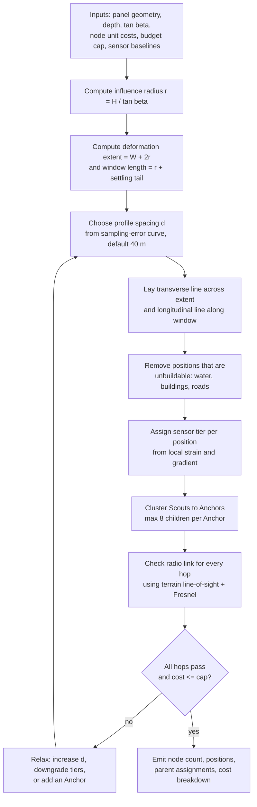
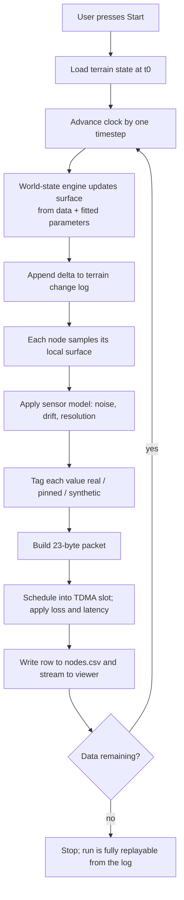

# 09 — Network and Layout Baseline v1

## 0. How to read this document

This file is self-contained. Drop it into a fresh chat with no other context and work can continue.

It replaces `mesh_architecture_summary.md` and `peer-review-resolutions.md` entirely. Where those two disagree with this file, this file wins.

Every number that was previously unknown is now a **tagged assumption** (`A1`, `A2`, …). Each tag has a default value, a reason, and a note on what changes if it moves. **No assumption is load-bearing on the architecture.** Changing any of them changes inputs to the sizing algorithm, never the algorithm itself. Replace values as real data arrives; do not redesign.

### Scope boundary

| In scope (Part 1) | Out of scope |
|---|---|
| Terrain simulation and replay | Backend framework, hosting, deployment |
| Synthetic sensor data with provenance tags | ML model architecture, loss functions, training (Part 2) |
| Node placement sizing algorithm | Frontend dashboard (Part 3) |
| Radio schedule and packet format | Physical hardware procurement and firmware |
| Cost model against a rupee cap | Live mine deployment, DGMS approval |

ML-relevant findings are collected in §11 as notes for the Part 2 owner. They are not resolved here.

---

## 1. Assumption register

Anything marked **OPEN** is a guess with no source. Anything marked **DERIVED** follows from other assumptions. Anything marked **SOURCED** comes from published practice.

### Mine geometry

| Tag | Value | Status | Reason / what changes if it moves |
|---|---|---|---|
| A1 | Panel 250 m wide × 2500 m long | OPEN | Adriyala longwall order of magnitude. A conflicting `750 × 350 m` appeared in an earlier doc; **250 × 2500 is adopted** because longwall panels are long and narrow, and 750 × 350 is board-and-pillar shaped. If A1 changes, node count changes, nothing else. |
| A2 | Working depth 375 m | OPEN | Sets influence radius. |
| A3 | Seam thickness 3.0 m | OPEN | Sets max subsidence linearly. |
| A4 | Subsidence factor a = 0.6 | SOURCED | Typical caving longwall range 0.55–0.9. Conservative end chosen. |
| A5 | tan β = 2.0 (angle of draw factor) | SOURCED | Indian coal measures typically 1.8–2.2. |
| A6 | Face advance 4.0 m/day | OPEN | Sets how fast the travelling window moves. |
| A7 | Knothe time coefficient c = 0.02 /day | OPEN | Settling tail length. t63 = 50 days. |

**Derived from A1–A5:**

- Influence radius `r = H / tan β` = **187.5 m**
- Transverse deformation extent = `W + 2r` = **625 m**
- Full subsidence `S_full = a · m` = **1.80 m**
- Actual peak subsidence = **1.63 m** (the panel is *subcritical* — 250 m is narrower than r, so the trough never reaches full depth)
- Settling tail behind face = `3 · t63 · advance` = **600 m**
- Travelling window length = `r + tail` = **788 m**

> The 1.95 m figure used in the earlier resolutions doc is wrong under these assumptions. It comes from assuming full subsidence is reached. Use **1.63 m**.

### Sensing

| Tag | Value | Status | Reason |
|---|---|---|---|
| A8 | Tier 1B strain rod baseline **10 m** | OPEN | A foil strain gauge measures the flex of the bar it is glued to, not the soil. A 10 m rod spanning two soil anchors converts ground stretch into bar flex. 10 m is a practical transport-and-install length. |
| A9 | Tier 1C wire extensometer baseline **30 m** | OPEN | Wire extensometers work over longer spans than rods; 30 m catches strain across the high-gradient band. |
| A10 | Subsidence detection threshold 10 mm | OPEN | Below this, sensor noise dominates. |

### Radio

| Tag | Value | Status | Reason |
|---|---|---|---|
| A11 | Band IN865, BW **125 kHz** | SOURCED | GSR 564(E) caps carrier bandwidth at 200 kHz, so BW250 is non-compliant. |
| A12 | Scout uplink **SF7**, CR 4/5, explicit header, CRC on, 8-symbol preamble | DERIVED | Shortest airtime that still reaches an Anchor at 40–250 m with ~86 dB spare. |
| A13 | Anchor backbone uplink **SF8** | DERIVED | SF9 pushes Anchor duty to 0.95%, leaving no retry room. SF8 gives 0.56%. |
| A14 | Duty cycle ceiling **1%** — self-imposed, not legal | SOURCED | GSR 564(E) regulates power (1 W ERP) and bandwidth, **not** duty cycle. Do not claim Indian law mandates 1%. Present it as an engineering ceiling adopted from LPWAN practice. |
| A15 | Antenna height: Scout/Anchor **2.0 m**, Gateway **10 m mast** | OPEN | Fresnel clearance, see §5.3. |
| A16 | Superframe period **60 s** | OPEN | Subsidence is a slow process; 60 s is far faster than needed and buys battery life. |
| A17 | 4 local channels (Scout→Anchor), 2 backbone channels (Anchor→Gateway) | OPEN | Carried over from prior design; capacity analysis shows even 1 channel suffices at this node count. |

### Power and cost

| Tag | Value | Status | Reason |
|---|---|---|---|
| A18 | Scout battery 2× 18650 Li-ion = 6000 mAh | OPEN | Cheap, available, field-replaceable. |
| A19 | Currents: TX 120 mA, RX 11 mA, sensor read 20 mA, sleep 20 µA | SOURCED | SX1262 + ESP32-C3 datasheet typicals. |
| A20 | Target battery life **12 months** | OPEN | One maintenance visit per year. |
| A21 | Unit costs: Tier 1A ₹1,200 · Tier 1B ₹1,800 · Tier 1C ₹2,600 · Anchor ₹3,500 · Gateway ₹15,000 | OPEN | Only ₹1,200 was given. Others estimated from component deltas. **Highest-uncertainty numbers in this document.** |
| A22 | Budget cap **₹1,00,000** | SOURCED | Stated project cap. |

---

## 2. Locked architectural decisions

These are not assumptions. They are decisions, and they should not be silently reversed.

1. **The world-state engine owns terrain truth.** It owns the live Z of every node. Not the PINN, not any model.
2. **There is no PINN in this build.** File 08 supersedes every PINN reference in files 00–07. A model that reads terrain state does not get to produce it.
3. **No neural network in the safety path.** The classical Knothe-fit detector is the only thing that raises an alarm.
4. **Exactly one implementation of `S(x,y,t)` exists in the repository.**
5. **Node count is an output, never an input.** The sizing algorithm derives it from coverage need, node properties and budget.
6. **Every emitted value carries a provenance tag** — `real`, `pinned`, or `synthetic`.
7. **Synthetic values are generated only from the behaviour of data that exists.** Nothing is invented freely.
8. **The system is mine-independent.** Adriyala is one example input, not a baseline.

---

## 3. Physical layout

### 3.1 Why not a blanket grid

The earlier design called for Scouts every 15–25 m across the whole deformation footprint. That footprint is 625 × 2875 m = 1.80 km².

| Layout | 20 m grid | 50 m grid | 100 m grid |
|---|---|---|---|
| Blanket, full footprint | 4,785 nodes | 826 | 240 |
| Blanket, travelling window only | 1,353 nodes | 238 | 72 |

At ₹1,200/node the 20 m blanket is ₹57 lakh against a ₹1 lakh cap. This is not a 7× overshoot, it is roughly 100×.

The cause is that two different jobs were merged into one spacing number:

- **Catching a localized crack** genuinely needs 15–25 m node spacing.
- **Resolving the subsidence bowl** does not.

Sampling the computed Knothe transverse profile at different spacings:

| Spacing | Worst subsidence error | Peak tilt error |
|---|---|---|
| 15 m | 18.0 mm | 0.2% |
| 25 m | 18.0 mm | 1.5% |
| **40 m** | **21.2 mm** | **1.5%** |
| 50 m | 32.6 mm | 1.9% |
| 60 m | 46.5 mm | 7.1% |
| 100 m | 117.7 mm | 10.9% |

Nothing meaningful is gained below 40 m, and error climbs sharply past 50 m. **40 m is the knee of the curve.**

Cracks are then caught by **strain measured across a baseline** (A8/A9) rather than by node density — which is both cheaper and how field practice actually does it.

### 3.2 The chosen layout: travelling profile cross

Standard mine subsidence survey practice is profile lines, not blankets: one line across the panel, one along its axis.

```
                  <-- 788 m travelling window -->
         ^   . . . . . . . . . . . . . . . . . . .
         |   .                                   .
    625 m|   .    T T T T T T T T T T T T T T T T T   <- transverse line (17 nodes)
  extent |   .                  L                .
         |   .                  L                .
         v   .                  L  <- longitudinal line (21 nodes)
             . . . . . . . . . . . . . . . . . . .
                    ^ face advances this way -->
```

- **Transverse line:** 17 Scouts at 40 m, spanning the full 625 m deformation extent, crossing the panel centre.
- **Longitudinal line:** 21 Scouts at 40 m, spanning the 788 m active window along the panel axis.
- One node is shared at the crossing → **37 Scouts**.
- The cross **travels with the face**. If instead the layout is fixed at t=0, the longitudinal line must span the full 2500 m and count roughly triples. Travelling is the baseline; see §10 Open Decision 1.

### 3.3 Sensor mix across the 37 positions

Strain and tilt peak in different places, so the tiers are placed by what the ground does there, not uniformly.

| Tier | Sensor | Count | Placed where |
|---|---|---|---|
| 1A | MPU-6050 tilt only | 17 | Flat trough bottom and far edges — low gradient, secondary vote only |
| 1B | Foil strain gauge on 10 m rod + slide potentiometer | 14 | Mid-slope band where subsidence gradient is high |
| 1C | Wire extensometer, 30 m baseline | 6 | Peak-strain band near the inflection point |

**Tilt is a secondary signal, never primary.** Consumer MEMS tilt chips drift with temperature by more than the subsidence signal is worth. Strain and displacement are primary. Common-mode rejection is applied **after** computing σ, not before.

---

## 4. Node sizing algorithm

Node count is computed, not chosen. This is the part that must keep working when any assumption changes.



Two rules the algorithm must not break:

- It never accepts a node count as an input parameter.
- It always reports the cost breakdown alongside the count, so budget is a visible constraint rather than a hidden one.

---

## 5. Radio design

### 5.1 Airtime — corrected

The previously documented figure of **90.4 ms is wrong** and matched no valid configuration. Under A11/A12 (BW125, CR 4/5, explicit header, CRC on, 8-symbol preamble):

| Payload | SF7 | SF8 | SF9 |
|---|---|---|---|
| 23 B Scout uplink | **61.7 ms** | 113.2 ms | 205.8 ms |
| 98 B Anchor bundle (6 × 15 B + 8 B hdr) | 169.2 ms | **297.5 ms** | 533.5 ms |
| 6 B bitmap ACK | **36.1 ms** | 65.9 ms | 118.6 ms |
| 1 B minimum ACK | 25.9 ms | 51.7 ms | 103.4 ms |

Note the 1-byte minimum: a "20 ms ACK" cannot exist, because the preamble alone costs 12.5 ms at SF7.

### 5.2 Duty cycle by tier

The Scout was never the constraint. **The Anchor is.** Against the 600 ms/60 s ceiling (A14):

| Tier | Transmits per frame | Airtime | Duty |
|---|---|---|---|
| Scout | 1 × 23 B uplink | 61.7 ms | **0.10%** |
| Scout (with emergency retx) | 2 × 23 B | 123.4 ms | 0.21% |
| Anchor | 1 bitmap + 1 bundle @ SF8 | 333.6 ms | **0.56%** |
| Anchor if backbone were SF9 | 1 bitmap + 1 bundle @ SF9 | 569.6 ms | 0.95% — no retry room |
| Gateway | 1 beacon | 82.4 ms | **0.14%** |

**Per-device ACKs are abolished.** Six individual ACKs cost an Anchor 155 ms and pushed it to 1.15% at SF9. A single bitmap ACK acknowledges every child at once for 36 ms.

### 5.3 Range — what is actually true

Treat a radio link as a fat invisible tube between antennas, not a thin line. Ground intruding into that tube kills the signal even with clear visual line of sight.

| Hop | Tube (1st Fresnel) radius at midpoint | Antenna height to clear 60% of it |
|---|---|---|
| 40 m | 1.86 m | 1.11 m |
| 150 m | 3.60 m | 2.16 m |
| 1000 m | 9.30 m | 5.58 m |
| 3000 m | 16.11 m | **9.67 m** |

So the "3 km range" is real only from a ~10 m mast — hence A15 putting the Gateway on one. Scouts and Anchors at 2.0 m clear their short hops comfortably.

What makes the short hops robust is raw margin, not range:

| Hop | Received power | Margin over SF7 sensitivity (−123 dBm) |
|---|---|---|
| 40 m | −37 dBm | **86 dB** |
| 150 m | −49 dBm | 74 dB |

Also: at 865 MHz, rain and dust are practically irrelevant. **Vegetation and terrain are what matter.** Do not claim the link punches through dust; claim it survives on 86 dB of margin.

### 5.4 Superframe schedule

```
t = 0.0 s    Gateway beacon: time sync + bitmap ACK for Anchors        (82 ms, SF8)
t = 2.0 s    Scout uplink window opens
             37 Scouts / 4 channels = 10 per channel
             slot = 61.7 ms airtime + 30 ms guard = 92 ms
             worst channel occupancy = 917 ms of a 9500 ms window
t = 11.5 s   Scout uplink window closes
t = 12.0 s   Anchor broadcasts single bitmap ACK                       (36 ms, SF7)
t = 13.0 s   Anchor -> Gateway bundle uplink, 2 backbone channels     (298 ms, SF8)
t = 15.5 s   Emergency backup window opens, 8 sub-slots
t = 16.5 s   Emergency window closes
t = 16.5 s   All tiers sleep until next frame
```

Capacity is not a constraint: one SF7 channel fits 510 slots per frame. The 4-channel plan (A17) has ~20× headroom at this node count.

### 5.5 Scout receive discipline — the power-critical rule

A Scout transmits at, say, t = 2.1 s but its ACK does not arrive until t = 12.0 s.

**It must sleep in between and wake on a timer.** It must not hold the radio in receive.

| Scout behaviour | Receive duty | Radio average current |
|---|---|---|
| Listens continuously until beacon | 16.5% | ~1.82 mA |
| Sleeps, wakes only for the beacon | ~0.3% | ~0.04 mA |

A 45× difference. Continuous listening defeats the entire purpose of the TDMA design.

### 5.6 Failover

Every Scout holds a Primary and Backup Anchor in `nodes.json`. If the bitmap ACK at t = 12.0 s does not show its bit set, its parent is presumed dead. It retransmits at +22 dBm to its Backup Anchor during the emergency window.

**Sub-slot assignment uses child index within the Anchor, not `Node_ID % 16`.**

The realistic failure is one Anchor dying and orphaning all its children simultaneously. Under `Node_ID % 16`, two children with IDs congruent mod 16 (e.g. 7 and 23) land in the same sub-slot and collide — precisely the scenario the mechanism exists to survive. Child index (0–7) is unique by construction, needs no ID-assignment discipline, and is already present in `nodes.json`.

8 sub-slots × 92 ms = 736 ms, fitting the 1 s emergency window.

---

## 6. Power budget

Per 60 s frame, using A18/A19:

| Tier | TX | RX | Sense | Average current | Nameplate life | **At 40% derate** |
|---|---|---|---|---|---|---|
| Scout | 61.7 ms | 0.20 s | 0.5 s | **0.346 mA** | 722 d | **433 d — passes A20** |
| Anchor | 334 ms | 9.5 s | — | **2.426 mA** | 103 d | **62 d — fails A20** |

**The Anchor cannot run on battery alone.** It must listen through the whole 9.5 s Scout window, and that receive current dominates everything else.

Resolution: **Anchors get a small solar panel.** At 2.43 mA and 3.7 V the draw is ~9 mW, i.e. ~216 mWh/day. With 4 peak-sun-hours and 50% system efficiency a **1 W panel** covers it with roughly 10× margin, at negligible cost. The 18650 pack becomes a multi-day monsoon buffer rather than the primary source.

This is deliberately over-specified so that seasonal cloud cover and panel soiling never become a design question.

---

## 7. Cost model

Against the ₹1,00,000 cap (A22), using the estimated unit costs (A21):

| Item | Qty | Unit | Subtotal |
|---|---|---|---|
| Tier 1A Scout (tilt) | 17 | ₹1,200 | ₹20,400 |
| Tier 1B Scout (strain rod) | 14 | ₹1,800 | ₹25,200 |
| Tier 1C Scout (extensometer) | 6 | ₹2,600 | ₹15,600 |
| Tier 2 Anchor (+ 1 W solar) | 6 | ₹3,500 | ₹21,000 |
| Tier 3 Gateway (10 m mast, NB-IoT) | 1 | ₹15,000 | ₹15,000 |
| **Total** | **44 units** | | **₹97,200** |
| **Headroom** | | | **₹2,800** |

This is **tight, and the unit costs are the least reliable numbers in this document.** Treat ₹97,200 as "plausibly fits" rather than "proven". If real costs come in higher, the algorithm's relaxation path (§4, node K) degrades gracefully: widen spacing from 40 m toward 50 m (error 21 mm → 33 mm) before cutting sensor tiers.

The earlier ₹92,500 figure assumed a single ₹1,200 unit price for all 37 Scouts, which stopped being true once the tier split was introduced, and omitted Anchors and Gateway entirely.

6 Anchors serve 37 Scouts as 6/6/6/6/6/7. The bitmap ACK is 1 byte, covering up to 8 children, so this has room.

---

## 8. Data outputs

Three artefacts, so a run can be replayed and inspected at any point in time.

| File | Contents |
|---|---|
| `nodes.csv` | One row per node per frame: node_id, epoch, sensor readings, provenance tag, RSSI, parent used |
| `terrain_state.*` | Full terrain surface at t = 0 |
| `terrain_changes.*` | Ordered log of surface deltas per timestep |

Replaying the change log from t=0 up to any time T reconstructs the exact terrain at T. That is the mechanism for scrubbing backwards and forwards in the 3D view.

### Provenance

Every emitted value carries exactly one tag:

- `real` — measured, from a real dataset
- `pinned` — anchored to a real value at a known reference point
- `synthetic` — generated, and generated **only** from the observed behaviour of data that exists

Nothing is invented freely. Part 2 needs this to score honestly; without it, a model trained on our output is only learning our simulator.

### Packet dedup key

Use `(node_id, epoch)`. **Not `(node_id, seq)`** — sequence numbers reset on reboot, silently merging distinct packets.

### Z coordinate

`z0` in `nodes.json` is the **static t = 0 reference baseline only**. Live Z is owned by the world-state engine (Locked Decision 1). The ground moves up to 1.63 m, so a static Z diverges from reality; but the fix is the world-state engine tracking it, not a model.

---

## 9. Simulation run loop (resolves §4.2)

Pressing **Start** begins replay from a chosen date and runs forward to wherever the data ends. The terrain deforms continuously, like video. The user rotates and inspects in 3D throughout. Nodes read the moving ground and emit packets the whole time.

There is no click-to-subside. Deformation is driven by data and fitted parameters, never by operator clicks.



### Deferred to v2 (do not build now)

External environment knobs that alter the running data — rainfall, temperature, seasonality, blast events. These layer on top of the loop above as modifiers; the loop does not change to accommodate them.

Operator interventions — node kill, blast injection, collapse trigger — are also v2.

**Blast log reuse is the strongest differentiator when it lands.** DGMS Circular 7/1997 mandates blast seismograph logs at Indian mines. Reusing those as a false-alarm filter is free and legally grounded.

---

## 10. Open decisions

These need a human answer eventually. Each has a working default so nothing is blocked.

1. **Travelling window vs fixed layout.** Default: travelling (37 Scouts). Fixed across the full 2500 m roughly triples the count and breaks the budget. Needs a call on whether nodes are physically relocated as the face advances.
2. **Panel geometry conflict.** `250 × 2500 m` adopted (A1) over the `750 × 350 m` that appeared elsewhere. Someone should confirm where 750 × 350 came from.
3. **Unit costs (A21).** Only the ₹1,200 Scout figure was given. Everything else is estimated, and the budget has only ₹2,800 of slack.
4. **Sensor baselines (A8, A9).** 10 m rod and 30 m wire are practical guesses. These directly set how close nodes must sit, so real values feed straight back into §4.
5. **GSR 564(E) duty cycle text.** A14 asserts the notification does not mandate 1%. Worth one team member reading the actual notification, because a judge who knows it will ask.

---

## 11. Notes for the Part 2 owner (ML)

Not requests. Just findings from Part 1 that will affect the model.

- **Input dimensionality is not fixed.** Node count and positions are algorithm outputs and change per mine. The model cannot assume a constant number of inputs.
- **Provenance tags must drive the loss.** Weight `real` values; do not let the model fit `synthetic` values as if they were ground truth, or it learns our simulator instead of the ground.
- **Runs are exactly reproducible** via the terrain change log, so model comparisons are fair and A/B tests are meaningful.
- **Inputs will have gaps.** Packets arrive late or not at all. Missing data is a normal operating condition, not an error case.
- **The `f_gap` inflation factor must be capped at ~10.** Uncapped, it reaches extreme values after extended outages and silently disables the detector.
- **Tilt is a secondary, drift-prone signal.** Do not let the model lean on it as primary. Apply common-mode rejection after computing σ, not before.
- **The detector stays classical.** PINN draws surfaces; the Knothe-fit detector raises alarms. No neural network in the safety path (Locked Decisions 2–3).

---

## 12. Test gates

Global register. Each gate is pass/fail and independently checkable.

| Gate | Assertion |
|---|---|
| G1 | Exactly one implementation of `S(x,y,t)` exists in the repository |
| G2 | Sizing algorithm accepts no node-count input parameter |
| G3 | Sizing algorithm emits a cost breakdown with every layout |
| G4 | Every row in `nodes.csv` carries a provenance tag |
| G5 | No `synthetic` value is generated from anything other than observed data behaviour |
| G6 | Replaying `terrain_changes` from t=0 to T reproduces terrain at T bit-identically |
| G7 | Dedup uses `(node_id, epoch)`; no use of `seq` as a key |
| G8 | Anchor duty cycle ≤ 1% at the configured backbone SF |
| G9 | Scout radio is in receive < 0.5 s per superframe |
| G10 | Emergency sub-slot derives from child index, not node ID modulo |
| G11 | No two children of one Anchor share an emergency sub-slot, under any ID assignment |
| G12 | Total layout cost ≤ budget cap, or the algorithm reports failure explicitly |
| G13 | `z0` is never written after t=0; live Z comes only from the world-state engine |
| G14 | No PINN output feeds any alarm decision |
| G15 | Changing any A-tag value re-runs sizing without a code change |
