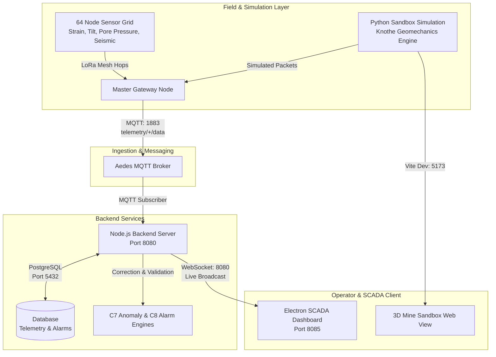

# MINECRAFTS - Mine Subsidence Monitoring & Early Warning System

An end-to-end industrial IoT digital-twin geomechanics platform engineered for real-time mine subsidence monitoring, sensor telemetry aggregation, risk analysis, and early warning alerting for underground mining operations (specifically calibrated for the Adriyala Longwall Project, SCCL).

---

## 🌟 Key Capabilities

- **Real-Time 3D & 2D SCADA Dashboard (`dashboard_electron/`)**:
  - Interactive 3D Digital Twin with regional DEM elevation draping and offline map tile caching.
  - Multi-view split screen, real-time node inspectors, and dynamic sensor graphs (strain, tilt, pore pressure, vibration).
  - 3-Tier industrial alarm engine (`ADVISORY`, `WARNING`, `CRITICAL`) with audio-visual alerts and incident escalation.
  - Replay system allowing historical scrub, pause/resume, and event analysis without affecting live sensor queues.

- **High-Throughput Telemetry Backend (`backend/`)**:
  - Node.js Express server orchestrating REST APIs and low-latency WebSocket broadcasts.
  - PostgreSQL persistence for telemetry history, node registries, threshold configs, and alarm audits.
  - Direct integration with local MQTT broker to ingest 60-second aggregated field packets.

- **Physics-Informed Subsidence Simulation (`simulation/`)**:
  - Python FastAPI engine (`simulation/sandbox/`) implementing Knothe time-dependent subsidence theory with viscoelastic delay.
  - Three.js / React 3D sandbox viewer (`simulation/frontend/`) for visual excavation planning, subsidence bowl deformation, and intervention modeling.
  - Emulates 64+ multi-parameter underground sensors across an 8×8 grid transmitting over simulated LoRa mesh hops.

- **Machine Learning & GNN Pipeline (`ml_dataset_generator/`)**:
  - Synthetic dataset generator (`minegen/`) modeling geotechnical stress, void migrations, and fault dynamics.
  - Graph Neural Network (GNN) and Physics-Informed Neural Network (PINN) architectures for predictive hazard forecasting.

---

## 🏗️ System Architecture



---

## 📁 Repository Structure

```
├── backend/                  # Node.js backend server, REST APIs, WebSocket hub, PostgreSQL schema
│   ├── routes/               # API route handlers (telemetry, nodes, alarms)
│   ├── services/             # MQTT consumer, WebSocket broadcaster, alarm engine
│   ├── server.js             # Backend entrypoint
│   └── package.json
├── dashboard_electron/       # Desktop SCADA frontend (Electron + HTML5/CSS3/JS + Three.js)
│   ├── renderer/             # SCADA UI, 3D terrain viewer, chart widgets, layout engine
│   ├── tiles/                # Offline cached satellite, DEM, and topographic map tiles
│   ├── main.js               # Electron main process
│   ├── serve.js              # Tile caching proxy and static server
│   └── package.json
├── simulation/               # Geomechanics simulation engine & 3D sandbox UI
│   ├── sandbox/              # Python FastAPI server, Knothe subsidence equations, MQTT publisher
│   ├── frontend/             # Three.js / React / Vite 3D interactive excavation viewer
│   ├── data/                 # Regional DEM elevation dataset (Adriyala)
│   ├── scripts/              # Geomechanics stress tests and verification scripts
│   └── tests/                # Automated physics pipeline tests
├── ml_dataset_generator/     # Machine learning training & synthetic data generation
│   ├── minegen/              # Procedural collapse data & sensor noise synthesizer
│   ├── training/             # GNN model architectures, training loops, loss functions
│   └── tests/                # Dataset validation & training unit tests
├── scripts/                  # Unified automation, launcher, broker, and test tools
│   ├── start_all.js          # Cross-platform full-stack launcher
│   ├── broker.js             # Standalone Aedes MQTT broker
│   ├── prefetch_tiles.js     # Map tile pre-caching utility
│   └── verify_data_loop.js   # End-to-end data pipeline verification test
├── docs/                     # Technical specifications, formulas, and architecture diagrams
└── package.json              # Root orchestration and convenience scripts
```

---

## 🚀 Quickstart & Setup

### Prerequisites

- **Node.js** (v18.x or later) & **npm**
- **Python** (v3.10 or later) with `pip`
- **PostgreSQL** (v14+ recommended; optional for in-memory/mock runs)

### 1. Installation

Install root, backend, and frontend dependencies:

```bash
# Install root orchestration packages
npm install

# Install backend dependencies
cd backend && npm install && cd ..

# Install dashboard dependencies
cd dashboard_electron && npm install && cd ..

# Install simulation frontend dependencies
cd simulation/frontend && npm install && cd ..

# Install simulation Python dependencies (in a virtual environment)
cd simulation
python -m venv .venv
# Windows:
.venv\Scripts\activate
# Linux/macOS:
# source .venv/bin/activate
pip install -r <(python -c "import tomllib; f=open('pyproject.toml','rb'); print('\n'.join(tomllib.load(f)['project']['dependencies']))")
cd ..
```

### 2. Launch the Entire System

Run the cross-platform unified launcher:

```bash
npm start
```

This single command automatically starts:
1. **MQTT Broker** on port `1883`
2. **Backend API & WebSocket** on port `8080`
3. **Tile Proxy & Web Server** on port `8085`
4. **Python Geomechanics Engine** on port `8000`
5. **3D Sandbox Frontend** on port `5173`
6. **Electron SCADA Desktop App**

### 3. Individual Service Commands

If you prefer running services independently:

| Component | Command | Description |
| :--- | :--- | :--- |
| **MQTT Broker** | `npm run broker` | Starts embedded Aedes broker on `127.0.0.1:1883` |
| **Backend** | `npm run backend` | Starts Express server on `http://127.0.0.1:8080` |
| **Tile Proxy / Web** | `npm run frontend` | Starts tile server on `http://127.0.0.1:8085` |
| **SCADA Electron** | `npm run electron` | Launches desktop dashboard window |
| **Simulation Server** | `npm run sim` | Starts FastAPI simulation on `http://127.0.0.1:8000` |
| **Simulation 3D UI** | `npm run sim:ui` | Starts Vite dev server on `http://127.0.0.1:5173` |
| **Pipeline Verify** | `npm run verify` | Tests end-to-end data transmission loop |

---

## 📊 Geotechnical Formulas & Alarm Logic

- **Subsidence Model**: Knothe influence function with time-dependent viscoelastic response:
  $$S(x, y, t) = S_{max} \cdot \left[1 - \exp\left(-\frac{t}{\tau}\right)\right] \cdot \Phi(x, y)$$
- **Sensor Parameters**:
  - Strain ($\mu\epsilon$): Micro-strain deformation across tension/compression zones.
  - Tilt ($mm/m$): Angular deviation across $x$ and $y$ vectors.
  - Pore Pressure ($kPa$): Piezometric hydrostatic load variations.
  - Microseismic Rate ($Hz$ / $g$): Pre-collapse acoustic emissions and peak ground acceleration.
- **Alarm Thresholds**:
  - `ADVISORY`: Early trend shift ($> 15\%$ above baseline).
  - `WARNING`: Active subsidence inflection ($> 50\%$ allowable limit).
  - `CRITICAL`: Immediate collapse hazard / tensile strain $> 5.3\text{ mm/m}$. Automated evacuation signal dispatched.

---

## 📄 License

This project is licensed under the ISC License.
