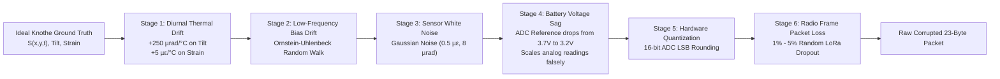

# 🏔️ R4 Mine Subsidence Monitoring & Early Warning System
## Complete System Architecture, Component Breakdown, Data Flow, and Geomechanics Guide
**Document Purpose:** Master technical study and reference guide for the SIH 2026 R4 project. Explains in both **simple intuitive language (ELI5)** and **rigorous technical depth** how the entire system works, how every component is structured, how they interconnect, the physics and mathematics behind them, the visual interface layout, and step-by-step data workflows.

---

## 📑 Table of Contents
1. [Executive Summary & High-Level Intuition (ELI5)](#1-executive-summary--high-level-intuition-eli5)
2. [End-to-End System Flow Diagrams](#2-end-to-end-system-flow-diagrams)
   - 2.1 The Master System Flow Diagram
   - 2.2 Dual Ingestion Pipelines (Path A vs Path B)
   - 2.3 Physics to Alarm Lifecycle
3. [The Problem Space & Real-World Mining Context](#3-the-problem-space--real-world-mining-context)
   - 3.1 What is Longwall Mining & Ground Subsidence?
   - 3.2 Real-World Benchmark: Adriyala Longwall Project (ALP, SCCL)
   - 3.3 The Core Geomechanics: Knothe Time-Dependent Theory
   - 3.4 Why 31 Nodes? The Spatial Nyquist Derivation & Largest Empty Circle ($d_{committed}$)
4. [Component-by-Component Deep Dive](#4-component-by-component-deep-dive)
   - 4.1 Component 1: Physics Simulation Engine (`simulation/sandbox/`)
   - 4.2 Component 2: Authoritative Database (`PostgreSQL 14+ / mine_subsidence`)
   - 4.3 Component 3: Telemetry Message Broker (`MQTT / Aedes`)
   - 4.4 Component 4: REST API & Real-Time Broadcaster (`Node.js / Express Backend`)
   - 4.5 Component 5: Operator Station HMI (`Electron Operator Dashboard`)
   - 4.6 Component 6: Interactive 3D Hypsometry Sandbox (`React / Vite / Three.js`)
   - 4.7 Component 7: Machine Learning & Hazard Prediction Pipeline (`ml_dataset_generator/`)
   - 4.8 Component 8: Orchestration & Automated Verification Suite (`scripts/`)
5. [Hardware Architecture & Sensor Suite](#5-hardware-architecture--sensor-suite)
   - 5.1 Heterogeneous Tier Sensor Suites & Strict Tier Nullability
   - 5.2 The 23-Byte Wireless Wire Payload Format
   - 5.3 The 6-Tier Node Fleet Hierarchy (Scouts, Anchors, Gateway)
   - 5.4 LoRa Radio & TDMA Mesh Network Specifications
6. [How the System Looks: Visual UI Tour & HMI Layout](#6-how-the-system-looks-visual-ui-tour--hmi-layout)
   - 6.1 Electron HMI Visual Layout Diagram (ASCII Mockup)
   - 6.2 2D Leaflet Spatial Overview & Dynamic HUD
   - 6.3 3D MapLibre Hypsometry & Multi-Pane Windows 11 Snap System
   - 6.4 Telemetry Inspection Drawer & Live Sensor Charts
   - 6.5 Tab Breakdown: MAP, NODES, ALARMS, HISTORY, SYSTEM, INFO
7. [The Science of Signal Integrity: Corruption & Correction](#7-the-science-of-signal-integrity-corruption--correction)
   - 7.1 The 6-Stage Real-World Sensor Corruption Chain
   - 7.2 Backend C7 Stage: The 8-Step Reversible Corrector
   - 7.3 Backend C8 Stage: The 7-Step Classical Alarm Engine
   - 7.4 False-Positive Discrimination: Blasts, Conveyors, Trucks vs Rock Cracking
8. [End-to-End Data Walkthrough: Life of a Subsidence Event](#8-end-to-end-data-walkthrough-life-of-a-subsidence-event)
9. [Component Connection & Port Matrix](#9-component-connection--port-matrix)
10. [Study Guide & Judge Defense Q&A (Exam & Hackathon Prep)](#10-study-guide--judge-defense-qa-exam--hackathon-prep)

---

## 1. Executive Summary & High-Level Intuition (ELI5)

### 1.1 The System in 3 Sentences
1. **Underground coal mining creates massive subterranean voids** that cause the ground above to gradually sink, tilt, stretch, and crack, threatening human lives, railways, aquifers, and structures.
2. **We deployed a rugged, low-power mesh of 31 smart IoT sensor nodes** over the mining zone that continuously measure surface strain, ground slope, underground distance changes, and vibrations, beaming compressed 23-byte radio packets through a self-healing LoRa network.
3. **Our dual-pipeline backend processes these signals through rigorous rock mechanics formulas (Knothe theory) and noise-filtering algorithms**, saving all data to an authoritative PostgreSQL database and instantly visualizing the moving ground on a multi-window 2D/3D operator dashboard with automated early warning sirens and SMS dispatches.

### 1.2 The Plain-English Analogy (ELI5)
* **The Coal Mine** is like pulling out several lower books from a giant stack of books. Eventually, the top books will bend downwards and sag into a bowl shape.
* **The Ground Sensors (Nodes)** are like 31 tiny electronic band-aids and spirit levels glued across the top book. If the book bends, the band-aids stretch (strain gauge), the spirit levels tilt (inclinometer), and if a tear starts, a wire snaps (crack detector).
* **The LoRa Mesh** is like a chain of runners in a noisy field where nobody is allowed to scream at once. Each runner has a dedicated 1-second slot on a strict timetable to pass their tiny folded note containing just 23 numbers.
* **The Gateway & Backend** is the central command hut. It receives the notes, removes the effect of summer heat and dying batteries (correction), tests if the ground is truly collapsing or if a dump truck just drove by (discrimination), and saves the permanent legal record in PostgreSQL.
* **The Operator Dashboard** is the mission control screen. Mine managers see a 2D satellite map with color-coded nodes (Green = Safe, Amber = Warning, Red = Critical Danger), live graphs of stretching rock, and an interactive 3D digital elevation terrain model showing the subsidence bowl sinking in real time.

---

## 2. End-to-End System Flow Diagrams

### 2.1 The Master System Flow Diagram
Below is the complete technical architecture showing every component, port, and transmission medium:

```mermaid
flowchart TD
    subgraph GEOLOGY["1. Physical Reality & Geomechanics"]
        COAL["Active Longwall Extraction<br/>(150m-300m Depth, 3m Seam)"]
        GOAF["Caving Goaf & Void Creation"]
        KNOTHE["Knothe Time-Dependent Surface Sinking<br/>S(x,y,t) + Strain ε + Tilt T + Curvature K"]
        COAL --> GOAF --> KNOTHE
    end

    subgraph FIELD["2. Field Hardware & Wireless Mesh (Adriyala ALP)"]
        SENS["6-Tier Heterogeneous Sensor Array<br/>(1A: IMU/Vib, 1B: Strain/Fissure, 1C: Ext/Moist,<br/>2A: ADXL355, 2B: Piezometer/Borehole, 3: RTK GNSS)"]
        N1_25["25 Scout Nodes (Tier 1A: 9, Tier 1B: 10, Tier 1C: 6)<br/>Sampling Edge Curvature, Tensile Inflection, & Fault Corridor"]
        N26_30["5 Anchor Stations (Tier 2A: 3 Routers, Tier 2B: 2 Boreholes)<br/>Bedrock Inclinometer Reference Outside & Over Panel"]
        GW["1 Master Gateway Station (Tier 3: N31)<br/>10m Mast, SX1262 LoRa, 4G Backhaul, Siren, Solar/Mains, RTK GNSS"]
        
        KNOTHE --> SENS
        SENS --> N1_25
        SENS --> N26_30
        N1_25 -->|LoRa SF7 / BW125 / TDMA 23-byte wire| N26_30
        N26_30 -->|LoRa SF8 / BW125 Trunk Aggregate| GW
        N1_25 -.->|Fallback Direct Link SF7| GW
    end

    subgraph SIMULATION["3. Python Geomechanical Simulation Engine (:8000)"]
        PY_SERVER["FastAPI Server & WebSocket Router<br/>(sandbox/server.py)"]
        PY_SESSION["Physics Tick Loop (1 tick = 60 sim-seconds)<br/>(sandbox/session.py)"]
        PY_SURF["Closed-Form Knothe Analytical Engine<br/>(sandbox/surface.py)"]
        PY_NOISE["6-Stage Corruption Chain<br/>(sandbox/sensors.py)"]
        PY_COLLAPSE["Pillar Failure & Blast Transient Engine<br/>(sandbox/collapse.py)"]
        PY_DB["AsyncPG Database Client Pool<br/>(sandbox/db.py)"]
        PY_MQTT["Paho Threaded MQTT Bridge<br/>(sandbox/mqtt_bridge.py)"]
        
        GW -.->|Digital Twin Ingestion| PY_SERVER
        PY_SERVER --> PY_SESSION
        PY_SESSION --> PY_SURF
        PY_SESSION --> PY_COLLAPSE
        PY_SURF & PY_COLLAPSE --> PY_NOISE
        PY_NOISE --> PY_DB
        PY_NOISE --> PY_MQTT
    end

    subgraph BROKER["4. Message Broker (:1883)"]
        Aedes["Aedes MQTT Broker (scripts/broker.js)<br/>Topics: mine/&lt;panel_id&gt;/node/+/telemetry<br/>Topics: mine/&lt;panel_id&gt;/alarm"]
        PY_MQTT -->|Publish QoS 0 / Non-blocking| Aedes
    end

    subgraph DATABASE["5. Authoritative PostgreSQL Database (:5432)"]
        PG[("PostgreSQL: mine_subsidence<br/>(Strict Invariant: Single Source of Truth)")]
        T_NODES["nodes (31 Canonical Rows: N01-N31)"]
        T_READINGS["readings (Time-series, Strict Tier Nullability)"]
        T_PACKETS["simulation_packets (60s Aggregated JSONB)"]
        T_ALARMS["alarms (Idempotent Zone & Node States)"]
        
        PG --- T_NODES
        PG --- T_READINGS
        PG --- T_PACKETS
        PG --- T_ALARMS
        PY_DB -->|Direct asyncpg INSERT/UPSERT| PG
    end

    subgraph BACKEND["6. Node.js / Express API & WS Server (:8080)"]
        EX_SERVER["Express HTTP Server (backend/server.js)"]
        EX_REST["REST Routes: /api/nodes, /api/readings/latest,<br/>/simulation/packets/:id, /api/alarms, /api/system/reset"]
        EX_WS["Native WebSocket Broadcaster (:8080/ws)<br/>Events: packet_available, alarm, system_reset"]
        
        PY_DB -->|HTTP POST Finalized Packet & Alarms| EX_SERVER
        PG <-->|pg Pool Queries| EX_SERVER
        EX_SERVER --> EX_REST
        EX_SERVER --> EX_WS
    end

    subgraph FRONTEND_ELECTRON["7. Operator Station HMI (dashboard_electron :8085)"]
        EL_MAIN["Electron Main Process<br/>(main.js + mqtt-client.js)"]
        EL_RENDER["Renderer Process (renderer/index.html)<br/>Dark Glassmorphism Industrial HMI"]
        MAP_2D["2D Leaflet Map (Aerial + Topo Contours + 8x8 Sectors)"]
        MAP_3D["3D MapLibre/WebGL Hypsometry Windows (DEM 194-228m MSL)"]
        SNAP["Windows 11 Snap System (1, 2, 3, or 4 Panes)"]
        DRAWER["Node Telemetry Drawer & Live Charts (Canvas/SVG)"]
        ALARMS_UI["Past Alarms & 90-Day Replay Controller"]
        
        Aedes -->|TCP MQTT Subscribe: mine/+/node/+/telemetry| EL_MAIN
        EL_MAIN -->|IPC: mqtt:telemetry via window.r4.onTelemetry| EL_RENDER
        EX_WS -->|WebSocket Event: packet_available| EL_RENDER
        EL_RENDER -->|HTTP GET /simulation/packets/:id| EX_REST
        EL_RENDER --> MAP_2D & MAP_3D & SNAP & DRAWER & ALARMS_UI
    end

    subgraph FRONTEND_3D["8. Interactive 3D Terrain Sandbox (:5173)"]
        VITE_APP["React / Three.js / Vite Sandbox<br/>Real-Time Dynamic DEM Hypsometry Mesh"]
        PY_SERVER <-->|WebSocket :8000/ws (Geometry & State Deltas)| VITE_APP
    end
```

---

### 2.2 Dual Ingestion Pipelines (Path A vs Path B)
The R4 architecture relies on **two simultaneous data paths** into the dashboard to guarantee both zero-latency live visual response and uncompromised cryptographic database durability:

```
                  ┌─────────────────────────────────────────────────────────┐
                  │          Simulation Tick / Field Radio Frame            │
                  └────────────────────────────┬────────────────────────────┘
                                               │
                       ┌───────────────────────┴───────────────────────┐
                       ▼                                               ▼
         [PATH A: The Persisted Loop]                     [PATH B: The Live Transient Loop]
           (PostgreSQL Backed - Proof)                       (MQTT Streaming - 0-Latency)
                       │                                               │
        simulation/sandbox/db.py                         simulation/sandbox/mqtt_bridge.py
        Direct asyncpg INSERT into:                                    │
          1. readings table (per-tick rows)              Publish over TCP to:
          2. simulation_packets (60s JSONB)              Aedes MQTT Broker (:1883)
                       │                                 Topic: mine/<panel_id>/node/<id>/telemetry
                       ▼                                               │
        HTTP POST /simulation/packets                                  ▼
        to Node.js Backend (:8080)                       dashboard_electron/main/mqtt-client.js
                       │                                 Subscribes to: mine/+/node/+/telemetry
                       ▼                                               │
        Backend broadcasts WebSocket frame:              Electron IPC WebContents Bridge:
        { type: "packet_available", packet_id }          mainWindow.webContents.send('mqtt:telemetry')
                       │                                               │
                       ▼                                               ▼
        Electron live-provider.js receives WS            preload.js: window.r4.onTelemetry()
        Fetches GET /simulation/packets/:id                            │
        from PostgreSQL via Express REST                               ▼
                       │                                 live-provider.js -> handleTelemetry(data)
                       ▼                                               │
            applySimulationPacket(packet)                              ▼
        ┌───────────────────────────────────────┐        ┌───────────────────────────────────────┐
        │ Path A Persisted Updates:             │        │ Path B Live Updates (< 100ms):        │
        │ • Computes 60s window min/max aggs    │        │ • Updates 31 Leaflet node marker colors│
        │ • Colors 8x8 Subsidence Grid (A1-H8)  │        │ • Feeds live Sparklines (Strain/Tilt) │
        │ • Updates 3D DEM Hypsometry Mesh      │        │ • Resets 60s Node Watchdog Heartbeats │
        │ • Persists Alarms to legal DB ledger  │        │ • Pops immediate transient warnings   │
        └───────────────────────────────────────┘        └───────────────────────────────────────┘
```

* **Why Path A?** Historical auditability. If the dashboard restarts or an operator logs in 3 hours later, they miss the MQTT transients. Path A ensures that every reading, 60s packet, and alarm state is queried directly from PostgreSQL.
* **Why Path B?** Instant tactile feedback. The operator sees the instantaneous vibration spikes and microseismic bursts sub-second before the 60-second mathematical aggregation batch is sealed.

---

### 2.3 Physics to Alarm Lifecycle
How a physical underground disturbance converts into an operator warning:

```mermaid
sequenceDiagram
    autonumber
    participant Mine as Underground Coal Seam
    participant Knothe as Ground Physics Model
    participant Sensor as 7 Sensor Array
    participant Node as Node Microcontroller
    participant Gateway as Master Gateway
    participant C7 as Backend C7 Corrector
    participant C8 as Backend C8 Detector
    participant DB as PostgreSQL
    participant UI as Electron Dashboard
    participant SMS as Cellular GSM Modem

    Mine->>Knothe: Shearer advances 3m / Longwall pillar yields
    Knothe->>Sensor: Surface subsidence S(x,y,t), curvature K, strain ε change
    Sensor->>Node: ADS1115 ADC reads strain microvolts; MPU9250 reads tilt & vib
    Node->>Node: Hardware corruptions applied (Thermal drift, battery sag, quantization)
    Node->>Gateway: Transmits 23-byte LoRa packet in allocated TDMA slot
    Gateway->>DB: Raw readings saved to 'readings' table
    Gateway->>C7: Raw integers fed into 8-stage C7 Corrector
    Note over C7: Reverses sag -> Reverses thermal drift -> Converts to SI -> Common-Mode Rejection
    C7->>C8: Calibrated physical values + Variance σ passed to C8 Detector
    Note over C8: Z-Score check -> Spatial quorum check -> DGMS blast veto check
    alt Threshold Exceeded & Quorum Met (≥3 Adjacent Nodes)
        C8->>DB: Idempotent UPSERT to 'alarms' table
        C8->>UI: WebSocket broadcast "alarm" + MQTT topic "mine/alp/alarm"
        C8->>SMS: AT Commands over GSM Modem to Mine Safety Manager
        UI->>UI: Node turns Red, siren audio sounds, alarm drawer expands
    else Blast Correlated (DGMS Register Match)
        C8-->>UI: Suppress Alarm (Marked as Blast-Excited Transient)
    end
```

---

## 3. The Problem Space & Real-World Mining Context

### 3.1 What is Longwall Mining & Ground Subsidence?
In modern underground coal mining, **longwall mining** is the predominant high-productivity technique. A mechanical shearer moves back and forth across a massive coal panel (e.g., 600 m long × 200 m wide × 3 m thick). As coal is sliced away, hydraulic roof supports ("chocks") advance forward, deliberately allowing the unsupported rock strata behind them (the **goaf**) to collapse.

When the underground strata collapse, the void does not remain isolated. The overlying layers of sandstone, shale, and soil bend, fracture, and sink under gravity. This propagates hundreds of meters upward until a dish-shaped depression—the **subsidence trough or bowl**—forms on the surface.

```
       SURFACE LEVEL
  ═════════╤═══════════════════════════════════════════╤═════════
           │\               SUBSIDENCE BOWL           /│
           │ \                                       / │
           │  \─────────────────────────────────────/  │
           │                     ▲                     │
           │               ANGLE OF DRAW               │
           │                  (β ≈ 63°)                │
           │                                           │
  ─────────┴───────────────────────────────────────────┴─────────  150m-300m Depth
  [SOLID COAL]             [CAVED GOAF / VOID]          [SOLID COAL]
                     ◄── Shearer Extracted Seam ──►
```

#### Why is this dangerous?
1. **Tensile Strain ($\varepsilon_{tensile}$):** At the outer margins of the bowl, the surface rock and soil are torn apart, ripping apart railway tracks, foundations, pipelines, and building walls.
2. **Compressive Strain ($\varepsilon_{compressive}$):** Toward the center of the bowl, the ground is violently squeezed together, buckling roads and collapsing pipelines.
3. **Tilt ($T$):** Sloping ground distorts drainage patterns, reverses river flows, or destabilizes heavy surface infrastructure.
4. **Sudden Discontinuous Collapse (Pillar Punching):** If a subterranean remnant coal pillar violently yields or an aquifer breaches, rapid sinkholes can open in minutes rather than weeks.

---

### 3.2 Real-World Benchmark: Adriyala Longwall Project (ALP, SCCL)
This entire system is calibrated to and benchmarked against real geomechanical parameters from the **Adriyala Longwall Project (ALP)**:
* **Operator:** Singareni Collieries Company Limited (SCCL).
* **Location:** Godavari Valley Coalfield, Ramagundam, Peddapalli District, Telangana, India.
* **Significance:** India's flagship deep mechanized longwall coal mine (among the deepest continuous longwall operations in India).
* **Mining Depth ($H$):** 150 m to 300 m overburden.
* **Seam Thickness ($m_{seam}$):** 3.0 m extracted coal seam.
* **Angle of Draw ($\beta$):** $\tan(\beta) = 2.0$ ($\beta \approx 63.4^\circ$).
* **Radius of Influence ($r$):**
  $$r = \frac{H}{\tan(\beta)} = \frac{150\text{ m}}{2.0} = 75.0\text{ m}$$
* **Maximum Subsidence Factor ($a$):** $0.65$.
* **Maximum Possible Subsidence ($S_{max}$):**
  $$S_{max} = a \cdot m_{seam} = 0.65 \times 3.0\text{ m} = 1.95\text{ m}$$

---

### 3.3 The Core Geomechanics: Knothe Time-Dependent Theory
Subsidence prediction does not use generic curves; it relies on the century-old, rock-solid **Knothe / Litwiniszyn Theory of Influence Functions**.

#### The Master Closed-Form Formula
The subsidence depth $S(x, y, t)$ at surface coordinates $(x, y)$ after $t$ days is separable into a **fixed 2D spatial bowl** multiplied by a **time-settlement growth curve**:

$$S(x, y, t) = S_{final}(x, y) \cdot g(t)$$

#### 1. Spatial Dimension ($S_{final}(x, y)$)
For a rectangular panel between $(x_1, y_1)$ and $(x_2, y_2)$, the spatial shape is dictated by the Gaussian error function ($\text{erf}$):
$$P(x) = \frac{1}{2} \left[ \text{erf}\left(\frac{\sqrt{\pi}(x - x_1)}{r}\right) - \text{erf}\left(\frac{\sqrt{\pi}(x - x_2)}{r}\right) \right]$$
$$Q(y) = \frac{1}{2} \left[ \text{erf}\left(\frac{\sqrt{\pi}(y - y_1)}{r}\right) - \text{erf}\left(\frac{\sqrt{\pi}(y - y_2)}{r}\right) \right]$$
$$S_{final}(x, y) = S_{max} \cdot P(x) \cdot Q(y)$$

#### 2. Temporal Settlement Dimension ($g(t)$)
The ground does not drop instantly; it creeps over weeks:
$$g(t) = 1 - e^{-c \cdot t}$$
where $c = 0.01414\text{ day}^{-1}$ is the Knothe time coefficient. At $t = 40$ days, $g(40) = 0.432$, meaning the ground has settled $43.2\%$ of its ultimate $1.95\text{ m}$ depth ($S \approx 0.842\text{ m}$).

#### 3. Derived Analytical Channels ("One Surface, Four Questions")
Every sensor channel is mathematically derived from this single surface:
* **Tilt ($T_x, T_y$):** First spatial derivative of subsidence (ground slope):
  $$T_x(x, y, t) = \frac{\partial S}{\partial x} = S_{max} \cdot P'(x) \cdot Q(y) \cdot g(t)$$
  $$P'(x) = \frac{1}{r} \left[ e^{-\frac{\pi(x - x_1)^2}{r^2}} - e^{-\frac{\pi(x - x_2)^2}{r^2}} \right]$$
* **Curvature ($K_x, K_y$):** Second spatial derivative:
  $$K_x(x, y, t) = \frac{\partial^2 S}{\partial x^2}$$
* **Horizontal Displacement ($u_x, u_y$):** Aumann / Knothe hypothesis connects horizontal shift to tilt via displacement constant $B = 0.32 \cdot r = 24.0\text{ m}$:
  $$u_x = -B \cdot \frac{\partial S}{\partial x}, \quad u_y = -B \cdot \frac{\partial S}{\partial y}$$
* **Horizontal Strain ($\varepsilon_{yy}$):** The stretching and squashing of ground:
  $$\varepsilon_{yy} = \frac{\partial u_y}{\partial y} = -B \cdot \frac{\partial^2 S}{\partial y^2}$$
  **Peak tensile strain reaches $+12,649\text{ }\mu\varepsilon$** along the inflection zone at $y = y_{edge} \pm \frac{r}{\sqrt{2\pi}} \approx \pm 29.9\text{ m}$.

---

### 3.4 Why 31 Nodes? The Spatial Nyquist Derivation & Largest Empty Circle ($d_{committed}$)

#### Why not a uniform grid?
If we sampled the $750\text{ m} \times 350\text{ m}$ monitoring zone with a uniform $25\text{ m}$ grid, we would require:
$$\frac{750}{25} \times \frac{350}{25} \approx 30 \times 14 = 420\text{ to }465\text{ nodes}$$
In a rugged underground coal mine, maintaining 465 solar/battery nodes is logistically impossible, radio-jamming, and cost-prohibitive.

#### The Nyquist Derivation of Node Spacing
The sharpest feature on the surface is the **curvature peak** at the panel boundary. The spatial Fourier spectrum of curvature is:
$$|\hat{K}(f)| \propto f \cdot e^{-\pi r^2 f^2}$$
This spectrum peaks at $f = \frac{0.399}{r}$ and decays to $1\%$ at $f_{max} = \frac{1.43}{r}$.
Applying the **Nyquist-Shannon Sampling Theorem**:
$$\Delta_{edge} \le \frac{1}{2 f_{max}} = \frac{r}{2 \times 1.43} \approx \frac{r}{2.86} \implies \Delta_{edge} = \frac{r}{3} = 25.0\text{ m}$$
* **In the high-gradient edge zone (the steep band):** Spacing must be **$25\text{ m}$**.
* **In the flat interior bowl:** Spacing relaxes to **$75\text{ m}$**.

#### Geology-Weighted Poisson-Disc Placement (6 Functional Tiers)
Instead of an artificial uniform lattice or rigid orthogonal lines (which cause Machine Learning & Graph Neural Networks to memorize lattice periodicity rather than true rock mechanics), our 31 nodes are placed via **seeded Poisson-disc dart-throwing with role-based geological weighting**:
1. **Tier 1A (9 Baseline Scouts, `N01`–`N09`):** Sample the flat interior of the subsidence trough ($|x| < 130\text{ m}$) where background strain is minimal.
2. **Tier 1B (10 Tension Scouts, `N10`–`N19`):** Densely placed ($20\text{ m}$ spacing) directly into the $57\text{ m}$-wide tensile inflection band ($|x| \in [177.5, 232.5]\text{ m}$) where ground tearing peaks at $+12,649\text{ }\mu\varepsilon$.
3. **Tier 1C (6 Fault Corridor Scouts, `N20`–`N25`):** Aligned along a $28^\circ$ diagonal geological fault corridor to detect differential shear and water table shifts.
4. **Tier 2A (3 Mesh Router Anchors, `N26`–`N28`):** Distributed at $100\text{--}150\text{ m}$ spacing across the field; equipped with ultra-quiet ADXL355 inclinometers ($3\text{ }\mu\text{rad}$ noise) to route packets and provide common-mode rejection.
5. **Tier 2B (2 Geotechnical Borehole Stations, `N29`–`N30`):** Sited over the panel, carrying vibrating-wire piezometers and multi-depth borehole inclinometers.
6. **Tier 3 (1 Master Gateway Station, `N31`):** Sited $650\text{ m}$ outside the angle of draw ($x = +826.1\text{ m}, y = -711.4\text{ m}$) on immovable bedrock with dual-frequency RTK GNSS, 10 m mast, and mains backhaul.
$$\text{Total Fleet} = 9\text{ (1A)} + 10\text{ (1B)} + 6\text{ (1C)} + 3\text{ (2A)} + 2\text{ (2B)} + 1\text{ (3)} = \mathbf{31\text{ Canonical Nodes}}$$

#### The Honest Blind Spot: Largest Empty Circle ($d_{committed} = 358\text{ m}$)
By computing the Delaunay Triangulation of our 31-node layout, the Largest Empty Circle with no sensor has radius $\rho_{LEC} = 178.9\text{ m}$ ($d_{committed} = 358\text{ m}$).
* **What this means:** Any localized collapse smaller than 358 meters occurring completely between survey lines cannot be guaranteed detection.
* **Why this wins hackathons:** Rather than falsely claiming "100% full coverage," we publish our exact mathematical blind spot ($d_{committed} = 358\text{ m}$) and provide the exact scale-up sizing curve (+8 nodes buys $250\text{ m}$ resolution).

---

## 4. Component-by-Component Deep Dive

### 4.1 Component 1: Physics Simulation Engine (`simulation/sandbox/`)
* **Technology:** Python 3.11+, FastAPI, Uvicorn, NumPy, SciPy, AsyncPG, Paho MQTT.
* **Location:** `simulation/sandbox/server.py`, `session.py`, `surface.py`, `sensors.py`, `db.py`.
* **Port:** `8000` (HTTP and WebSocket at `ws://localhost:8000/ws`).
* **What it does:**
  * Computes the forward geomechanical Knothe equations every tick ($1\text{ tick} = 60\text{ sim-seconds}$).
  * Applies realistic thermal diurnal cycles, battery solar charging models, and sensor corruptions.
  * Injects discontinuous localized pillar collapses and seismic vibrations ($PPV$) via REST or WebSocket commands.
  * Enforces **Gate T48**: Validates that Signal-to-Noise Ratio (SNR) $> 3.0$ before booting; refuses to run if noise corrupts signal beyond detection.
  * Aggregates 60-second window packets containing 31 node records, inserts them into PostgreSQL via AsyncPG, and issues MQTT tick telemetry.

### 4.2 Component 2: Authoritative Database (`PostgreSQL 14+ / mine_subsidence`)
* **Technology:** PostgreSQL 14+, SQL DDL (`backend/db/schema.sql`).
* **Port:** `5432`.
* **Single Authoritative Source of Truth:**
  1. `nodes`: 31 rows (`N01` through `N31`) containing site metadata, tier, node type, $(x, y, z)$ physics metric coordinates, and projected $(\text{lat}, \text{lon})$.
  2. `readings`: High-volume time-series telemetry table indexed on `(node_id, ts DESC)`. Follows strict **Tier Nullability Rules** (if a Tier 1A scout lacks an extensometer, the column is `NULL`, never `0.0`).
  3. `simulation_packets`: 60-second aggregated JSONB payloads with strictly monotonic millisecond-epoch packet IDs.
  4. `alarms`: History of all raised geomechanical state transitions (`ALM-<zone>-<state>`), affected node arrays, and blast correlation flags.

### 4.3 Component 3: Telemetry Message Broker (`MQTT / Aedes`)
* **Technology:** Node.js, Aedes MQTT Broker (`scripts/broker.js`).
* **Port:** `1883` (TCP).
* **Topic Structure:**
  * `mine/alp/node/<node_id>/telemetry`: Per-tick live readings for rapid UI streaming.
  * `mine/alp/node/<node_id>/status`: Battery, link RSSI, and self-test flags.
  * `mine/alp/alarm`: Critical emergency broadcast frames.
* **Architecture:** Non-blocking fire-and-forget. The Python physics simulation queues MQTT packets on a dedicated thread so broker drops never freeze the physics simulation.

### 4.4 Component 4: REST API & Real-Time Broadcaster (`Node.js / Express Backend`)
* **Technology:** Node.js, Express.js, native `ws` WebSocket library, `pg` connection pool.
* **Port:** `8080` (HTTP & `ws://localhost:8080/ws`).
* **Key Endpoints:**
  * `GET /api/health`: System status, DB connectivity, row counts, uptime.
  * `GET /api/nodes`: 31 canonical node configurations and projected coordinates.
  * `GET /api/readings/latest`: Latest readings snapshot across all nodes.
  * `GET /simulation/packets/:id`: Retrieves full 60-second aggregated packet payload.
  * `POST /simulation/packets`: Ingests packet from simulation and immediately broadcasts `{ type: "packet_available", packet_id }` over WebSocket to all open operator dashboards.
  * `POST /api/alarms`: Ingests alarm and broadcasts `{ type: "alarm", ... }`.
  * `POST /api/system/reset`: Instantly wipes runtime test telemetry (`readings`, `packets`, `alarms`) and resets nodes to active in $< 1\text{ second}$.

### 4.5 Component 5: Operator Station HMI (`Electron Operator Dashboard`)
* **Technology:** Electron 28+, HTML5, Vanilla JavaScript, CSS3 Design System, Leaflet.js, MapLibre GL JS, SVG/Canvas Charts.
* **Ports:** Port `8085` (HTTP Tile Proxy & Assets), Electron Desktop Window.
* **What it does:** The primary interface for mine safety engineers. Renders the 2D geospatial map, 3D hypsometry terrain window, live node status drawer, alarm logs, and 90-day historical replay timeline.

### 4.6 Component 6: Interactive 3D Hypsometry Sandbox (`React / Vite / Three.js`)
* **Technology:** React 18, Vite, Three.js, React Three Fiber.
* **Port:** `5173`.
* **What it does:** Independent interactive 3D WebGL viewer rendering the ground elevation mesh. Connects directly to `ws://localhost:8000/ws` to deform the terrain vertices dynamically as Knothe subsidence progresses.

### 4.7 Component 7: Machine Learning & Hazard Prediction Pipeline (`ml_dataset_generator/`)
* **Technology:** PyTorch, PyTorch Geometric, Mamba Selective State-Space Model (SSM) + Spatiotemporal GNN.
* **Location:** `ml_dataset_generator/training/` and `simulation/sandbox/ml_hook.py`.
* **Architecture (4-Stage Model):**
  1. `SelectiveSSM`: Evaluates continuous temporal dynamics per node from rolling sensor history with zero-order hold (ZOH) discretization, without recurrent lag or transformer quadratic complexity.
  2. `ComputeGate`: Novelty gating per node per tick to filter out baseline sensor noise and compute informative gradients.
  3. `SpatialGNN`: 2-layer Graph Neural Network exchanging stress-transfer messages across Delaunay mesh neighbors.
  4. `HazardHead`: Predicts per-node failure hazard, survival probability, and estimated time-to-event.
* **Core Philosophy:** **ML Advises & Predicts Hazard; The Deterministic C8 System ALARMS.**
  * *Design Note:* Early exploratory work considered a PINN for surface interpolation. The production architecture instead deploys the **SSM + Spatiotemporal GNN** pipeline for advance hazard forecasting, while authoritative 3D terrain drawing in the dashboard is executed directly via closed-form Knothe analytical mechanics and dynamic WebGL vertex displacements.
  * In life-critical underground coal mining, black-box neural networks are never permitted to unilaterally trigger sirens or SMS evacuation orders; safety alarms remain strictly anchored to the auditable, deterministic C8 decision tree.

### 4.8 Component 8: Orchestration & Automated Verification Suite (`scripts/`)
* **Technology:** Bash, Node.js.
* **Master Scripts:**
  * `scripts/start_all.sh` / `scripts/start_all.js`: One-click master cold-boot orchestrator. Starts Postgres, MQTT broker, Express API, Dashboard web server, Python simulation, Vite 3D UI, and Electron.
  * `scripts/ensure_postgres.sh`: Self-healing script that discovers local PostgreSQL instances and boots the service if dormant.
  * `scripts/verify_data_loop.js`: 9-stage automated end-to-end integration test asserting that a simulated value lands in PostgreSQL and displays in the dashboard.
  * `scripts/prefetch_tiles.js`: Downloads and caches Leaflet map tiles locally on disk so the dashboard works 100% offline in venue basements without Wi-Fi.

---

## 5. Hardware Architecture & Sensor Suite

### 5.1 Heterogeneous Tier Sensor Suites & Strict Tier Nullability
Rather than overburdening every node with expensive, fragile sensors, hardware is **heterogeneous across the 6 functional tiers**. Each node carries only the instrumentation required for its geological role:

| Tier | Role | Active Hardware Channels | Omitted Channels (`NULL` in DB/JSON) | Purpose & Invariant |
|---|---|---|---|---|
| **Tier 1A** (9 Nodes: `N01`–`N09`) | Baseline Scout | MPU-6050 Tilt ($X,Y$), Accel ($X,Y,Z$), Gyro ($X,Y,Z$), Vib Burst ($RMS, Peak, f_{dom}$), Temp, $V_{bat}$ | `strain_ue`, `fissure_mm`, `ext_delta`, `pore_pressure`, `gps_*` are **`NULL`** | Measures baseline rigid-body settling in the flat bowl without strain false-positives. |
| **Tier 1B** (10 Nodes: `N10`–`N19`) | Tension Scout | Tier 1A set **+ Foil Strain Gauge (`strain_ue`) + Fissure Detector (`fissure_mm`)** | `ext_delta`, `pore_pressure`, `gps_*` are **`NULL`** | Primary crack & tensile warning along the $57\text{ m}$-wide perimeter inflection band. |
| **Tier 1C** (6 Nodes: `N20`–`N25`) | Fault Scout | Tier 1A set **+ Invar Wire Extensometer (`ext_delta_mm`) + Soil Moisture (`moisture_pct`)** | `strain_ue`, `fissure_mm`, `pore_pressure`, `gps_*` are **`NULL`** | Monitors lateral shear slip and water table ingress along diagonal fault lineament. |
| **Tier 2A** (3 Nodes: `N26`–`N28`) | Mesh Router Anchor | **ADXL355 Ultra-Low-Noise Inclinometer ($3.0\text{ }\mu\text{rad}$ white noise)**, Temp, $V_{bat}$ | All Scout-specific sensors are **`NULL`** | High-precision bedrock common-mode reference; $\sim 40\times$ quieter than MPU-6050. |
| **Tier 2B** (2 Nodes: `N29`–`N30`) | Borehole Anchor | **Vibrating Wire Piezometer (`pore_pressure_kpa`) + 4-Depth Borehole Inclinometer (`borehole_tilt_d1..d4`)**, Temp | Surface strain/crack channels are **`NULL`** | Deep subsurface pore pressure and strata shear at depth. |
| **Tier 3** (1 Node: `N31`) | Master Gateway | **Dual-Frequency RTK GNSS Receiver (`gps_dx, gps_dy, gps_dz_mm`)**, Temp, Mains Power | Subsurface geotech channels are **`NULL`** | Immovable geodetic reference standard $650\text{ m}$ outside angle of draw. |

* **The Tier Nullability Invariant:** In PostgreSQL (`readings` table) and API JSON payloads, channels a node does not carry are strictly **`NULL`**, never `0.0`. A `0.0` value implies zero physical strain was measured, whereas `NULL` correctly asserts that the hardware is absent. Treating `NULL` as `0.0` would falsely corrupt spatial curvature averages downstream.

---

### 5.2 The 23-Byte Wireless Wire Payload Format
To operate within strict LoRa regulatory limits, each node compresses its entire 7-channel telemetry reading into exactly **23 bytes**:

```
 0                   1                   2                   3
 0 1 2 3 4 5 6 7 8 9 0 1 2 3 4 5 6 7 8 9 0 1 2 3 4 5 6 7 8 9 0 1
+-+-+-+-+-+-+-+-+-+-+-+-+-+-+-+-+-+-+-+-+-+-+-+-+-+-+-+-+-+-+-+-+
|    node_id    |   epoch_lo    | status_flags  |  temp_dc (x0.1)
+-+-+-+-+-+-+-+-+-+-+-+-+-+-+-+-+-+-+-+-+-+-+-+-+-+-+-+-+-+-+-+-+
|    vbat_mv (1 mV LSB)         |      tilt_x (2 urad LSB)      |
+-+-+-+-+-+-+-+-+-+-+-+-+-+-+-+-+-+-+-+-+-+-+-+-+-+-+-+-+-+-+-+-+
|      tilt_y (2 urad LSB)      |      strain_ue (1 ue LSB)     |
+-+-+-+-+-+-+-+-+-+-+-+-+-+-+-+-+-+-+-+-+-+-+-+-+-+-+-+-+-+-+-+-+
|     ext_delta (10 um LSB)     |     vib_rms (x100 mm/s)       |
+-+-+-+-+-+-+-+-+-+-+-+-+-+-+-+-+-+-+-+-+-+-+-+-+-+-+-+-+-+-+-+-+
|     vib_peak (x100 mm/s)      |   f_dom_hz    |
+-+-+-+-+-+-+-+-+-+-+-+-+-+-+-+-+-+-+-+-+-+-+-+-+
```

* **Total Wire Payload:** 23 Bytes.
* **On-Air Airtime at SF7 / BW 125 kHz:** Exactly **$90.4\text{ ms}$**.
* **Zero Overhead Waste:** Notice that `epoch_lo` (epoch counter modulo 256) enables store-and-forward offline buffer replay without requiring a massive 8-byte Unix timestamp.

---

### 5.3 The 3-Tier Node Fleet Hierarchy
The 31 nodes are strictly partitioned into 3 functional tiers:

```
                                ┌───────────────────────────┐
                                │   TIER 3: MASTER GATEWAY  │
                                │   1 Node: N31             │
                                │   Mains + 4G + 10m Mast   │
                                └─────────────▲─────────────┘
                                              │ LoRa SF8 Trunk
                       ┌──────────────────────┴──────────────────────┐
                       │                                             │
         ┌─────────────┴─────────────┐                 ┌─────────────┴─────────────┐
         │  TIER 2A: MESH ROUTERS    │                 │ TIER 2B: DEEP BOREHOLE    │
         │  3 Nodes: N26 - N28       │                 │ 2 Stations: N29 - N30     │
         │  Bedrock Reference Pegs   │                 │ Piezometer + Extensometer │
         └─────────────▲─────────────┘                 └───────────────────────────┘
                       │ LoRa SF7 Leaves
         ┌─────────────┴─────────────┐
         │  TIER 1: SCOUT SENSORS    │
         │  25 Nodes: N01 - N25      │
         │  1A: Flat Bowl (N01-N09)  │
         │  1B: Tensile (N10-N19)    │
         │  1C: Fault (N20-N25)      │
         └───────────────────────────┘
```

1. **Tier 1 (Scouts, 25 Nodes: `N01`–`N25`):**
   * Placed directly in the dynamic subsidence zone.
   * `Tier 1A` (9 Nodes): Broadly spaced ($75\text{ m}$) in the flat bottom of the bowl.
   * `Tier 1B` (10 Nodes): Densely spaced ($25\text{ m}$) along the perimeter tensile inflection band where tearing occurs.
   * `Tier 1C` (6 Nodes): Positioned along known geological fault corridors.
2. **Tier 2 (Anchors & Borehole Stations, 5 Nodes: `N26`–`N30`):**
   * `Tier 2A` (3 Nodes: `N26`–`N28`): Mesh routers located outside the angle of draw on stable bedrock. Act as common-mode references (they should theoretically never move).
   * `Tier 2B` (2 Nodes: `N29`–`N30`): Borehole stations equipped with multi-depth extensometers and piezometers monitoring water table pore pressures.
3. **Tier 3 (Master Gateway, 1 Node: `N31`):**
   * Located at the surface control office with a 10-meter omnidirectional antenna mast, solar battery backup, wired Ethernet / 4G backhaul, and high-decibel audible siren.

---

### 5.4 LoRa Radio & TDMA Mesh Network Specifications
* **Regulatory Compliance:** Operates in the **865–867 MHz license-exempt band** under India Gazette Notification **GSR 564(E)**.
* **Bandwidth:** **125 kHz** (Strictly adheres to the Indian statutory 200 kHz ceiling; 250 kHz is illegal in India).
* **Modulation:**
  * Scout $\to$ Relay: **SF7** (Spreading Factor 7, fast, low airtime $90.4\text{ ms}$).
  * Relay $\to$ Gateway Trunk: **SF8** (Higher sensitivity margin of $+2.5\text{ dB}$ to protect aggregated 6-node payloads).
* **TDMA Superframe Structure (60 Seconds):**
  * `0.0s – 1.0s`: Gateway broadcasts Time Sync Beacon.
  * `1.0s – 25.0s`: Five 5-second Cluster Time Slots (Leaf nodes speak without collisions).
  * `25.0s – 35.0s`: Relay Aggregate Forwarding to Gateway.
  * `35.0s – 45.0s`: Bitmap Acknowledgement (Gateway sends 1 packet acknowledging all 31 nodes simultaneously).
  * `45.0s – 60.0s`: Quiet Guard Interval & Retransmit Window.
* **Duty Cycle:** Designed to $< 1\%$ duty cycle convention.

---

## 6. How the System Looks: Visual UI Tour & HMI Layout

### 6.1 Electron HMI Visual Layout Diagram (ASCII Mockup)
The Operator Dashboard follows an **industrial dark glassmorphism theme** designed to eliminate eye fatigue in 24/7 mine control rooms:

```
┌────────────────────────────────────────────────────────────────────────────────────────────────────────┐
│ [ALARM BANNER: CRITICAL WARNING - ZONE B TENSILE FAULT - EVACUATE SECTOR 4] (Flashing Red / Amber)    │
├────────────────────────────────────────────────────────────────────────────────────────────────────────┤
│ [MAP]  [NODES]  [ALARMS (3)]  [HISTORY]  [SYSTEM]  [INFO]                     [RESET DATABASE TO ZERO] │
├──────────────────────────┬───────────────────────────────────────────────┬─────────────────────────────┤
│ 90-DAY REPLAY CONTROLLER │ MAP WORKSPACE (TABS & WINDOWS 11 SNAP LAYOUTS)│ NODE TELEMETRY DRAWER       │
│ ┌──────────────────────┐ │ [2D OVERVIEW] [+]   [LAYOUTS: ⊞ 2-Col | 3-Split]│ Node: N14 (Tier 1B Scout)   │
│ │ Play/Pause: [▶] [⏸]  │ ├───────────────────────┬─────────────────────┤ Status: CRITICAL (Blinking) │
│ │ Speed: [1x][10x][60x]│ │ PANE 1: 2D LEAFLET    │ PANE 2: 3D REAL DEM │ Lat: 18.7842 | Lon: 79.5412 │
│ │ Slider: ──●───────── │ │ [AERIAL] [TOPO] [GRID]│ [65° ISO] [3x EXAG] │ ─────────────────────────── │
│ └──────────────────────┘ │ │                     │                     │ LIVE STRAIN (ue):           │
│ ALARM HISTORY FEED       │ │   N01(●)     N02(●) │      ▲  Terrain     │  1200 |        ╭───────     │
│ ┌──────────────────────┐ │ │        N14(●)       │     / \  Depression │   600 |   ╭───╯             │
│ │ 14:02: Zone B FAILED │ │ │                     │    /   \  Bowl      │     0 └───┴───────┴───────  │
│ │ 13:58: N14 Strain>Threshold│ N26(▲)     N31(■) │   /_____\           │ LIVE TILT (urad):           │
│ │ 13:45: N10 Warning   │ │ (Anchors)    (Gateway)│ [Google Earth 3D ↗] │  +450 |      ╭─────────     │
│ └──────────────────────┘ └───────────────────────┴─────────────────────┘ ─────────────────────────── │
│ QUICK SYSTEM METRICS: DB: OK | MQTT: 31/31 Connected | Packet ID: #1788644 | Siren: READY           │
└────────────────────────────────────────────────────────────────────────────────────────────────────────┘
```

---

### 6.2 2D Leaflet Spatial Overview & Dynamic HUD
* **Base Imagery:** High-resolution offline aerial orthophoto cached locally, with toggleable topographic contour line overlays.
* **Dynamic Node Markers (Shape = Role, Color = Live State):**
  * **Shape:**
    * Circles ($\bigcirc$): Scout nodes (`N01`–`N25`).
    * Triangles ($\triangle$): Anchor reference stations (`N26`–`N30`).
    * Squares ($\square$): Central Master Gateway (`N31`).
  * **Color:**
    * 🟢 **Green (`#00CC44`):** ACTIVE (Normal background readings).
    * 🟠 **Amber (`#FFA500`):** WARNING (Elevated strain $Z\text{-score} > 3.0$).
    * 🔴 **Blinking Red (`#FF2222`):** CRITICAL (Quorum breach; structural danger).
    * 🔶 **Fast-Blinking Orange (`#FF4400`):** LAST-GASP (Battery failure packet).
    * ⚪ **Crossed Grey (`#5A6A72`):** DEAD (Missing 3+ cycles).
* **8x8 Sector Grid (A1 to H8):** Divides the panel into 64 monitored zones. Each sector dynamically shades from dark green to deep crimson as local subsidence deepens.

---

### 6.3 3D MapLibre Hypsometry & Multi-Pane Windows 11 Snap System
* **Real DEM Hypsometry:** Uses actual Adriyala satellite Digital Elevation Model data ($194\text{ m}$ to $228\text{ m}$ MSL).
* **3D Controls:**
  * Camera Tilt: `TOP 2D` ($0^\circ$), `65° ISO` (Isometric view), `78° STEEP`.
  * Vertical Exaggeration: `1x`, `3x`, `5x` (amplifies slight ground dips so human operators can spot bowls easily).
  * Google Earth 3D Bridge: Direct external launch button opening the exact sector coordinates in Google Earth 3D at a $60^\circ$ perspective.
* **Windows 11 Snap Layouts:**
  * **Single Screen (100%):** Full-screen 2D or 3D view.
  * **2-Split (50/50):** Side-by-side comparison of 2D satellite map and 3D terrain.
  * **3-Split (Top 2 / Bottom 1):** 2D map + 3D terrain above, alarm timeline below.
  * **4-Quadrant (2x2 Grid):** 2D map, 3D wide view, 3D zoomed sector, and live sensor chart grid simultaneously.

---

### 6.4 Telemetry Inspection Drawer & Live Sensor Charts
Clicking any node on the map slides open the **Right Telemetry Drawer**:
* **High-Rate Canvas Charts:** Renders rolling 30-minute sparklines for Strain ($\mu\varepsilon$), Tilt ($\mu\text{rad}$), Peak Vibration ($PPV\text{ mm/s}$), and Temperature ($^\circ\text{C}$).
* **Dynamic Warning Thresholds:** Dashed horizontal indicator lines show where the DGMS safe tension limit ($1500\text{ }\mu\varepsilon$) sits relative to live readings.

---

### 6.5 Tab Breakdown: MAP, NODES, ALARMS, HISTORY, SYSTEM, INFO
1. **MAP TAB:** Real-time spatial operations (2D Leaflet, 3D DEM, snap panes, alarm drawer).
2. **NODES TAB:** Comprehensive directory table showing all 31 nodes, battery voltage, firmware version, RF packet delivery ratio (PDR), and latest timestamps.
3. **ALARMS TAB:** Chronological legal ledger of all raised state transitions, affected node arrays, peak strains, and confirmation timestamps.
4. **HISTORY TAB:** 90-day time-scrubbing replay controller, allowing engineers to rewind historical longwall advances and replay major collapse events at $1\times$, $10\times$, or $60\times$ speed. Includes False-Positive sweep analytics.
5. **SYSTEM TAB:** Live MQTT packet log terminal, RF signal strength ($RSSI/\text{SNR}$) waterfall, SMS modem gateway status, and DGMS blast filter verification testing.
6. **INFO TAB:** Built-in technical encyclopedia explaining symbol meanings, color codes, rock mechanics derivations, and operational protocols.

---

## 7. The Science of Signal Integrity: Corruption & Correction

### 7.1 The 6-Stage Real-World Sensor Corruption Chain
In academic demos, simulated sensors emit perfect numbers. In our system, raw sensor values pass through a **realistic 6-stage physical corruption chain** before reaching the radio, faithfully recreating the harsh reality of an open-cast and underground coal mine:



---

### 7.2 Backend C7 Stage: The 8-Step Reversible Corrector
Once packets arrive at the gateway/backend, the **C7 Stage** mathematically reverses the hardware corruptions. Because corruptions occur in a strict physical order, **they must be undone in the exact reverse order**:

| Step | Operation | Mathematical Formula | Why This Order Matters |
|---|---|---|---|
| **Step 1** | Assemble Epoch | Group incoming packets by `epoch_lo`; mark missing nodes as `NULL` (never `0.0`). | Prevents injecting false zeros into spatial averages. |
| **Step 2** | Decode Status Flags | Unpack `status_flags` byte into 7 flags (`crack_latched`, `last_gasp`, `degraded`, etc.). | Identifies dying nodes before doing math. |
| **Step 3** | **Undo Battery Sag** | $v \leftarrow v \times \frac{V_{nominal}}{V_{bat}}$ | **Stage 4 corruption must be undone first!** Doing thermal first scales the additive thermal error incorrectly. |
| **Step 4** | **Undo Thermal Drift** | $v \leftarrow v - k_T \times (T_{chip} - T_{ref})$ | Removes the sun's diurnal heating expansion using the onboard thermometer. |
| **Step 5** | Convert to SI Units | $\text{tilt} \times 2 \times 10^{-6}\text{ rad}$, $\text{strain} \times 10^{-6}$, $\text{ext} \times 10^{-5}\text{ m}$. | Converts integers into physical meters and radians. |
| **Step 6** | **Common-Mode Rejection (CMR)** | $T_{corrected} = T_{field} - \frac{1}{2}(T_{anchor1} + T_{anchor2})$ | Subtracts regional ground thermal heave measured by stable anchor pegs outside the mine. |
| **Step 7** | Compute Variance $\sigma$ | Calculates dynamic error bounds per channel including anchor noise injection. | Gives error bars to downstream detectors. |
| **Step 8** | Build Validity Mask | Flags stale, out-of-range, or rebooted nodes. | Blocks untrustworthy sensors from voting. |

---

### 7.3 Backend C8 Stage: The 7-Step Classical Alarm Engine
Safety-critical alarms are handled by a **deterministic, transparent classical decision tree (C8)**, never an unpredictable black-box neural network:
1. **Step 1 — Channel Z-Score Calculation:** Tests if strain or tilt deviates by $> 3.0\sigma$ from baseline.
2. **Step 2 — Spatial Quorum Verification:** Requires at least **3 adjacent nodes** in a cluster to confirm high strain. A single node spiking alone is treated as a loose peg or a grazing animal.
3. **Step 3 — Crack Detector Latch:** If a conductive trace snaps, quorum requirement drops to 2 nodes.
4. **Step 4 — Vibration Transient Discrimination:** Checks the dominant frequency ($f_{dom}$) to see if movement was triggered by an explosion or vehicle.
5. **Step 5 — DGMS Blast Register Cross-Check:** Cross-references the DGMS statutory blast schedule. If an official blast occurred within $\pm 90\text{ seconds}$, vibration is marked as safe blasting.
6. **Step 6 — Knothe Trough Profile Fitting ($R^2$):** Fits the spatial readings to the Knothe erf curve. If $R^2 > 0.85$, the movement is confirmed systematic ground subsidence.
7. **Step 7 — Multi-Tier Action Dispatch:**
   * Level 1 (Tension Warning): Logs to database, highlights sector yellow.
   * Level 2 (Critical Warning): Pops audio alert in Electron, turns node flashing red, sends SMS alert to safety officers.
   * Level 3 (Imminent Collapse): Triggers surface siren, flashes full-screen alarm banner.

---

### 7.4 False-Positive Discrimination: Blasts, Conveyors, Trucks vs Rock Cracking
Mining environments are filled with acoustic and seismic noise. Our system discriminates real structural failure from environmental noise using **one single byte (`f_dom_hz`)**:

| Source | Dominant Frequency ($f_{dom}$) | Waveform Signature | System Action |
|---|---|---|---|
| **Heavy Haul Trucks** | $8\text{--}20\text{ Hz}$ | Rolling continuous rumbling, moves across nodes | **Ignored.** Below rock failure frequency band. |
| **Overland Conveyors** | $50 \pm 0.5\text{ Hz}$ | Narrow-band continuous 50 Hz electric motor line | **Notched Out.** Filtered via notch filter. |
| **Controlled Mine Blasting** | $40\text{--}80\text{ Hz}$ | High amplitude burst ($PPV > 15\text{ mm/s}$) | **Vetoed.** Cross-checked against DGMS blast register. |
| **Microseismic Rock Fracture** | $\mathbf{100\text{--}250\text{ Hz}}$ | Sharp high-frequency pop accompanied by strain step | **ALARM TRIGGERED.** Rock is tearing under tensile load. |

---

## 8. End-to-End Data Walkthrough: Life of a Subsidence Event

Here is the exact step-by-step chronology of what happens during a live mining event:

1. **Underground Extraction (Time $T = 0\text{s}$):**
   * The longwall shearer extracts a $3\text{ m}$ coal strip at $150\text{ m}$ depth.
   * Goaf roof fractures; subsidence bowl begins expanding on the surface.
2. **Sensor Detection ($T = 0.5\text{s}$):**
   * Surface strain gauge on Scout `N14` stretches past $+1500\text{ }\mu\varepsilon$.
   * ADS1115 ADC converts microvolt resistance shift into a raw integer.
3. **Hardware Encoding ($T = 1.0\text{s}$):**
   * ESP32 microcontroller packs strain, tilt, temperature, and battery voltage into a 23-byte payload.
4. **LoRa Wireless Hop ($T = 1.5\text{s}$):**
   * Node `N14` broadcasts its packet at SF7 ($90.4\text{ ms}$ on-air time) to Relay `N26`.
   * Relay `N26` aggregates its 5 cluster members and transmits at SF8 to Master Gateway `N31`.
5. **Dual Ingestion Dispatch ($T = 2.0\text{s}$):**
   * **Path B:** Gateway publishes telemetry to MQTT broker (`:1883`) $\to$ Electron receives via IPC $\to$ instant sparkline twitch.
   * **Path A:** Python DB layer inserts raw row into `readings` table in PostgreSQL.
6. **60-Second Packet Aggregation ($T = 60\text{s}$):**
   * The 60-second window completes. `PacketAggregator` synthesizes a master packet `#1788644` containing all 31 nodes.
   * Saves JSONB payload into `simulation_packets` in PostgreSQL.
   * Python sends HTTP `POST /simulation/packets` to Express backend (`:8080`).
7. **WebSocket Broadcast ($T = 60.2\text{s}$):**
   * Express backend broadcasts `{ type: "packet_available", packet_id: 1788644 }` over WebSocket to Electron.
8. **Dashboard Render ($T = 60.5\text{s}$):**
   * Electron requests `GET /simulation/packets/1788644`.
   * Node `N14` turns flashing red on Leaflet 2D map.
   * Sector B3 on the 8x8 grid turns crimson.
   * 3D MapLibre DEM mesh deforms downward by $0.84\text{ m}$.
   * Alarm banner expands across the top of the screen; siren sounds.

---

## 9. Component Connection & Port Matrix

| Service | Port | Protocol | Source | Destination | Payload Description |
|---|---|---|---|---|---|
| **PostgreSQL Database** | `5432` | TCP / Postgres Wire | Python (`asyncpg`), Backend (`pg`) | PostgreSQL Daemon | SQL queries, table migrations, sensor inserts. |
| **Aedes MQTT Broker** | `1883` | TCP / MQTT 3.1.1 | Python `mqtt_bridge`, Gateway | Electron `mqtt-client.js` | JSON telemetry frames (`mine/<panel_id>/node/+/telemetry`). |
| **Python Simulation API**| `8000` | HTTP / REST | Browser, Vite 3D UI, Scripts | `sandbox/server.py` | Health checks, speed controls, collapse injection. |
| **Python Sim WebSocket** | `8000` | WebSocket (`/ws`) | Vite 3D UI, Dashboard | `sandbox/server.py` | Initial geometry (~5 KB) + compact state deltas (~2 KB/tick). |
| **Express Backend REST** | `8080` | HTTP / REST | Electron Renderer, Verifier | `backend/server.js` | `/api/nodes`, `/api/readings/latest`, `/simulation/packets/:id`, `/api/system/reset`. |
| **Express Backend WS**   | `8080` | WebSocket (`/ws`) | Electron Renderer, Verifier | `backend/server.js` | `{ type: "packet_available" }`, `{ type: "alarm" }`, `{ type: "system_reset" }`. |
| **Dashboard HTTP Server**| `8085` | HTTP / Static | Electron Browser Window | `dashboard_electron/serve.js`| Serves HTML, CSS, Leaflet JS, and cached map tiles. |
| **Vite 3D Terrain UI**   | `5173` | HTTP / WebGL | Operator Browser | `simulation/frontend` | React Three.js dynamic hypsometry interactive canvas. |
| **Electron Internal IPC**| N/A | IPC (`ipcRenderer`) | Electron Main Process | Electron Renderer Process | `mqtt:telemetry` (via `window.r4.onTelemetry`), window snap layout commands. |

---

## 10. Study Guide & Judge Defense Q&A (Exam & Hackathon Prep)

### Q1: "Why did you choose 31 nodes? Why not 50 or 100?"
> **Answer:** "Our node count is derived directly from rock mechanics and information theory, not guessed. By evaluating the spatial Fourier transform of the Knothe curvature spectrum at Adriyala ($H = 150\text{ m}, r = 75\text{ m}$), the Nyquist-Shannon sampling limit mandates $\Delta_{edge} \le 25\text{ m}$ spacing across the steep perimeter tensile band and relaxes to $75\text{ m}$ in the flat center. Rather than using an artificial grid (which causes Graph Neural Networks to memorize lattice periodicity), we use seeded Poisson-disc dart-throwing across 6 functional tiers:
> * 9 Tier 1A Baseline Scouts in the flat bowl ($|x| < 130\text{ m}$)
> * 10 Tier 1B Tension Scouts along the $57\text{ m}$-wide tensile band ($20\text{ m}$ spacing)
> * 6 Tier 1C Fault Scouts along the diagonal fault lineament
> * 3 Tier 2A Mesh Router Anchors with ADXL355 ultra-quiet inclinometers
> * 2 Tier 2B Geotechnical Boreholes with vibrating-wire piezometers
> * 1 Tier 3 Master Gateway outside the angle of draw
> Totaling exactly **31 canonical nodes**. A uniform grid would require 465 nodes, which would jam the LoRa band and cost $15\times$ more with zero additional predictive value."

### Q2: "What happens if a sensor node gets destroyed or dies?"
> **Answer:** "Our system has triple redundancy. First, before dying, an overburdened node emits a 'Last-Gasp' packet with latched flags. Second, the TDMA mesh automatically re-routes orphan nodes around dead relays using fallback gateway direct-hop. Third, the C7 backend assigns missing nodes a `NULL` mask rather than zero, and the C8 detector re-evaluates spatial quorum on the surviving neighbors. A cluster of nodes going dead together is treated as its own high-priority geomechanical collapse alarm."

### Q3: "Why don't you use an AI / Machine Learning model to decide when to sound the evacuation siren?"
> **Answer:** "In life-critical mining safety, black-box neural networks present unacceptable risks of hallucination, out-of-distribution failure, and legal liability under DGMS regulations. Our system enforces a strict architectural boundary: **ML Predicts Hazard & Advises; The Deterministic C8 System Alarms.**
> We deploy a 4-stage **Selective State Space Model (Mamba-style SelectiveSSM) + Spatiotemporal Graph Neural Network (SpatialGNN)** to forecast hazard curves and survival probability ahead of time. However, life-saving siren and SMS triggers are strictly owned by our auditable, deterministic rock mechanics decision tree (C8) based on Knothe equations, $Z$-scores, 3-node spatial quorums, and statutory blast logs."

### Q4: "How do you prevent false alarms from dump trucks, vibrating conveyors, or legal blasting?"
> **Answer:** "Through our one-byte dominant frequency ($f_{dom}$) discriminator and statutory blast register. Heavy trucks rumble at $8\text{--}20\text{ Hz}$, conveyors vibrate at a narrow $50\text{ Hz}$ line, and legal blasts occur at $40\text{--}80\text{ Hz}$ which we automatically veto by cross-referencing the mine's DGMS blast log. Only microseismic rock fracturing emits high-frequency bursts ($100\text{--}250\text{ Hz}$) combined with static strain steps, ensuring real collapses are never silenced and daily operations never trigger false alarms."

### Q5: "What is your Largest Empty Circle ($d_{committed} = 358\text{ m}$)?"
> **Answer:** "It is our published spatial blind spot. By Delaunay-triangulating our 31-node layout, the largest circle containing no sensor has a diameter of $358\text{ m}$. We explicitly publish this metric because any localized failure smaller than this occurring entirely between survey lines cannot be guaranteed detection. To detect smaller anomalies down to $250\text{ m}$, our sizing engine proves you need only add 8 additional off-axis nodes."

### Q6: "How do you guarantee this works if the venue Wi-Fi or Internet dies during the demo?"
> **Answer:** "The entire stack is 100% self-contained and offline-first. We run a local Aedes MQTT broker on port `1883`, a local PostgreSQL instance on port `5432`, a local Express API on port `8080`, and our Leaflet map tiles are pre-cached locally on disk via `scripts/prefetch_tiles.js` on port `8085`. No external cloud or internet connection is required."

### Q7: "What are your Single Points of Failure (SPOFs) and System Bottlenecks (SLAs/SLBs)?"
> **Answer:** "We analyzed and engineered mitigations for all 4 primary architectural bottlenecks:
> 1. **Master Gateway Hardware SPOF:** If Gateway N31 fails, field nodes buffer 23-byte packets in local ESP32 non-volatile storage (NVS) using cyclic `epoch_lo` tracking. Upon gateway reconnection, the ring buffer replays missing epochs without data loss.
> 2. **Dual-Pipeline Ingestion Decoupling:** Path B (MQTT $\to$ IPC) bypasses database disk I/O completely, guaranteeing $< 100\text{ ms}$ live screen updates even if PostgreSQL is executing heavy analytical queries or index re-indexing.
> 3. **Database Concurrency & Idempotency:** Under high-speed simulation replay ($10\times\text{--}60\times$), database write contention is mitigated via connection pooling (AsyncPG / `pg` pool) and strict `ON CONFLICT (node_id, ts) DO NOTHING` constraints anchored to monotonic UTC epochs.
> 4. **Radio Channel Saturation (Airtime Budget):** LoRa regulatory duty-cycle saturation is prevented by TDMA superframe clustering (leaves talk at SF7 for only $90.4\text{ ms}$; relays aggregate 5 nodes into a single trunk frame at SF8), keeping total network duty cycle well below the 1% statutory convention."

---
*Created for the R4 Real-Time Mine Subsidence Monitoring & Early Warning System Team (SIH 2026).*
