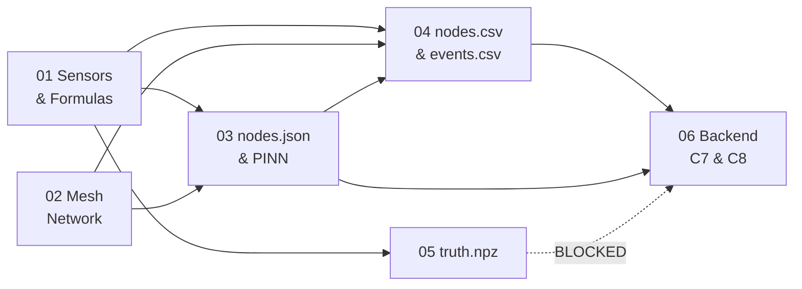

# 00 — Index, Glossary, and the Frozen Constants

**Read this first. It is two pages and it removes 90% of the "where does this live?" questions.**

---

## 1. The six files and what each one owns

| File | Owns | Does NOT own |
|---|---|---|
| **00** (this) | glossary, frozen constants, build order, the boundary rules | any design detail |
| **01 — Sensors & Formulas** | the 8 sensors, the one master formula, every derivation, the corruption chain, why the data is trustworthy at scale | radio, files, PINN |
| **02 — Mesh Network** | node count derivation, topology, relays, slots, airtime, failures, the `mesh` block of `nodes.json` | ground physics, PINN, file schemas other than `mesh` |
| **03 — nodes.json & the PINN** | the complete `nodes.json` schema, and exactly what the PINN receives / never receives / produces | radio behaviour, the alarm |
| **04 — nodes.csv & events.csv** | wire format, the exact CSV columns, how the mesh writes rows, how events are authored | why the numbers have those values |
| **05 — truth.npz** | ground truth storage, quarantine, and the simulation↔real-world map | anything the backend can see |
| **06 — Backend C7 & C8** | correction, σ computation, validity mask, the classical alarm | the PINN, the simulator |

---

## 2. Glossary — every term, in plain words

| Term | Plain meaning |
|---|---|
| **Subsidence** | The ground sinking because coal was removed from underneath it. |
| **Panel** | The rectangle of coal that was dug out. Ours is 600 m × 200 m, 150 m down. |
| **Trough / bowl** | The dish-shaped dent that appears on the surface above a mined panel. |
| **Knothe model** | A hundred-year-old formula that predicts the shape of that dish. We use it as our ground truth. |
| **`r` — radius of influence** | How far sideways the dent spreads past the panel edge. Ours is 75 m. |
| **Tilt** | How much a spot on the ground is sloping. First derivative of the dish. |
| **Strain** | How much the ground is being stretched or squashed. Second derivative of the dish. This is the channel that actually detects things. |
| **Extensometer** | A wire between two pegs. If the ground moves, the wire length changes. |
| **Node** | One box in the field: ESP32 + LoRa radio + 7 sensors + solar panel. |
| **Leaf** | A node that only talks to its relay and sleeps the rest of the time. |
| **Relay** | The same box, with one config flag flipped, that collects 4–5 leaves and forwards them. |
| **Anchor** | A node placed outside the influence zone, so it must read zero forever. Our reference point. |
| **Gateway** | The one box at the surface hut with mains power and internet. Everything ends up here. |
| **LoRa** | A long-range, very slow radio. Good for kilometres, bad for megabytes. |
| **SF — spreading factor** | How slowly the radio speaks. SF7 = fast and short-range. SF12 = very slow, very long-range. |
| **Airtime** | How many seconds a message occupies the shared radio channel. Our only real currency. |
| **Duty cycle** | The fraction of each hour one transmitter is allowed to speak. India: **1%**. Hard law. |
| **TDMA** | Everyone gets a timetable slot. Nobody speaks out of turn, so nobody collides. |
| **Flooding** | Every node repeats every message it hears. Self-healing, but costs N² transmissions. |
| **Epoch** | The 60-second sample number since the scenario started. The network's clock. |
| **PDR** | Packet Delivery Ratio — the chance a message actually arrives. |
| **PINN** | Physics-Informed Neural Network. A small net that draws the surface, but is only allowed to draw shapes the Knothe formula permits. |
| **LOO residual** | Hide one node, guess what it should have read, compare. An accuracy score that needs no answer key. |
| **DGMS** | Directorate General of Mines Safety. Circular 7/1997 makes blast records legally mandatory. |
| **C7 / C8 / C9** | Backend stages: C7 corrects, C8 alarms, C9 draws. |

---

## 3. The frozen constants

One Python module, `sim/constants.py`. **Simulator and backend import the same module.** If they ever hold different values, losses silently fail to converge and it looks like a training bug for a full day.

### 3.1 Ground

| Symbol | Value | Units | Used by |
|---|---|---|---|
| `H` | 150.0 | m | surface, PINN (fixed) |
| `TAN_BETA` | 2.0 | — | surface, PINN (fixed) |
| `R_INFL` | 75.0 | m | `H / TAN_BETA` |
| `M_SEAM` | 3.0 | m | surface, PINN (fixed) |
| `A_SUBS` | 0.65 | — | surface ONLY — PINN must learn this |
| `S_MAX` | 1.95 | m | `A_SUBS × M_SEAM` |
| `C_KNOTHE` | 0.01414 | /day | surface ONLY — PINN must learn this |
| `B_HORIZ` | 24.0 | m | `0.32 × R_INFL` — surface AND PINN (fixed, must match exactly) |
| `PANEL` | (100, 100, 700, 300) | m | x1, y1, x2, y2 |
| `GRID` | x 25→775, y 25→375, 64×64 | m | output grid |

### 3.2 Noise and corruption

| Channel | `k_T` | `σ_b` | `σ_w` | `LSB` |
|---|---|---|---|---|
| tilt_x, tilt_y | 250 µrad/°C | 3 µrad | 8 µrad | **2 µrad** |
| strain | 5 µε/°C | 0.5 µε | 1.2 µε | 1 µε |
| ext | 12 µm/°C | 5 µm | 15 µm | 10 µm |
| temp | — | — | 0.05 °C | 0.1 °C |
| vbat | — | — | 5 mV | 1 mV |

`T_REF = 25.0 °C` · `TAU_OU = 21600 s` · `V_NOM = 3.70 V`

### 3.3 Events

| Constant | Value |
|---|---|
| `PPV_K`, `PPV_EXP` | 1140, −1.6 |
| `Q_EQ_TRUCK` | 0.14 kg |
| `CONV_A0`, `CONV_D0` | 0.8 mm/s, 120 m |
| `THETA_C` | 1500 µε ±10% per node |
| f_dom bands | blast 40–80 · truck 8–20 · conveyor 50±0.5 · microseismic 100–250 Hz |

### 3.4 Radio

| Constant | Value |
|---|---|
| Band / power / duty limit | IN865 / 30 dBm ERP / **1%** |
| Leaf preset | SF7 / BW250 — 45 ms for 37 B |
| Relay preset | SF9 / BW250 — 345 ms for 121 B |
| Event preset | SF7 / BW250 — 35 ms for 24 B |
| Superframe | 60 s |
| Leaf slot | 250 ms (45 ms TX + 205 ms guard) |
| Relay slot | 800 ms |
| Reliable range, ground↔ground | 400 m |
| Reliable range, ground↔10 m mast | 800 m |
| Hop limit | 3 |

### 3.5 Derived peak magnitudes — sanity anchors

If your generator disagrees with these, the generator is wrong.

| Channel | Peak value | Wire capacity | Margin |
|---|---|---|---|
| Subsidence `S` | 1.95 m | not on wire | — |
| Tilt | 26 000 µrad (1.49°) | ±65 534 µrad @ 2 µrad LSB | 2.5× |
| Strain | 8 300 µε | ±32 767 µε | 3.9× |
| Ext (10 m span) | 83 mm | ±327 mm | 3.9× |

---

## 4. The four boundaries that must never move

1. **`truth/` has no import path from `backend/`.** Enforced by test T8 in CI, not by discipline.
2. **One implementation of `S(x, y, t)`.** Every derivative comes from it. There is no second generator.
3. **The PINN never raises an alarm.** C8 never reads C9's output.
4. **No language model anywhere in the safety loop.**

---

## 5. Build order

| Day | Build | Gate |
|---|---|---|
| 1 | `constants.py`, `nodes.json` (all 31 entries, personality frozen), `events.csv` | JSON schema validates; T1, T2 |
| 2 | Layers 0–2: surface, derivatives, weather, event vibration | T9, T10 |
| 3 | Layer 3: six-stage corruption | **T7 — if this fails, stop** |
| 4 | Layer 4: mesh, TDMA, PDR, aggregation, failover | T11, T12 |
| 5 | `readings.parquet`, `nodes.csv`, `radio_report.json`, handoff | T8, T13 |
| 6 | **Freeze.** Scenario tuning only | full suite green |

**Freeze means:** after day 6 the `nodes.json` schema, the wire format, and the C7→C9 contract are immutable. Anything found later is a v5 note, not a code change.

---

## 6. Test register

| Test | Asserts | File that defines it |
|---|---|---|
| T1 | Volume conservation over the bowl | 01 |
| T2 | `S → 0` beyond `r` outside the panel | 01 |
| T3 | Derivatives match finite differences to 1e-7 | 01 |
| T7 | Undoing corruption stages 4 then 1 leaves residual inside the white-noise band | 01 / 06 |
| T8 | `import truth` from `backend/` raises | 05 |
| T9 | `truth_at(check_t[i])` reproduces `check_S[i]` to < 1e-6 | 05 |
| T10 | Simulated crack latch matches the analytic crack time within one sample | 01 |
| T11 | `relay_kill` loses **zero** rows, only delays them | 02 / 04 |
| T12 | Measured worst-node duty cycle < 1.0% across the whole run | 02 |
| T13 | A reboot resetting `seq` causes no upsert collision | 04 |
| T14 | Every `nodes.csv` row has a matching `nodes.json` node id | 04 |
| T15 | Anchors read `|S| < 1 mm` at every epoch in truth | 05 |
