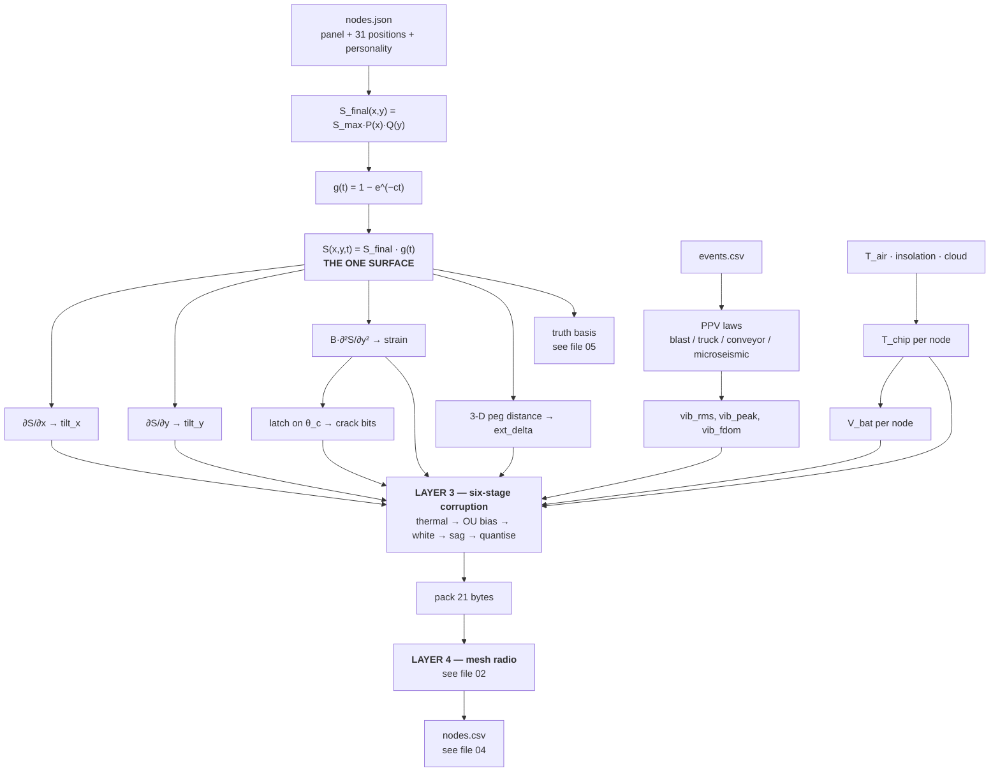

# 01 — Sensors, the Master Formula, and Why Simulated Data Is Trustworthy at Scale

> **This file owns:** what physically sits on a node, what each sensor outputs, the one formula that generates the ground, every derivation from it, the generators for the channels that are *not* derived from it, the six-stage corruption chain, and the argument that lets us generate millions of correct rows.
>
> **This file does NOT own:** radio behaviour (→ 02), file schemas (→ 03, 04), the PINN (→ 03), the alarm (→ 06).

---

## 1. The sensors

### 1.1 ELI5 first — what is actually in the box

Imagine a shoebox screwed to a concrete peg in a field, with a small solar panel on top. Inside:

- a **spirit level that can talk** (tilt),
- a **rubber band glued to the ground** that reports how stretched it is (strain),
- a **tape measure** stretched to a second peg 10 m away (extensometer),
- a **thin wire painted across a slab** that snaps if the slab cracks (crack detector),
- a **microphone for the ground** that hears shaking (vibration),
- a **thermometer** and a **fuel gauge** that exist only so the other four can be trusted,
- and a **walkie-talkie** (LoRa radio).

Everything else in this project is arithmetic about those seven things.

### 1.2 The complete sensor table

| # | Sensor | Part | Physical input | Output channel(s) | Wire format | Real range | Role |
|---|---|---|---|---|---|---|---|
| 1 | Tilt / inclination | MPU9250 accelerometer | direction of gravity vs the board → ground slope | `tilt_x`, `tilt_y` | int16, **LSB 2 µrad** | ±65 534 µrad (±3.75°) | **Secondary vote.** Thermal drift can rival the signal (SNR 2.8:1). Never alarms alone |
| 2 | Die temperature | MPU9250 internal | chip temperature | `temp_dc` | int16, ×0.1 °C | −40 → +85 °C | **Correction key.** Without it, tilt drift is uncorrectable |
| 3 | Strain gauge | foil gauge + ADS1115 | surface stretch/squash across panel width | `strain_ue` | int16, 1 µε | ±32 767 µε | **Primary signal.** SNR 139:1. This is what triggers |
| 4 | Wire extensometer | invar wire, 10 m, to anchor peg | 3-D distance change between two pegs | `ext_delta_10um` | int16, ×10 µm | ±327 mm | **Primary signal.** Directly answers the PS bullet "change in relative distance between nodes" |
| 5 | Crack detector | conductive trace on a substrate | trace has broken (latched, never un-breaks) | `status_flags` bits 0–1 | uint8, 2 bits | level 0–3 | Binary confirmation. Cheap, unambiguous, survives a dead battery |
| 6 | Vibration | accelerometer high-rate burst | ground shaking | `vib_rms_x100`, `vib_peak_x100`, `vib_fdom_hz` | uint16 ×2, uint8 | 0–655 mm/s, 0–255 Hz | **Discriminator, not detector.** Separates blast / truck / conveyor / rock-crack |
| 7 | Battery monitor | resistor divider → ADC | supply voltage | `vbat_mv` | uint16, mV | 3000–4200 mV | Second correction key + maintenance signal |
| 8 | Radio link | LoRa PHY, **measured at the gateway** | quality of the hop that just arrived | `rssi_dbm`, `snr_db`, `hops` | int16, f32, uint8 | −140 → −40 dBm | Provenance. Feeds **σ**, never feeds the PINN |

**Rows 1–7 are on the node. Row 8 is measured at the gateway** — a node cannot measure its own journey.

### 1.3 The two sensors that are not sensors

Temperature and battery voltage do not measure the ground at all. They exist so the four ground channels can be **un-corrupted** later.

> **Analogy.** If you weigh yourself on a bathroom scale on a sloping floor, the reading is wrong. A spirit level taped to the scale doesn't weigh anything — but it tells you exactly how wrong the reading is. `temp_dc` and `vbat_mv` are the spirit level.

### 1.4 Supporting hardware that shapes the data

| Part | Job | Why it appears in the data model |
|---|---|---|
| ESP32 + SX1262 | brain + voice | sets the 21-byte packet ceiling, which sets everything about the cadence |
| ADS1115 external ADC | precise strain measurement | the ESP32's own ADC has documented reference drift; without this, strain σ is 5–10× worse |
| Voltage reference / LDO | stable measurement rail | without it, battery sag directly fakes a drift in every analogue channel |
| Solar + Li-ion | power | `shade_s` per node → different `vbat` curves → different σ per node. **This is why nodes are not clones** |
| Gateway (RPi + 4G + siren + SD) | collect, alert, buffer | siren and SMS are **actions**, not measurements — they appear in no file |

### 1.5 Node compute budget — the ESP32 is genuinely enough

| Task | When | Time on ESP32 @ 240 MHz | RAM |
|---|---|---|---|
| Read 7 channels over I²C/SPI | every 60 s | ~3 ms | 64 B |
| Running mean/max accumulate | every 60 s | < 1 µs | 40 B |
| Crack latch (max with previous) | every 60 s | < 1 µs | 1 B |
| Vibration burst, 256 samples @ 400 Hz | every 60 s | 640 ms wall-clock, mostly idle | 1 KB |
| RMS + peak over the burst | every 60 s | ~10 µs | — |
| 256-point real FFT for `f_dom` | every 60 s | ~1.5 ms | 2 KB |
| Pack 21 bytes + CRC | every 60 s | < 50 µs | 21 B |
| LoRa TX @ SF7 | every 60 s | 45 ms radio-on | — |

**CPU duty ≈ 0.3%. Peak RAM ≈ 4 KB of 520 KB.**

> **The line for the deck:** the binding constraint on a node is **airtime and milliamp-hours, not MIPS**. Compute is free at this scale; every design pressure comes from the radio.

**What the node must NOT do:** thermal correction, sag correction, filtering, or any alarm logic. All of it happens in `backend/C7`/`C8`, where it is auditable. **A node that corrects its own data has destroyed the evidence.**

---

## 2. The one master formula

### 2.1 ELI5

Dig a rectangle of coal out from 150 m underground and the surface above sags into a smooth dish. The dish has two properties:

1. **Its shape never changes.** It is the same dish on day 1 and on day 40.
2. **It only gets deeper.** Depth follows a curve that starts fast and flattens out.

So the whole ground truth is **one picture times one number that grows**. That single fact is the reason this project fits on a laptop.

### 2.2 The formula

```
Derived once at load:
  r      = H / tan_beta            = 75.0 m
  S_max  = a · m_seam              = 1.95 m
  B      = 0.32 · r                = 24.0 m

Spatial profile, per axis (Knothe / Litwiniszyn Gaussian influence over a rectangle):
  P(x) = ½[ erf(√π (x − x₁)/r) − erf(√π (x − x₂)/r) ]
  Q(y) = ½[ erf(√π (y − y₁)/r) − erf(√π (y − y₂)/r) ]

Fully-settled bowl:
  S_final(x, y) = S_max · P(x) · Q(y)

Knothe time function:
  g(t) = 1 − e^(−c·t)                          t = days since extraction

THE MASTER FORMULA:
  S(x, y, t) = S_final(x, y) · g(t)            down positive, metres
```

`P → 1` deep inside the panel, `P → 0` far outside. Same for `Q`.

> **Read the last line carefully — it is the whole of §5.** Space and time are **separable**. The surface at every instant is one fixed image multiplied by one scalar.

### 2.3 Everything derived from it — the closed forms

| # | Channel | Formula | Helper |
|---|---|---|---|
| 1 | `tilt_x` | `∂S/∂x = S_max · P′(x) · Q(y) · g(t)` | `P′(x) = (1/r)[ e^(−π(x−x₁)²/r²) − e^(−π(x−x₂)²/r²) ]` |
| 2 | `tilt_y` | `∂S/∂y = S_max · P(x) · Q′(y) · g(t)` | `Q′(y)` same form in y |
| 3 | `strain` | `ε_yy = B · ∂²S/∂y² = B · S_max · P(x) · Q″(y) · g(t)` | `Q″(y) = (−2π/r³)[ (y−y₁)e^(−π(y−y₁)²/r²) − (y−y₂)e^(−π(y−y₂)²/r²) ]` |
| 4 | `ext_delta` | **exact 3-D**, not a strain integral: `Δ = ‖(p₂+u₂) − (p₁+u₁)‖ − ‖p₂ − p₁‖` where `u = ( B·∂S/∂x , B·∂S/∂y , −S )` at each peg | uses the vertical component too — differential settlement shortens the wire even at zero horizontal strain |
| 5 | `crack_level` | latch: `flag(t) = max over τ ≤ t of level(|ε_yy(τ)|)`, thresholds `θ_c, 2θ_c, 3θ_c` | `θ_c` frozen per node in `nodes.json` |

**The one-line summary: one surface, four questions.** Tilt, strain, extensometer and crack are four different questions asked of a single ground model. They are never generated independently. Generating them independently is the single fastest way to destroy this project, because the PINN's entire job is to prove they are consistent — and if you generated them separately, they trivially are, and the demo proves nothing.

### 2.4 A free test that catches sign errors instantly

Because `g(t)` only increases, the crack time has a closed form:

```
t_crack = −(1/c) · ln( 1 − θ_c / ( B · |∂²S_final/∂y²| ) )        (∞ if the argument ≤ 0)
```

> **Test T10:** the crack latch found by simulation must match this analytic time to within one sample interval. It catches a wrong sign or a wrong `B` in one second.

---

## 3. The channels NOT derived from the master formula

Four things the ground surface cannot explain. Each has its own independent generator.

### 3.1 The generator table

| Channel | Formula | Shared or per-node? |
|---|---|---|
| `T_air(t)` | `T̄ + A_d·sin(2π(t − φ_d)) + A_s·sin(2πt/365 − φ_s)` | **shared** across all nodes |
| `I(t)` insolation | `max(0, sin(π·frac(t) shifted to daylight)) · cloud(t)` | **shared** — `cloud(t)` is one RNG stream |
| `T_chip,i(t)` | `T_air(t) + shade_sᵢ · k_solarᵢ · I(t) + temp_offset_cᵢ` | **per-node**, from `nodes.json` personality |
| `V_bat,i(t)` | SOC integration `+η·shade_sᵢ·I(t)·P_panelᵢ − P_load`, through a Li-ion OCV curve | **per-node** |
| `PPV_blast` | `1140 · (D/√Q)^(−1.6)` mm/s, `D` = node-to-blast distance, `Q` = `charge_kg` | per-event geometry |
| `PPV_truck` | same scaled-distance form with `Q_eq = 0.14 kg` | fitted so a 30 m pass ≈ 1.0 mm/s |
| `PPV_conveyor` | `A₀ · e^(−D/D₀)` while conveyor is on; `A₀ = 0.8 mm/s`, `D₀ = 120 m` | constant floor |
| `PPV_microseismic` | rare Poisson events, amplitude ∝ local `|ε_yy|` | the only *real* rock cracking |

### 3.2 The `f_dom` bands — the whole discriminator in one byte

| Source | `f_dom` | What it means |
|---|---|---|
| Truck | 8–20 Hz | heavy vehicle, ignore |
| Conveyor | 50 ± 0.5 Hz | mains-harmonic line, narrow-band, notch it out |
| Blast | 40–80 Hz | check the DGMS register, veto if logged |
| Microseismic | 100–250 Hz | **rock actually cracking** — this one counts |

Four sources, four separable frequency neighbourhoods, one byte to carry it. **Put this table on a slide.**

### 3.3 Derived vs generated — the decision table

Nobody should ever have to ask "where does this number come from?"

| Channel | Comes from | Reason |
|---|---|---|
| `tilt_x`, `tilt_y` | **master formula** | first derivative of `S` |
| `strain_ue` | **master formula** | second derivative of `S` |
| `ext_delta_10um` | **master formula** | 3-D peg geometry from `S` and its gradients |
| `crack` bits | **master formula** | latch on strain |
| `temp_dc` | independent weather model | the sky, not the ground |
| `vbat_mv` | independent power model | the sun and the load, not the ground |
| `vib_*` | independent PPV laws from `events.csv` | machines and blasts, not the ground |
| `rssi`, `snr`, `hops` | mesh Layer 4 (→ file 02) | the radio journey, not the ground |
| `alive`, `seq` gaps | mesh Layer 4 (→ file 02) | delivery, not measurement |

> **Rule:** if a channel is a derivative of `S`, it must come from `S`. If it is not, it must never be back-fitted to `S`. Mixing the two is how simulators start lying.

---

## 4. The corruption chain — six stages, fixed order

Real sensors do not output clean physics. Layer 3 damages the clean values on purpose, in an order chosen so the backend can undo exactly two of them.

### 4.1 The order and why it cannot change

| # | Stage | Formula | Invertible by C7? |
|---|---|---|---|
| 1 | Thermal drift | `v += k_T,ch · (T_chip − T_ref)` | ✅ **yes** — `temp_dc` is in the same packet |
| 2 | Bias random walk (OU) | `b_{n+1} = b_n·e^(−Δt/τ) + σ_b·√(1−e^(−2Δt/τ))·ξ`, then `v += b` | ❌ no — absorbed into **σ** |
| 3 | White noise | `v += σ_w · ξ` | ❌ no — this *is* σ's floor |
| 4 | Battery sag | `v *= V_bat / V_nom` | ✅ **yes** — `vbat_mv` is in the same packet |
| 5 | Quantisation | `v = round(v / LSB) · LSB`, then clip to the wire type | ❌ no — adds `LSB/√12` to σ |
| 6 | Event vibration | `vib += Σ PPV_sources`, recompute rms / peak / f_dom | separate channel |

**Why the order matters.** Applying quantisation before noise, or sag before thermal, produces a chain that C7 **cannot invert**. And if C7 cannot invert it, the detector cannot work, and nothing downstream is meaningful.

> **Test T7 — run this before anything else exists.** Take the damaged array, undo stage 4 then stage 1 using the *true* `T_chip` and `V_bat`, and confirm the residual sits inside the white-noise band. **If T7 fails, stop building. Nothing downstream can work.**

### 4.2 ELI5

Think of the clean value as a clean shirt. Six things happen to it, in this order: it gets a heat stain (removable), it gets slowly wrinkled (not removable), someone flicks dust on it (not removable), it shrinks in the wash (removable), and then it gets folded into a fixed-size box that rounds off the shape (not removable).

C7 later removes the heat stain and un-shrinks it. The wrinkles and dust it cannot remove, so instead it **measures how bad they are and reports that number as σ**. That honesty is the whole design.

---

## 5. Why this system can simulate huge amounts of *correct* data

Five properties. Each one is load-bearing.

### 5.1 Separability collapses the storage

```
S(x, y, t) = S_final(x, y) · g(t)
```

Frame 1919 is not a new picture. It is frame 0 multiplied by a different scalar. And separability survives every derivative, because `∂/∂x`, `∂/∂y`, `∂²/∂y²` are linear in space while `g(t)` is a constant with respect to them:

| Array | Decomposition | Separable? |
|---|---|---|
| `S` | `S_final · g(t)` | ✅ |
| `dS/dx` | `(∂S_final/∂x) · g(t)` | ✅ |
| `dS/dy` | `(∂S_final/∂y) · g(t)` | ✅ |
| `ε_yy` | `B·(∂²S_final/∂y²) · g(t)` | ✅ |

**125.8 MB of stored frames → 65.5 KB of basis.** A factor of 1920×. Details in file 05.

### 5.2 No time-domain Python loops

Every node-level Layer 0 array is an **outer product**:

```
values[i, t] = S_final(node_i) ⊗ g(t)        shape (31, 57600)
```

One numpy call per channel. 31 nodes × 57 600 minutes × f32 = 7.1 MB per channel. Ten channels = 71 MB peak RAM. Generation time: seconds, not minutes.

**The only genuine `for` loop in the whole pipeline is Layer 4, the radio**, because routing depends on per-packet state. That is documented in file 02 and it is the only place you may write one.

### 5.3 One seed, named streams, byte-identical reruns

```jsonc
"master_seed": 20260901,
"rng_streams": ["weather","cloud","ou_bias","white","shadow","pdr","ack","event_jitter"]
```

Each stream is derived from the master seed by name, never shared. **Rule 5, and chunking depends on it:** noise arrays are generated for the **full time span** and then sliced. A chunked 10-day-block run must be byte-identical to a single 40-day run. Chunking without this rule silently corrupts the second half, and you will not notice.

### 5.4 Per-node personality is frozen, not re-drawn

`shade_s`, `temp_offset_c`, `crack_theta_c_ue`, `sigma_scale`, `battery_wh` and the rest are drawn **once when `nodes.json` is authored** and written into the file. They are never re-drawn at runtime.

Consequence: two people running the simulator on two laptops get identical data, and a bug is reproducible by sending someone a 40 KB JSON file instead of a 200 MB dataset.

### 5.5 The scale-up arithmetic, honestly

| | Demo today | Full deployment |
|---|---|---|
| Nodes / panels / days | 31 / 1 / 40 | 100 / 6 / 90 |
| Simulated minutes | 57 600 | 129 600 |
| One channel, f32 | 7.1 MB | 51.8 MB |
| Ten channels, peak RAM | 71 MB | **518 MB** |
| Packets through the radio loop | 178 560 | **1 296 000** |
| Telemetry rows | 164 k | **1.19 M** |
| Truth basis | 65 KB | **393 KB** — does not break |

**What breaks first, in order:**

1. **The radio loop** (~30–60 s in plain Python at 1.3 M packets). Fix: vectorise the drop decision as one Bernoulli draw over the whole `(N, slots)` array, keeping the loop only for duty-cycle queue state. Or `numba.njit` it — it is one function.
2. **Peak RAM at 518 MB.** Fix: chunk the time axis into 10-day blocks — safe *only* because of §5.3.
3. **CSV at 150 MB.** Fix: switch to parquet above ~500 k rows. The contract is "one row per node per slot", not "the file is CSV".
4. **Truth grid.** Does not break. That is the point of §5.1.

---

## 6. The whole lineage, one flowchart



---

## 7. Gates this file owns

| Test | Asserts |
|---|---|
| **T1** | Volume conservation: `∫∫ S_final dx dy ≈ a · m_seam · panel_area`, within 1% |
| **T2** | `S_final → 0` beyond `r` outside the panel (anchors read < 1 mm) |
| **T3** | Closed-form derivatives match central finite differences of `S` to < 1e-7 |
| **T7** | Undoing corruption stages 4 then 1 with true `T_chip`, `V_bat` leaves residual inside the white-noise band |
| **T10** | Simulated crack latch matches `t_crack = −(1/c)·ln(1 − θ_c/(B·\|∂²S_final/∂y²\|))` within one sample |

---

## 8. Six lines to say out loud

> Each node carries seven cheap sensors and an ESP32 running at 0.3% CPU duty — compute is free, airtime is not, which is why the packet is 21 bytes. Two of those seven sensors do not measure the ground at all; they exist so the other four can be un-corrupted later. All four ground channels are derivatives of one closed-form Knothe surface, so there is no second generator and no way for them to be quietly inconsistent. Vibration, temperature and battery come from independent physical models, because the ground cannot explain a passing truck. Six corruption stages run in a fixed order specifically so the backend can invert two of them and turn the rest into an honest uncertainty. And because the surface is separable in space and time, the truth is one bowl and one exponential rather than nineteen hundred photographs — which is why millions of rows fit on a laptop and why a rerun is byte-identical.
