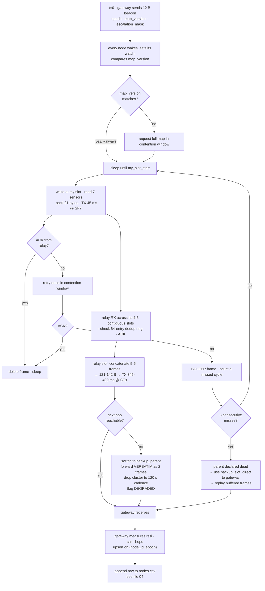

# 02 — The Mesh Network: Nodes, Relays, Slots, Airtime, and Failure

> **This file owns:** how many nodes and why, where they go, who talks to whom, the timetable, every airtime and duty-cycle calculation, relay behaviour, backup paths, all eight failure classes, and the `mesh` block of `nodes.json`.
>
> **This file does NOT own:** ground physics (→ 01), the rest of `nodes.json` (→ 03), the PINN (→ 03), the CSV columns (→ 04), the alarm (→ 06).

---

## 1. Radio physics — four ideas, no maths

**1. Spreading factor is how slowly you speak.** SF7 is talking normally: fast, but the listener must be close. SF12 is shouting one syllable at a time: painfully slow, audible from far away. Each step up roughly **doubles** message duration and buys about 2.5 dB of range.

**2. Airtime is the only currency.** The radio is one shared room. Only one node speaks at a time. Airtime is how many seconds of the room a message occupies. Everything in this document is an argument about who speaks and for how long.

**3. Duty cycle is the law.** India's licence-free LoRa band is 865–867 MHz, 1 W ERP, **1% duty cycle** — each transmitter may occupy the air for at most 36 seconds in any hour. Not a guideline. It binds before the physics does.

**4. Flooding is expensive.** Meshtastic's default routing is *managed flood*: hear a new message, repeat it. Self-healing with zero configuration — and one message costs a dozen transmissions.

> **Flooding, ELI5.** Thirty-one people in a field. One shouts "node 17 tilt is 42." Everyone who heard shouts it again so the far side hears. Then everyone who heard *that* shouts again. One sentence, thirty shouts. Now have all thirty-one people do that at once, every minute.

### 1.1 The airtime table — memorise two numbers

Coding rate 4/5, 16 preamble symbols, explicit header, CRC on. Payload = Meshtastic header (~16 B) + application bytes.

| Preset | 24 B (alert) | 37 B (one node) | 121 B (aggregate ×5) |
|---|---|---|---|
| LongSlow SF12/125 | 1745 ms | 2236 ms | 5022 ms |
| LongFast SF11/250 | 436 ms | **518 ms** | 1133 ms |
| MediumSlow SF10/250 | 218 ms | 280 ms | 628 ms |
| **MediumFast SF9/250** ← relay trunk | 119 ms | 150 ms | **345 ms** |
| ShortSlow SF8/250 | 65 ms | 80 ms | 188 ms |
| **ShortFast SF7/250** ← leaf hop + alerts | **35 ms** | **45 ms** | 107 ms |

**518 ms** is what a packet cost in the old design. **45 ms** is what a leaf packet costs now. Everything else is bookkeeping.

---

## 2. How many nodes — derived, not guessed

### 2.1 The monitoring rectangle falls out of the geometry

```
r = H / tan_beta = 150 / 2.0 = 75 m
```

Subsidence extends `r` past the panel edge in every direction:

```
monitoring rectangle = (600 + 2×75) × (200 + 2×75) = 750 m × 350 m
                     = x ∈ [25, 775],  y ∈ [25, 375]
```

That is exactly the grid in `nodes.json`. The grid was already right; this writes down why.

### 2.2 Uniform sampling is unaffordable — and that is the point

The hard feature is not subsidence depth (smooth, easy) but **curvature**, which changes sign across the trough edge over roughly `r/2 ≈ 37 m`. Three points minimum to resolve a sign change → spacing ≤ 18 m.

```
uniform 18 m grid over 750 × 350 m  =  42 × 20  =  840 nodes
```

Non-starter at any plausible cost. So one of two things must give: the sampling density, or the assumption that sampling is uniform.

### 2.3 Lines, not grids — which is also a century of survey practice

Real subsidence monitoring uses **survey lines**: one transverse line across the panel through its centre, one longitudinal line along the panel axis. Dense where the gradient is steep, sparse where it is flat.

| Group | Count | Positions | Job |
|---|---|---|---|
| Transverse line | 13 | x = 400, y ∈ {25, 75, 100, 125, 150, 175, 200, 225, 250, 275, 300, 325, 375} | resolves the steep trough edges; 25 m in edge zones, 50 m in flat centre |
| Longitudinal line | 10 | y = 200, x ∈ {25, 100, 175, 250, 325, 475, 550, 625, 700, 775} | resolves trough advance along the panel; shares (400,200) with the transverse line |
| Off-axis constraint | 5 | (250,150) (550,150) (250,250) (550,250) **(325,300)** | two crossed lines constrain only two cross-sections; these break the degeneracy and give the PINN real 2-D information |
| **Anchors** | 2 | (860,200), (860,340) | 160 m beyond the panel edge, i.e. **> r outside the influence zone**. Stable datum and common-mode drift reference |
| **Gateway** | 1 | (860,200), co-sited with anchor 1 | backhaul, time beacon, slot master |
| **Total** | **31** | | |

> **Correction from v1:** the fifth off-axis node was listed at (400,300), which is a duplicate of an existing transverse node. It is now **(325,300)**.

### 2.4 The 27× gap is closed by the PINN — say this out loud

840 nodes for uniform Nyquist. 28 field nodes on lines. The factor of 27 is not absorbed by clever layout; it is absorbed by the **physics prior**. The PINN is not free to interpolate any surface it likes — it is constrained to surfaces a Knothe influence function can produce. **That constraint is worth 800 sensors.**

> "We used a neural network because it's accurate" is a weak claim. "We used a physics-informed network because it is the only thing that lets 28 sensors do the job of 840" is a costed engineering argument.

### 2.5 Why the anchors matter more than they look

They sit outside the influence zone, so **by construction they must read zero subsidence forever**. Therefore:

- If an anchor reports movement, your **sensors** are drifting, not the ground. Instant drift detection with no ground truth required.
- Subtracting the anchor's temperature-driven tilt from every field node removes the shared seasonal component. Thermal drift reaches 0.76° against a 0.17°–1° signal — **common-mode rejection against the anchors is the cheapest SNR gain in the system.**
- Two anchors, not one, so you can distinguish "the anchor is broken" from "everything is drifting."

---

## 3. Topology — relays exist because of range

### 3.1 The distance problem

Gateway sits at **(860, 200)**. Reliable link at 1.5 m antenna height is **400 m**.

| Node group | Distance to gateway | Reaches directly? |
|---|---|---|
| x = 775, 700 (y=200) | 85, 160 m | ✅ |
| x = 625, 550, 475 | 235, 310, 385 m | ✅ |
| Transverse line x = 400 | 460–475 m | ❌ |
| x = 325, 250, 175, 100, 25 | 535, 610, 685, 760, 835 m | ❌ |

**Roughly half the field physically cannot reach the gateway.** That is the justification for relays, and it is far stronger than "compress 24 packets into 6."

> **v1 said relays were "a scheduling construct, not a range construct." That was wrong** and it is corrected here.

### 3.2 Fix 1 — the gateway mast (do this first; it is one antenna)

Radio between two points does not travel in a line. It travels in a fat cigar shape around the line — the **Fresnel zone**. At 866 MHz over 500 m that cigar is ~6.5 m fat at its middle. Antennas at 1.5 m sit inside the bottom fifth of it, buried in soil. That is why the 400 m limit exists.

**Raise the gateway antenna to 10 m on the surface hut.**

| | Without mast | With 10 m mast |
|---|---|---|
| Clutter loss on relay→GW links | 15 dB | ~3 dB |
| Reliable range to gateway | 400 m | **~800 m** |
| Relays reaching GW in one hop | 1 of 5 | **5 of 5** |
| Max chain depth | leaf→R→R→R→GW (4 hops) | **leaf→R→GW (2 hops)** |
| Worst-node duty cycle | 2.7% ❌ **illegal** | **0.67%** ✅ |

One elevated antenna, at the only site with mains power and someone who can climb, fixes every long link at once. **It is the highest-leverage hardware decision in the system.**

**Worse problem it also mitigates:** the thing you are measuring degrades your radio. A developing trough lowers and tilts the nodes in it, changing the terrain profile between them. Links get worse precisely when the event you care about is happening. A masted gateway is the one link that the trough cannot bend.

### 3.3 The five clusters — frozen assignment

| Cluster | Relay position | Children | Longest child hop | Relay→GW | Relay slot |
|---|---|---|---|---|---|
| **C1** | (175, 200) | (25,200) (100,200) (250,150) (250,250) | 150 m | 685 m | 0 |
| **C2** | (325, 200) | (250,200) (400,175) (400,200) (400,225) | 79 m | 535 m | 1 |
| **C3** | (400, 100) | (400,25) (400,75) (400,125) (400,150) | 75 m | 471 m | 2 |
| **C4** | (400, 300) | (400,250) (400,275) (400,325) (400,375) (325,300) | 100 m | 471 m | 3 |
| **C5** | (550, 200) | (475,200) (550,150) (550,250) (625,200) | 75 m | 310 m | 4 |
| **Direct** | — | (700,200) (775,200) anchor (860,340) | — | ≤ 212 m | direct slots |
| **Wired** | — | anchor (860,200) | co-sited | 0 m | none |

```
5 relays + 21 clustered leaves + 3 direct leaves + 1 wired anchor + 1 gateway = 31 ✅
```

Relay slots are ordered **by distance to the gateway, descending** (C1 first, C5 last). §3.6 explains why that order is load-bearing.

### 3.4 What a relay actually is — one SKU

Physically nothing changes. Same board, same ESP32, same SX1262, same sensors, same enclosure, same BOM. **`radio_role: "relay"` in `nodes.json` is the entire difference.**

| | Leaf | Relay |
|---|---|---|
| TX per cycle | 45 ms @ SF7 | 345–400 ms @ SF9 |
| RX per cycle | ~0.4 s (beacon, 1 cycle in 5) | ~1.4 s (own cluster's contiguous slots + beacon) |
| Sleeping | ~99.2% | ~97.5% |
| RAM held | one 21 B frame | 126 B aggregate + 320 B dedup ring |
| Sends ACKs | no | yes |
| Failure blast radius | 1 node | **5–6 nodes** |

**Energy ratio ≈ 3.5×, not 40×.** That is bought entirely by making each cluster's leaf slots **contiguous**, so a relay wakes RX for its own four or five slots and sleeps through the other seventeen. v1 assumed the relay listened across the entire 36 s leaf window, which gave 60× and forced mandatory monthly rotation.

**Consequence:** rotation is demoted from mandatory to a policy. Rotate when a relay's `vbat_mv` sits more than 15% below its cluster median, or monthly, whichever comes first. The gateway already receives `vbat_mv` in every row, so this needs no new telemetry.

> **Say to judges:** one SKU, no special spares, any node promotable by a config push. That is a procurement argument, not just an engineering one.

### 3.5 The relay's job, in three lines

1. Wake for each of its children's slots; receive, ACK, and drop anything already in the 64-entry dedup ring.
2. At its own relay slot, concatenate the frames it holds plus its own into one payload (105 B for 5 members, 126 B for 6).
3. Transmit once to the gateway.

### 3.6 Relay-to-relay — the failover path

With the mast, no relay needs another relay in normal operation. Relay-to-relay is the **degraded path**, and it must exist because the trough degrades links exactly when it matters.

| Relay | Primary next hop | Backup next hop | Backup distance |
|---|---|---|---|
| C1 | gateway | **C2** | 150 m |
| C2 | gateway | **C5** | 225 m |
| C3 | gateway | **C5** | 180 m |
| C4 | gateway | **C5** | 180 m |
| C5 | gateway | C2 | 225 m |

**Three rules that make forwarding work.**

**Rule 1 — verbatim forwarding, never re-aggregation.** A relay in failover transmits its own aggregate *and separately* forwards its child-relay's aggregate as a second frame, unchanged. Re-aggregating five clusters would produce a 546 B payload; LoRa's maximum is 255 B. Two frames, one TTL decrement each.

**Rule 2 — relay slots ordered by hop depth descending.**
```
relay_slot_index = (h_max − h_self)
```
The deeper relay transmits first, so its parent is still awake to hear it **inside the same superframe**. Get this backwards and a forwarded frame waits a full cycle. This is also why the nominal order is C1→C5 by distance: it is already the correct failover order.

**Rule 3 — failover halves the orphan's cadence.** A relay carrying two aggregates transmits ~644 ms per cycle = **1.07% duty**, which is illegal. So a cluster in failover drops to **120 s** cadence, bringing it to 0.54%. The gateway logs this and the dashboard marks the cluster *degraded* — never silently.

### 3.7 Does this forfeit being a mesh? No.

A mesh is defined by **multi-hop forwarding with alternate paths and self-healing**. It is not defined by flooding. Flooding is one routing policy a mesh may use, and here it is the wrong one.

| Mesh property | Present? | Where |
|---|---|---|
| Multi-hop forwarding | ✅ | leaf→relay→gateway; leaf→relay→relay→gateway in failover |
| Alternate paths | ✅ | `backup_parent` per node, backup relay per relay, `backup_slot` per leaf |
| Self-healing with no operator | ✅ | 3-cycle parent-death detection → automatic re-election |
| Flooding | ✅ | **event plane only**, where it is correct |

**What we drop is flooding as the routing policy for bulk telemetry.** The arithmetic:

```
30 nodes × 13 rebroadcasts × 45 ms = 17.5 s per 60 s cycle = 29% channel
                                     past the ~18% ALOHA collapse threshold
per-node duty = 13 × 45 ms / 60 s  = 0.975%  ← essentially the legal ceiling,
                                     leaving nothing for alerts
```

And flooding scales as **N²** — every added node is another rebroadcaster. Under TDMA one more node costs exactly one more slot. Linear.

> **Adding nodes to fix a flooding problem is like adding people to a room to make it quieter.**
>
> **The rule underneath the whole design: flood the rare and tiny, schedule the frequent and bulky.**

We remain inside Meshtastic. `NextHopRouter` is a stock Meshtastic router; choosing it over managed flood is configuration, not a departure from the stack.

---

## 4. The three planes

"How fast is the system" is not one number. It is three, and they cost wildly different amounts.

| Plane | Payload | Preset | Cadence | Who talks | Latency | Worst duty |
|---|---|---|---|---|---|---|
| **P1 Routine** | 21 B telemetry, everyone | SF7 leaf / SF9 relay | 60 s | all | ~5 s | 0.67% |
| **P2 Escalation** | same, faster | SF7 | 20 s | **one cluster only** | ~2 s | 0.53% |
| **P3 Event** | 8 B alert, **flooded** | SF7 | immediate | the tripping node | **< 1 s** | 0.21% |

**The insight.** Nobody is harmed because a tilt reading arrived nine minutes late. They are harmed because an *alarm* arrived nine minutes late. Those are different payloads with different urgencies, and the old design forced them to share one cadence — so the expensive one set the price for the cheap one.

An 8-byte alert at SF7 is **35 ms**. A full telemetry packet at SF11 was **518 ms**. The alarm is fifteen times cheaper than the thing that was throttling it.

> **Hospital ward analogy.** The routine plane is the nurse writing every patient's vitals on a chart once an hour — thorough, slow, nobody sprints. The event plane is the crash button on the wall: one bit of information, no detail, instantly everywhere. You do not make a ward safer by asking the nurse to write faster. You put in a crash button.

### 4.1 P3 in detail

- Payload 8 B: `node_id | epoch | channel_id | magnitude | confidence | crc` → ~24 B on air.
- Preset ShortFast, **managed flood** (the one place flooding is correct — you want every path tried at once), highest priority, preempts the slot schedule after a CAD check.
- 35 ms per transmission, ~384 ms to flood the whole network at R = 10.
- Latency: 3 hops × (35 ms + ~200 ms CAD/backoff) ≈ **0.7 s to the gateway**.
- Budget: 20 alerts/hour = 0.21% duty. Effectively free.

**What triggers it:** a tiny on-board detector — no ML, no model. A threshold on `|value − rolling_baseline| / σ` plus a threshold on `d/dt`. Two comparisons and a subtraction, running on the node so it fires without a network round trip.

**What it does not do: it does not raise an alarm.** It is a *request for attention*. The alarm remains owned entirely by the gateway-side classical bowl fit plus blast-log cross-check (file 06). The event plane changes **when** the gateway looks, not **who decides**.

### 4.2 State machine

```
  QUIET ──── node-local warn threshold ────► ESCALATED (one cluster, 20 s, SF7)
    ▲                                              │
    └──── 30 min elapsed, no re-trigger ───────────┘

  ┌──────────────────────────────────────────────┐
  │ EVENT  8-byte flood, preempts anything, <1 s │  ← from any state, any time
  │  → gateway runs bowl fit + blast veto        │
  └──────────────────────────────────────────────┘
```

---

## 5. The superframe — the timetable

### 5.1 Layout, 60 seconds

```
 t=0    t=2                     t=8               t=14        t=22                  t=60
 ├──────┼────────────────────────┼─────────────────┼───────────┼─────────────────────┤
 │beacon│ 24 leaf slots × 250 ms │ 5 relay @800ms  │ contention│ quiet / event reserve│
 │  2 s │ CONTIGUOUS PER CLUSTER │ 3 direct @400ms │    8 s    │        38 s          │
 └──────┴────────────────────────┴─────────────────┴───────────┴─────────────────────┘
```

| Block | Duration | Contents |
|---|---|---|
| Beacon | 2 s | gateway broadcasts 12 B: epoch, map_version, escalation_mask, config_version, flags, crc → 119 ms on air. The only downlink in a normal cycle |
| Leaf slots | 6 s | 24 slots × 250 ms (45 ms TX @ SF7 + 205 ms guard). 21 used, 3 reserved |
| Relay + direct | 6 s | 5 relay slots (800 ms) + 3 direct-leaf slots (400 ms) = 5.2 s used |
| Contention | 8 s | retries, map pulls, buffer replay, orphan backup slots. CSMA with CAD and jittered backoff |
| Quiet | 38 s | event-plane headroom. **63% idle is why the alarm plane clears CAD on the first attempt** |

### 5.2 Slot allocation — frozen

| Slot range | Count | Assigned to |
|---|---|---|
| 0–3 | 4 | C1 children |
| 4–7 | 4 | C2 children |
| 8–11 | 4 | C3 children |
| 12–16 | 5 | C4 children |
| 17–20 | 4 | C5 children |
| 21–23 | 3 | reserved (spare leaves) |
| 24–28 | 5 | relays C1…C5, in that order |
| 29–31 | 3 | direct leaves |
| 32–71 | 40 | contention-window backup slots — **one pre-reserved per node** |

Backup slots are pre-allocated at deployment so two orphaned leaves can never collide. Forty slots in an 8 s window is enough for **two simultaneous relay deaths** plus retries plus buffer replay.

**Contiguity is the whole optimisation.** Cluster C1 owns slots 0–3, so its relay wakes RX for 1.0 s and sleeps through slots 4–23. That single choice takes relay energy from 60× a leaf down to 3.5×.

### 5.3 How a node knows its slot

**Wrong mental model:** nodes pass a token, listen for "you're next", or watch the channel for their turn. None of that happens — all of it costs airtime and breaks the moment one node goes deaf.

**Right mental model: every node owns a printed timetable and a watch. The beacon sets the watch. The timetable does the rest.**

```
my_slot_start = beacon_arrival_time + 2 s + (my_slot_index × slot_duration)
```

A node computes that once per cycle, sets a hardware timer, and sleeps. It wakes, transmits for 45 ms, sleeps again. **It does not listen during other nodes' slots.** That is where the power saving comes from and why there is no contention.

> **School assembly analogy.** The wrong design is a teacher calling names — needs a working PA, stops dead if the PA fails. The right design is a printed running order plus one bell at the start. Everyone counts from the bell.

**Two tiers of slot source:**

| Tier | Source | When used | If it fails |
|---|---|---|---|
| **Static** | `slot` field in `nodes.json`, written at deployment | always, as the floor | a node with no beacon for 10 cycles reverts to this and **keeps transmitting** |
| **Dynamic** | slot map broadcast by the gateway | whenever a fresh map is held | supersedes static; used for rotation and orphan re-homing |

**The static tier is the safety net and must never be removed.** A node that has lost the gateway entirely still transmits on its factory slot. It may be transmitting into a void, but it is never silent for a reason the operator cannot diagnose — and the instant the gateway returns, its data is already flowing.

**The beacon is 12 bytes, not a slot table.** Broadcasting the full 31-node map every cycle wastes airtime on data that changes maybe once a month. The beacon carries a **version number**; a node compares it to its stored copy, does nothing if they match (essentially every cycle), and requests the full 31-byte map in the contention window if they differ. **Steady-state cost of the entire slot-management system: 119 ms per minute — the beacon you were sending anyway.**

### 5.4 Time sync without GPS

| Quantity | Value |
|---|---|
| Commodity crystal tolerance | ±20 ppm |
| Beacon interval | 60 s |
| Accumulated drift between beacons | **1.2 ms** |
| Guard band per leaf slot | **205 ms** |
| Margin | **170×** |
| After 10 missed beacons | 12 ms — still 17× inside guard |
| Propagation delay at 750 m | 2.5 µs — ignore it |

**Therefore no GPS on field nodes.** That saves ~₹400/node plus a power-budget line, and "we did the drift arithmetic and found we didn't need it" is a better answer than "GPS."

---

## 6. The budget — measured, not asserted

### 6.1 Airtime per 60 s cycle

```
21 clustered leaves × 45 ms  (SF7, 37 B)   = 0.945 s
 3 direct leaves    × 150 ms (SF9, 37 B)   = 0.450 s
 4 relays × 345 ms (121 B) + 1 × 400 ms (142 B)  = 1.780 s
 beacon                                     = 0.119 s
                                     TOTAL  = 3.294 s
```

### 6.2 The verdict table

| Metric | Old (v3, flood @ SF11, 600 s) | v1 design | **This design** | Limit |
|---|---|---|---|---|
| Channel utilisation | 24–45% ❌ | 9.45% | **5.49%** | 18% (ALOHA collapse) |
| Worst-node duty cycle | 29% ❌ | 0.57% | **0.67%** | **1.00%** (IN865 law) |
| Leaf duty cycle | — | 0.25% | **0.075%** | 1.00% |
| Routine cadence | 600 s | 60 s | **60 s** | — |
| Alarm latency | 600 s | < 1 s | **< 1 s** | — |
| Channel idle | 55–76% | 90.6% | **94.5%** | — |

The worst-node number rises slightly from v1 (0.57 → 0.67) because relays now do genuine forwarding rather than being a scheduling convenience. Channel use falls because 21 leaves moved to SF7. Both are the right direction.

### 6.3 Cadence sensitivity

| Cadence | Channel | Worst-node duty | Verdict |
|---|---|---|---|
| 600 s | 0.55% | 0.07% | wildly over-conservative |
| **60 s** | **5.49%** | **0.67%** | ✅ **legal, well under collapse, 1.5× headroom** |
| 30 s | 10.98% | 1.33% | ❌ over the 1% duty limit |
| 15 s | 21.96% | 2.67% | ❌ illegal and past collision collapse |

**60 s is not a preference. It is the legal floor for sustained routine telemetry.** That is a clean, quotable constraint and it is precisely why the escalation plane exists.

### 6.4 Combined worst case

| Plane | Airtime | Worst-node duty |
|---|---|---|
| P1 routine @ 60 s | 400 ms/cycle | 0.67% |
| P2 escalation, cluster of 6 @ 20 s | 107 ms/20 s | 0.53% |
| P3 event, 20 alerts/hr | 384 ms/alert | 0.21% |
| **All three, one hour, same relay** | | **~1.4%** ⚠️ |

**Therefore escalation is capped at 30 min per hour**, bringing the worst case to ~0.95%. **Write the cap into firmware, not into a slide.** Design constraints you enforce in code are the ones judges believe.

---

## 7. Routing — the selection formulas

All cheap arithmetic. No model, no learning, nothing that can surprise you at 3 a.m.

### 7.1 Link model

```
PL(d) = 71.2 + 40·log₁₀(d/100) + X_σ + L_clutter          dB

  71.2 dB   free-space path loss at 100 m, 866 MHz
  n = 4.0   path-loss exponent, near-ground obstructed
  X_σ       log-normal shadowing, σ = 6 dB, FROZEN per node pair
  L_clutter 15 dB ground↔ground  |  3 dB ground↔masted gateway

M   = ERP − PL − sensitivity(SF)
PDR = 1 / (1 + exp(−(M − 3)/2))
```

**Be honest on stage:** `n` and `L_clutter` are **calibrated, not derived**. They are set so the model reproduces the design assumption of PDR ≥ 0.99 at 400 m with 1.5 m antennas. Validate against Meshtasticator and **report the disagreement rather than hiding it**.

### 7.2 Parent selection cost

Node `i` choosing among candidate parents `j`:

```
C(i→j) = 0.50·(1 − PDR_ij)              link reliability dominates
       + 0.25·(h_j + 1)/h_max            prefer shorter chains to the gateway
       + 0.15·(1 − vbat_j/V_full)        don't hang children on a dying parent
       + 0.10·(load_j / 5)               spread load across relays

pick argmin C
```

**Hysteresis is mandatory:** switch only if `C_new < 0.8 × C_current` for **3 consecutive cycles**. Without it the network thrashes parents on shadowing noise and you spend the whole demo re-electing.

### 7.3 Relay election score

Run at the gateway when a relay dies or drops below its battery threshold. Highest score in the orphaned cluster wins.

```
E_j = 0.40·(vbat_j / V_full)
    + 0.30·(1 − d_j→nexthop / 400)
    + 0.20·(mean PDR to prospective children)
    + 0.10·(1 − duty_j / 0.01)
```

### 7.4 Transmission ordering — the rule people get wrong

**Do not reorder TDMA slots by urgency.** Slot order is static and derived from `node_id`, because determinism is the entire reason TDMA has no collisions. A dynamic order would require every node to agree on the order every cycle, which requires broadcasting the full map every cycle, which costs exactly the airtime TDMA was built to save.

> **Priority is expressed as cadence, not as order.** A node with a rising signal does not jump the queue — its *cluster* is moved to P2 and talks three times as often. Two ways to express urgency; only one of them is free.

The score that drives escalation:

```
U_i(t) = | v_i(t) − baseline_i(t) | / σ_i        (z-score, per channel)

U > 3                          → WATCH   log it
U > 5                          → WARN    gateway moves this cluster to P2
U > 8  AND  dU/dt > 1/epoch    → node fires a P3 event packet
```

`baseline_i` is a 24 h rolling median held on the node in 48 bytes.

**The only ordering rule that is dynamic** is §3.6 Rule 2: relay slots ordered by hop depth descending, so failover cascades complete inside one superframe. That order changes only when `map_version` changes — roughly monthly.

---

## 8. Switching relays — the two protocols

### 8.1 Planned rotation, three cycles of lead time

```
cycle N     gateway decides the new assignment
            beacon carries map_version = v+1, effective_at = N+3
cycle N     nodes with a stale version request the full map in the contention window
cycle N+1   same, for anyone who missed it
cycle N+2   same — three chances
cycle N+3   everyone switches at the beacon, simultaneously
            old relay drops to leaf; new relay comes up
```

Any node that still lacks the map by N+3 falls back to its **static slot** and reports direct to the gateway. Degraded — it costs its own 150 ms at SF9 instead of sharing a relay's 345 ms — but **never silent**, and it self-corrects at the next beacon it hears.

**Lead time plus static fallback is what makes this safe.** Without lead time, one lost beacon splits the cluster into nodes using the old map and nodes using the new one, and they collide.

### 8.2 Unplanned relay death (F4)

```
cycle N     leaf transmits in its slot → no ACK
            leaf retries once in the contention window → no ACK
            leaf BUFFERS the frame, does not give up
cycle N+1   same
cycle N+2   same → 3 consecutive failures → parent declared dead
cycle N+3   leaf transmits on its backup_slot, direct to gateway
            replays its 3 buffered frames at low priority
cycle N+3   gateway sees 4 nodes on backup slots + relay silent → confirms F4
            elects a new relay by the §7.3 score, bumps map_version
cycle N+6   cluster back to normal aggregation
```

**Why three cycles and not one.** At PDR 0.99 a single missed ACK happens to some node roughly once every 25 cycles across the network — completely normal. Three consecutive misses from the same parent is a one-in-a-million event if losses were independent, so it is almost certainly a real death. One-cycle triggering would have the network re-electing relays constantly.

**Total cost of a relay dying: about six minutes of degraded aggregation and zero lost data.** Leaves buffer through the detection window and replay once on backup slots.

> **Relay death costs latency, not data.** That distinction is the difference between a mesh that survives and one that merely reroutes.

---

## 9. Failure handling — eight classes, complete

| # | Failure | What it looks like | Detection rule | Response |
|---|---|---|---|---|
| **F1** | Single node silent | `alive=0`, `seq` gap for one id | 3 consecutive missed slots | mark stale; PINN masks that node; alarm quorum recomputed on survivors; maintenance ticket |
| **F2** | Link degrading | `rssi_dbm` trending down, `hops` rising | 24 h rolling RSSI slope < −3 dB/day | re-elect parent (§7.2). **Maintenance alert, never a subsidence alarm** |
| **F3** | **Correlated cluster loss** | ≥3 nodes within 100 m go `alive=0` together | spatial clustering on `alive=0`, no blackout logged, no DGMS blast | **Class-A escalation to a human.** See §9.1 |
| **F4** | Relay death | a relay's children all go silent together | 3 consecutive missed ACKs from the same parent | §8.2 |
| **F5** | Gateway death | nothing arrives at all | backhaul watchdog, 3 missed cycles | nodes fall to store-and-forward; buffer and replay. See §9.2 |
| **F6** | Duplicate packets | same `(node_id, epoch)` twice | dedup key | **idempotent upsert on `(node_id, epoch)`** — harmless by construction, not by vigilance |
| **F7** | Out-of-order arrival | epoch 3400 lands before 3390 | epoch monotonic per node | order by `(node_id, epoch)`, **never by `t_iso`** |
| **F8** | Byzantine node (lying, not dead) | one node's values diverge from every neighbour | median absolute deviation vs 5 nearest neighbours, **per channel** | quarantine **that channel on that node**, not the whole node |

### 9.1 F3 — silence is data. Do not bury this.

A naive mesh treats missing nodes as missing data and interpolates over them. But **the failure mode you are trying to detect destroys sensors.** A subsidence event severe enough to matter will crack, tilt, bury or sever the nodes sitting on top of it. So the moment your system most needs data is exactly the moment it stops arriving — and a system that silently interpolates that gap **will interpolate over a collapse**.

> **Rule: a spatially clustered silence is an event, not an absence.**

**Detection:** ≥3 nodes whose pairwise separation is < 100 m, all transitioning to `alive=0` within one 10-minute window, with no `radio_blackout` event logged and no corresponding blast in the DGMS register.

**Response:** Class-A alert to a human, phrased honestly — *"four nodes in the north-east quadrant stopped reporting simultaneously; cause unknown; investigate."*

**Never auto-resolve this.** The system does not know whether it lost four boxes or four hectares, and it must not pretend otherwise.

### 9.2 F5 — store-and-forward: 72 hours, zero data loss

Every node keeps a ring buffer of unacknowledged frames in flash.

| | Value |
|---|---|
| Frame size | 21 bytes |
| 72 hours at 60 s | 21 × 60 × 72 = **90.7 KB** |
| A full week | **212 KB** |

Any ESP32-class board has megabytes of flash. **The entire outage-survival story costs a rounding error of storage**, and it converts "the gateway went down and we lost a day" into "the gateway went down and the data arrived late." Replay happens in the contention window at low priority so it never delays live traffic.

### 9.3 Duplicates — five sources and three defences

| # | Source | Frequency | Deliberate? |
|---|---|---|---|
| D1 | Relay got the frame, its ACK was lost, leaf retried | ~1 in 100 | no |
| D2 | Event-plane flood — gateway hears one alert via 3 paths | every alert | **yes, by design** |
| D3 | Store-and-forward replay of frames that did land | after every outage | no |
| D4 | Leaf briefly reporting to two parents during re-election | rare, bounded to 3 cycles | no |
| D5 | Node reboots, `seq` resets to zero | rare | no |

**The identity key is `(node_id, epoch)`, never `(node_id, seq)`.**

- `epoch` is the 60 s sample index carried in the beacon. Monotonic by construction, identical on the original and every retry, and it **survives a reboot** because it comes from the network, not from node state.
- `seq` resets to zero on reboot. D5 would make a rebooted node's frame 5 collide with its pre-reboot frame 5, and the upsert would silently overwrite good data with unrelated good data. **No error, no gap, wrong numbers** — the worst class of bug.

> **`seq` measures loss. `epoch` establishes identity.** Keep both — gaps in `seq` are how you compute per-node packet loss, and that number is on your results slide. Just never key on it.
>
> **Corollary, the most important line here:** `seq` increments **once per frame produced**, never per transmission. Retransmitting frame 1152 sends frame 1152 again, bit for bit. A retry is not a new frame.

**Three defence layers:**

| Layer | Where | Mechanism | Protects |
|---|---|---|---|
| 1 | node | buffer the frame with `(epoch, seq)` intact; on retry resend identical bytes | correctness at source; costs nothing |
| 2 | relay | 64-entry `(node_id, epoch)` dedup ring = 320 B RAM. Already-seen frames are ACKed (so the child stops retrying) but **not** aggregated | **airtime** — without it a duplicate rides into the aggregate and consumes real transmit time |
| 3 | gateway | `INSERT … ON CONFLICT (node_id, epoch) DO UPDATE` | **correctness.** You cannot corrupt the dataset by receiving a packet twice, from however many paths, in whatever order |

64 ring entries covers 16 cycles of history for four children — comfortably longer than the 3-cycle re-election window that produces D4.

**D2 is different — count it, don't just drop it.** Event alerts flood deliberately, so key those on `(node_id, epoch, alert_id)`, keep the **first arrival time** as the latency measurement, and **count the copies**. Three copies means three independent paths carried the alert — the mesh is healthy. One copy means it reached you by a single route and you nearly missed it. **A free measurement of network redundancy, taken exactly when it matters most.**

### 9.4 Aggregation risk — model it, don't assume it away

**One lost relay frame loses five nodes' data, not one.** That is the price of the airtime saving.

Mitigations: relay-level retry in the contention window, plus the leaf's own buffer (a leaf does not delete a frame until it is ACKed). **Measure the resulting loss distribution and put it on the results slide** rather than asserting it is fine.

### 9.5 Redundancy targets to quote

| Property | Target | Basis |
|---|---|---|
| RF neighbour degree | ≥ 3 at ≥ 10 dB margin | actual degree 12–20 at this density; redundancy is free |
| Alarm quorum | ≥ 5 nodes, bowl fit R² ≥ 0.85 | one node cannot alarm alone; F8 Byzantine nodes are **structurally unable** to trigger |
| Single node loss | reconstruction RMSE degrades < 5% | 1 of 28 on a well-sampled line |
| 4-node cluster loss | local RMSE degrades ~30% | must be **surfaced**, never silently absorbed |
| Gateway outage survivable | **72 h** with zero loss | 90.7 KB buffer |
| Time sync margin | **170×** | 1.2 ms drift vs 205 ms guard |

---

## 10. The `mesh` block of `nodes.json`

This file owns these fields. The rest of `nodes.json` is in file 03.

```jsonc
"mesh": {
  "band": "IN865",
  "erp_dbm": 30,
  "duty_cycle_limit": 0.01,

  "preset_leaf":  "SHORT_FAST",     // SF7 / BW250 — leaf → relay
  "preset_relay": "MEDIUM_FAST",    // SF9 / BW250 — relay → gateway
  "preset_event": "SHORT_FAST",     // SF7 / BW250 — P3 alerts

  "router": "next_hop",
  "flood_planes": ["event"],        // flooding allowed ONLY here
  "hop_limit": 3,                   // 2 nominal, 3 covers failover

  "superframe_s": 60,
  "beacon_s": 60,
  "leaf_slot_s": 0.25,
  "relay_slot_s": 0.80,
  "direct_slot_s": 0.40,
  "contention_s": 8,
  "guard_s": 2,

  "escalation_cadence_s": 20,
  "escalation_cap_s": 1800,         // 30 min/hour, ENFORCED IN FIRMWARE
  "failover_cadence_s": 120,        // orphan cluster halves cadence to stay legal

  "buffer_frames": 4320,            // 72 h at 60 s
  "dedup_ring_entries": 64,

  "gateway_antenna_h_m": 10.0,      // THE MAST
  "field_antenna_h_m": 1.5,
  "reliable_range_m": 400,
  "reliable_range_masted_m": 800,

  "pathloss_n": 4.0,
  "pathloss_ref_db": 71.2,
  "shadow_sigma_db": 6.0,
  "clutter_ground_db": 15.0,
  "clutter_masted_db": 3.0,

  "parent_cost_weights": [0.50, 0.25, 0.15, 0.10],
  "parent_hysteresis": 0.8,
  "parent_hysteresis_cycles": 3,
  "parent_death_cycles": 3,

  "relay_election_weights": [0.40, 0.30, 0.20, 0.10],
  "relay_rotation_days": 30,
  "relay_rotation_vbat_margin": 0.15,

  "escalation_z_warn": 5.0,
  "event_z_trigger": 8.0,
  "watch_z": 3.0
}
```

### 10.1 Per-node radio fields

Added to each entry in `nodes[]`. Full node schema is in file 03; these five are owned here.

| Field | Type | Meaning |
|---|---|---|
| `radio_role` | enum | `leaf` / `relay` / `direct` / `gateway` / `wired` — **how it behaves on air**. Separate from `role`, which is what the node is *for*. An anchor can be a relay |
| `parent` | int \| null | primary next hop |
| `backup_parent` | int \| null | pre-computed failover next hop (§3.6) |
| `cluster` | int \| null | 1–5, or null for direct/wired |
| `hop_depth` | int | 1 nominal, 2 in failover — sets relay slot order |
| `slot` | int | static slot index — **the safety net that must never be removed** |
| `backup_slot` | int | contention-window direct slot, used on F4 |
| `antenna_h_m` | float | 1.5 field, **10.0 gateway** |

---

## 11. What the simulator must actually implement

Layer 4 is the **only** genuine `for` loop in the whole pipeline. Everything upstream stays vectorised.

### 11.1 Loop structure

```
for each superframe (60 s):
    emit beacon; every node updates its clock model (±20 ppm drift)

    for each leaf slot:
        if node alive and not buffered-out:
            compute link margin M to parent → draw PDR → deliver or buffer
            draw ACK independently of frame delivery      ← D1 exists because these differ

    for each relay slot (ordered by hop_depth DESCENDING):
        concatenate delivered children + own frame → one packet → next hop
        on failure, the ENTIRE aggregate buffers          ← the aggregation risk, model it

    contention window:
        retries + buffered replays + orphan backup slots
        CSMA with CAD and jittered backoff

    apply any active event: node_kill / cluster_kill / relay_kill / gateway_down

    gateway: upsert on (node_id, epoch) → append rows to nodes.csv
```

### 11.2 Minimum feature list — do not skip these

1. Per-node clock with ±20 ppm drift, disciplined on beacon arrival.
2. Slot scheduler with static fallback after 10 missed beacons.
3. Relay dedup ring, 64 entries — and it must be **possible** for it to overflow, so you can prove it doesn't.
4. ACK loss modelled **independently** of frame loss.
5. Three-cycle parent-death detection with buffering, then backup-slot replay.
6. Reboot events that reset `seq` but not `epoch` — the only way to prove the §9.3 key fix matters.
7. Failover cadence halving, and a `degraded` flag surfaced to the dashboard.

### 11.3 The radio report card — emit this every run

This is what makes the network story credible on stage.

- Channel utilisation, **measured** not asserted
- Per-node duty cycle, worst and mean, against the 1% line
- PDR distribution across nodes
- Hop count distribution
- Event-plane latency histogram
- **Rows lost vs rows delayed vs rows recovered from buffer**

> **Close the demo on this chart, not on the 3-D surface.** The surface is what every team will show. The duty-cycle chart is what no team will show.

### 11.4 Validation

**Meshtasticator, not ns-3 or FLoRa.** ns-3 and FLoRa model LoRaWAN star topology, which is not what we are building. Meshtasticator runs actual Meshtastic firmware as native Linux binaries, so it models the real routing behaviour including the parts nobody documents.

Three things to validate, in priority order:

1. **The rebroadcast count R** at our density and hop limit. Everything in §3.7 hangs off it, and it is the one figure estimated rather than derived.
2. **NextHopRouter behaviour under relay death** — does it re-elect within one beacon, or thrash? F4 depends on the answer.
3. **Event-plane preemption latency** with routine traffic underneath. The claimed < 1 s assumes CAD finds a clear channel quickly at 5.5% utilisation.

If Meshtasticator proves too slow to learn in the time available, the fallback is hand arithmetic in a spreadsheet — and §1.1, §6 **are** that spreadsheet. **Say which one you did.**

---

## 12. One packet's whole life — the flowchart



---

## 13. Settled vs parked

**Settled by this file — do not re-open:**

- Node count is 31, derived from trough geometry.
- Routine cadence is 60 s. Not 30 s — the duty-cycle limit forbids it.
- Leaf hop is SF7; relay trunk is SF9; alerts are SF7.
- Relays exist for **range** first, scheduling second.
- Gateway antenna goes on a **10 m mast**.
- Cluster slots are contiguous, so relay energy is 3.5× a leaf, not 60×.
- Routing is NextHopRouter for telemetry, managed flood **for alerts only**.
- No GPS on field nodes; beacon-disciplined TDMA with 170× drift margin.
- Duplicates handled by idempotent upsert on `(node_id, epoch)`. `seq` measures loss; `epoch` establishes identity.
- Clustered silence is a Class-A event, never interpolated over.
- 72-hour outage survivability for 90.7 KB of flash.

**Parked deliberately:**

- A second gateway at the anchor site. Cheap insurance, but a hardware-phase decision.
- Multi-panel scale-out. `panel` becomes an array with `panel_id` per node — the door is open at zero cost. Leave it open, do not walk through it.

---

## 14. Gates this file owns

| Test | Asserts |
|---|---|
| **T11** | `relay_kill` injection loses **zero rows** — only delays them. If any row is missing, the buffer or the backup slot is wrong. *This single assertion validates most of §8–§9* |
| **T12** | Measured worst-node duty cycle stays < 1.0% across the entire 40-day run |
| **T13** | A reboot resetting `seq` produces no upsert collision |
| **T16** | Every relay's next hop is within `reliable_range_masted_m`; every leaf's parent is within `reliable_range_m` |
| **T17** | No two nodes share a `slot` or a `backup_slot` |
