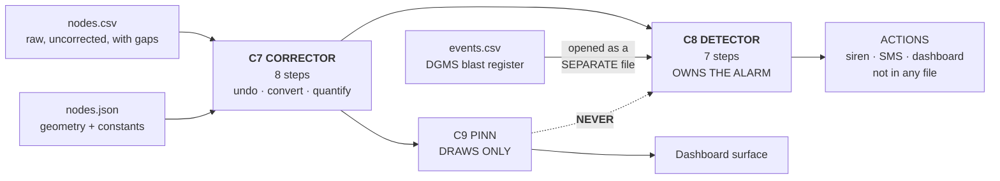
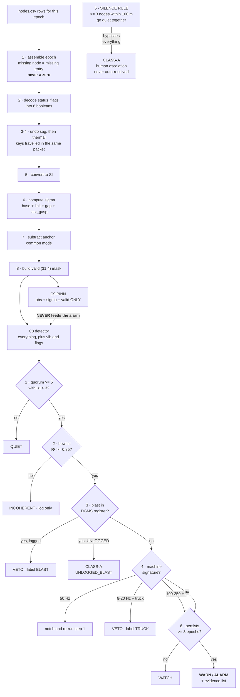

# 06 — The Backend: C7 the Corrector and C8 the Alarm

> **You did not ask for this file. It exists because there was a hole.** Files 01–05 describe the world, the radio, the registry, the telemetry and the truth. Nothing described what happens between "a row lands in `nodes.csv`" and "a siren goes off." That gap is where σ comes from, where the `valid` mask comes from, and where the alarm decision lives — three things every other file references and none of them defines.
>
> **This file owns:** the eight C7 correction steps, the exact σ formula, the `valid` mask rules, and the seven-step C8 alarm pipeline.
>
> **This file does NOT own:** the PINN (→ 03), telemetry format (→ 04), truth (→ 05).

---

## 1. Where this sits



**One sentence each.** C7 turns damaged integers into honest physics with error bars. C8 decides whether those error bars mean anybody should be woken up.

---

## 2. C7 — the corrector, eight steps in fixed order

Runs once per epoch. Input: all `nodes.csv` rows for that epoch, plus `nodes.json`. Output: one dict, ~4 KB, consumed by both C8 and C9.

### 2.1 The eight steps

| Step | Action | Detail |
|---|---|---|
| **1** | **Assemble the epoch** | Gather all rows with this `epoch`. **Missing node ⇒ missing entry, never a zero.** Record which node ids are absent |
| **2** | **Decode `status_flags`** | Split into 6 boolean columns: `crack_level`, `selftest_ok`, `last_gasp`, `reboot`, `ext_present`, `degraded` |
| **3** | **Undo thermal drift** | `v ← v − k_T,ch · (temp_dc × 0.1 − T_ref)`. Uses the `temp_dc` **in the same packet** — the key travelled with the lock |
| **4** | **Undo battery sag** | `v ← v × V_nom / (vbat_mv × 1e-3)` |
| **5** | **Convert to SI** | `tilt × 2e-6` → rad · `strain × 1e-6` → dimensionless · `ext × 1e-5` → m |
| **6** | **Compute σ per channel** | §2.3 |
| **7** | **Common-mode rejection** | Subtract the mean anchor tilt from every field node's tilt. **The cheapest SNR gain in the system** |
| **8** | **Build the `valid` mask** | §2.4 |

### 2.2 Why steps 3 and 4 are in that order and no other

The corruption chain applied thermal **first** and sag **fourth** (file 01 §4). Inversion runs in reverse: undo sag, then undo thermal.

> ⚠️ **The step order in the table above is written as 3-thermal then 4-sag for readability of the *concepts*. In code, undo sag first, then thermal.** Reversing an ordered chain means reversing the order. If you undo thermal before sag, the sag multiplier scales a value that has already had an additive term removed, and the residual is wrong by `k_T·(T−T_ref)·(V_nom/V − 1)`. Small, but systematic, and it will look like a physics bug.

**Correct code order:**
```python
v = v * V_NOM / (vbat_mv * 1e-3)                    # undo stage 4 first
v = v - K_T[ch] * (temp_dc * 0.1 - T_REF)           # then undo stage 1
v = v * SI_FACTOR[ch]                               # then convert
```

> **Test T7 lives here:** apply the above with the *true* `T_chip` and `V_bat` from the simulator and confirm the residual sits inside the white-noise band. **If T7 fails, stop. Nothing downstream can work.**

### 2.3 The σ formula — stated explicitly, once

Every other document references σ and none defines it. Here it is.

**Base variance, per channel `ch`, per node `i`:**

```
σ_base²  =  (σ_w[ch] · sigma_scale_i)²        white-noise floor        (stage 3)
         +  (LSB[ch]² / 12)                    quantisation             (stage 5)
         +  σ_b[ch]²                           residual OU bias walk    (stage 2)
         +  (k_T[ch] · σ_temp_resid)²          residual thermal         (stage 1 leftover)
         +  (v · σ_vbat_resid / V_nom)²        residual sag             (stage 4 leftover)

σ_temp_resid = 0.1 / √12 = 0.029 °C            (temp quantisation)
σ_vbat_resid = 1e-3 / √12 = 0.29 mV            (vbat quantisation)
```

**Then inflate for delivery quality:**

```
f_link  = 1 + 0.5·(hops − 1) + 0.5·max(0, −snr_db / 5)
f_gap   = 1 + 0.3·(epochs since this node's last delivered row − 1)
f_flag  = 5.0 if last_gasp else 1.0

σ_final = σ_base · f_link · f_gap · f_flag
```

**Why each factor exists:**

| Factor | Reason |
|---|---|
| `f_link` | a frame that came 3 hops through a poor link is more likely to be a corrupted-but-CRC-passing frame |
| `f_gap` | a reading from a node you have not heard from in 8 epochs is stale — the ground may have moved since |
| `f_flag` | a last-gasp packet is real evidence but wildly untrustworthy in magnitude. **Widen the bar, do not discard the reading** |

**Sanity anchors, day 20, healthy node:**

| Channel | σ_final | Signal | Ratio |
|---|---|---|---|
| tilt | ~9 µrad → 9e-6 rad | ~26 000 µrad peak | good, but thermal residual dominates in the far field |
| strain | ~1.6 µε → 1.6e-6 | ~8300 µε peak | **excellent — this is why strain is the primary channel** |
| ext | ~18 µm → 1.8e-5 m | ~83 mm peak | excellent |

### 2.4 The `valid` mask — the rules, complete

`valid` is `(N, 4)` — per node, **per channel**. Channel order `[tilt_x, tilt_y, strain, ext]`, and it never changes.

A channel is marked **invalid** if **any** of these hold:

| # | Condition | Rationale |
|---|---|---|
| V-a | No row arrived for this node this epoch | absence, not zero |
| V-b | `selftest_ok == 0` | **the stuck-sensor case.** A dead ADC returns a constant, which looks exactly like perfectly stable ground. This is the most dangerous failure in the design because it fails *safe-looking* |
| V-c | Raw value is clipped at the wire limit | the true value is unknown, only bounded |
| V-d | Channel is `ext` and `ext_present == 0` | node has no extensometer |
| V-e | Value fails a MAD outlier test vs the 5 nearest neighbours **on that channel** — **unless `last_gasp` is set** | F8 Byzantine quarantine. The last-gasp exception is essential: the outlier filter would otherwise discard the single most important packet the node ever sends |
| V-f | `reboot == 1` **and** this is the first packet after restart | `seq` continuity is broken; the value itself is fine, but treat the first one cautiously |

> **`valid` is (N, 4), not (N,).** A node can send a good tilt and a garbage strain in the same packet. Masking per node throws away good data — and with 28 field nodes doing the work of 840, you cannot afford to throw away good data.

### 2.5 What C7 outputs

| To | Contents |
|---|---|
| **C9 (PINN)** | `t`, `obs_tilt_x/y`, `obs_strain`, `obs_ext`, `sigma_*`, `valid`. **Nothing else** — file 03 §13 |
| **C8 (alarm)** | all of the above **plus** `vib_*`, `status_flags` booleans, `alive`, `seq` gaps, `rssi`, `snr`, `hops` |

**C7 forwards `temp_dc` and `vbat_mv` to neither.** They were consumed at steps 3–4. Passing them on would let the PINN re-learn a correction already applied.

---

## 3. C8 — the alarm

### 3.1 There is no alarm neural network, and that is the feature

The alarm is a **deterministic classical detector**. Not a neural network, not a classifier, not a language model.

**This is a frozen decision and it is a selling point, not a limitation.** An alarm you can hand-trace at 3 a.m. is the only kind a mine safety officer will accept, and DGMS will ask how the decision was made.

**The PINN's output is not an alarm input either.** Routing a learned surface into a safety decision would launder a neural network into the alarm path through the back door. **C8 reads sensors and the blast register. Nothing else.**

### 3.2 C8's complete input list

| Input | Source | Shape |
|---|---|---|
| `obs_strain`, `obs_tilt_x/y`, `obs_ext` + `sigma_*` + `valid` | C7 | (31,), (31,4) |
| `xy`, `panel`, `is_anchor` | `nodes.json` | static |
| `alive`, `seq` gaps | telemetry | (31,) |
| `crack_level`, `selftest_ok`, `last_gasp`, `reboot`, `degraded` | decoded flags | (31,5) |
| `vib_rms`, `vib_peak`, `vib_fdom` | telemetry | (31,3) |
| `rssi`, `snr`, `hops`, `parent_id` | telemetry | (31,4) — **for σ and F2 only** |
| Blast register: `t_iso`, `x_m`, `y_m`, `charge_kg`, `duration_s`, `logged_in_dgms` | **`events.csv`, opened as a separate file** | rows |

### 3.3 The seven-step pipeline

```
1  QUORUM GATE
      count nodes with valid[:, 2] and |z_strain| > 3
      z = (obs_strain − baseline_strain) / sigma_strain
      if count < 5  →  QUIET, stop
      Rationale: one node cannot alarm alone. F8 Byzantine nodes are
      STRUCTURALLY unable to trigger, not merely unlikely to.

2  BOWL FIT
      Levenberg-Marquardt over (a, c) with the panel rectangle FIXED
      fit against strain + tilt at all valid nodes, weighted by 1/σ²
      → R², residual, a_fit
      if R² < 0.85  →  INCOHERENT: log it, no alarm
      Rationale: real subsidence has a shape. Scattered anomalies that
      do not fit a bowl are sensor problems, not ground problems.

3  BLAST VETO                                      ⭐ THE DIFFERENTIATOR
      for each blast row in events.csv:
          if |t_event − t_now| < 120 s
             and distance(node, blast) < 500 m
             and vib_fdom in [40, 80] Hz
             and the anomaly decays within 3 epochs
          →  VETO, label BLAST, log the vetoing row id
      if logged_in_dgms == 0 for the matching blast
          →  DO NOT VETO. Escalate with label UNLOGGED_BLAST.
      Rationale: an unlogged blast is a compliance failure at the mine
      and must reach a human, not be silently absorbed.

4  MACHINE VETO
      vib_fdom in [49.5, 50.5]  →  narrow-band conveyor. Notch, subtract, re-run step 1.
      vib_fdom in [8, 20] and a truck_pass row is active  →  VETO, label TRUCK.
      vib_fdom in [100, 250]    →  microseismic. DO NOT veto. This is real rock.

5  SILENCE RULE                                    ⭐ BYPASSES EVERYTHING
      if >= 3 nodes with pairwise separation < 100 m all went alive=0
         within one 10-minute window
         and no radio_blackout row covers them
         and no blast row matches
      →  CLASS-A, immediately, regardless of steps 1-4.
      Rationale: the failure mode we detect destroys sensors. A system
      that interpolates over that gap will interpolate over a collapse.

6  PERSISTENCE
      the anomaly must hold for >= 3 consecutive epochs
      EXCEPTIONS that skip persistence entirely:
         - any node with last_gasp set
         - step 5 having fired
         - crack_level increasing on >= 3 nodes
      else  →  WATCH

7  LEVEL AND EVIDENCE
      emit level + the full evidence list
```

### 3.4 Output levels

| Level | Meaning | Action |
|---|---|---|
| `QUIET` | nothing above threshold | log only |
| `WATCH` | quorum met but persistence not yet | dashboard highlight |
| `WARN` | persistent, bowl-coherent, not vetoed | SMS to the shift supervisor; cluster moves to P2 escalation |
| `ALARM` | WARN plus rising trend or crack confirmation | siren + SMS + dashboard takeover |
| `CLASS-A` | clustered silence, or an unlogged blast | **human escalation, never auto-resolved** |

### 3.5 The output record — every alarm is traceable

```jsonc
{
  "epoch": 28800,
  "t_iso": "2026-03-21T00:00:00Z",
  "level": "WARN",
  "quorum_n": 7,
  "bowl_r2": 0.912,
  "a_fit": 0.631,
  "vetoed_by": null,
  "evidence": [
    {"node_id": 17, "channel": "strain", "z": 6.4, "contribution": 0.22},
    {"node_id": 18, "channel": "strain", "z": 5.9, "contribution": 0.19},
    {"node_id": 12, "channel": "tilt_y", "z": 4.1, "contribution": 0.11}
  ],
  "silent_nodes": [],
  "blast_rows_checked": ["blast-004"],
  "latency_ms": 340
}
```

> **`evidence` is the field that matters.** Every alarm names the nodes and channels that caused it, with their contributions. A safety officer can walk to those exact pegs. **No neural network output appears anywhere in this record.**

### 3.6 Baselines

`baseline_strain` and friends are **24-hour rolling medians per node per channel**, computed by C7 and held in a ring buffer.

**Median, not mean** — a single wild reading must not shift the baseline it is being compared against. That is a circularity trap of the same family as the PINN's `a`/`c` problem: let outliers into the baseline and the detector slowly re-normalises to the disaster it is meant to detect.

---

## 4. Why the blast veto is the strongest thing in the project

**DGMS Circular 7/1997 requires every Indian coal mine to keep blast seismograph records.** Those records exist, legally, at every target site, today, whether or not anybody deploys our system.

| Consequence | Detail |
|---|---|
| Removes the largest false-positive source | blasts are the dominant transient in a working mine |
| Removes a sensor from the BOM | no separate blast-detection hardware required |
| Zero deployment gap | unlike every other input, the real artefact **already exists** |
| Makes the fast alarm plane affordable | **you can afford a sub-second alarm precisely because you have a legally-mandated register to veto it against.** Speed and the blast log are one story, not two |
| Nobody else will have read the circular | it is a compliance document, not an engineering paper |

---

## 5. Actions are not data

The alert chain — siren, GSM SMS, email, dashboard push, SD-card buffering — produces **actions**, not measurements. **Nothing about it belongs in any of the four files.**

State this explicitly so nobody adds an `alert_sent` column to `nodes.csv` and quietly breaks the sim/backend seam. `nodes.csv` is a record of what the ground and the radio did. It is not a record of what the operator did about it.

---

## 6. The whole backend, one flowchart



---

## 7. Gates this file owns

| Test | Asserts |
|---|---|
| **T7** | Undoing sag then thermal with true `T_chip`, `V_bat` leaves the residual inside the white-noise band |
| **T27** | On the day-3 logged blast, C8 emits `vetoed_by = BLAST` and **no** alarm |
| **T28** | On the day-21 **unlogged** blast, C8 emits `CLASS-A / UNLOGGED_BLAST` |
| **T29** | On the day-26 `cluster_kill`, C8 emits `CLASS-A` within one epoch, via step 5, **regardless** of what steps 1–4 concluded |
| **T30** | Injecting a single Byzantine node with a 20σ strain value produces **no** alarm — the quorum gate holds |
| **T31** | A node with `selftest_ok = 0` reporting a perfectly constant value is marked invalid and **excluded from the quorum count** |
| **T32** | `grep -r "C9\|pinn\|S_grid" backend/C8/` returns nothing |

**T30 and T31 are the two to write first.** T30 proves a lying node cannot trigger a siren. T31 proves a *dead* node cannot report "all clear" — and that is the failure that would actually kill someone.
