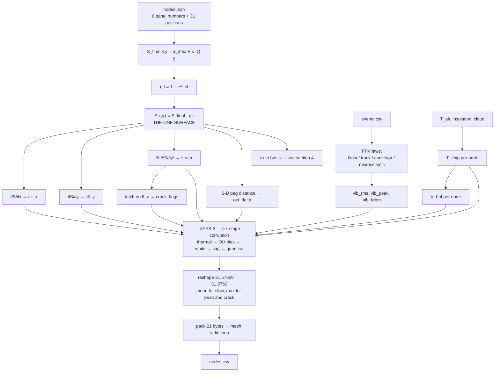
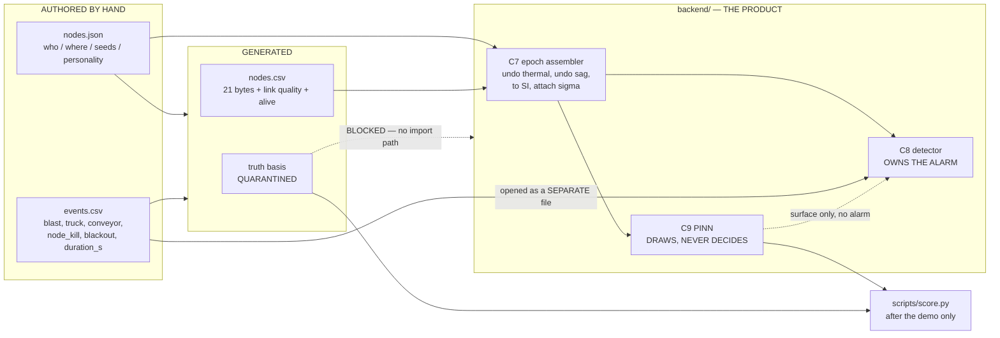
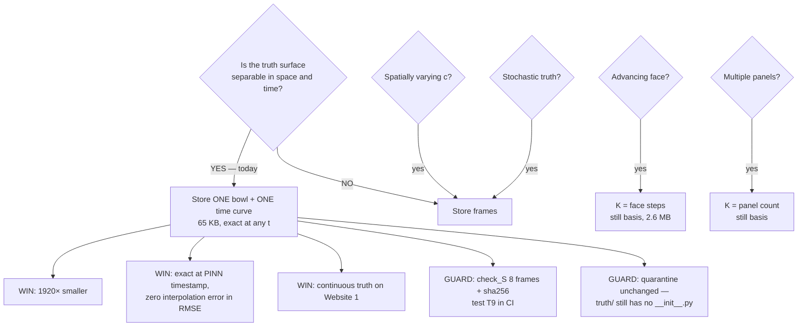
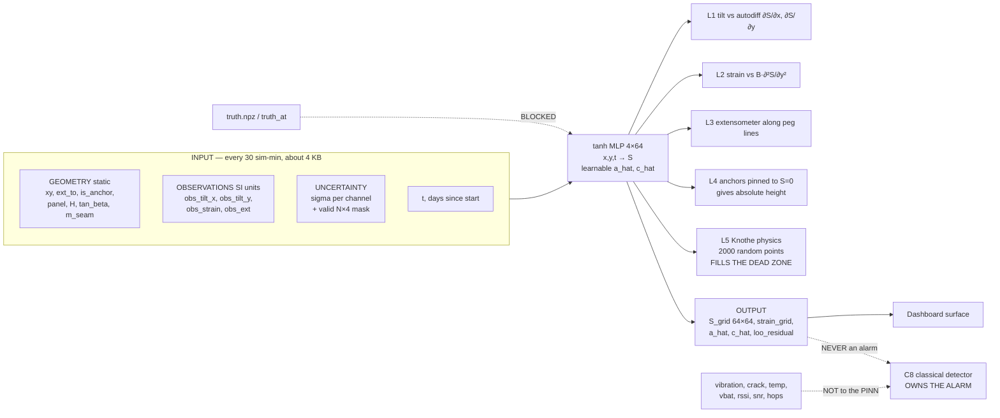

# Part 1C — Sensors, Formulas, File Contents, Surface Generation, and the ML Handoff

**Scope.** Six questions, answered in order:

1. What sensors exist, what each one reports, and why an ESP32 is enough.
2. What formula generates the ground, and what formula turns the ground into each sensor channel.
3. What information lives in which file — and what the alarm needs that is currently **missing**.
4. How the truth surface is generated — and whether we really need 1 920 frames. **(Verdict: no. Build it once.)**
5. The exact input/output contract for the neural-network owner.
6. Everything referenced elsewhere but never specified, plus the scale-up story.

**Companion docs.** `part1-maths-spec.md` (derivations), `part1-data-and-files-v3.md` (file architecture), `mine-subsidence-full-report-v3.md` (noise, cost, PS mapping). This document does not re-derive; it tabulates and closes gaps.

---

## 1. The Sensors

### 1.1 What is physically on a node

| # | Sensor | Part | What it physically senses | Channel(s) it produces | Wire format | Real range | Role in the system |
|---|---|---|---|---|---|---|---|
| 1 | Tilt / inclination | MPU9250 (accel) | direction of gravity relative to the board → ground slope | `tilt_x_urad`, `tilt_y_urad` | int16 µrad ×2 | ±32 767 µrad (±1.88°) | **Secondary vote.** Thermal drift can exceed signal (SNR 2.8:1). Never fires an alarm alone |
| 2 | Die temperature | MPU9250 internal | chip temperature | `temp_dc` | int16, ×0.1 °C | −40 → +85 °C | **Correction key.** C7 uses it to undo tilt/strain thermal drift. Without it, drift is uncorrectable |
| 3 | Strain gauge | foil gauge + ADS1115 | surface stretch/compression across panel width | `strain_ue` | int16 µε | ±32 767 µε | **Primary signal.** SNR 139:1. This is what actually triggers |
| 4 | Wire extensometer | invar wire, 10 m, to anchor peg | 3-D distance change between two pegs | `ext_delta_10um` | int16, ×10 µm | ±327.6 mm | **Primary signal.** Directly answers PS bullet "change in relative distance between nodes" |
| 5 | Crack detector | conductive trace on a substrate | trace has broken (latched, never un-breaks) | `crack_flags` bits 0–1 | uint8, 2 bits used | level 0–3 | Binary confirmation. Cheap, unambiguous, survives a dead battery |
| 6 | Vibration | accel high-rate burst (or piezo geophone) | ground shaking | `vib_rms_x100`, `vib_peak_x100`, `vib_fdom_hz` | uint16 ×0.01 mm/s ×2, uint8 Hz | 0–655 mm/s, 0–255 Hz | **Discriminator, not detector.** Separates blast / truck / conveyor / rock-crack |
| 7 | Battery monitor | resistor divider → ADC | supply voltage | `vbat_mv` | uint16 mV | 3 000–4 200 mV | Second correction key + maintenance signal |
| 8 | Radio link (measured by receiver) | LoRa PHY | signal quality of the hop that just arrived | `rssi_dbm`, `snr_db`, `hops` | int16, f32, uint8 | −140→−40 dBm | Provenance. Feeds **σ**, never feeds the PINN |

Node 1–7 are on the node. Row 8 is measured **at the gateway** — a node cannot measure its own journey.

### 1.2 Supporting hardware (not sensors, but they shape the data)

| Part | Job | Why it exists in the data model |
|---|---|---|
| ESP32 + LoRa (SX1276/62) | brain + voice | sets the 21-byte packet ceiling → sets the whole 10-min cadence |
| ADS1115 external ADC | precision measurement for the strain gauge | ESP32's own ADC has documented per-chip reference drift; without this, strain σ is 5–10× worse |
| Voltage reference / LDO | stable measurement rail | without it, `vbat` sag directly fakes a drift in every analogue channel |
| Solar + Li-ion | power | `shade_s` per node → different `vbat` curves → different σ per node. This is why nodes are not clones |
| Gateway (RPi + GSM + siren + SD) | collect, alert, buffer | siren and SMS are **actions**, not data — they appear nowhere in the four files. See §6.6 |

### 1.3 Node compute budget — why an ESP32 is genuinely enough

You said the nodes do almost no processing. That is correct, and here is the arithmetic to say it with:

| Task | When | Operations | Time on ESP32 @240 MHz | RAM |
|---|---|---|---|---|
| Read 7 channels over I²C/SPI | every 60 s | ~200 bus transactions | ~3 ms | ~64 B |
| Running mean/max accumulate | every 60 s | ~20 float ops | < 1 µs | 40 B |
| Crack latch (`max` with previous) | every 60 s | 1 compare | < 1 µs | 1 B |
| Vibration burst: 256 samples @ 400 Hz | every 60 s | ADC capture | 640 ms **wall-clock, mostly idle** | 1 KB |
| RMS + peak over the burst | every 60 s | 512 float ops | ~10 µs | — |
| 256-pt real FFT for `f_dom` (esp-dsp) | every 60 s | ~2 000 butterflies | ~1.5 ms | 2 KB |
| Pack 21 bytes + CRC | every 10 min | ~50 ops | < 50 µs | 21 B |
| LoRa TX, SF9 BW125, 21 B payload | every 10 min | — | ~130 ms **radio-on** | — |

**Totals:** CPU duty ≈ **0.3 %**. Peak RAM ≈ **4 KB** of a 520 KB budget.

> **The sentence for the deck:** the binding constraint on a node is **airtime and milliamp-hours, not MIPS**. Compute is free at this scale; every design pressure comes from the radio. That is exactly why the packet is 21 bytes and exactly why the cadence is 10 minutes.

**Cheaper alternative if you ever want it:** replace the FFT with a zero-crossing-rate estimate for `f_dom` (~20 ops instead of 2 000). It is coarser but adequate for separating a 12 Hz truck from a 55 Hz blast. Keep the FFT — you can afford it — but note the fallback exists, because "we checked whether we needed the expensive thing" is a good answer to a judge.

**What the node must NOT do:** thermal correction, sag correction, filtering, or alarm logic. All of it happens in `backend/` C7/C8 where it is auditable. A node that corrects its own data has destroyed the evidence.

---

## 2. The Formulas

### 2.1 The one master formula

Everything in the entire simulation descends from a single closed-form surface.

**Derived constants (computed once at load, never stored in JSON):**

| Symbol | Formula | Meaning |
|---|---|---|
| `r` | `H / tan_beta` | radius of major influence (m) |
| `S_max` | `a · m` | maximum possible subsidence (m) |
| `B` | horizontal-displacement coefficient, per `part1-maths-spec.md §1.2` | converts slope → horizontal displacement (m) |

**Spatial profile (per axis, Knothe/Litwiniszyn Gaussian influence over a rectangle):**

```
P(x) = ½ [ erf( √π (x − x₁) / r ) − erf( √π (x − x₂) / r ) ]
Q(y) = ½ [ erf( √π (y − y₁) / r ) − erf( √π (y − y₂) / r ) ]
```

`P → 1` deep inside the panel, `P → 0` far outside. Same for `Q`.

**Fully-settled bowl:**

```
S_final(x, y) = S_max · P(x) · Q(y)
```

**Knothe time function:**

```
g(t) = 1 − e^(−c·t)          t in days since extraction
```

**THE MASTER FORMULA:**

```
S(x, y, t) = S_max · P(x) · Q(y) · (1 − e^(−c·t))
           = S_final(x, y) · g(t)                    ← down positive, metres
```

> **Read that second line carefully — it is the whole of §4.** Space and time are **separable**. The surface at every instant is one fixed image multiplied by one scalar.

### 2.2 Per-sensor generation formulas — Layer 0 (clean truth)

All four channels are derivatives of the one surface. There is **no second generator**.

| # | Channel | Formula | Note |
|---|---|---|---|
| 1 | `tilt_x` | `∂S/∂x = S_max · P′(x) · Q(y) · g(t)` | `P′(x) = (1/r)[ e^(−π(x−x₁)²/r²) − e^(−π(x−x₂)²/r²) ]` |
| 2 | `tilt_y` | `∂S/∂y = S_max · P(x) · Q′(y) · g(t)` | `Q′(y)` same form in y |
| 3 | `strain` | `ε_yy = B · ∂²S/∂y² = B · S_max · P(x) · Q″(y) · g(t)` | `Q″(y) = (−2π/r³)[ (y−y₁)e^(−π(y−y₁)²/r²) − (y−y₂)e^(−π(y−y₂)²/r²) ]` |
| 4 | `ext_delta` | **exact 3-D**, not a strain integral: `Δ = ‖(p₂+u₂) − (p₁+u₁)‖ − ‖p₂ − p₁‖` where `u = ( B·∂S/∂x , B·∂S/∂y , −S )` evaluated at each peg | uses the vertical component too — differential settlement between the pegs shortens the wire even with zero horizontal strain |
| 5 | `crack` | latch: `flag(t) = max over τ ≤ t of [ level(|ε_yy(τ)|) ]`, thresholds `θ_c, 2θ_c, 3θ_c` | `θ_c` is `crack_theta_c_ue`, frozen per node in `nodes.json` |

**Free identity worth testing.** Because `g(t)` is monotonically increasing, the crack time has a closed form:

```
t_crack = −(1/c) · ln( 1 − θ_c / ( B · |∂²S_final/∂y²| ) )      (∞ if the argument ≤ 0)
```

Add this as **test T10**: the crack latch found by simulation must match this analytic time to within one sample interval. It catches a wrong sign or a wrong `B` instantly.

### 2.3 Per-sensor generation formulas — Layers 1–2 (environment and events)

| Channel | Formula | Source |
|---|---|---|
| `T_air(t)` | `T̄ + A_d·sin(2π(t − φ_d)) + A_s·sin(2π t/365 − φ_s)` | shared across all nodes |
| `I(t)` (insolation) | `max(0, sin(π·frac(t) shifted to daylight)) · cloud(t)` | `cloud(t)` shared, one RNG stream |
| `T_chip,i(t)` | `T_air(t) + shade_sᵢ · k_solar · I(t) + temp_offset_cᵢ` | per-node personality from `nodes.json` |
| `V_bat,i(t)` | SOC integration: `+ η·shade_sᵢ·I(t)·P_panel − P_load`, mapped through a Li-ion OCV curve | drives the sag stage below |
| `PPV_blast` | `1140 · (D / √Q)^(−1.6)` mm/s, `D` = node-to-blast distance, `Q` = `charge_kg` | DGMS-style attenuation law; `f_dom ≈ 40–80 Hz` |
| `PPV_truck` | same scaled-distance form with an effective `Q_eq` (fit so a pass at 30 m ≈ 0.5–2 mm/s) | `f_dom ≈ 8–20 Hz` — **see §6.3, this is a placeholder needing a fixed constant** |
| `PPV_conveyor` | constant floor `A₀·e^(−D/D₀)` while `conveyor_on` | `f_dom` = fixed line harmonic, e.g. 50 Hz ± 0.5 — that narrow-band signature is what the notch filter removes |
| `PPV_microseismic` | rare Poisson events, amplitude ∝ local `|ε_yy|` | `f_dom ≈ 100–250 Hz` — the only band that is *real* rock cracking |

**The `f_dom` bands are the discriminator.** Four sources, four separable frequency neighbourhoods, one byte to carry it. Put this table on a slide.

### 2.4 Layer 3 — the corruption chain, six stages, fixed order

Order matters. Applying quantisation before noise, or sag before thermal, produces a chain that **C7 cannot invert**, and if C7 cannot invert it, the detector cannot work.

| # | Stage | Formula | Invertible by C7? |
|---|---|---|---|
| 1 | Thermal drift | `v += k_T,ch · (T_chip − T_ref)` | ✅ yes — `temp_dc` is in the same packet |
| 2 | Bias random walk (OU) | `b_{n+1} = b_n·e^(−Δt/τ) + σ_b·√(1−e^(−2Δt/τ))·ξ`, then `v += b` | ❌ no — absorbed into **σ**, not corrected |
| 3 | White noise | `v += σ_w · ξ` | ❌ no — this *is* σ's floor |
| 4 | Battery sag | `v *= V_bat / V_nom` | ✅ yes — `vbat_mv` is in the same packet |
| 5 | Quantisation | `v = round(v / LSB) · LSB`, then clip to the wire type | ❌ no — adds `LSB/√12` to σ |
| 6 | Event vibration | `vib += Σ PPV_sources`, recompute rms/peak/f_dom | n/a — this is a separate channel |

**Test T7 (already in the runbook, restated because it is the important one):** take the damaged array, undo stages 4 then 1 using the *true* `T_chip` and `V_bat`, and confirm the residual sits inside the white-noise band. If it does not, stop — the chain is not invertible and nothing downstream can work.

### 2.5 The full lineage, one picture



---

## 3. What Lives in Which File — and What Is Missing

### 3.1 The four files, at a glance

| File | Authored or generated | Carries | Read by |
|---|---|---|---|
| `nodes.json` | authored | identity, geometry, schedule, determinism, personality | sim + gateway + backend |
| `events.csv` | authored | schedule + geometry of every non-subsidence disturbance | sim **and** detector, opened separately |
| `truth.npz` | generated | pure physics, no sensor anywhere | scoring only, quarantined |
| `nodes.csv` | generated | measurement + provenance | backend, and only this |

### 3.2 The alarm-input trace — every C8 decision input, sourced

This is the table that proves nothing the alarm needs is missing. Every row is "what the detector must know" → "where it comes from."

| What C8 needs to decide | Column / field | File | Present? |
|---|---|---|---|
| Corrected strain per node | `strain_ue` + `temp_dc` + `vbat_mv` | `nodes.csv` | ✅ |
| Corrected tilt per node | `tilt_x_urad`, `tilt_y_urad` + same keys | `nodes.csv` | ✅ |
| Corrected extensometer delta | `ext_delta_10um` + same keys | `nodes.csv` | ✅ |
| Where each node is | `nodes[].x`, `nodes[].y` | `nodes.json` | ✅ |
| Which nodes are anchors (S=0 reference) | `nodes[].role` | `nodes.json` | ✅ |
| Panel rectangle, for the bowl fit | `panel.*` | `nodes.json` | ✅ |
| Is this node alive right now | `alive` | `nodes.csv` | ✅ |
| Was a packet lost (→ inflate σ) | gaps in `seq` | `nodes.csv` | ✅ |
| Link quality (→ σ) | `rssi_dbm`, `snr_db`, `hops` | `nodes.csv` | ✅ |
| Did the ground shake, how hard, at what pitch | `vib_rms_x100`, `vib_peak_x100`, `vib_fdom_hz` | `nodes.csv` | ✅ |
| Was a blast legally logged at that time and place | `t_iso`, `x_m`, `y_m`, `charge_kg` | `events.csv` | ✅ |
| Has this node's ground cracked | `crack_flags` | `nodes.csv` | ✅ |
| Current time | `t_iso` | `nodes.csv` | ✅ |
| **When the node actually sampled** (≠ arrival) | — | — | ❌ **gap 1** |
| **Is this sensor healthy or stuck** | — | — | ❌ **gap 2** |
| **Is this the node's dying last-gasp packet** | — | — | ❌ **gap 3** |
| **When does a conveyor / blackout period end** | — | — | ❌ **gap 4** |

### 3.3 The four gaps, and the fixes — total cost: zero extra bytes

**Gap 1 — sample time vs arrival time.**
`t_iso` is *arrival at the gateway*. The node's own sample time is inferred as `start_iso + seq × transmit_s`. That works right up until a node reboots and `seq` resets to zero — after which every timestamp for that node is wrong, silently, forever. Brownouts on solar nodes are common.
**Fix:** persist `seq` in ESP32 NVS across reboots, **and** raise a `REBOOT` bit (below) on the first packet after a restart so C7 can distinguish "counter jumped" from "packets lost."

**Gap 2 — a stuck sensor looks like perfectly stable ground.**
A dead ADC returns a constant. Constant tilt and constant strain is exactly what "nothing is happening" looks like. The system would report a healthy, quiet panel from a node that has been dead for two weeks. This is the most dangerous failure in the whole design because it fails *safe-looking*.
**Fix:** a `SELFTEST_OK` bit, set by the node from a simple liveness check — e.g. the MPU9250 `WHO_AM_I` register readback plus a variance check that the last 10 samples are not bit-identical.

**Gap 3 — no last-gasp marker.**
The full report proposes that a node about to be destroyed fires one final reading. There is no way to mark that packet as special, so it arrives looking like an ordinary sample containing a wild value — and gets thrown out as an outlier by the very filter designed to reject bumps.
**Fix:** a `LAST_GASP` bit. C7 routes those packets past the outlier filter and straight to C8 with a distinct σ.

**Gap 4 — `conveyor_on` and `radio_blackout` have no end.**
`conveyor_off` exists as a `kind`; `radio_blackout` has no matching `_off` and no duration column, so a blackout is infinitely long.
**Fix:** add a `duration_s` column to `events.csv`, empty for instantaneous events. One column, no ambiguity.

**Where the three bits go — the elegant part.** `crack_flags` is a `uint8` that uses **2 bits**. Six are free.

| Bit | Name | Meaning |
|---|---|---|
| 0–1 | `CRACK_LEVEL` | 0–3, existing |
| 2 | `SELFTEST_OK` | 1 = sensors passed liveness check this slot |
| 3 | `LAST_GASP` | 1 = node detected impact/freefall, this is its final packet |
| 4 | `REBOOT` | 1 = first packet since a restart, `seq` continuity is broken |
| 5 | `EXT_PRESENT` | 1 = this node has an extensometer (redundant with `nodes.json`, but self-describing on the wire) |
| 6–7 | reserved | |

Rename the column `status_flags` in `nodes.csv` and decode it into separate boolean columns in C7. **Packet stays 21 bytes.** No airtime cost, no duty-cycle change, no re-derivation of §6 of the data doc.

### 3.4 Two wire-format bugs — confirmed resolved in v3

Recorded so they are not reintroduced:

| Bug | v1/v2 | v3 | Why it mattered |
|---|---|---|---|
| Extensometer wrap | `int16` in µm → ±32.7 mm | `int16` ×10 µm → ±327 mm | day-30 displacements exceed 32.7 mm and would have wrapped to the opposite sign |
| Temperature resolution | `int8` whole °C | `int16` ×0.1 °C | 1 °C granularity leaves residual uncorrectable tilt drift larger than the subsidence signal |

### 3.5 Lineage picture



---

## 4. Building the Surface — Do We Really Need 1 920 Frames?

**Your question:** the terrain parameters never change, so why photograph the surface every 30 simulated minutes? Why not build it once?

**Verdict: you are right. Build it once.** Store one bowl and one time-curve instead of 1 920 images. But the reasoning has four load-bearing assumptions, and if any of them ever changes the answer changes with it — so here is the whole argument, including the edge cases.

### 4.1 First — a numerical correction to the existing spec

`part1-data-and-files-v3.md §4.5` states the truth file is 31.5 MB for "1920 frames × 4 arrays." That figure is **per array**, not for all four.

| | Elements | Bytes (f32) |
|---|---|---|
| One array, `(1920, 64, 64)` | 7 864 320 | **31.5 MB** |
| Four arrays (`S`, `dSdx`, `dSdy`, `eps_yy`) | 31 457 280 | **125.8 MB** |

`np.savez` is uncompressed by default; `savez_compressed` on smooth float32 fields realistically gets you to 40–60 MB, not 32. So the real file is roughly **4× larger than the doc claims** — which makes the case below stronger, not weaker.

### 4.2 The reason it collapses

From §2.1:

```
S(x, y, t) = S_final(x, y) · g(t)
```

Space and time are **separable**. Frame 1 919 is not a new picture — it is frame 0 multiplied by a different scalar. Storing 1 920 frames is storing the same 64×64 image 1 920 times at 1 920 brightness levels.

And separability survives every derivative you need, because `∂/∂x`, `∂/∂y`, `∂²/∂y²` are all **linear operators in space** and `g(t)` is a constant with respect to them:

| Array | Decomposition | Separable? |
|---|---|---|
| `S` | `S_final · g(t)` | ✅ |
| `dSdx` | `(∂S_final/∂x) · g(t)` | ✅ |
| `dSdy` | `(∂S_final/∂y) · g(t)` | ✅ |
| `eps_yy` | `B·(∂²S_final/∂y²) · g(t)` | ✅ |

All four channels compress by the same factor. Nothing is lost.

**Compression:** 125.8 MB → 4 × 64 × 64 × 4 B = **65.5 KB** of field data. A factor of **1 920×**.

### 4.3 The four assumptions this rests on

| # | Assumption | True in the current spec? | If it breaks |
|---|---|---|---|
| 1 | **Instantaneous extraction** — the whole panel is mined at `t = 0` | ✅ yes; `nodes.json` has a static rectangle and no face-advance rate | separability dies → §4.5 |
| 2 | **One panel** | ✅ yes; `panel` is a single object | becomes a sum of P separable terms → §4.5 |
| 3 | **`a` and `c` are constants, not fields** | ✅ yes | if `a` becomes `a(x,y)`, still separable (fold into `S_final`); if `c` becomes `c(x,y)`, **separability dies** |
| 4 | **No stochastic component in the truth** | ✅ yes; all randomness is in Layers 1–3, none in Layer 0 | separability dies → store frames or store seed + recipe |

Assumptions 1–4 all hold today. Write them down as an explicit precondition in the code, and assert them at generation time.

### 4.4 What actually gets stored

```
truth.npz          ≈ 200 KB, down from ≈ 126 MB
├── x              (64,)      f32   grid x ruler, metres
├── y              (64,)      f32   grid y ruler, metres
├── basis_S        (K,64,64)  f32   settled bowl per extraction step
├── basis_dSdx     (K,64,64)  f32
├── basis_dSdy     (K,64,64)  f32
├── basis_eps_yy   (K,64,64)  f32
├── basis_t0       (K,)       f32   day each step's extraction completed
├── basis_c        (K,)       f32   time constant per step
├── check_t        (8,)       f32   8 arbitrary times, incl. t=0 and t=40
├── check_S        (8,64,64)  f32   fully materialised, REGRESSION ONLY
└── meta           json             panel params, seed, generator version, sha256 of the generator source
```

Today `K = 1`. The evaluator is three lines:

```python
def truth_at(t, key="S"):
    """Exact truth field at ANY t, not just 30-min grid points."""
    g = 1.0 - np.exp(-basis_c * np.maximum(0.0, t - basis_t0))   # (K,)
    return np.tensordot(g, npz[f"basis_{key}"], axes=(0, 0))     # (64,64)
```

### 4.5 The edge cases — what breaks this, and what to do

**EC-1 — Advancing longwall face. (the important one)**

Real longwall panels are mined progressively, ~3–5 m/day. Then the extracted area is `A(t)`, and each surface point starts settling only once the face passes beneath it. The surface becomes a convolution:

```
S(x, y, t) = ∫ dS_final(x, y; τ) · (1 − e^(−c(t−τ))) dτ
```

**Not separable as a single term.** But discretise the face advance into `K` daily steps and it becomes a **sum of K separable terms** — which is precisely what the `basis_*` layout above already supports.

| Face model | K | Basis size |
|---|---|---|
| Instantaneous (today) | 1 | 65 KB |
| Daily steps, 40 days | 40 | 2.6 MB |
| Hourly steps, 40 days | 960 | 63 MB — pointless, use daily |

**Recommendation:** ship instantaneous now; the `K`-dimension is already in the file, so adding face advance later is a data change, not a code change. And note this is a *strong* judge answer — "our truth representation already generalises to a progressive face, here is the axis" beats "we assumed it all appears at once."

**EC-2 — Multiple panels.** `nodes.json` rule 4 already anticipates making `panel` an array. Each panel contributes its own separable term with its own `t0`. `K = number of panels`. Handled, no new mechanism.

**EC-3 — Blast-triggered sudden roof fall.** Not currently modelled: `events.csv` blasts perturb *sensors only*, never the ground. If you ever want a blast to cause a real step in subsidence, that is a Heaviside term — add one more basis slice with `c → ∞` and `t0` = the blast time. Still handled by the same layout. **But flag it loudly if you add it**, because it destroys the clean claim "events never touch the truth surface," which is currently a nice thing to be able to say.

**EC-4 — Float32 precision at very early times.** At `t = 0.01` day, `g ≈ 1.4 × 10⁻⁴`, so `S ≈ 0.3 mm`. Float32 is *relative* precision (~7 digits), so `S_final × g` computed at read time is at least as accurate as a stored frame, and in fact slightly better because it quantises once instead of twice. **Non-issue — provided you never store `S` in a fixed-point or integer format.** Say so in the code comment.

**EC-5 — Scoring alignment. (this one is a win, not a risk)**
With 1 920 stored frames, scoring a PINN output at `t = 14.237 days` requires interpolating between two frames, and that interpolation error contaminates your headline RMSE number. With `truth_at(t)`, you score at *exactly* the PINN's own timestamp. The error is zero. **Your RMSE number gets cleaner, not just smaller-on-disk.**

**EC-6 — Audit and reproducibility.** A frozen 126 MB file is evidence you can hash; a function is code that could have quietly changed. This is the one real argument for storing frames — and it is answered by the `check_S` array: 8 fully materialised frames plus a sha256 of the generator source, stored alongside the basis.

> **Test T9 (new):** `truth_at(check_t[i])` reproduces `check_S[i]` to `< 1e-6` for all 8. If someone refactors `S(x,y,t)` and breaks a sign, T9 fails in CI — not on stage.

**EC-7 — Does the quarantine still hold?** Yes, and it gets slightly tighter. The rule was never "the file is big and scary"; it was "`truth/` has no `__init__.py`, so `backend/` cannot import it." Put `truth_at()` in `truth/evaluate.py` — same folder, same missing `__init__.py`, same T8 test, unchanged. One genuine caution: cheap-to-compute truth is more *tempting* to reach for at 2 a.m. Keep T8 in CI and it does not matter.

**EC-8 — Website 1 (the simulator control panel) reads `truth/`.** Under the old scheme it showed the nearest 30-minute frame, so the truth surface visibly stepped while the node data moved smoothly. Under `truth_at(t)` it is continuous at any speed multiplier. **Better demo, less code.**

**EC-9 — The `(31, 57600)` node-level Layer 0 arrays.** These are separate from the grid truth and stay as they are — they feed the sensor chain and are transient in RAM (7.1 MB per channel, f32). Worth noting though: they are *also* an outer product, `S_final(node_i) ⊗ g(t)`. So the "one numpy call per channel" claim in the data doc is understating it — it is one **outer product**, cheaper still.

**EC-10 — What if `c` is ever made spatially varying?** Then `g` depends on `(x,y)` and separability genuinely dies with no basis workaround. If that ever comes up, fall back to materialising frames — but there is currently no physical or PS-driven reason to want it. Recorded so nobody discovers it by surprise.

### 4.6 What actually changes in the runbook

| Runbook step | Before | After |
|---|---|---|
| 4 (evaluate grid) | evaluate S on 64×64 at 1 920 frames | evaluate `S_final` and its three derivatives on 64×64 **once**; store `basis_c`, `basis_t0` |
| Gates T1, T2 | unchanged | unchanged — they act on `S_final`, and volume conservation is time-independent anyway |
| New | — | **T9** basis reproduces `check_S`; **T10** analytic crack time matches simulated latch |
| `scripts/score.py` | `truth.S[nearest_frame]` | `truth_at(t_exact)` |
| Generation time | ~30 s | slightly faster; the 1 920-frame evaluation was a measurable chunk of it |

### 4.7 The decision in one picture



**One-line verdict:** *the ground truth is not a recording, it is an analytic field — so we store the field, not 1 920 photographs of it, and we can score at any instant instead of only at the frames we happened to save.*

---

## 5. The Neural-Network Handoff — Exact Parameters

Hand this section to the Part 2 owner. It is a contract: if Part 1 emits exactly these and Part 2 consumes exactly these, the halves meet without a meeting.

### 5.1 What arrives, every 30 simulated minutes

`N = 31` nodes, `M = 2 000` collocation points, `G = 64` grid side.

| Name | Shape | dtype | Units | Meaning | Source |
|---|---|---|---|---|---|
| `xy` | `(N,2)` | f32 | m | node positions | `nodes.json`, static |
| `ext_to` | `(N,2)` | f32 | m | far peg of the wire; NaN if none | `nodes.json`, static |
| `is_anchor` | `(N,)` | bool | — | true for the 2 anchors | `nodes.json`, static |
| `panel` | `(4,)` | f32 | m | `x1,y1,x2,y2` | `nodes.json`, static |
| `H` | scalar | f32 | m | seam depth | `nodes.json`, static |
| `tan_beta` | scalar | f32 | — | influence flare | `nodes.json`, static |
| `m_seam` | scalar | f32 | m | seam thickness | `nodes.json`, static |
| `grid_x`, `grid_y` | `(G,)` each | f32 | m | where to draw the output | `nodes.json`, static |
| `t` | scalar | f32 | days since `start_iso` | this epoch's timestamp | epoch |
| `obs_tilt_x` | `(N,)` | f32 | **radians** | corrected slope in x | C7 step 5 |
| `obs_tilt_y` | `(N,)` | f32 | **radians** | corrected slope in y | C7 step 5 |
| `obs_strain` | `(N,)` | f32 | **dimensionless** | corrected strain | C7 step 5 |
| `obs_ext` | `(N,)` | f32 | **metres** | corrected wire-length change | C7 step 5 |
| `sigma_tilt_x` | `(N,)` | f32 | rad | uncertainty | C7 step 6 |
| `sigma_tilt_y` | `(N,)` | f32 | rad | uncertainty | C7 step 6 |
| `sigma_strain` | `(N,)` | f32 | — | uncertainty | C7 step 6 |
| `sigma_ext` | `(N,)` | f32 | m | uncertainty | C7 step 6 |
| `valid` | `(N,4)` | bool | — | per-node **per-channel** usability | C7 step 8 |

**Unit conversions C7 performs — the ML owner never does these:**

| Wire | → SI | Factor |
|---|---|---|
| `tilt_*_urad` | radians | `× 1e-6` |
| `strain_ue` | dimensionless | `× 1e-6` |
| `ext_delta_10um` | metres | `× 1e-5` |
| `temp_dc` | °C | `× 0.1` (consumed by C7, not forwarded) |

**`valid` is `(N,4)`, not `(N,)`.** A node can send a good tilt and a garbage strain in the same packet. Masking per node throws away good data. Channel order: `[tilt_x, tilt_y, strain, ext]`.

### 5.2 What must never arrive

| Withheld | Why |
|---|---|
| `truth.npz` / `truth_at()`, any part | it is the answer key; one import and the system is a playback device that still looks like it works |
| `vib_rms`, `vib_peak`, `vib_fdom` | transients do not constrain a surface that moves over days → goes to C8 |
| `crack_flags` / `status_flags` | derived from strain; feeding it double-counts the same evidence → goes to C8 |
| `temp_dc` | already consumed at C7 step 3; pass it again and the net re-learns a correction already applied |
| `vbat_mv` | already consumed at C7 step 4 |
| `rssi`, `snr`, `hops` | link quality, not ground physics; belongs in σ, not in the network |
| Raw uncorrected values | the net will fit thermal drift and call it subsidence |

### 5.3 The network

| Property | Value | Why |
|---|---|---|
| Input | `(x, y, t)` normalised to ≈`[−1,1]` | coordinate MLP; normalisation is not optional for PINNs |
| Output | `S`, scalar, metres, **down positive** | one surface |
| Shape | 4 hidden × 64 units, ≈13 k params | tiny, CPU-only |
| Activation | **`tanh`** | you need `∂²S/∂y²`; ReLU's second derivative is zero everywhere and the strain loss silently dies |
| Derivatives | autograd on the net's own output | exact, not finite-differenced |
| Optimiser | Adam, ~400 steps/epoch | warm-started from previous epoch |
| Warm start | always | the surface barely moved in 30 min; cold-starting wastes 90 % of the compute |

### 5.4 The five losses

| # | Loss | Compares | Weight | Evaluated at |
|---|---|---|---|---|
| 1 | Tilt | net `∂S/∂x`, `∂S/∂y` vs `obs_tilt_x`, `obs_tilt_y` | `1/σ²` | 31 node positions |
| 2 | Strain | net `B·∂²S/∂y²` vs `obs_strain` | `1/σ²` | node positions |
| 3 | Extensometer | net's implied peg-to-peg length change vs `obs_ext` | `1/σ²` | node → `ext_to` lines |
| 4 | Anchor | net `S` vs `0` | high, fixed | the 2 anchors |
| 5 | Physics | net `S` vs the Knothe form | moderate | **2 000 random points, resampled every epoch** |

**Loss 4 does enormous work for one line.** Losses 1–3 constrain *shape* only; none constrains *height*. Without anchors you get a perfectly-shaped bowl floating at an arbitrary depth — the maths genuinely cannot distinguish 5 mm from 5 m. Anchors convert relative shape into absolute millimetres.

**Loss 5 fills the dead zone.** Where a Kill Cluster removed six nodes, losses 1–3 contribute nothing and loss 4 is far away. Loss 5 is still fully present and says: *whatever is here must be a smooth Knothe bowl consistent with the edges.* That is a defensible reconstruction, not a guess — and it is the answer to the question the judges will ask when you press the button.

### 5.5 The circularity trap — the single most important paragraph

Loss 5 says "S must obey the Knothe form." If you hand the network the **true** `a` and `c` from `nodes.json`, loss 5 alone fully determines the answer. The network reconstructs a perfect surface **without reading a single sensor**, and your demo becomes an elaborate way of re-plotting a formula you typed in yourself. It will look like it works.

| Parameter | Fixed / learned | Init | Why |
|---|---|---|---|
| `x1,y1,x2,y2` | **fixed** | true | the mine plan is a real known input |
| `H` | **fixed** | true | known from the mine plan |
| `tan_beta` | **fixed** | true | regional geology constant |
| `a` (subsidence factor) | **LEARNED** | 0.5 (true 0.65) | this is what the sensors are *for* |
| `c` (time constant) | **LEARNED** | 0.008 (true 0.01414) | ditto |

Now loss 5 constrains only the *family* of shapes and the sensors must pick which member is real. Bonus deliverable: the converged values are themselves a result — *"estimated subsidence factor: 0.63"* on the dashboard.

### 5.6 What comes out

| Name | Shape | Units | Goes to | Cadence |
|---|---|---|---|---|
| `S_grid` | `(64,64)` | m, down positive | 3-D dashboard surface | 30 min |
| `tilt_x_grid`, `tilt_y_grid` | `(64,64)` | rad | contour overlay, optional | 30 min |
| `strain_grid` | `(64,64)` | — | tension heat-map | 30 min |
| `a_hat`, `c_hat` | scalars | —, /day | "estimated parameters" panel | 30 min |
| `loo_residual` | `(N,)` | per-channel σ | **the live accuracy number** | 30 min |
| `weights` | — | — | warm-start next epoch | 30 min |

`loo_residual` is leave-one-node-out: hide node 17, reconstruct from the other 30, predict what 17 *should* read, compare to what it did. It needs **no ground truth**, so it is the only accuracy metric that survives into a real deployment. Put it on the dashboard.

### 5.7 The rule that makes an AI component acceptable in a safety system

> **The PINN draws. It never decides.** Alarms are owned entirely by C8 — classical bowl-fit plus blast cross-check. No language model anywhere in the safety loop.

### 5.8 Handoff picture



---

## 6. Referenced Everywhere, Specified Nowhere

Open items. Each one is either a decision you need to make or a number someone needs to pin down.

### 6.1 Constants that are named but never valued

| Constant | Where it is used | Status |
|---|---|---|
| `B` (horizontal displacement coefficient) | strain, extensometer, PINN loss 2 and 3 | **Must be defined once in `part1-maths-spec.md §1.2` and computed at load. Not in `nodes.json`.** If sim and PINN disagree on `B`, loss 2 will never converge and it will look like a training bug for a full day |
| `k_T,ch` (thermal coefficient per channel) | corruption stage 1, C7 correction | Needs one number per channel. Sim and C7 must use the identical value or T7 fails |
| `σ_b`, `τ` (OU bias walk) | corruption stage 2 | Sets the noise floor that σ is built from |
| `V_nom` | corruption stage 4 | Trivially 3.7 V, but write it down |
| `LSB` per channel | corruption stage 5 | Implied by the wire format; state it explicitly |
| `Q_eq` for a truck | truck PPV | **Placeholder in §2.3.** Pick a value that puts a 30 m pass at 0.5–2 mm/s and freeze it |
| `A₀`, `D₀` for conveyor | conveyor PPV | Same |

### 6.2 The demo clock (your Q1, still parked)

At 14 400× speedup, 30 sim-minutes is **0.125 real seconds**, and a PINN retrain takes **1–3 real seconds**. The numbers do not fit.

**Recommended resolution (unchanged):** pre-compute the baseline 40-day reconstructions offline and play them back; trigger a genuine **live retrain only after a Kill Cluster or blast event**. The judges then watch a real retrain at exactly the moment it matters, and the other 1 918 frames cost nothing.

**One thing §4 changes here:** with `truth_at(t)`, the *truth* overlay is now free at any speed, so only the PINN needs pre-computation. The simulator screen stays fully live.

### 6.3 Face advance

Not modelled. §4.5 EC-1 has the migration path and it is a data change, not a code change. Worth one sentence in the deck either way — "our truth representation already carries a face-advance axis" is a strong answer to a mining-literate judge.

### 6.4 Scaling up — the honest arithmetic

| | Demo today | Small real test | Full deployment |
|---|---|---|---|
| Nodes | 31 | 30 | 100 |
| Panels | 1 | 1 | 6 |
| Duration | 40 days | 40 days | 90 days |
| Simulated minutes | 57 600 | 57 600 | 129 600 |
| One channel, f32 | 7.1 MB | 6.9 MB | **51.8 MB** |
| Ten channels, peak RAM | 71 MB | 69 MB | **518 MB** |
| Packets (radio loop) | 178 560 | 172 800 | **1 296 000** |
| Rows in telemetry | 164 k | 159 k | **1.19 M** |
| Telemetry file size | 20 MB | 19 MB | **~150 MB CSV** |
| Truth basis (K = panels) | 65 KB | 65 KB | **393 KB** |

**What breaks first, in order:**

1. **The radio loop.** It is the only genuine `for` loop in the pipeline (~10 ops × 1.3 M packets ≈ 30–60 s in plain Python). **Fix:** vectorise the drop decision as a single Bernoulli draw over the whole `(N, slots)` array and keep the loop only for duty-cycle queue state. Or `numba.njit` it — it is one function.
2. **Peak RAM at 518 MB.** **Fix:** chunk the time axis into 10-day blocks. This is safe *only* because of Rule 5 — noise arrays are generated for the full span from the master seed and then sliced, so a chunked run is byte-identical to a single run. Chunking without that rule silently corrupts the second half.
3. **CSV at 150 MB.** **Fix:** switch `nodes.csv` to `nodes.parquet` above ~500 k rows. The backend contract is "one row per node per slot," not "the file is CSV" — the format is not load-bearing. Keep CSV for the demo, since a judge can open it in a text editor and that is worth something.
4. **Truth grid.** Does **not** break. This is the whole point of §4: it stays under 400 KB even at six panels, where the old scheme would have been 126 MB × 6 × 2.25 = **1.7 GB**.

### 6.5 Not in the data model at all, and correctly so

The alert chain — siren, GSM SMS, email, dashboard push, SD-card buffering — produces **actions**, not measurements. Nothing about it belongs in the four files. Worth stating explicitly so nobody tries to add an `alert_sent` column to `nodes.csv` and quietly breaks the sim/backend seam.

### 6.6 Still open, listed so they are not forgotten

| Item | Status |
|---|---|
| Fraction of real underground failures that occur with no warning | flagged for a focused search before the pitch; "we don't know" is a weak answer to a mining-literate judge |
| Meshtasticator integration for the Layer 4 mesh | tool chosen (Meshtastic flooding mesh, not ns-3/FLoRa star topology); not yet wired in |
| Confidence-coverage zoning on the dashboard | strong differentiator, no data model yet — needs a per-cell confidence field, which `loo_residual` can supply |
| InSAR (Sentinel-1) as a real-world truth substitute | one line in the deck; no implementation needed |
| `duration_s` column on `events.csv` | **new, from §3.3 gap 4** — add it |
| `status_flags` rename + 3 new bits | **new, from §3.3** — zero byte cost, do it before the sim is written |
| Tests **T9** (basis reproduces `check_S`) and **T10** (analytic crack time) | **new** — add to the gate list |

---

## 7. Say It In Eight Lines

> Each node carries seven cheap sensors and an ESP32 that runs at 0.3 % duty — compute is free, airtime is not, which is why the packet is 21 bytes and the cadence is 10 minutes. All four ground channels are derivatives of **one** closed-form Knothe surface; there is no second generator. That surface is separable in space and time, so the ground truth is not 1 920 photographs, it is one bowl and one exponential — 65 KB instead of 126 MB, exact at any instant instead of only on the frames we happened to save. Six corruption stages run in a fixed order specifically so the backend can invert two of them and turn the rest into an uncertainty. The alarm reads only telemetry, the node registry, and the mine's own legally-mandated blast register, opened as a separate file. The neural network gets 31 corrected readings with per-channel uncertainties and a validity mask, and produces a surface, two estimated physics parameters, and a leave-one-out accuracy number that needs no answer key. It draws. It never decides.
