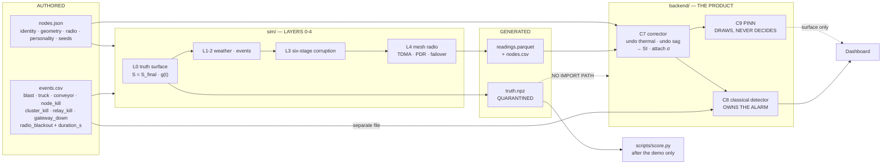

# Part 1C v4 — Network + Sensors, Merged Build Spec

**Supersedes** `part1c-mesh-network.md` (v1) and `part1-sensors-formulas-and-handoff.md`. Those two documents contradicted each other in three places; this one resolves them and states the build.

**This is a build document, not a critique.** Every number here is frozen. If a number is not in this document, it does not exist yet and you should not write code that needs it.

---

## 0. The three contradictions, resolved

Stated once so nobody re-litigates them mid-build.

| # | v1 said | Other doc said | **Frozen answer** |
|---|---|---|---|
| C1 | Relays are "a scheduling construct, not a range construct" (§4.2) | Reliable link = 400 m (§4.1); gateway at x=860; far node at x=25 is 835 m away | **Relays are a range construct first, scheduling second.** The west half of the field physically cannot reach the gateway. §3 rebuilds the topology on that basis. |
| C2 | Leaf→relay hop runs at SF9 (150 ms) | Leaf→relay hops are 25–150 m | **Leaf→relay runs at SF7 (45 ms).** Short hop, cheap preset. Cuts total channel use from 9.4% to 5.5%. |
| C3 | Relay burns ~40–60× a leaf's energy → monthly rotation mandatory | — | **Cluster slots are contiguous**, so a relay wakes RX for ~1 s not ~6 s. Relay is ~3.5× a leaf. Rotation demoted from mandatory to a battery-threshold policy. |

---

## 1. Frozen physical constants

Every constant that was previously "named but never valued." These go in one Python module, `sim/constants.py`, imported everywhere. **Sim and backend import the same module.** If they ever diverge, losses silently fail to converge and it looks like a training bug.

### 1.1 Ground model

| Symbol | Value | Units | Meaning |
|---|---|---|---|
| `H` | 150.0 | m | seam depth |
| `tan_beta` | 2.0 | — | influence flare |
| `r` | 75.0 | m | `H/tan_beta` — radius of major influence |
| `m_seam` | 3.0 | m | seam thickness |
| `a` | 0.65 | — | subsidence factor (**PINN must learn this, not be told it**) |
| `S_max` | 1.95 | m | `a · m_seam` |
| `c` | 0.01414 | /day | Knothe time constant (**learned**) |
| `B` | 24.0 | m | horizontal displacement coefficient, `0.32 · r` |
| `panel` | x∈[100,700], y∈[100,300] | m | extracted rectangle |
| `grid` | x∈[25,775], y∈[25,375], 64×64 | m | monitoring rectangle = panel + r on all sides |

**Derived peak magnitudes** (sanity anchors — if your generator disagrees, it is wrong):

| Channel | Peak | Wire headroom |
|---|---|---|
| Tilt | ~26 000 µrad (1.49°) | int16 @ **2 µrad LSB** → ±3.75° ✅ |
| Strain | ~8 300 µε | int16 @ 1 µε → ±32 767 ✅ |
| Ext (10 m span) | ~83 mm | int16 @ 10 µm → ±327 mm ✅ |
| Subsidence | 1.95 m | not on the wire |

> **Wire change from v3:** tilt LSB moves from 1 µrad to **2 µrad**. At 1 µrad the peak tilt clips at 1.88° and the true peak is 1.49° — a 26% margin, which is not a margin. Zero byte cost.

### 1.2 Corruption chain constants

Six stages, fixed order: thermal → OU bias → white → sag → quantise → vibration.

| Channel | `k_T` (stage 1) | `σ_b` (stage 2) | `σ_w` (stage 3) | `LSB` (stage 5) |
|---|---|---|---|---|
| tilt_x, tilt_y | 250 µrad/°C | 3 µrad | 8 µrad | 2 µrad |
| strain | 5 µε/°C | 0.5 µε | 1.2 µε | 1 µε |
| ext | 12 µm/°C | 5 µm | 15 µm | 10 µm |
| temp | — | — | 0.05 °C | 0.1 °C |
| vbat | — | — | 5 mV | 1 mV |

`T_ref = 25.0 °C` · `τ_OU = 21 600 s (6 h)` · `V_nom = 3.70 V`

### 1.3 Event / vibration constants

| Constant | Value | Note |
|---|---|---|
| `PPV` law | `1140 · (D/√Q)^(−1.6)` mm/s | DGMS-style attenuation |
| `Q_eq` truck | **0.14 kg** | fitted so a 30 m pass = 1.0 mm/s |
| `A₀` conveyor | **0.8 mm/s** | `PPV = A₀·e^(−D/D₀)` |
| `D₀` conveyor | **120 m** | |
| `f_dom` bands | blast 40–80 Hz · truck 8–20 Hz · conveyor 50±0.5 Hz · microseismic 100–250 Hz | the discriminator |
| `θ_c` crack | **1 500 µε**, ±10% per-node jitter | frozen into `nodes.json` |

---

## 2. The one master formula

Unchanged and non-negotiable. **One surface, four questions.**

```
P(x) = ½[ erf(√π(x−x₁)/r) − erf(√π(x−x₂)/r) ]
Q(y) = ½[ erf(√π(y−y₁)/r) − erf(√π(y−y₂)/r) ]
S(x,y,t) = S_max · P(x) · Q(y) · (1 − e^(−c·t))      down positive, metres
```

Space and time are **separable**, so truth is stored as one bowl plus one scalar curve — 65 KB, not 126 MB, and exact at any `t` rather than only on saved frames.

| Channel | Derivative of `S` |
|---|---|
| `tilt_x` | `∂S/∂x` |
| `tilt_y` | `∂S/∂y` |
| `strain` | `B · ∂²S/∂y²` |
| `ext_delta` | `‖(p₂+u₂)−(p₁+u₁)‖ − ‖p₂−p₁‖`, `u = (B·∂S/∂x, B·∂S/∂y, −S)` |
| `crack_flags` | latch on `|ε_yy|` crossing `θ_c, 2θ_c, 3θ_c` |

There is no second generator. Adding one is the single fastest way to break this project.

---

## 3. The network, rebuilt on range

### 3.1 Why the topology changes

Gateway sits at (860, 200). Reliable link at 1.5 m antenna height is **400 m**. Distances to the gateway:

| Node group | Distance to GW | Reaches directly? |
|---|---|---|
| Longitudinal x = 700, 775 | 160, 85 m | ✅ |
| Longitudinal x = 475–625 | 235–385 m | ✅ |
| Transverse line x = 400 | 460–475 m | ❌ |
| Longitudinal x = 25–325 | 535–835 m | ❌ |

**Roughly half the field cannot talk to the gateway.** That is the justification for the relay tier, and it is a stronger one than airtime compression.

### 3.2 Fix 1 — the gateway mast (do this first, it is one antenna)

Fresnel radius at 866 MHz over 500 m is ~6.5 m. Ground-level antennas sit inside the bottom 20% of the Fresnel cigar, which is why the 400 m limit exists at all.

**Raise the gateway antenna to 10 m on the surface hut.** Clutter loss on every relay→gateway link drops ~12 dB, extending reliable range to ~800 m.

| | Without mast | With 10 m mast |
|---|---|---|
| Relays reaching GW in one hop | 1 of 5 | **5 of 5** |
| Max chain depth | leaf→R→R→R→GW (4 hops) | **leaf→R→GW (2 hops)** |
| Worst-node duty cycle | 2.7% ❌ illegal | **0.67%** ✅ |

One elevated antenna, at the only site with mains power and a person who can climb, fixes every long link simultaneously. It is the highest-leverage hardware decision in the system.

### 3.3 The 31 nodes and 5 clusters — frozen assignment

| Cluster | Relay | Children | Max child hop | Relay→GW |
|---|---|---|---|---|
| **C1** | (175, 200) | (25,200) (100,200) (250,150) (250,250) | 150 m | 685 m |
| **C2** | (325, 200) | (250,200) (400,175) (400,200) (400,225) | 79 m | 535 m |
| **C3** | (400, 100) | (400,25) (400,75) (400,125) (400,150) | 75 m | 471 m |
| **C4** | (400, 300) | (400,250) (400,275) (400,325) (400,375) (325,300) | 100 m | 471 m |
| **C5** | (550, 200) | (475,200) (550,150) (550,250) (625,200) | 75 m | 310 m |
| **Direct** | — | (700,200) (775,200) anchor (860,340) | — | ≤ 212 m |
| **Wired** | — | anchor (860,200) | co-sited with GW | 0 m |

**Total: 5 relays + 21 clustered leaves + 3 direct leaves + 1 wired anchor + 1 gateway = 31.**

Two corrections to the v1 layout embedded above: the fifth off-axis node moves from (400,300) — which was a duplicate of an existing transverse node — to **(325,300)**. And the relay count drops from 6 to 5, because the two easternmost longitudinal nodes are inside direct gateway range and do not need a parent.

### 3.4 What a relay is — one SKU

Physically nothing changes. Same board, same ESP32, same SX1262, same sensors, same enclosure, same BOM. `radio_role: "relay"` in `nodes.json` is the entire difference.

| | Leaf | Relay |
|---|---|---|
| TX per cycle | 45 ms @ SF7 | 345–400 ms @ SF9 |
| RX per cycle | ~0.4 s (beacon, 1 cycle in 5) | ~1.4 s (own cluster's contiguous slots + beacon) |
| RAM held | one 21 B frame | 126 B aggregate + 320 B dedup ring |
| ACKs | receives | sends |
| Failure blast radius | 1 node | **5–6 nodes** |

**Energy ratio ≈ 3.5×, not 40×.** That is bought entirely by making each cluster's leaf slots **contiguous**, so the relay wakes RX for its own four slots and sleeps through the other seventeen. v1 assumed the relay listened across the whole 36 s leaf window.

> **Say this to judges:** one SKU, no special spares, and any node can be promoted to relay by a config push. That is a procurement argument, not just an engineering one.

### 3.5 Relay-to-relay — the failover path

With the mast, no relay needs another relay in nominal operation. Relay-to-relay is the **degraded path**, and it must exist because the thing you are measuring degrades your radio: a deepening trough lowers and tilts nodes, so links get worse exactly when the event matters.

**Pre-computed backup parents, frozen in `nodes.json`:**

| Relay | Primary next hop | Backup next hop | Backup distance |
|---|---|---|---|
| C1 | gateway | **C2** | 150 m |
| C2 | gateway | **C5** | 225 m |
| C3 | gateway | **C5** | 180 m |
| C4 | gateway | **C5** | 180 m |
| C5 | gateway | C2 | 225 m |

**How the forward actually works — three rules:**

1. **Verbatim forwarding, never re-aggregation.** A relay in failover transmits its own 121 B aggregate *and separately* forwards its child-relay's aggregate as a second frame. Re-aggregating five clusters would produce a 546 B payload, and LoRa's maximum is 255 B. Two frames, one TTL decrement each.
2. **Relay slots are ordered by hop depth, descending.** The deepest relay transmits first, so its parent is still awake to hear it inside the same superframe. `relay_slot_index = (h_max − h_self)`. Get this backwards and a forwarded frame waits a full cycle.
3. **Failover halves the orphan's cadence.** A relay carrying two aggregates hits 1.07% duty — over the legal 1%. So a cluster in failover drops to **120 s** cadence, bringing it to 0.54%. The gateway logs this and the dashboard shows the affected cluster as *degraded*, never silently.

### 3.6 Does this forfeit being a mesh?

No, and the distinction is worth stating precisely because a judge will ask.

A mesh is defined by **multi-hop forwarding with alternate paths and self-healing**. It is not defined by flooding. Flooding is one routing policy a mesh can use, and it is the wrong one here:

| Property | Present? | Where |
|---|---|---|
| Multi-hop forwarding | ✅ | leaf → relay → gateway, and leaf → relay → relay → gateway in failover |
| Alternate paths | ✅ | backup parent per node, backup relay per relay, backup direct slot per leaf |
| Self-healing without operator action | ✅ | 3-cycle parent-death detection → automatic re-election |
| Flooding | ✅ | **event plane only** — where it is correct |

**What we drop is flooding as the routing policy for bulk telemetry.** The arithmetic: 30 nodes × 13 rebroadcasts × 45 ms = 17.5 s per 60 s cycle = 29% channel, past the ~18% ALOHA collapse threshold, with each node at 0.975% duty — the legal ceiling, leaving nothing for alerts.

And flooding scales as **N²** — every added node is another rebroadcaster. Under TDMA one more node costs exactly one more slot. Linear. *Adding nodes to fix a flooding problem is like adding people to a room to make it quieter.*

> **The rule underneath the whole design: flood the rare and tiny, schedule the frequent and bulky.**

We remain inside Meshtastic. `NextHopRouter` is a stock Meshtastic router; choosing it over managed flood is a configuration decision, not a departure from the stack.

---

## 4. The three planes

| Plane | Payload | Preset | Cadence | Who | Latency | Duty |
|---|---|---|---|---|---|---|
| **P1 Routine** | 21 B telemetry, all nodes | SF7 leaf / SF9 relay | 60 s | everyone | ~5 s | 0.67% worst |
| **P2 Escalation** | same, faster | SF7 | 20 s | one cluster only | ~2 s | 0.53% |
| **P3 Event** | 8 B alert | SF7, **flooded** | immediate | tripping node | **<1 s** | 0.21% |

**The insight:** nobody is harmed because a tilt reading arrived nine minutes late. They are harmed because an *alarm* arrived nine minutes late. An 8 B alert at SF7 costs 35 ms; a full telemetry packet at SF11 costs 518 ms. The alarm is fifteen times cheaper than the thing that was throttling it.

**P3 does not raise an alarm.** It is a request for attention. Trigger is two comparisons on the node — `|v − rolling_baseline| > k·σ` and `|dv/dt| > threshold`. No ML on the node. The alarm remains owned entirely by the gateway-side classical detector (§7).

---

## 5. The superframe — 60 s, frozen

```
 t=0    t=2                    t=8              t=14        t=22                    t=60
 ├──────┼───────────────────────┼────────────────┼───────────┼───────────────────────┤
 │beacon│ 24 leaf slots × 250ms │ 5 relay slots  │ contention│  quiet / event reserve│
 │  2 s │ CONTIGUOUS PER CLUSTER│ + 3 direct     │    8 s    │         38 s          │
 └──────┴───────────────────────┴────────────────┴───────────┴───────────────────────┘
```

| Block | Duration | Contents |
|---|---|---|
| Beacon | 2 s | epoch, map_version, escalation_mask, config_version, flags, crc — **12 B**, 119 ms on air |
| Leaf slots | 6 s | 24 × 250 ms (45 ms TX @ SF7 + 205 ms guard). **Cluster k occupies slots [4k, 4k+5)** |
| Relay + direct | 6 s | 5 relay slots @ 800 ms, 3 direct-leaf slots @ 400 ms, ordered by hop depth descending |
| Contention | 8 s | retries, map pulls, buffer replay, orphan backup slots (40 pre-allocated) |
| Quiet | 38 s | event-plane headroom. **63% idle is why the alarm plane clears CAD in one attempt** |

### 5.1 Budget — measured, not asserted

```
21 clustered leaves × 45 ms  (SF7)  = 0.945 s
 3 direct leaves    × 150 ms (SF9)  = 0.450 s
 4 relays × 345 ms + 1 × 400 ms     = 1.780 s
 beacon                             = 0.119 s
                              TOTAL = 3.294 s / 60 s
```

| Metric | v1 design | **v4** | Limit |
|---|---|---|---|
| Channel utilisation | 9.45% | **5.49%** | 18% (ALOHA collapse) |
| Worst-node duty cycle | 0.57% | **0.67%** | 1.00% (IN865 law) |
| Leaf duty cycle | 0.25% | **0.075%** | 1.00% |
| Alarm latency | <1 s | <1 s | — |
| Free channel time | 90.6% | **94.5%** | — |

The worst-node number goes *up* slightly (0.57 → 0.67) because the relay tier now carries genuine forwarding work rather than being a scheduling convenience. Channel use goes *down* because 21 leaves moved to SF7. Both are the right direction.

### 5.2 Time sync — no GPS

±20 ppm crystal · 60 s beacon interval → **1.2 ms** drift · **205 ms** guard band → **170× margin**. After ten missed beacons: 12 ms, still 17× inside guard. Propagation delay at 750 m is 2.5 µs — ignore it.

> "We did the drift arithmetic and found we didn't need GPS" is a better answer than "GPS," and it saves ~₹400/node.

---

## 6. Routing — the selection formulas

These are the formulas the simulator implements and the firmware would implement. All are cheap integer/float arithmetic; none needs a model.

### 6.1 Parent selection cost

Node `i` choosing among candidate parents `j`:

```
C(i→j) = w₁·(1 − PDR_ij)  +  w₂·(h_j + 1)/h_max  +  w₃·(1 − vbat_j/V_full)  +  w₄·(load_j/5)

w₁ = 0.50   link reliability dominates
w₂ = 0.25   prefer shorter chains to the gateway
w₃ = 0.15   do not hang children on a dying parent
w₄ = 0.10   spread load across relays
```

Pick `argmin C`. **Hysteresis is mandatory:** switch only if `C_new < 0.8 · C_current` for **3 consecutive cycles**. Without it the network thrashes parents on shadowing noise and you spend the whole demo re-electing.

`PDR_ij` comes from the link model:

```
PL(d) = 71.2 + 40·log₁₀(d/100) + X_σ + L_clutter      [σ = 6 dB, frozen per node pair]
L_clutter = 15 dB ground-level   |   3 dB relay→masted gateway
M = ERP − PL − sensitivity(SF)
PDR = 1 / (1 + exp(−(M − 3)/2))
```

`n = 4.0` and `L_clutter` are **calibrated, not derived** — set so the model reproduces PDR ≥ 0.99 at 400 m with 1.5 m antennas. Say so on stage and report Meshtasticator's disagreement rather than hiding it.

### 6.2 Relay election score

Run at the gateway when a relay dies or drops below its battery threshold:

```
E_j = 0.40·(vbat_j / V_full)
    + 0.30·(1 − d_j→nexthop / 400)
    + 0.20·(mean PDR to prospective children)
    + 0.10·(1 − duty_j / 0.01)
```

Highest `E_j` in the orphaned cluster wins.

### 6.3 Transmission ordering — the one rule people get wrong

**Do not reorder TDMA slots by urgency.** Slot order is static and derived from `node_id`, because determinism is the entire reason TDMA has no collisions. A dynamic order needs every node to agree on the order every cycle, which needs the full map every cycle, which costs the airtime you built TDMA to save.

**Priority is expressed as cadence, not as order.** A node with a rising signal does not jump the queue — its *cluster* is moved to P2 escalation and talks three times as often. Two ways to express urgency; only one of them is free.

The value-of-information score that drives escalation:

```
U_i(t) = |v_i(t) − baseline_i(t)| / σ_i          (z-score, per channel)

U > 3    →  WATCH   log it
U > 5    →  WARN    gateway moves this cluster to P2 (20 s cadence, SF7, 30 min cap)
U > 8 AND dU/dt > 1 per epoch  →  node fires a P3 event packet
```

`baseline_i` is a 24 h rolling median, held on the node in 48 bytes.

The only ordering rule that *is* dynamic is §3.5 rule 2: **relay slots ordered by hop depth descending**, so cascades complete within one superframe. That order changes only when `map_version` changes — roughly monthly.

---

## 7. Failure handling

| # | Failure | Detection | Response |
|---|---|---|---|
| **F1** | Single node silent | 3 consecutive missed slots | mark stale; PINN masks it; alarm quorum recomputed on survivors |
| **F2** | Link degrading | 24 h rolling RSSI slope < −3 dB/day | re-elect parent (§6.1). **Maintenance alert, never a subsidence alarm** |
| **F3** | **Correlated cluster loss** | ≥3 nodes within 100 m go `alive=0` in one 10-min window, no blackout logged, no DGMS blast | **Class-A escalation to a human.** Never auto-resolved |
| **F4** | Relay death | 3 consecutive missed ACKs from the same parent | leaf buffers → backup direct slot at cycle N+3 → gateway re-elects (§6.2) → normal by N+6 |
| **F5** | Gateway death | backhaul watchdog, 3 missed cycles | store-and-forward; 21 B × 60 × 72 = **90.7 KB** for 72 h |
| **F6** | Duplicates | key `(node_id, epoch)` | idempotent upsert |
| **F7** | Out-of-order | epoch monotonic per node | order by `(node_id, epoch)`, **never** by `t_iso` |
| **F8** | Byzantine node | MAD vs 5 nearest neighbours, per channel | quarantine **that channel on that node**, not the node |

### 7.1 Silence is data — the strongest claim in the design

A naive mesh treats missing nodes as missing data and interpolates over them. But **the failure mode you are trying to detect destroys sensors.** A subsidence event severe enough to matter will crack, tilt, bury or sever the nodes on top of it. The moment the system most needs data is exactly the moment it stops arriving — and a system that silently interpolates that gap will interpolate over a collapse.

**Rule: spatially clustered silence is an event, not an absence.**

Response is a Class-A alert phrased honestly: *"four nodes in the north-east quadrant stopped reporting simultaneously; cause unknown; investigate."* The system does not know whether it lost four boxes or four hectares, and it must not pretend otherwise.

### 7.2 Identity key — `epoch`, never `seq`

- `epoch` = the 60 s sample index, sourced from the beacon. Monotonic by construction, identical on the original and every retry, **survives a reboot**.
- `seq` resets to zero on reboot, so a rebooted node's frame 5 would collide with its pre-reboot frame 5 and the upsert would overwrite good data with unrelated good data. No error, no gap, wrong numbers — the worst class of bug.

**`seq` measures loss. `epoch` establishes identity.** Keep both.

**Corollary:** `seq` increments once per **frame produced**, never per transmission. Retransmitting frame 1152 sends frame 1152 again, bit for bit. A retry is not a new frame.

### 7.3 Aggregation risk — model it, do not assume it away

One lost relay frame loses five nodes' data, not one. That is the price of the airtime saving. Mitigations: relay-level retry in the contention window, plus the leaf's own buffer (the leaf does not delete a frame until ACKed). **Measure the resulting loss distribution and put it on the results slide** rather than asserting it is fine.

---

## 8. `nodes.json` — complete field reference

The registry. Authored by hand, read by sim, gateway and backend. Nothing here is computed at runtime — per-node random draws are **frozen into the file**, not re-drawn, so a rerun is byte-identical.

### 8.1 Top-level blocks

```jsonc
{
  "meta":   { ... },   // provenance
  "site":   { ... },   // ground physics
  "panel":  { ... },   // extracted rectangle
  "grid":   { ... },   // output grid
  "mesh":   { ... },   // radio configuration
  "sim":    { ... },   // cadence and seeds
  "nodes":  [ ... ]    // 31 entries
}
```

### 8.2 `meta` — provenance

| Field | Type | Meaning |
|---|---|---|
| `schema_version` | str | `"1.4.0"` — bump on any field change |
| `scenario_id` | str | `"sih-demo-40d"` |
| `start_iso` | str | UTC start of `t = 0` |
| `duration_days` | float | 40.0 |
| `generator_sha256` | str | hash of the generator source, written at generation |

### 8.3 `site` — ground physics

| Field | Type | Units | Value | Consumed by |
|---|---|---|---|---|
| `H` | float | m | 150.0 | surface, PINN (**fixed**) |
| `tan_beta` | float | — | 2.0 | surface, PINN (**fixed**) |
| `m_seam` | float | m | 3.0 | surface, PINN (**fixed**) |
| `a` | float | — | 0.65 | surface only — **PINN must never read this** |
| `c` | float | /day | 0.01414 | surface only — **PINN must never read this** |
| `B` | float | m | 24.0 | surface, PINN loss 2 & 3 (**fixed, must match exactly**) |

> `a` and `c` are the answer key for the physics loss. See §10.3.

### 8.4 `panel`, `grid`

| Field | Type | Value |
|---|---|---|
| `panel.x1, y1, x2, y2` | float, m | 100, 100, 700, 300 |
| `panel.t0_day` | float | 0.0 — extraction completion day |
| `grid.x_min, x_max, y_min, y_max` | float, m | 25, 775, 25, 375 |
| `grid.nx, ny` | int | 64, 64 |

Both `panel` and `grid` are single objects today. Rule 4 stands: making `panel` an array and adding `panel_id` per node is a data change, not a code change. Leave the door open, do not walk through it.

### 8.5 `mesh` — radio configuration

| Field | Value | Meaning |
|---|---|---|
| `band` | `"IN865"` | 865–867 MHz |
| `erp_dbm` | 30 | 1 W ERP |
| `duty_cycle_limit` | 0.01 | hard legal ceiling |
| `preset_leaf` | `"SHORT_FAST"` | SF7/BW250 — **changed from SF9 in v1** |
| `preset_relay` | `"MEDIUM_FAST"` | SF9/BW250 |
| `preset_event` | `"SHORT_FAST"` | SF7/BW250 |
| `router` | `"next_hop"` | routed unicast for P1/P2 |
| `flood_planes` | `["event"]` | flooding is allowed **only** here |
| `hop_limit` | 3 | 2 nominal, 3 covers failover |
| `superframe_s` | 60 | |
| `beacon_s` | 60 | |
| `leaf_slot_s` | 0.25 | 45 ms TX + 205 ms guard |
| `relay_slot_s` | 0.8 | |
| `contention_s` | 8 | |
| `escalation_cadence_s` | 20 | |
| `escalation_cap_s` | 1800 | 30 min/hour, enforced in firmware not on a slide |
| `failover_cadence_s` | 120 | orphan cluster halves cadence to stay legal |
| `buffer_frames` | 4320 | 72 h at 60 s |
| `gateway_antenna_h_m` | **10.0** | the mast |
| `reliable_range_m` | 400 | ground-to-ground |
| `reliable_range_masted_m` | 800 | ground-to-mast |
| `parent_cost_weights` | `[0.50, 0.25, 0.15, 0.10]` | §6.1 |
| `parent_hysteresis` | 0.8 | switch threshold |
| `parent_hysteresis_cycles` | 3 | |

### 8.6 `sim` — cadence, seeds, determinism

| Field | Value | Meaning |
|---|---|---|
| `sample_s` | 60 | node sampling interval |
| `transmit_s` | 60 | baseline transmission (was 600 in v3) |
| `hot_window_s` | 60 | cadence inside event windows |
| `hot_window_pad_h` | 3 | hours either side of a scripted event |
| `truth_frame_s` | 1800 | irrelevant now — truth is analytic |
| `master_seed` | 20260901 | one seed, all streams derived from it |
| `rng_streams` | `["weather","cloud","ou_bias","white","shadow","pdr","ack","event_jitter"]` | named streams, never shared |

> **Rule 5, restated because chunking depends on it:** noise arrays are generated for the **full span** from the master seed and then sliced. A chunked run must be byte-identical to a single run. Chunking without this rule silently corrupts the second half.

### 8.7 `nodes[]` — per-entry fields

Every field, grouped by what it is *for*.

**Identity**

| Field | Type | Example | Meaning |
|---|---|---|---|
| `id` | int | 17 | stable, 0–30 |
| `name` | str | `"T-400-175"` | human label, group-position |
| `role` | enum | `field` / `anchor` / `gateway` | what the node is **for** |
| `group` | enum | `transverse` / `longitudinal` / `offaxis` / `anchor` / `gateway` | which survey construct it belongs to |

**Geometry**

| Field | Type | Units | Meaning |
|---|---|---|---|
| `x`, `y` | float | m | position |
| `z0` | float | m | initial surface elevation (0.0 datum) |
| `antenna_h_m` | float | m | 1.5 field, **10.0 gateway** |
| `has_ext` | bool | — | extensometer fitted |
| `ext_to` | [float,float] \| null | m | far peg; null if `has_ext` false |
| `ext_len_m` | float | m | 10.0 nominal span |

**Radio**

| Field | Type | Meaning |
|---|---|---|
| `radio_role` | enum | `leaf` / `relay` / `direct` / `gateway` / `wired` — how it behaves on air. **Separate from `role`**: an anchor can be a relay |
| `parent` | int \| null | primary next hop |
| `backup_parent` | int \| null | pre-computed failover next hop (§3.5) |
| `hop_depth` | int | 1 or 2; sets relay slot order |
| `cluster` | int \| null | 1–5, or null for direct |
| `slot` | int | static slot index, the safety net that must never be removed |
| `backup_slot` | int | contention-window direct slot, used on F4 |

**Personality — frozen random draws**

These are what stop the 31 nodes being clones. Drawn once when the file is authored, then never re-drawn.

| Field | Type | Units | Range | Feeds |
|---|---|---|---|---|
| `shade_s` | float | — | 0.3–1.0 | solar insolation → `T_chip`, `vbat` |
| `temp_offset_c` | float | °C | ±2.0 | `T_chip` |
| `k_solar` | float | °C per unit I | 6–12 | `T_chip` |
| `crack_theta_c_ue` | float | µε | 1350–1650 | crack latch |
| `bias0_tilt_x/y` | float | µrad | ±10 | OU stage initial condition |
| `bias0_strain` | float | µε | ±2 | " |
| `bias0_ext` | float | µm | ±20 | " |
| `sigma_scale` | float | — | 0.8–1.3 | per-node noise multiplier |
| `battery_wh` | float | Wh | 8–12 | SOC integration |
| `panel_w` | float | W | 1.5–2.5 | solar panel rating |

**Health / schedule**

| Field | Type | Meaning |
|---|---|---|
| `install_day` | float | day the node came online (0.0 for all today) |
| `firmware_version` | str | `"1.4.0"` |
| `enabled` | bool | authored kill switch, distinct from runtime `alive` |

### 8.8 What `nodes.json` must NOT contain

| Excluded | Why |
|---|---|
| Anything time-varying | that is telemetry, not registry |
| `alert_sent`, siren state | alerts are **actions**, not measurements; adding them breaks the sim/backend seam |
| Runtime `alive` | `alive` lives in telemetry; `enabled` is the authored equivalent |
| Any truth field | quarantine |

---

## 9. What the PINN gets

Hand this to the Part 2 owner as a contract. Arrives every 30 simulated minutes. `N = 31`, `G = 64`, `M = 2000` collocation points.

### 9.1 Inputs

**Static, from `nodes.json`, loaded once:**

| Name | Shape | dtype | Units |
|---|---|---|---|
| `xy` | (N,2) | f32 | m |
| `ext_to` | (N,2) | f32 | m — NaN where none |
| `is_anchor` | (N,) | bool | — |
| `panel` | (4,) | f32 | m |
| `H`, `tan_beta`, `m_seam`, `B` | scalars | f32 | m, —, m, m |
| `grid_x`, `grid_y` | (G,) each | f32 | m |

**Per epoch, from C7:**

| Name | Shape | Units | Source |
|---|---|---|---|
| `t` | scalar | days since `start_iso` | epoch |
| `obs_tilt_x`, `obs_tilt_y` | (N,) | **radians** | C7 step 5 |
| `obs_strain` | (N,) | **dimensionless** | C7 step 5 |
| `obs_ext` | (N,) | **metres** | C7 step 5 |
| `sigma_tilt_x/y`, `sigma_strain`, `sigma_ext` | (N,) each | matching units | C7 step 6 |
| `valid` | (N,4) | bool | C7 step 8 |

**Unit conversions C7 performs — the ML owner never does these:**

| Wire | → SI | Factor |
|---|---|---|
| `tilt_*` (2 µrad LSB) | radians | `× 2e-6` |
| `strain_ue` | dimensionless | `× 1e-6` |
| `ext_delta_10um` | metres | `× 1e-5` |
| `temp_dc` | °C | `× 0.1` — **consumed by C7, not forwarded** |

**`valid` is (N,4), not (N,).** A node can send good tilt and garbage strain in the same packet. Masking per node throws away good data. Channel order `[tilt_x, tilt_y, strain, ext]`.

### 9.2 What must never arrive

| Withheld | Why |
|---|---|
| `truth.npz` / `truth_at()`, any part | it is the answer key; one import and the system becomes a playback device that still looks like it works |
| `a`, `c` from `nodes.json` | §10.3, the circularity trap |
| `vib_rms`, `vib_peak`, `vib_fdom` | transients do not constrain a surface that moves over days → C8 |
| `crack_flags` / `status_flags` | derived from strain; feeding it double-counts the same evidence → C8 |
| `temp_dc`, `vbat_mv` | already consumed at C7 steps 3–4; pass them again and the net re-learns a correction already applied |
| `rssi`, `snr`, `hops`, `parent_id` | link quality is not ground physics; it belongs in σ, not in the network |
| Raw uncorrected values | the net will fit thermal drift and call it subsidence |

### 9.3 Network and losses

| Property | Value | Why |
|---|---|---|
| Input | `(x,y,t)` normalised to ≈[−1,1] | normalisation is not optional for PINNs |
| Output | `S`, scalar, metres, down positive | one surface |
| Shape | 4 hidden × 64, ≈13 k params | CPU-only |
| Activation | **`tanh`** | you need `∂²S/∂y²`; ReLU's second derivative is zero and the strain loss silently dies |
| Optimiser | Adam, ~400 steps/epoch, **always warm-started** | the surface barely moved in 30 min |

| # | Loss | Compares | Weight | Evaluated at |
|---|---|---|---|---|
| 1 | Tilt | net `∂S/∂x`, `∂S/∂y` vs obs | `1/σ²` | 31 node positions |
| 2 | Strain | net `B·∂²S/∂y²` vs obs | `1/σ²` | node positions |
| 3 | Extensometer | implied peg-to-peg length change vs obs | `1/σ²` | node → `ext_to` lines |
| 4 | Anchor | net `S` vs 0 | high, fixed | the 2 anchors |
| 5 | Physics | net `S` vs Knothe form with **learned** `â`, `ĉ` | moderate | 2000 points, resampled each epoch |

**Loss 4 does enormous work for one line.** Losses 1–3 constrain *shape* only. Without anchors you get a perfectly-shaped bowl floating at an arbitrary depth — the maths genuinely cannot distinguish 5 mm from 5 m.

**Loss 5 fills the dead zone.** Where a Kill Cluster removed six nodes, losses 1–3 contribute nothing. Loss 5 says: *whatever is here must be a smooth Knothe bowl consistent with the edges.* That is a defensible reconstruction, not a guess — and it is the answer to the question judges will ask when you press the button.

### 9.4 Outputs

| Name | Shape | Goes to |
|---|---|---|
| `S_grid` | (64,64) | 3-D dashboard surface |
| `tilt_x_grid`, `tilt_y_grid` | (64,64) | contour overlay |
| `strain_grid` | (64,64) | tension heat-map |
| `a_hat`, `c_hat` | scalars | "estimated parameters" panel |
| `loo_residual` | (N,) | **the live accuracy number** |
| `weights` | — | warm-start next epoch |

`loo_residual` is leave-one-node-out: hide node 17, reconstruct from the other 30, predict what 17 *should* read, compare. It needs **no ground truth**, so it is the only accuracy metric that survives into a real deployment.

### 9.5 The rule

> **The PINN draws. It never decides.**

---

## 10. What the alarm gets

### 10.1 There is no alarm neural network — and that is the feature

The alarm is a **deterministic classical detector**. Not a neural network, not a classifier, not a language model. This is a frozen decision and it is a selling point, not a limitation: an alarm you can hand-trace at 3 a.m. is the only kind a mine safety officer will accept, and DGMS will ask.

The PINN's output is not an alarm input either — that would launder a learned surface into a safety decision through the back door. **C8 reads sensors and the blast register. Nothing else.**

### 10.2 C8 input vector

| Input | Source | Shape |
|---|---|---|
| `obs_strain`, `obs_tilt_x/y`, `obs_ext` + σ + `valid` | C7 | (N,), (N,4) |
| `xy`, `panel`, `is_anchor` | `nodes.json` | static |
| `alive`, `seq` gaps | telemetry | (N,) |
| `status_flags` → `CRACK_LEVEL`, `SELFTEST_OK`, `LAST_GASP`, `REBOOT`, `EXT_PRESENT` | telemetry | (N,5) |
| `vib_rms`, `vib_peak`, `vib_fdom` | telemetry | (N,3) |
| `rssi`, `snr`, `hops`, `parent_id` | telemetry | (N,4) — **used for σ inflation and F2 only** |
| Blast register: `t_iso`, `x_m`, `y_m`, `charge_kg`, `duration_s` | `events.csv`, **opened as a separate file** | rows |

### 10.3 C8 decision pipeline — seven steps, all auditable

```
1  QUORUM      ≥5 valid nodes with |z| > 3           else → QUIET
2  BOWL FIT    Levenberg-Marquardt over (a, c), panel fixed
               → R², residual, a_fit
               require R² ≥ 0.85                     else → INCOHERENT (log, no alarm)
3  BLAST VETO  any DGMS blast with Δt < 120 s AND D < 500 m
               AND f_dom ∈ [40,80] Hz
               AND anomaly decays within 3 epochs    → VETO, label BLAST
4  MACHINE     f_dom ∈ [49.5,50.5] Hz narrow band    → notch, subtract, re-run step 1
   VETO        f_dom ∈ [8,20] Hz + truck event       → VETO, label TRUCK
5  SILENCE     ≥3 nodes within 100 m, alive=0 in one window,
               no blackout logged, no blast          → CLASS-A, bypasses everything
6  PERSISTENCE anomaly holds ≥3 consecutive epochs
               except LAST_GASP and step 5           else → WATCH
7  LEVEL       emit WATCH / WARN / ALARM + evidence list
```

**Why the blast veto is the differentiator.** DGMS Circular 7/1997 already requires every Indian coal mine to keep blast seismograph records. Those records exist, legally, at every target site. Reusing them simultaneously removes the largest false-positive source *and* removes a sensor from the BOM. Speed and the blast log are one story, not two: **you can afford a sub-second alarm plane precisely because you have a legally-mandated register to veto it against.**

### 10.4 C8 output

| Field | Meaning |
|---|---|
| `level` | QUIET / WATCH / WARN / ALARM / CLASS-A |
| `evidence[]` | list of `(node_id, channel, z, contribution)` — every alarm is traceable to named nodes |
| `bowl_r2`, `a_fit` | fit quality |
| `vetoed_by` | null / BLAST / TRUCK / CONVEYOR |
| `quorum_n` | how many nodes voted |
| `latency_ms` | first-arrival to decision |

---

## 11. Data flow, one picture



---

## 12. Development scope — boundaries and gates

### 12.1 Module ownership and interfaces

| Module | Owner | Reads | Writes | Never touches |
|---|---|---|---|---|
| `sim/L0-L3` | Part 1 | `nodes.json`, `events.csv` | in-RAM arrays | anything in `backend/` |
| `sim/L4` mesh | Part 1 | L3 arrays, `mesh` block | `readings.parquet`, `nodes.csv`, `radio_report.json` | truth |
| `truth/` | Part 1 | `nodes.json` | `truth.npz` | **has no `__init__.py`** |
| `backend/C7` | Part 2 | `nodes.csv`, `nodes.json` | epoch dict | `truth/`, `events.csv` |
| `backend/C8` | Part 2 | C7 output, `events.csv` | alarm records | `truth/`, C9 output |
| `backend/C9` PINN | Part 2 | C7 output only | `S_grid`, `loo_residual` | `truth/`, `a`, `c` |
| `frontend/` | Part 3 | C7/C8/C9 JSON over WS | — | files directly |

### 12.2 The four boundaries that must not move

1. **`truth/` has zero import path from `backend/`.** Enforced by test T8 in CI, not by discipline.
2. **One implementation of `S(x,y,t)`.** All derivatives are autodiff or closed-form from it.
3. **The PINN never raises an alarm.** C8 never reads C9.
4. **No language model in the safety loop.**

### 12.3 Test gates

| Test | Asserts |
|---|---|
| T1 | volume conservation over the bowl |
| T2 | `S → 0` beyond `r` outside the panel |
| T7 | undoing stages 4 then 1 with true `T_chip`, `V_bat` leaves residual inside the white-noise band |
| T8 | `import truth` from `backend/` raises |
| **T9** | `truth_at(check_t[i])` reproduces `check_S[i]` to < 1e-6, all 8 |
| **T10** | simulated crack latch matches `t_crack = −(1/c)·ln(1 − θ_c/(B·|∂²S_final/∂y²|))` within one sample |
| **T11** | `relay_kill` injection loses **zero rows** — only delayed ones |
| **T12** | measured worst-node duty cycle < 1.0% across the whole run |
| **T13** | a reboot resetting `seq` produces no upsert collision |

T11 alone validates most of §7.

### 12.4 Six-day build schedule, hard freeze on day 6

| Day | Deliverable | Gate |
|---|---|---|
| **1** | `constants.py` + `nodes.json` authored, all 31 entries, all personality draws frozen | file validates against a JSON schema; T1, T2 pass on the surface |
| **2** | L0–L2: surface, derivatives, weather, events → in-RAM arrays | T9, T10 |
| **3** | L3 corruption chain, six stages, fixed order | **T7 — if this fails, stop; nothing downstream can work** |
| **4** | L4 mesh: TDMA scheduler, link model, PDR draw, relay aggregation, failover | T11, T12 |
| **5** | `readings.parquet` + `nodes.csv` + `radio_report.json`; handoff to Parts 2 & 3 | T8, T13; Part 2 can load an epoch without asking a question |
| **6** | **Freeze.** Demo scenario tuning only — no schema changes, no new fields | full suite green |

**Day 6 freeze means:** after day 6, `nodes.json` schema, wire format, and the C7/C9 contract are immutable. Anything discovered after that becomes a v5 note, not a code change.

### 12.5 Demo data path — decided

Freeze at **Layer 2 output**, run Layers 3–4 live. This preserves Kill Cluster, blast injection and radio degradation as genuinely live overlays, and it resolves the demo-clock problem: pre-compute the baseline 40-day PINN reconstructions offline, and trigger a **real live retrain only after a Kill Cluster or blast event**. Judges then watch a genuine retrain at exactly the moment it matters, and the other 1918 frames cost nothing.

---

## 13. Say it in ten lines

> Every node carries seven cheap sensors and an ESP32 running at 0.3% CPU duty — compute is free, airtime is not, which is why the packet is 21 bytes. All four ground channels are derivatives of one closed-form Knothe surface; there is no second generator, and because that surface is separable in space and time, the ground truth is 65 KB and exact at any instant rather than 126 MB of photographs. The radio runs three planes: bulk telemetry scheduled at 60 s, a cluster escalation mode, and an 8-byte alarm flood that reaches the gateway in under a second — 5.5% channel use and 0.67% worst-node duty against a 1% legal ceiling, measured rather than asserted. Relays exist because half the field is physically out of gateway range, they run one SKU with a config flag, and a 10-metre mast at the surface hut collapses every long link to a single hop. We flood the rare and tiny and schedule the frequent and bulky, because flooding costs N² and scheduling costs N. When four nodes go quiet together we escalate to a human, because the thing we are detecting destroys sensors and a system that interpolates that gap will interpolate over a collapse. The neural network receives 31 corrected readings with per-channel uncertainties and a validity mask, learns the two physics parameters it is not told, and returns a surface plus a leave-one-out accuracy number that needs no answer key. The alarm is not a neural network at all — it is a bowl fit vetoed by the mine's own legally-mandated blast register. It draws. It never decides.
