# PS 26025 — System Flow, Component Map, and Requirement Checklist

**Purpose.** Two jobs in one document.
1. Turn the problem statement into a checklist and mark what is planned, what is spec'd, and what is missing.
2. Explain the whole machine as a chain of small components, each with a diagram, then join the diagrams into one.

**Read order.** §1 for the checklist. §2–§3 for the components. §7 for the whole picture. §8 for one packet traced end to end. §9 for the decisions I need from you.

---

# 1. The problem statement as a checklist

## 1.1 What the PS explicitly asks for

Status key: **DONE** = spec'd and buildable from existing docs · **PARTIAL** = covered but has a hole · **GAP** = not addressed anywhere · **DEFERRED** = deliberately cut to Phase 2

### Sensor node requirements

| # | PS asks for | Where it lives | Status | Note |
|---|---|---|---|---|
| 1 | Tilt / inclination sensors | MPU9250 slow read → `tilt_x`, `tilt_y` | DONE | Demoted to secondary. You have the number that justifies it. |
| 2 | Vibration sensors | MPU9250 fast read → `vib_rms`, `vib_peak`, `vib_fdom` | DONE | Used for rejection, not detection. |
| 3 | Displacement / stretch sensors | Draw-wire extensometer → `ext_delta` | DONE | |
| 4 | Crack detection sensors | Conductive line → `crack_r` | DONE | Derived from accumulated strain. State that plainly. |
| 5 | Optional low-cost positioning | GPS, surveyed once into `nodes.json` | DONE | You have a strong three-reason answer for why it is not transmitted. |
| 6 | Low cost hardware — Arduino/ESP32/RPi | BOM slide only | DEFERRED | ₹1,850–3,650/node claim. Have the BOM printed. |

### Network requirements

| # | PS asks for | Where it lives | Status | Note |
|---|---|---|---|---|
| 7 | Wireless mesh: LoRa/Zigbee/Wi-Fi mesh | C4 Radio model + Meshtastic | DONE | |
| 8 | Continuous real-time monitoring | 60 s sample / 10 min transmit | DONE | |
| 9 | Low power | Duty cycle model + battery channel | PARTIAL | You model battery sag but have no energy budget. See §9 Q4. |

### Detection requirements

| # | PS asks for | Where it lives | Status | Note |
|---|---|---|---|---|
| 10 | Abnormal ground tilt | C8 detector, secondary vote | DONE | |
| 11 | **Change in relative distance between nodes** | — | **PARTIAL — read this** | Your extensometer measures peg A → peg C, *not* node to node. The PS wording literally asks for inter-node distance. See §1.3. |
| 12 | Early crack initiation | `crack_r` one-way latch | DONE | |
| 13 | Unusual vibration signatures | Blast/truck/conveyor/cracking fingerprints | DONE | Your strongest section. |

### AI/ML requirements

| # | PS asks for | Where it lives | Status | Note |
|---|---|---|---|---|
| 14 | Identify abnormal deformation patterns | C8 Knothe bowl-fit, R² gated | DONE | |
| 15 | Predict possible subsidence zones | C9 PINN continuous field | DONE | |
| 16 | Estimate severity and progression | C8 time-function extrapolation → "6 days to Level 3" | DONE | |
| 17 | Generate automated early warning alerts | C10 + C12 | DONE | |
| 18 | Using **live and historical** data | — | **GAP** | You have live only. No historical archive, no retrospective backtest. See §9 Q5. |

### Platform requirements

| # | PS asks for | Where it lives | Status | Note |
|---|---|---|---|---|
| 19 | GIS-based live deformation maps | C11 Leaflet + heat overlay | DONE | |
| 20 | Risk zones | C11 confidence zoning | DONE | |
| 21 | Alerts via SMS / email / mobile app | C12, log panel only | PARTIAL | Simulated. One real SMS via a free gateway would cost 2 hours and remove the weakest line in the demo. |
| 22 | Interactive dashboards for **operators, planners, and regulators** | C11, operator only | **GAP** | Three personas named in the PS. You have one. Cheapest fix: one read-only "Regulator view" tab showing compliance log + blast cross-check audit trail. |
| 23 | Offline capability with periodic cloud sync | C6 "flagged unsent" | **PARTIAL** | One line in the plan. Nothing designed. This is an explicit PS bullet — see §9 Q6. |
| 24 | Scalable across multiple coalfields | — | **GAP** | Everything is hardcoded to one panel. Cheapest fix: make `panel` an array in `nodes.json` and show a panel selector dropdown. Half a day. |
| 25 | Web/mobile enabled | C11 desktop web | PARTIAL | Make the dashboard responsive. Do not build a native app. |

## 1.2 Scoreboard

```
Sensor node design      ████████████████████░  DONE (hardware deferred, honestly)
Mesh network            ██████████████████░░░  DONE in simulation
Detection logic         ████████████████████░  DONE — this is your strength
AI/ML                   ████████████████░░░░░  DONE minus "historical data"
GIS / dashboard         ██████████████░░░░░░░  Planned, not built
Alerts                  ██████████░░░░░░░░░░░  Log panel only
Offline sync            ████░░░░░░░░░░░░░░░░░  One sentence exists
Multi-panel scale       ██░░░░░░░░░░░░░░░░░░░  Not addressed
Physical hardware       ░░░░░░░░░░░░░░░░░░░░░  Deliberately cut
```

**The five cheapest wins**, ranked by score-per-hour:

| Fix | Hours | Why it pays |
|---|---|---|
| Panel selector dropdown in `nodes.json` | 4 | Kills the "does this scale?" question dead |
| Regulator read-only tab | 4 | Turns 1 of 3 named personas into 2 |
| One real SMS through a free gateway | 2 | Removes "it's all simulated" from the alert chain |
| Offline sync: kill the network for 60 s on stage, watch the queue drain | 3 | Turns a missing bullet into a demo moment |
| Historical backtest: re-run a past scenario file and show detection day | 2 | Answers PS bullet 18 with a chart |

That's 15 hours to close four of your five weakest areas.

## 1.3 The one wording mismatch you must have an answer ready for

The PS says: *"change in relative distance **between nodes**."*

Your design measures peg A → peg C, a dedicated 10 m anchor 10 m away, not the distance to the neighbouring node 90 m away.

**The answer to give:**

> Measuring node-to-node distance directly needs either a taut wire 90 m long, which is impossible to keep clean in a field, or RF ranging, which is accurate to metres when we need millimetres. So we measure the same physical quantity — ground strain — over a 10 m baseline where we can achieve 50 µm accuracy, and we recover inter-node distance change from the reconstructed surface, which is the integral of that strain field. We measure it better and we still report it.

Have that sentence memorised. It is the most likely "gotcha" in the whole PS.

## 1.4 The category flag

The PS category is **Hardware**. Theme is **Smart Automation**.

For the internal round, software-only is the correct call and I would not change it. For SIH finals on a Hardware-category PS, a jury will expect something physical on the table. Budget for a 3-node bench prototype between rounds — three ESP32s, three LoRa modules, one strain gauge, one HX711. Roughly ₹6,000 and a weekend. It does not need to work in a field. It needs to exist.

---

# 2. The parts list

Twelve components. Each one has exactly one job, one input format, one output format.

| # | Component | Lives where | Runs every | In → Out |
|---|---|---|---|---|
| **C1** | Ground engine | `sim/` | 60 s sim time | panel params → `S` value at any point |
| **C2** | Sensor sampler | `sim/` | 60 s sim time | `S` derivatives → 4 damaged numbers |
| **C3** | Node firmware model | `sim/` | 10 min sim time | 10 readings → 21 bytes |
| **C4** | Mesh radio | `sim/` | per packet | 21 bytes → 21 bytes, later or never |
| **C5** | Gateway | `sim/` (Phase 2: RPi) | per packet | 21 bytes → ~400 B JSON |
| **— SEAM —** | MQTT topic | Mosquitto | — | nothing below knows what is above |
| **C6** | Store | `backend/` | per message | JSON → row in SQLite + `nodes.csv` |
| **C7** | Epoch assembler | `backend/` | 10 min *and* 30 min | rows → one epoch object |
| **C8** | Classical detector | `backend/` | 10 min | epoch + `events.csv` → alarm level |
| **C9** | PINN | `backend/` | 30 min | epoch → 64×64 surface grid |
| **C10** | Explainer | `backend/` | on alarm change | decision path → one English sentence |
| **C11** | Dashboard | `frontend/` | on push | surface + alarm → map |
| **C12** | Alert chain | `backend/` | on alarm rise | alarm → siren, SMS, email |

## 2.1 The rule that keeps this honest

> Every component may only read its declared input. If C8 can reach `truth.npz`, the project is dead and nobody will notice.

Enforce with folders, not discipline:

```
repo/
  sim/          ← C1..C5.  imports truth/
  truth/        ← truth.npz.  NO __init__.py, NOT on sys.path for backend
  backend/      ← C6..C10.  may open nodes.csv, events.csv, nodes.json.  nothing else
  frontend/     ← C11
  scenarios/    ← the frozen output files
```

Add a test that asserts `truth` is not importable from `backend`. One line. It will save you.

---

# 3. Component by component

## C1 — The ground engine

**Job:** answer one question — how far has the ground sunk at point (x, y) on day t?

**Analogy.** A tight bedsheet with a fist pushing up from underneath. There is one sheet. Everything else in this project is a question asked about that sheet.

**Input:** six numbers from `nodes.json` → panel corners, depth, seam thickness, tan β, subsidence factor.
**Output:** a Python function. Not a file, not a grid — a function you can call at any point.

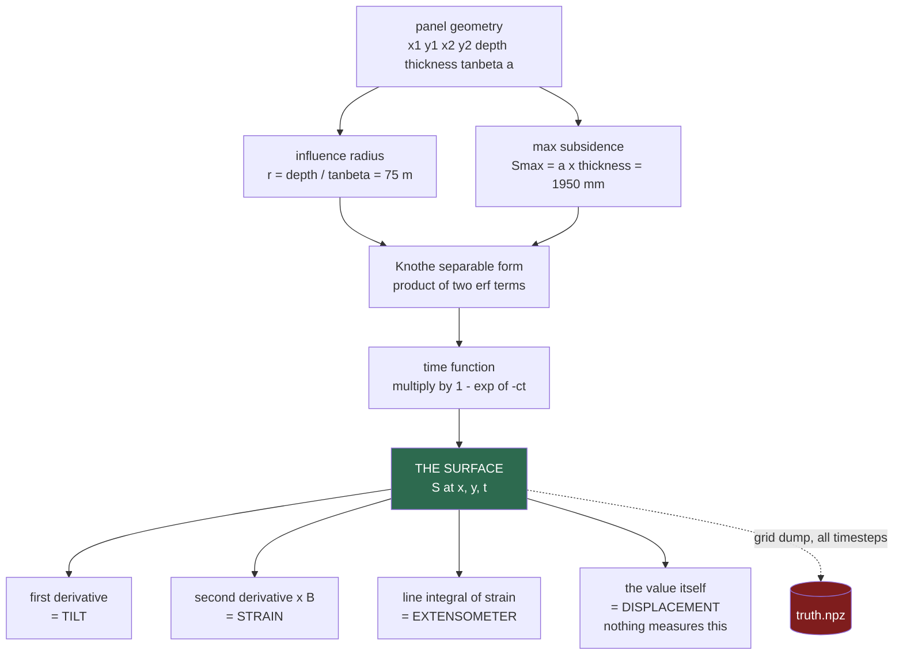

**The one thing that can kill you here:** writing a second generator. If tilt comes from `S` but strain comes from a separate formula, your detector will spend the whole demo detecting the disagreement between your own two models. It will look like it works. Test 2 in your spec — analytic derivative vs central difference, error under 0.1% — is the only thing standing between you and that.

---

## C2 — The sensor sampler: making the reading lie

**Job:** take four perfect numbers and ruin them exactly the way a real chip would.

**Analogy (ELI5).** Imagine a ruler made of soft rubber. When the sun heats it, the rubber stretches, so everything you measure with it comes out wrong — even though the thing you are measuring never moved. That is thermal drift. The chip is the rubber ruler.

The order of damage is not decorative. It mirrors the order things physically happen inside the chip. Change the order and you get a different answer.

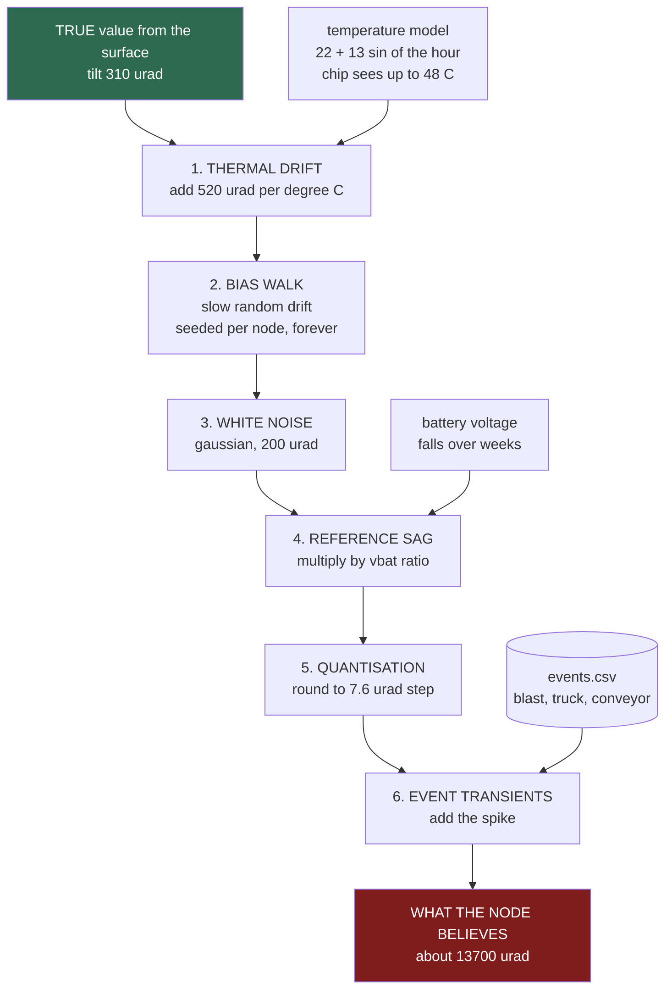

**Read the two ends of that diagram.** True signal 310 µrad. What the node believes: ~13,700 µrad. The lie is **forty times bigger than the truth**. That single fact is the numerical justification for demoting tilt, and it is measured from your own model rather than asserted.

**Per-node seeds.** Node 17 must produce the identical bias walk on every single run. Without this the demo behaves differently at each rehearsal and no bug is ever reproducible. The seed lives in `nodes.json` and is never regenerated.

---

## C3 — The node firmware: from 10 readings to 21 bytes

This is the component people get wrong, so it gets the most space.

**A node does not write a file.** It is a microcontroller with a couple hundred kilobytes of RAM and no filesystem worth the name. It holds exactly one reading at a time and a small running summary. It never keeps history.

**Analogy (ELI5).** A person standing in a field with a stopwatch, counting cars. Every minute they glance at the road. They do not write down every minute. They keep three numbers in their head — the average, the biggest one they saw, and whether anything alarming happened. Every ten minutes they shout those three numbers across the field and reset.

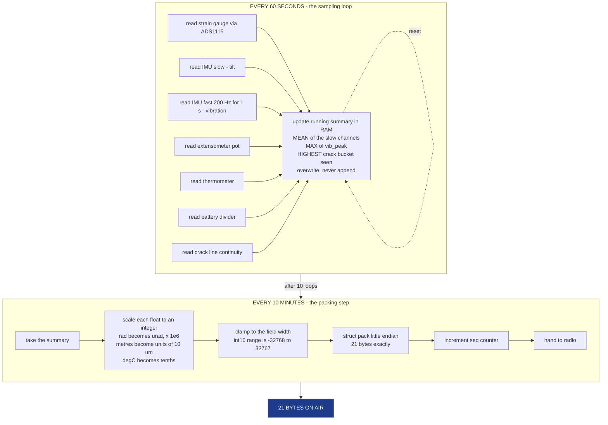

### The 21 bytes, laid out

```
byte  0        1  2        3  4        5  6        7  8
    ┌────────┬────────────┬────────────┬────────────┬────────────┐
    │node_id │    seq     │   tilt_x   │   tilt_y   │   strain   │
    │ uint8  │   uint16   │ int16 urad │ int16 urad │  int16 ue  │
    └────────┴────────────┴────────────┴────────────┴────────────┘
byte  9 10      11 12       13 14       15      16 17     18 19    20
    ┌────────────┬────────────┬────────────┬──────┬────────────┬────────┬────┐
    │ ext_delta  │  vib_rms   │  vib_peak  │ fdom │    temp    │  vbat  │ c+f│
    │int16 x10um │uint16 x100 │uint16 x100 │uint8 │ int16 0.1C │uint16  │uint8│
    └────────────┴────────────┴────────────┴──────┴────────────┴────────┴────┘
```

**What is deliberately NOT in the packet, and why:**

| Absent | Why |
|---|---|
| Position | Two floats is 8 bytes — 38% of your airtime spent resending a constant. It lives in `nodes.json` at the gateway. |
| Timestamp | Reconstructed from `seq` plus arrival time. Saves 4 bytes and dodges clock sync entirely. |
| Any corrected value | A node that corrects its own data has destroyed the evidence. Correction happens in the backend where you can audit it. |
| Raw vibration waveform | 200 Hz × 1 s × 2 bytes = 400 bytes. You would need 20 packets for one second of shaking. The summary is also more noise-resistant than the raw samples, so this is the right engineering choice, not a bandwidth compromise. |

### Two field widths that were bugs and are now fixed

- `ext_delta` in units of **10 µm**, not 1 µm. At 1 µm, an int16 wraps at ±32.8 mm and real values reach 78 mm. It would have wrapped **silently** and produced nonsense at exactly the moment the ground was moving most.
- `temp` as **int16 in 0.1 °C**, not int8 in whole degrees. At 520 µrad/°C, rounding temperature to the nearest degree leaves ±260 µrad of tilt error you can never remove afterward.

Both of these are worth a slide. "We found two silent overflow bugs in our own wire format before writing a line of firmware" is a strong thing to be able to say.

---

## C4 — The mesh radio

**Job:** decide, for each packet, whether it arrives, how late, and via how many relays.

**Analogy (ELI5).** Thirty people standing in a big field, too far apart to shout all the way to the house at the edge. So each person shouts to whoever is nearest, and that person shouts it onward, until the message reaches the house. Sometimes the wind eats a shout. Sometimes two people shout at the same moment and neither is understood.

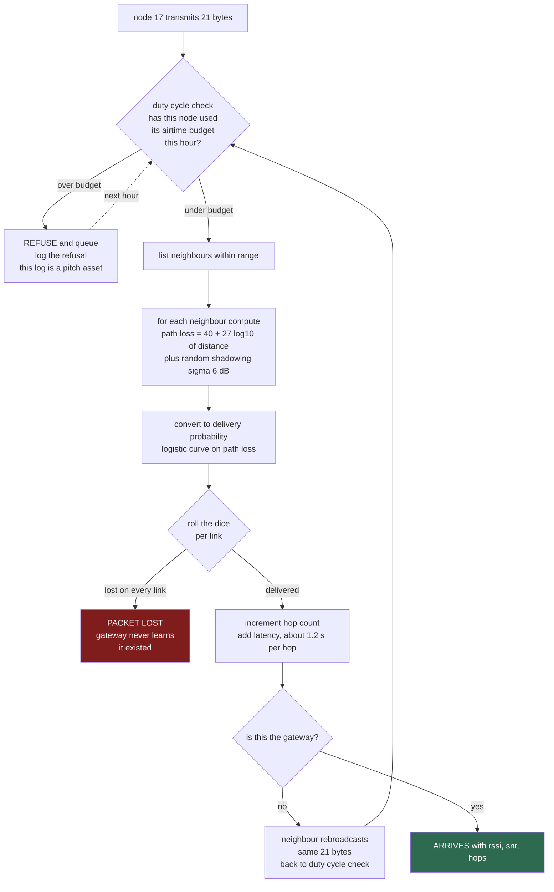

### The mesh calculation, with real numbers

This is the part you asked to see concretely. Everything below is arithmetic you can put on a slide.

**Step 1 — how long is one transmission on the air?**

LoRa airtime depends almost entirely on spreading factor. For your 21-byte payload, 125 kHz bandwidth, coding rate 4/5, 8-symbol preamble:

| Spreading factor | Time on air for 21 bytes | Range character |
|---|---|---|
| SF7 | ~56 ms | fast, short reach |
| **SF9** | **~185 ms** | your working default |
| SF12 | ~1.48 s | slow, long reach |

**Step 2 — how far can a node actually shout?**

Using your own path-loss model, `PL = 40 + 27·log₁₀(d)`:

| Distance | Path loss | Link margin at 14 dBm TX, −129 dBm RX sensitivity |
|---|---|---|
| 90 m | ~93 dB | 50 dB spare |
| 250 m | ~105 dB | 38 dB spare |
| 500 m | ~113 dB | 30 dB spare |
| 1000 m | ~121 dB | 22 dB spare |

**The honest conclusion:** at your node spacing of roughly 90 m, range is not your problem. You have 50 dB of margin, which is enormous. Your packet losses will come from **collisions and shadowing**, not from distance. Say this out loud rather than implying the mesh is heroically overcoming distance — it is not, and a radio person on the jury will know.

**Step 3 — the duty cycle arithmetic, which is where it gets interesting**

Assume a 1% airtime budget per node per hour = 36 seconds of talking per hour.

*Normal operation, 10-minute reporting:*

```
Own transmissions:     6 per hour  ×  185 ms  =  1.11 s
Network total:         30 nodes × 6  =  180 packets/hour
A hub node near the gateway relays maybe half:  90 × 185 ms  =  16.6 s
                                                        ────────────
Hub node total:                                          17.7 s
Budget used:                                             49%   ✓ fine
```

*Alarm cascade, every node drops to 1-minute reporting:*

```
Own transmissions:     60 per hour  ×  185 ms  =  11.1 s
Network total:         30 × 60  =  1800 packets/hour
Hub relays half:       900 × 185 ms  =  166.5 s
                                                        ────────────
Hub node total:                                         177.6 s
Budget used:                                            493%   ✗ ILLEGAL
```

**This is your finding, and it is a good one.** The mesh does not fail from distance. It fails from **self-inflicted congestion at exactly the moment you need it most** — every node panics simultaneously and the node nearest the gateway becomes the bottleneck.

**Your mitigation, which is worth a slide:**
1. Alarm packets get priority; routine telemetry is dropped, not queued.
2. Hub nodes shed relay duty when their own budget crosses 70%.
3. A second gateway on the opposite side halves the hub load. One extra ESP32.

*"We found the failure mode by simulating the alarm cascade, and it wasn't range — it was our own traffic. Here is the number of deferred transmissions and here is how we fixed it."*

### ⚠ A regulatory claim you need to soften

Your docs state the 1% duty cycle as an **IN865 legal requirement**. Be careful here. Some deployment guides do describe India's IN865 band as carrying a 1% airtime limit alongside a 30 dBm ERP ceiling. But the LoRaWAN IN865 region files themselves permit up to 100% duty cycle in principle, and duty-cycle limits are set by national regulators rather than by the LoRaWAN specification. The sources genuinely disagree.

Two extra problems:
- You are planning to use **Meshtastic**, which is LoRa point-to-point, not LoRaWAN. LoRaWAN regional parameters do not govern it at all.
- The binding document is the Indian WPC delicensing notification for 865–867 MHz, not the LoRa Alliance.

**Safe phrasing:** *"We enforce a 1% airtime budget per node as a self-imposed design constraint, consistent with common practice in the 865 MHz band. It is conservative, and it is what surfaces the alarm-cascade congestion problem."*

That is unfalsifiable and still gets you the whole point. Verify against the WPC notification before you claim a legal mandate.

---

## C5 — The gateway

**Job:** be the first place in the entire system where all thirty nodes exist at once.

**Analogy (ELI5).** The house at the edge of the field. It hears every shout, ignores the ones it already heard, looks up who each voice belongs to on a list pinned to the wall, and writes the message into a notebook.

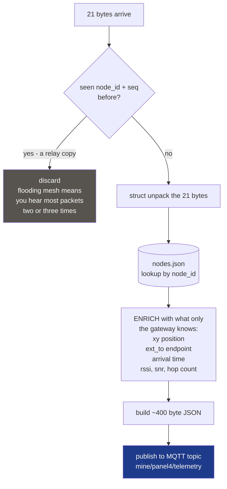

The gateway adds three categories of information the node could not possibly have supplied:
- **Identity in space** — where node 17 physically is. From the registry, not the radio.
- **Time** — the node has no clock worth trusting. Arrival time at the gateway is the authoritative timestamp.
- **Link quality** — rssi, snr and hops describe the *journey*, and only the receiver can measure a journey.

---

## THE SEAM

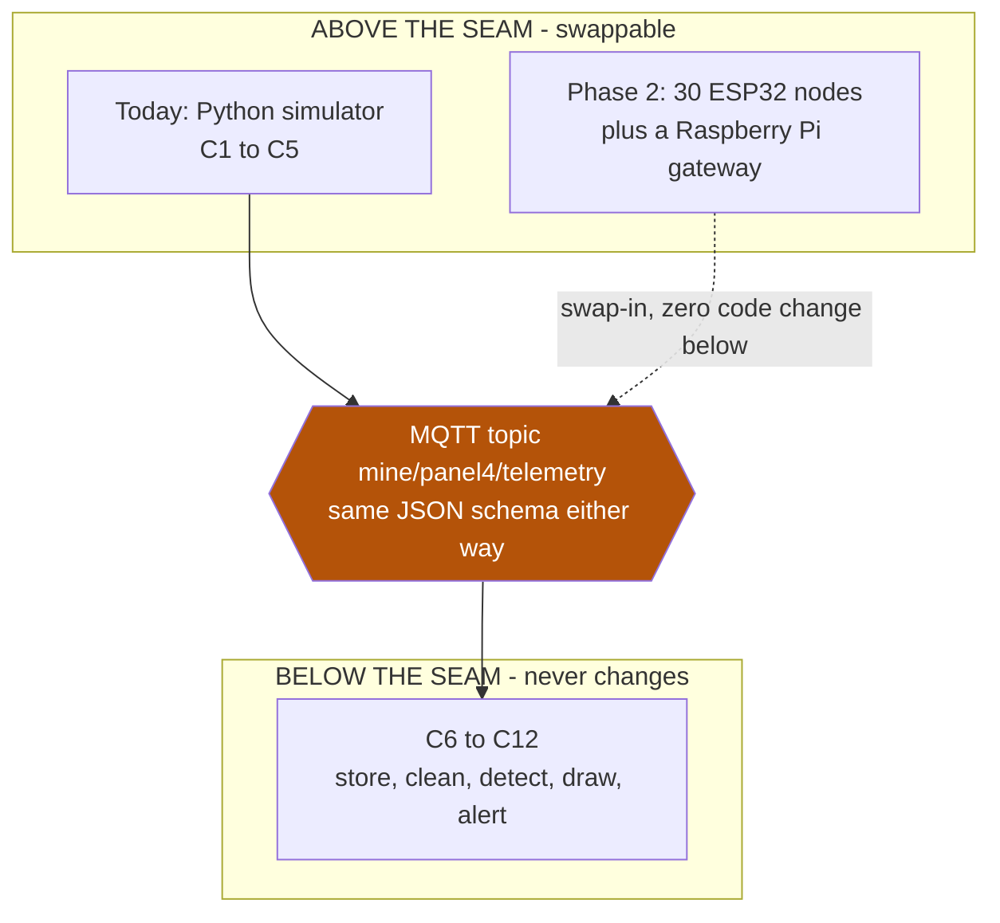

> **The rule:** nothing below the seam may know whether the data came from a simulator or from hardware.

This is what turns *"we made a simulation"* into *"we made a system and tested it with a simulation."* Those sound similar and score completely differently.

---

## C6 — The store

**Job:** persist everything, and be the thing that survives a power cut.

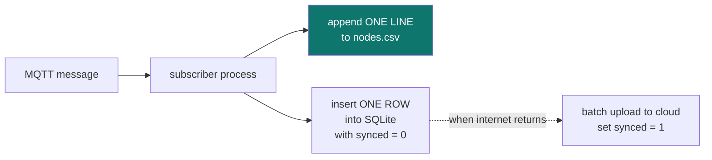

**There is one `nodes.csv` for the whole network, not one per node.** The `node_id` column is what separates them. This mirrors reality exactly — the gateway is the first place where all nodes coexist, so it is the first place a file can exist.

**A dead node is a present, blank row — never an omitted row:**

```csv
t_iso,node_id,x_m,y_m,tilt_x_urad,...,alive
2026-03-14T14:30:00Z,17,400.0,180.0,11842,...,1
2026-03-14T14:30:00Z,22,,,,,,,,,,,,,,,,0
```

Downstream code must be able to tell *"node 22 exists and is silent"* apart from *"node 22 was never installed."* Omitting the row destroys that distinction and the PINN will silently treat a dead zone as unmonitored territory.

**The `synced` flag is your offline-capability answer** (PS bullet 23). It is currently one word in your plan. Make it real — see §9 Q6.

---

## C7 — The epoch assembler

**Job:** turn a pile of rows arriving at random times into one clean photograph of the whole field at one moment.

**Analogy (ELI5).** Thirty children are supposed to send you a postcard every Tuesday. Some arrive Tuesday. Some arrive Thursday. Some send two. Some send none. Every fortnight you lay out all the postcards on a table and say "this is what everyone was thinking that Tuesday" — and you leave a blank space where a child sent nothing, so you remember they exist.

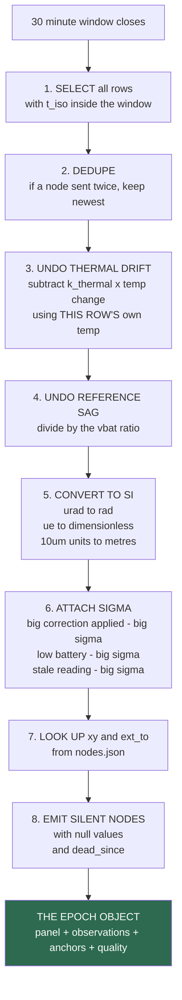

**Steps 3 and 4 are the entire reason `temp` and `vbat` ride on the packet.** They cost you 4 of your 21 bytes and they earn it back many times over.

**Step 6 is the one every team forgets**, and it is what stops one drifting sensor from bending the whole reconstructed map. Sigma is not decoration — it is the weight in the PINN's loss function. A node whose temperature correction was large gets a large sigma, which means the network is allowed to disagree with it.

### The anchors — the block that makes the numbers real

Look carefully at what your sensors measure. Tilt is slope. Strain is curvature. Extensometer is stretch. **Not one of them measures depth.**

Without anchors you can produce a perfectly-shaped bowl floating at an arbitrary height. The maths cannot tell you whether the trough centre is 5 mm down or 5 metres down.

Two anchor nodes outside the angle of draw assert `S = 0` at a known place. That is what converts relative shape into absolute millimetres. It is one sentence in your docs and it is doing enormous work — give it a slide.

### What is deliberately absent from the epoch object

Vibration, crack, temperature and battery do **not** go to the PINN.

| Channel | Why it is withheld |
|---|---|
| Vibration | A transient. Does not constrain a slow-moving surface. |
| Crack | Derived from strain. Feeding it in would double-count the same evidence. |
| Temperature | Already consumed during correction in step 3. |
| Battery | Already consumed in step 4. |

All four go to the classical detector instead, where they belong.

---

## C8 — The classical detector — this owns the alarm

**Job:** decide. Every ten minutes. Explainably.

**Analogy.** You cannot tell a rainstorm from a leaky pipe by looking at one wet patch. But if the wet patches across the whole floor form a circle with the middle deepest, you know it came from above.

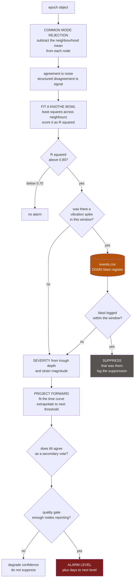

**The blast cross-check is your strongest differentiator** and it costs you almost nothing to implement — it is reading a file. Every Indian coal mine is already legally required to keep blast records. Nobody in this space is using them as a detection input, and false-alarm fatigue is the documented number-one reason these systems get switched off in the field.

**Keep the integrity of it:** Layer 3 *writes* `events.csv`, and C8 *reads* it as a genuinely separate file. Not a shared object in memory. A real mine hands you a file, so your simulation must too.

---

## C9 — The PINN — this draws and never decides

**Job:** turn 30 dots into a continuous surface, including where nodes have died.

**Analogy.** Thirty people scattered around a dark field, each shouting a rough guess of how deep the ground is beneath them. Some are lying because they are cold. Some have gone silent. Your job is to draw the shape of the whole field.

A plain neural network would draw *any* surface passing through the shouts, including impossible ones with spikes and cliffs. The PINN is given one extra rule — **whatever you draw must be a shape the ground could actually make.** That rule throws out almost every wrong answer, which is why 30 dots is enough.

**The second analogy, for the fusion part.** Three witnesses describe a robber. One saw the height, one saw the jacket, one saw the walk. None saw the whole person. The network's job is to construct the **one person** consistent with all three, not to pick the most reliable witness. Tilt, strain and extensometer are the witnesses. The surface is the person.

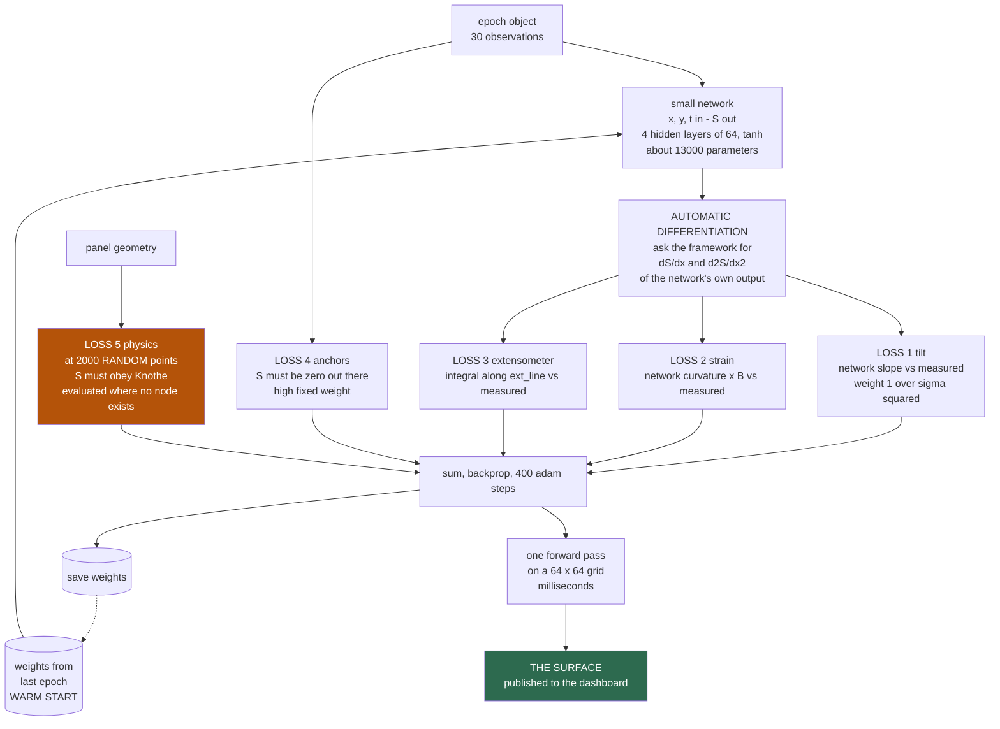

### Why it fills the hole where six nodes died

In a region where nodes are dead, losses 1, 2 and 3 contribute **nothing** — there is no data there. The anchor loss is far away. But **loss 5 is still there**, because it samples random points regardless of where sensors are.

So over the dead zone, physics alone decides, and physics says: *whatever is here must be a smooth Knothe bowl consistent with the edges around it.*

That is a defensible reconstruction, not a guess. It is also your answer when a judge asks how you know what happened where the sensors died — which they will, because you are going to press the kill-cluster button in front of them.

### The rule that keeps this safe

> **The PINN never raises an alarm.** It draws. C8 owns every alarm decision.

A safety system whose decisions cannot be explained to a mine safety officer will not be trusted, and an untrusted safety system gets switched off. This separation is the strongest single thing in your architecture — make sure it is on a slide in those words.

### Why 30 nodes is enough — the honest version

If you were doing free-form interpolation, 30 nodes over a 750 × 350 m area is nowhere near enough. The bowl's feature scale is the influence radius, 75 m. Standard sampling logic says you would need spacing under ~37 m, which is over 200 nodes.

**You are not doing free-form interpolation.** You are estimating roughly six numbers — panel extent, depth, tan β, subsidence factor, time constant, and the current phase of development. Thirty noisy observations to constrain six parameters is comfortable, not marginal.

Say it that way. *"We are not reconstructing 200 independent heights. We are fitting six physical parameters, and 30 sensors over-determines that by a factor of five."* It converts an apparent weakness into a design argument.

---

## C10 to C12 — Explain, show, alert

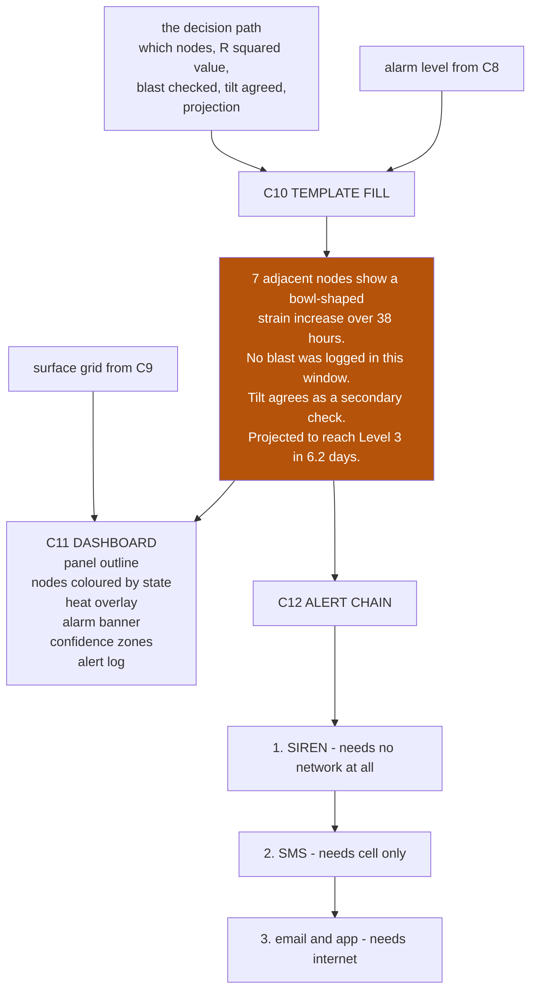

**The alert chain is ordered by how little it needs.** Siren works when everything else is dead. SMS works when the internet is down. Email works when everything is fine. Each layer requires less than the one before it. That ordering is a deliberate design decision and worth one sentence on stage.

**The confidence-zoning overlay** (C11) is a shaded region meaning *"in this zone the rock is brittle and can fail with almost no warning — we do not claim to catch that."* Admitting on screen, unprompted, where your system fails is the single most trust-building thing a safety product can do. It reads as maturity.

---

# 4. Where the "this data is artificial" tag lives

You asked for this explicitly, and there is a tension to resolve first.

**The tension:** you want the judge to see clearly that the data is simulated. But your Rule 2 says nothing below the seam may know the simulator exists. If you put `"source": "sim"` inside the telemetry message, some future teammate will write `if source == "sim"` somewhere in the detector and the seam is broken forever.

**The resolution: put the tag on a separate channel that the detection code cannot see.**

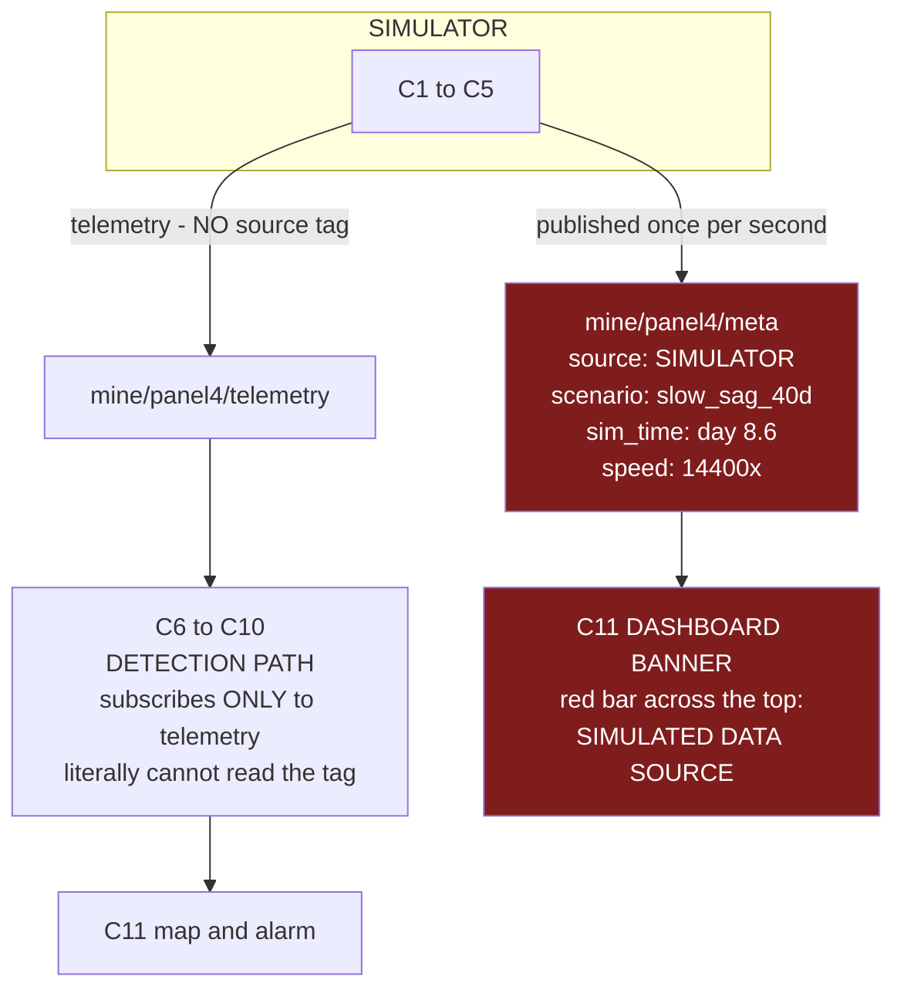

**Three places the tag should appear, all of them outside the detection path:**

1. **A red banner across the top of the Operator Dashboard** — `DATA SOURCE: SIMULATOR · slow_sag_40d · sim day 8.6 · 14 400×`. Never removable. Driven by the `meta` topic.
2. **A watermark in every exported chart and CSV** — a `# GENERATED BY SIMULATOR v1.0, scenario=..., seed=...` header line.
3. **Website 1 exists at all.** Putting the simulator on its own screen with its own URL is the loudest possible version of this tag. A team that hides its simulator inside the product looks like it is faking. A team that gives the simulator its own screen looks like it is testing.

**And the line to say when you press the first button:**

> *"Everything on the left screen is standing in for physical reality. Everything on the right screen is the product. The right screen has no way of knowing the left screen exists — it subscribes to a message topic, and today the simulator is filling it. In Phase 2 a Raspberry Pi fills the same topic and not one line of code below changes."*

That sentence, delivered before the demo starts, converts your biggest apparent weakness into your clearest architectural strength.

---

# 5. The clock — every cadence on one page

## 5.1 Real-world cadences

| Stage | Interval | Why this number |
|---|---|---|
| Node samples all sensors | 60 s | Cheap. No radio involved. Keeps a running summary. |
| Node transmits | 10 min | Airtime budget, shared across the mesh |
| Row appended to store | on arrival | one line per node per transmission |
| **Epoch assembled** | **30 min** | long enough for late and multi-hop packets to land |
| Classical detector runs | 10 min | cheap, and it owns the alarm |
| **PINN retrains** | **30 min** | warm-started, a few hundred steps, seconds on CPU |
| Dashboard redraw | on push | 48 surfaces per day, never stale |

```mermaid
gantt
    title One hour of real operation
    dateFormat  HH:mm
    axisFormat  %H:%M

    section Node 17
    sample and summarise   :a1, 00:00, 60m
    transmit               :milestone, 00:00, 0m
    transmit               :milestone, 00:10, 0m
    transmit               :milestone, 00:20, 0m
    transmit               :milestone, 00:30, 0m
    transmit               :milestone, 00:40, 0m
    transmit               :milestone, 00:50, 0m

    section Detector
    run 1                  :d1, 00:00, 10m
    run 2                  :d2, 00:10, 10m
    run 3                  :d3, 00:20, 10m
    run 4                  :d4, 00:30, 10m
    run 5                  :d5, 00:40, 10m
    run 6                  :d6, 00:50, 10m

    section PINN
    epoch A and retrain    :p1, 00:00, 30m
    epoch B and retrain    :p2, 00:30, 30m
```

## 5.2 ⚠ The demo clock problem — this needs your decision

Here is arithmetic nobody has done yet, and it breaks the current plan.

```
Scenario length                    40 days
Epochs at 30 min each              1 920 epochs
Node transmissions total           30 nodes × 6/hr × 960 hr  =  172 800 packets
Rows in nodes.csv                  172 800  (~25 MB)

You need 40 days to pass in about 4 minutes of stage time.
Required speedup                   14 400 ×
One 30-min epoch                   =  0.125 s of wall clock
One 10-min transmit tick           =  42 ms of wall clock
MQTT throughput needed             ~720 messages per second   ← Mosquitto is fine with this
PINN retrains needed               1 920 retrains in 240 s
Time available per retrain         0.125 s                     ← NOT POSSIBLE
```

The data path scales fine. **The PINN does not.** 400 Adam steps plus epoch assembly is one to three seconds, not 0.125 s. At 60× speedup as written in your spec, the 40-day scenario takes 16 hours to play.

Four ways out — I need you to pick one (§9 Q1):

| Option | How it works | Cost | Honesty |
|---|---|---|---|
| **A. Pre-render everything** | Compute all 1 920 surfaces offline on Day 4. Demo replays frames. | Zero risk, but the kill-cluster button cannot change the surface | Weakest — "live" becomes a video |
| **B. Decimate the PINN** | Data replays at 14 400×, but the PINN only retrains on 1 epoch in every 12 (every 6 sim-hours). 160 retrains in 4 min = 1.5 s each. | Feasible. Surface updates 4× per sim-day instead of 48× | Good, and easy to justify |
| **C. Short window** | Demo a 3-day window, not 40 days. 144 epochs, 1 200× speedup, 2 s per retrain. | Loses the long-arc story | Fully live |
| **D. Hybrid — my recommendation** | Pre-render the 40-day arc for the timeline scrubber. Then when the judge presses *Kill Cluster*, run **one genuinely live retrain** on stage and show the hole fill in real time, with a spinner. | Two code paths | Strongest — the one moment that matters is genuinely live, and you say so |

Option D gives you the sentence: *"The timeline you're scrubbing was computed ahead of time — 1 920 reconstructions would take four hours. This one, right now, is running live on this laptop. Watch the dead zone fill."*

---

# 6. The combined flow

Everything above, joined.

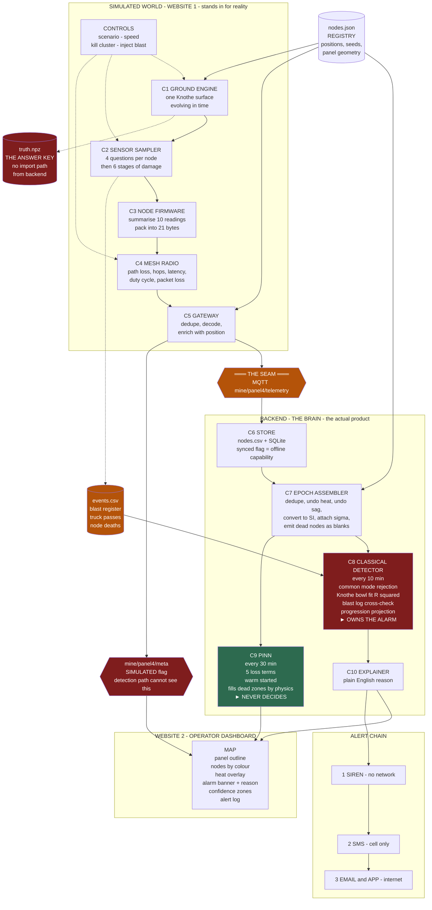

## The three rules this diagram encodes

**Rule 1 — One surface, four questions.** Never build separate models for tilt, strain and displacement. One surface, and everything else is a derivative of it. Breaking this causes silent, undetectable bugs.

**Rule 2 — The seam is sacred.** Nothing below it knows whether data came from a simulator or from hardware.

**Rule 3 — The AI draws; the physics decides.** The PINN never raises an alarm.

---

# 7. Worked example: one packet, end to end

Follow a single reading from the ground to the siren.

**Setting.** Scenario `slow_sag_40d`. Day 8.604. Node 17 sits at (400, 180), directly over the panel. It is 14:30 on an Indian March afternoon and the node's enclosure is baking.

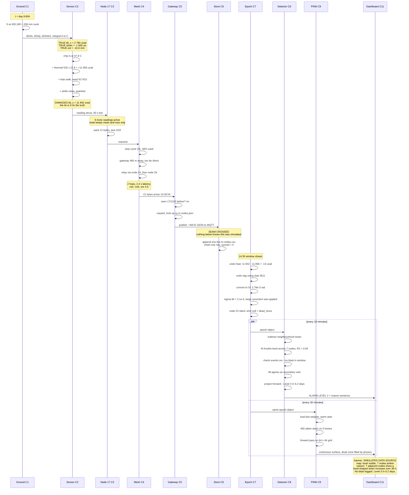

## The single most important line in that trace

```
DAMAGED tilt reading                        11 842 µrad
minus the thermal correction                11 856 µrad
                                            ───────────
what survives                                  −14 µrad
```

The true tilt at day 8 is 2 780 µrad. Your correction left −14 µrad. **The correction removed more than the entire real signal.**

That is not a bug — it is the whole argument. Temperature correction alone is not enough for tilt, because you are subtracting two large numbers to get a small one, and the error in the subtraction is comparable to the answer. This is exactly why:

1. Tilt is a **secondary vote**, never a trigger.
2. You need **neighbourhood common-mode rejection** on top of temperature correction, because the residual error is shared across nearby nodes and cancels when you compare them.
3. **Strain is primary** — at day 8 it sits at 1 660 µε against roughly 20 µε of corrected noise. An 80:1 margin, against tilt's roughly 1:1.

If a judge asks you one hard technical question, it will be about this. Have this arithmetic on a slide.

---

# 8. Node layout, concretely

Because "30 nodes over a panel" is vague, here is a layout that satisfies the geometry.

```
Panel:  x = 100 to 700,  y = 100 to 300     (600 m x 200 m)
Influence radius r = 75 m  →  the trough spreads 75 m past every edge
Monitored area:  x = 25 to 775,  y = 25 to 375   (750 m x 350 m)

    y=375  ·  ·  ·  ·  ·  ·  ·                    A = anchor
                                                  · = field node
    y=300  ┌───────────────────┐                  ┌┐ = panel edge
           │ ·  ·  ·  ·  ·  ·  │
    y=225  │ ·  ·  ·  ·  ·  ·  │                       A
           │                   │                     (860, 340)
    y=175  │ ·  ·  ·  ·  ·  ·  │
           │                   │
    y=100  └───────────────────┘                       A
                                                     (860, 60)
    y=25   ·  ·  ·  ·  ·  ·  ·

          x=100              x=700              x=860
```

| | Count | Placement | Purpose |
|---|---|---|---|
| Field nodes | 28 | 7 × 4 grid, ~100 m × 80 m spacing | measure the trough |
| Anchors | 2 | x = 860, well outside the draw angle | assert S = 0, give absolute depth |
| Gateway | 1 | (860, 200), beside the anchors | collect everything |
| **Total** | **31 radios** | | |

**Why the extra ring outside the panel matters.** The maximum tilt and maximum tensile strain both occur *at and just outside the panel edge*, not at the centre. If all your nodes sit over the panel, you miss the strongest signal in the whole field. Your own validation Test 4 asserts exactly this — assert the positions, not just the magnitudes.

---

# 9. Decisions I need from you

I have tried not to guess on these. Each one changes what gets built.

| # | Question | Why it matters |
|---|---|---|
| **Q1** | **Demo clock** — which of the four options in §5.2? | Decides whether the PINN is live, decimated, or pre-rendered. Affects Part 2 and Part 3 both. |
| **Q2** | **Live generation or replay?** Your spec says both — "pre-render six scenarios" *and* "live MQTT generation". Which is the demo path? If judges press *Kill Cluster* mid-run, a pre-rendered CSV cannot respond. My read: pre-render the baseline, apply kill and blast as **live overlays at the radio layer**, which works on replay too. Confirm? | Decides the architecture of Website 1 |
| **Q3** | **Detector cadence.** Docs say detector runs every 10 min but epochs assemble every 30 min. Does the detector get its own 10-minute assembler, or does it reuse the 30-minute epoch and therefore actually run every 30 min? | Ambiguity between the two spec docs |
| **Q4** | **Energy budget.** PS bullet: "low power". You model battery *sag* but have no mAh/day figure or solar sizing. Do you want a one-page power budget? ~2 hours, closes a PS bullet. | PS requirement 9 |
| **Q5** | **Historical data.** PS bullet 18 says "live **and historical** data". You have no historical archive. Cheapest fix: keep the first 20 days of a scenario as "historical", start the demo at day 20, show the detector using both. Worth it? | PS requirement 18 |
| **Q6** | **Offline sync.** Currently one word. Do you want the demo moment — cut the network on stage for 60 s, queue fills, network returns, queue drains? ~3 hours. | PS requirement 23 |
| **Q7** | **`nodes.csv` row rate.** Spec §3.1 says "one line per node per epoch" but §4.1 says rows are appended on arrival, i.e. every 10 min. Which? At 40 days this is 172 800 rows vs 57 600. | Affects file size and the assembler |
| **Q8** | **Second gateway.** Open item #7. Decided or still open? Removes the single point of failure that your own mesh demo exposes. | Affects the layout and the pitch |

---

## The ninety seconds this whole document exists to make true

A judge sits down. You press *Slow Sag* on Website 1. Website 2 shows nodes gradually turning amber and a bowl forming in the heat overlay. You press *Inject Blast* — a spike appears in the raw data stream, the dashboard **does not** alarm, and the explanation panel says why. You press *Kill Cluster* — six nodes grey out, the reconstruction fills the hole, and the alarm still fires with a projection of days remaining.

Everything above exists so that those ninety seconds are true.
