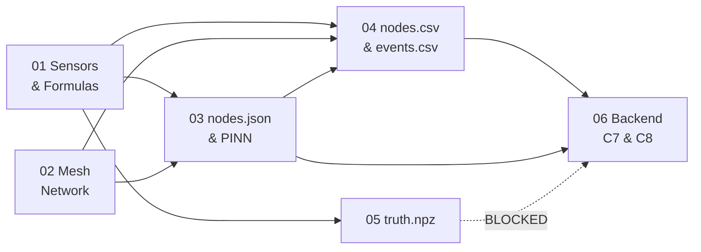

# 00 — Index, Glossary, Frozen Constants, and the Test Register

**Schema version 2.0.0. Read this first. It is three pages and it removes 90% of the "where does this live?" questions.**

> **What changed from v1.4 → v2.0.** The stress test that used to live in a separate file `02b` has been **folded into file 02 and retired**. Every fix it identified is now applied everywhere, not just described in one place. Three new faults were found while merging and are also fixed: the packet could not carry `epoch` (so store-and-forward was broken), the PINN could not learn `ĉ` (single time slice), and `nodes.csv` grew without bound. §7 lists every change with its reason.

---

## 1. The seven files and what each one owns

| File | Owns | Does NOT own |
|---|---|---|
| **00** (this) | glossary, frozen constants, build order, boundary rules, **the single global test register** | any design detail |
| **01 — Sensors & Formulas** | the 7 sensors, the one master formula, every derivation, the corruption chain, why the data is trustworthy at scale | radio, files, PINN |
| **02 — Mesh Network** | node count derivation, sizing engine, topology, relays, slots, airtime, **all ten failure classes**, the `mesh` block | ground physics, PINN, other schemas |
| **03 — nodes.json & the PINN** | the complete `nodes.json` schema; exactly what the PINN receives, never receives, and produces | radio behaviour, the alarm |
| **04 — nodes.csv & events.csv** | the 23-byte wire format, CSV columns, **the retention model**, how events are authored | why the numbers have those values |
| **05 — truth.npz** | ground-truth storage, quarantine, the simulation↔reality map | anything the backend can see |
| **06 — Backend C7 & C8** | correction, σ, the validity mask, the classical alarm | the PINN, the simulator |



---

## 2. Glossary — every term, in plain words

| Term | Plain meaning |
|---|---|
| **Subsidence** | The ground sinking because coal was removed from underneath it. |
| **Panel** | The rectangle of coal that was dug out. Ours is 600 m × 200 m, 150 m down. |
| **Trough / bowl** | The dish-shaped dent that appears on the surface above a mined panel. |
| **Knothe model** | A century-old formula that predicts the shape of that dish. We use it as ground truth. |
| **`r` — radius of influence** | How far sideways the dent spreads past the panel edge. Ours is 75 m. |
| **Tilt** | How much a spot on the ground is sloping. First derivative of the dish. |
| **Strain** | How much the ground is stretched or squashed. Second derivative. **This is the channel that detects things.** |
| **Extensometer** | A wire between two pegs. If the ground moves, the wire length changes. |
| **Node** | One box in the field: ESP32 + LoRa radio + 7 sensors + solar panel. |
| **Leaf** | A node that talks only to its relay and sleeps the rest of the time. |
| **Relay** | The same box, one config flag flipped, collecting 4–5 leaves and forwarding them. |
| **Anchor** | A node placed outside the influence zone, so it must read zero forever. Our reference point. |
| **Gateway** | The one box at the surface hut with mains power, a 10 m mast, and internet. |
| **LoRa** | A long-range, very slow radio. Good for kilometres, bad for megabytes. |
| **SF — spreading factor** | How slowly the radio speaks. SF7 = fast, shorter range. SF12 = very slow, very long range. |
| **BW — bandwidth** | How wide a slice of spectrum the signal occupies. **Indian law caps this at 200 kHz, so we use 125 kHz.** |
| **Airtime** | How many seconds a message occupies the shared channel. Our only real currency. |
| **Duty cycle** | The fraction of each hour one transmitter may speak. We design to **1%** — see §3.4, it is a convention, not Indian law. |
| **TDMA** | Everyone gets a timetable slot. Nobody speaks out of turn, so nobody collides. |
| **Flooding** | Every node repeats every message it hears. Self-healing, but costs N² transmissions. |
| **Epoch** | The 60-second sample number since the scenario started. The network's clock and **the identity key.** |
| **Superframe** | One 60 s cycle of the timetable: beacon, cluster blocks, relay slots, backups, quiet. |
| **Bitmap ACK** | One packet acknowledging many senders at once, by setting one bit each. Replaces N separate ACKs. |
| **PDR** | Packet Delivery Ratio — the chance a message actually arrives. |
| **PINN** | Physics-Informed Neural Network. A small net that **draws** the surface, constrained to shapes Knothe permits. It never alarms. |
| **LOO residual** | Hide one node, guess what it should have read, compare. An accuracy score that needs no answer key. |
| **LEC / `d_committed`** | Largest Empty Circle. Its diameter is the biggest feature the network could miss entirely. Ours is 358 m and we publish it. |
| **DGMS** | Directorate General of Mines Safety. Circular 7/1997 makes blast records legally mandatory at every Indian coal mine. |
| **C7 / C8 / C9** | Backend stages: C7 corrects, C8 alarms, C9 draws. |
| **Hot window** | The rolling slice of recent telemetry the backend works on. Sets `nodes.csv` size. |

---

## 3. The frozen constants

One Python module, `sim/constants.py`. **Simulator and backend import the same module.** If they ever hold different values, losses silently fail to converge and it looks like a training bug for a full day.

### 3.1 Ground

| Symbol | Value | Units | Used by |
|---|---|---|---|
| `H` | 150.0 | m | surface, PINN (fixed) |
| `TAN_BETA` | 2.0 | — | surface, PINN (fixed) |
| `R_INFL` | 75.0 | m | `H / TAN_BETA` |
| `M_SEAM` | 3.0 | m | surface, PINN (fixed) |
| `A_SUBS` | 0.65 | — | **surface ONLY** — the PINN must learn this |
| `S_MAX` | 1.95 | m | `A_SUBS × M_SEAM` |
| `C_KNOTHE` | 0.01414 | /day | **surface ONLY** — the PINN must learn this |
| `B_HORIZ` | 24.0 | m | `0.32 × R_INFL` — surface AND PINN (fixed, must match exactly) |
| `PANEL` | (100, 100, 700, 300) | m | x1, y1, x2, y2 |
| `GRID` | x 25→775, y 25→375, 64×64 | m | **output grid only.** Anchors and the gateway sit outside it — see V4 |

### 3.2 Noise and corruption

| Channel | `k_T` | `σ_b` | `σ_w` | `LSB` |
|---|---|---|---|---|
| tilt_x, tilt_y | 250 µrad/°C | 3 µrad | 8 µrad | **2 µrad** |
| strain | 5 µε/°C | 0.5 µε | 1.2 µε | 1 µε |
| ext | 12 µm/°C | 5 µm | 15 µm | 10 µm |
| temp | — | — | 0.05 °C | 0.1 °C |
| vbat | — | — | 5 mV | 1 mV |

`T_REF = 25.0 °C` · `TAU_OU = 21600 s` · `V_NOM = 3.70 V`

### 3.3 Events

| Constant | Value |
|---|---|
| `PPV_K`, `PPV_EXP` | 1140, −1.6 |
| `Q_EQ_TRUCK` | 0.14 kg |
| `CONV_A0`, `CONV_D0` | 0.8 mm/s, 120 m |
| `THETA_C` | 1500 µε ±10% per node |
| f_dom bands | blast 40–80 · truck 8–20 · conveyor 50±0.5 · microseismic 100–250 Hz |

### 3.4 Radio — **rewritten in v2.0, this is the block that changed most**

| Constant | Value | Note |
|---|---|---|
| Band | IN865, 865–867 MHz | GSR 564(E), 30 July 2008 |
| **Carrier bandwidth** | **125 kHz** | **law caps at 200 kHz. BW250 in v1.4 was illegal.** |
| TX conducted / ERP | 30 dBm (1 W) / design at 30 dBm ERP | law permits 36 dBm (4 W) ERP as headroom |
| Duty-cycle limit | **1%, self-imposed** | **The Indian notification specifies power and bandwidth but NOT duty cycle.** 1% is the ETSI/LoRaWAN convention. Say so on stage — §3.4.1 |
| Leaf / ACK / beacon / event / delta preset | **SF7 / BW125** | |
| Relay trunk preset | **SF8 / BW125** | one step slower, because losing one aggregate loses 6 nodes |
| Application packet | **23 bytes** | was 21; +2 for `epoch_lo`. **Zero airtime cost — verified** |
| Superframe | 60 s | |
| Leaf slot / cluster block | 250 ms / 1.9 s | 6 slots + 150 ms ACK + 250 ms retry sub-slot |
| Relay slot | 600 ms | |
| Backup slot | 150 ms × 16 | |
| Hop limit | 3 | 2 nominal, 3 in failover |

**Airtime, computed from the Semtech formula, not asserted:**

| Frame | App bytes | On-air PL | Preset | Airtime |
|---|---|---|---|---|
| Beacon | 13 | 29 B | SF7/125 | **75.0 ms** |
| Cluster ACK bitmap | 4 | 20 B | SF7/125 | **64.8 ms** |
| Event alert | 8 | 24 B | SF7/125 | **69.9 ms** |
| Leaf telemetry | 23 | 39 B | SF7/125 | **90.4 ms** |
| Escalation delta (3 nodes) | 24 | 40 B | SF7/125 | **90.4 ms** |
| Relay aggregate, 5 members | 115 | 131 B | SF8/125 | **406.0 ms** |
| Relay aggregate, 6 members | 138 | 154 B | SF8/125 | **457.2 ms** |

> **The free upgrade.** 21 B → 23 B leaves the leaf frame at **90.4 ms**, byte-identical in airtime, because the extra two bytes do not cross a LoRa symbol boundary. Two bytes bought store-and-forward correctness for nothing.

#### 3.4.1 How to say the duty-cycle thing on stage

Do **not** say "it's the law." Say:

> "The Indian delicensing notification specifies power and bandwidth but not duty cycle. We designed to the ETSI/LoRaWAN 1% convention anyway, because we share the band with UHF RFID and because self-imposed duty limits are what make a mesh scale. We treat it as a binding design constraint even though it isn't a binding legal one."

That answer survives a judge who has actually read GSR 564(E). The original claim does not.

### 3.5 Measured budget — the numbers to quote

| Metric | Value | Limit |
|---|---|---|
| Channel utilisation | **7.74%** | 18% (ALOHA collapse) |
| Worst-node duty (C4 relay) | **0.87%** | 1.00% |
| Gateway duty | **0.125%** | 1.00% |
| Leaf duty | **0.15%** | 1.00% |
| Escalating cluster (routine → 120 s) | **0.79%** | 1.00% |
| Alarm latency | **< 1.4 s** | — |
| `d_committed` (published blind spot) | **358 m** | — |

### 3.6 Derived peak magnitudes — sanity anchors

**Corrected in v2.0.** The v1.4 strain and extensometer figures were low by 1.5×. Recomputed from the closed form on a 4001² grid:

| Channel | Fully settled (t→∞) | **At day 40** (`g = 0.432`) | Wire capacity | Margin |
|---|---|---|---|---|
| Subsidence `S` | 1.95 m | 0.842 m | not on wire | — |
| Tilt | 25 978 µrad (1.49°) | 11 222 µrad | ±65 534 µrad @ 2 µrad LSB | **2.52×** |
| Strain | **12 649 µε** (was 8 300 ❌) | 5 464 µε | ±32 767 µε | **2.59×** |
| Ext (10 m span) | **126.5 mm** (was 83 ❌) | 54.6 mm | ±327.6 mm | **2.59×** |

**Consequence that matters:** `t_crack` at `θ_c = 1500 µε` is **8.93 days**, not 14.1. Your crack demo fires on day 9. If your generator disagrees with any cell above, the generator is wrong.

**Volume conservation checks exactly:** `∫∫S_final = 233 999 m³` against `a·m·A = 234 000 m³`, ratio 1.0000.

### 3.7 Retention — new in v2.0

| Constant | Value | Meaning |
|---|---|---|
| `retention_h` | **36** | hours held in `nodes.csv` |
| `buffer_frames` | 4320 | 72 h node ring |
| `dedup_ring_entries` | 64 | relay dedup |
| `baseline_window_h` | 24 | C8 rolling median — **this sets `retention_h`'s floor** |
| `pinn_window_h` | 24 | PINN training window |
| `pinn_window_slices` | 48 | 30-minute subsampling of that window |

```
retention_h  ≥  baseline_window_h × 1.5  =  36 h
bytes(nodes.csv)  ≈  N × (retention_h × 3600 / transmit_s) × 120 B
                  =  31 × 2160 × 120  =  8.0 MB       ← on day 3 and on day 300
```

---

## 4. The five boundaries that must never move

1. **`truth/` has no import path from `backend/`.** Enforced by test T8 in CI, not by discipline.
2. **One implementation of `S(x, y, t)`.** Every derivative comes from it. There is no second generator.
3. **One link model.** `reliable_range_*` are **outputs** of it, never independent constants.
4. **The PINN never raises an alarm.** C8 never reads C9's output.
5. **No language model anywhere in the safety loop.**

---

## 5. Build order

| Day | Build | Gate |
|---|---|---|
| 1 | `constants.py`, `nodes.json` (all 31 entries, personality frozen), `events.csv` | V1–V12, E1–E8 |
| 2 | Layers 0–2: surface, derivatives, weather, event vibration | T1–T5, T9, T10 |
| 3 | Layer 3: six-stage corruption | **T6, T7 — if these fail, stop** |
| 4 | Layer 4: mesh, TDMA, PDR, aggregation, failover | T11, T12, T16–T26 |
| 5 | `readings.parquet`, `nodes.csv` + retention, `radio_report.json`, handoff | T8, T13, T27–T31 |
| 6 | **Freeze.** Scenario tuning only | full suite green |

**Freeze means:** after day 6 the `nodes.json` schema, the 23-byte wire format, and the C7→C9 contract are immutable. Anything found later is a v2.1 note, not a code change.

---

## 6. The test register — **one global list, no collisions**

> **v1.4 had nine colliding IDs** (T18 meant three different things) **and three IDs that were never defined** (T4–T6). This table is now the only source of test numbering. No other file may invent an ID.

| Test | Owner | Asserts |
|---|---|---|
| **T1** | 01 | Volume conservation: `∫∫S_final ≈ a·m_seam·panel_area` within 1% |
| **T2** | 01 | `S_final → 0` beyond `r` outside the panel (anchors < 1 mm) |
| **T3** | 01 | Closed-form derivatives match central finite differences to < 1e-7 |
| **T4** | 01 | Peak magnitudes reproduce §3.6 to ±2% — catches a wrong `B` or `r` |
| **T5** | 01 | Separability: `S(t)/S(t′) = g(t)/g(t′)` at every grid cell |
| **T6** | 01 | The corruption chain runs in the documented order (order-hash assertion) |
| **T7** | 01 / 06 | Undoing sag then thermal with true `T_chip`, `V_bat` leaves the residual inside the white-noise band. **If red, stop** |
| **T8** | 05 | `import truth` from anywhere under `backend/` raises `ModuleNotFoundError` |
| **T9** | 05 | `truth_at(check_t[i])` reproduces `check_S[i]` to < 1e-6 for all 8 |
| **T10** | 01 | Simulated crack latch matches analytic `t_crack` (8.93 d) within one sample |
| **T11** | 02 / 04 | `relay_kill` loses **zero rows** — only delays them |
| **T12** | 02 | Measured worst-node duty cycle < 1.0% across the whole 40-day run |
| **T13** | 02 / 04 | A reboot resetting `seq` produces no upsert collision |
| **T14** | 04 | Every `nodes.csv` row's `node_id` exists in `nodes.json` |
| **T15** | 05 | Both anchors read `\|S\| < 1 mm` in truth at every check time |
| **T16** | 02 | Every `(node, parent)` hop is within the **derived** reliable range |
| **T17** | 02 | No two nodes share a `slot` or a `backup_slot` |
| **T18** | 02 | Carrier bandwidth ≤ 200 kHz on every configured preset. *Regulatory, non-negotiable* |
| **T19** | 02 | **Gateway** measured duty cycle < 1.0% — the node v1.4 never tested |
| **T20** | 02 | `largest_empty_circle × 2 ≤ d_committed`, and `d_committed` appears in the dashboard header |
| **T21** | 02 | Every `(node, parent)` **and** `(node, backup_parent)` pair has ≥ 10 dB margin at the 90th shadowing percentile |
| **T22** | 02 | `relay_kill` injection produces an **F4**, never an F3. *The false-Class-A test* |
| **T23** | 02 / 04 | `epoch` is uint32 end to end; a 100-day synthetic run produces no upsert collision |
| **T24** | 02 | Simulated 3 h beacon outage: static-slot fallback produces zero slot collisions |
| **T25** | 02 | 20 simultaneous node trips produce ≤ 3 originated alerts |
| **T26** | 02 | Measured relay RX duty ≤ 4× leaf RX duty |
| **T27** | 04 | The 23-byte pack/unpack round-trips exactly for 10 000 random values, including clipping |
| **T28** | 04 | No row exists during a `node_kill` window, and the absence is **never** zero-filled anywhere |
| **T29** | 04 | rows written + buffered + lost + dropped-on-overflow = rows produced. **Nothing vanishes** |
| **T30** | 04 | `nodes.csv` row count never exceeds `N × retention_h × 60` at any epoch |
| **T31** | 04 | A frame replayed 40 h late lands on its **original** epoch, not the current one |
| **T32** | 03 | `grep backend/C9/` finds no `site.a`, `site.c`, `S_MAX`, `C_KNOTHE`, or `truth` |
| **T33** | 03 | At day 40, `â·ĝ(t)` within 10% of truth; `â` within 15%; `ĉ` within 25% |
| **T34** | 03 | With the anchor loss disabled, `S_grid` mean offset drifts > 10 cm |
| **T35** | 03 | Switching activation to ReLU makes the strain loss constant |
| **T36** | 03 | The PINN training window spans ≥ 12 h of distinct `t` values. *Without this `ĉ` is unidentifiable* |
| **T37** | 05 | `meta.generator_sha256` matches the actual hash of the generator source |
| **T38** | 05 | The four separability preconditions are asserted at generation time |
| **T39** | 06 | Day-3 logged blast → `vetoed_by = BLAST`, no alarm |
| **T40** | 06 | Day-21 **unlogged** blast → `CLASS-A / UNLOGGED_BLAST` |
| **T41** | 06 | Day-26 `cluster_kill` → `CLASS-A` within one epoch via step 5, regardless of steps 1–4 |
| **T42** | 06 | A single Byzantine node with 20σ strain produces **no** alarm |
| **T43** | 06 | A node with `selftest_ok = 0` reporting a constant is invalid and excluded from quorum |
| **T44** | 06 | `grep -r "C9\|pinn\|S_grid" backend/C8/` returns nothing |
| **T45** | 06 | `f_gap` is capped at 10 — an outage must not make σ explode |
| **T46** | 06 | F9: backhaul dead → dashboard shows STALE and C8 emits no `QUIET` |

**Write T7, T29, T42 and T43 first.** T7 gates everything downstream. T29 turns "we think the mesh is lossless" into an arithmetic identity. T42 proves a lying node cannot trigger a siren. T43 proves a *dead* node cannot report "all clear" — and that is the failure that would actually kill someone.

---

## 7. v1.4 → v2.0 change log, with reasons

| # | Change | Reason |
|---|---|---|
| 1 | BW250 → **BW125** everywhere | GSR 564(E) caps carrier bandwidth at 200 kHz. BW250 was illegal |
| 2 | Relay trunk SF9 → **SF8**; direct leaves SF9 → **SF7** | recovers the airtime that BW125 costs |
| 3 | "1% duty cycle is Indian law" → **convention** | the notification contains no duty-cycle clause |
| 4 | `erp_dbm: 30` → `tx_conducted_dbm: 30`, `erp_limit_dbm: 36`, design at 30 | v1.4 mislabelled a conducted figure as ERP |
| 5 | Per-child ACKs → **bitmap ACKs, both directions** | gateway duty was never computed and was 1.54% — illegal |
| 6 | `reliable_range_m` deleted as a constant | it contradicted the link model by ~6×. Now derived |
| 7 | Packet 21 B → **23 B** (`epoch_lo` uint16) | **new fault.** Without it, replayed frames get the wrong sample time |
| 8 | `nodes.csv` append-only → **36 h rolling window + parquet archive** | **new fault.** File grew to 200 MB; now fixed at 8 MB |
| 9 | Hybrid 600 s cadence **deleted** | it contradicted 02's whole duty derivation. Retention solves the size problem instead |
| 10 | PINN trains on 1 epoch → **24 h window, 48 slices** | **new fault.** `ĉ` is unidentifiable from a single time slice |
| 11 | Cluster slot blocks 4–5 → **6**; backup slots 40 → **16** | re-homing needs an in-block spare; the contention window was 100% oversubscribed |
| 12 | 8 failure classes → **10** (F9 backhaul, F10 lightning) | data can die at a live gateway; lightning fakes F3 |
| 13 | F3/F4 discriminated by **backup-slot presence + precursor** | a relay battery failure fired the ground-collapse alarm |
| 14 | Escalation rate-based → **payload-based, routine drops to 120 s** | 20 s escalation was undeliverable for C1/C2 and 20 s was derived from nothing |
| 15 | `epoch` uint16 → **uint32** | wrapped at day 45.5, 5.5 days after the scenario ends |
| 16 | Peak strain 8 300 → **12 649 µε**; ext 83 → **126.5 mm** | recomputed; v1.4 was low by 1.5×, moving `t_crack` from 14.1 d to 8.93 d |
| 17 | C7 step table reordered: **sag then thermal** | the table and the paragraph below it contradicted each other |
| 18 | σ inflated **after** common-mode rejection, not before | CMR injects the anchors' own noise into every node |
| 19 | `f_gap` **capped at 10** | uncapped, a 72 h gap gave σ × 1297 |
| 20 | V4 exempts anchors and gateway | all three sit at x = 860, outside `grid`. V4 could never pass |
| 21 | Test IDs **globally renumbered T1–T46** | nine collisions, three undefined IDs |
| 22 | `02b` retired, folded into 02 | errata that live in a separate file do not get applied |
