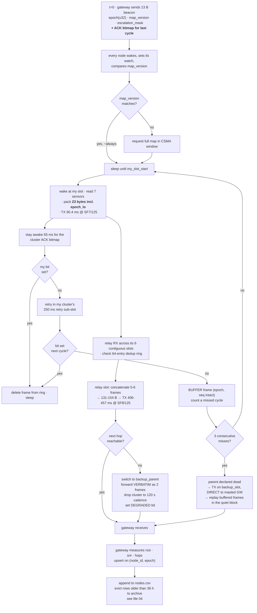

# 02 — The Mesh Network: Nodes, Relays, Slots, Airtime, Failure, and Sizing

> **This file owns:** how many nodes and why (including the general sizing engine for any site), where they go, who talks to whom, the timetable, every airtime and duty-cycle calculation, relay behaviour, every backup path, all **ten** failure classes, and the `mesh` block of `nodes.json`.
>
> **This file does NOT own:** ground physics (→ 01), the rest of `nodes.json` (→ 03), the PINN (→ 03), the CSV columns (→ 04), the alarm (→ 06).
>
> **v2.0: file `02b` has been folded in and retired.** Every fault it found is now applied here rather than described elsewhere. Three further faults found during the merge are also fixed. See 00 §7.

---

## 1. Radio physics — five ideas, no maths

**1. Spreading factor is how slowly you speak.** SF7 is talking normally: fast, but the listener must be closer. SF12 is shouting one syllable at a time: painfully slow, audible from far away. Each step up roughly **doubles** message duration and buys about 2.5 dB.

**2. Bandwidth is how wide a lane you use.** Wider is faster. **Indian law caps it at 200 kHz, so we use 125 kHz.** v1.4 specified 250 kHz, which is not legal here, and every airtime number in it was therefore half what it should have been.

**3. Airtime is the only currency.** The radio is one shared room. Only one node speaks at a time. Airtime is how many seconds of the room a message occupies. Everything in this document is an argument about who speaks and for how long.

**4. Duty cycle is a design constraint we chose.** GSR 564(E) specifies power and bandwidth. **It does not specify a duty cycle.** We hold ourselves to 1% because that is the ETSI/LoRaWAN convention, because we share the band with UHF RFID, and because self-imposed duty limits are what make a mesh scale. Say it that way — see 00 §3.4.1.

**5. Flooding is expensive.** Meshtastic's default routing is *managed flood*: hear a new message, repeat it. Self-healing with zero configuration — and one message costs a dozen transmissions.

> **Flooding, ELI5.** Thirty-one people in a field. One shouts "node 17 tilt is 42." Everyone who heard shouts it again so the far side hears. Then everyone who heard *that* shouts again. One sentence, thirty shouts. Now have all thirty-one people do that at once, every minute.

### 1.1 The airtime table — computed, not asserted

Every figure below comes from the Semtech time-on-air formula at **BW125, CR 4/5, 16-symbol preamble, explicit header, CRC on**. On-air payload = Meshtastic header (16 B) + application bytes.

| Frame | App B | On-air PL | SF7/125 | SF8/125 |
|---|---|---|---|---|
| Cluster ACK bitmap | 4 | 20 B | **64.8 ms** | 121 ms |
| Event alert | 8 | 24 B | **69.9 ms** | 131 ms |
| Beacon | 13 | 29 B | **75.0 ms** | 141 ms |
| **Leaf telemetry** | **23** | **39 B** | **90.4 ms** | 172 ms |
| Escalation delta (3 nodes) | 24 | 40 B | **90.4 ms** | 172 ms |
| Relay aggregate, 5 members | 115 | 131 B | 259 ms | **406.0 ms** |
| Relay aggregate, 6 members | 138 | 154 B | 259 ms | **457.2 ms** |

> **The free upgrade.** The application packet grew from 21 to 23 bytes in v2.0 (it now carries `epoch_lo`, without which store-and-forward is broken — file 04 §3). At SF7/125 both 37 B and 39 B on-air payloads take **90.4 ms**, because the extra two bytes do not cross a symbol boundary. **A correctness fix that cost exactly zero airtime.** Check things like this; they are common and free.

### 1.2 Which preset goes where, and why not just one

| Link | Preset | Reason |
|---|---|---|
| Leaf → relay | SF7/125 | short hop, cheap, 5.6× range margin |
| Leaf → gateway (fallback) | SF7/125 | masted gateway, 2.4× margin even from the far corner |
| Cluster ACK, beacon, event, escalation delta | SF7/125 | small and frequent; speed matters |
| **Relay → gateway (trunk)** | **SF8/125** | **the one asymmetry, and it is deliberate** |

**Why the trunk is one step slower.** Losing a leaf frame loses one node's row. Losing a relay aggregate loses **six**. Asymmetric consequence justifies asymmetric robustness: SF8 buys ~2.5 dB and costs 147 ms per relay per cycle, which the budget affords. SF7 would reach — the margin is 2.9× — but the failure cost is six times higher, so we pay for margin where the blast radius is largest.

That is a principled reason, not a preference, and it is the kind of answer a judge remembers.

---

## 2. How many nodes — derived, not guessed

### 2.1 The monitoring rectangle falls out of the geometry

```
r = H / tan_beta = 150 / 2.0 = 75 m

monitoring rectangle = (600 + 2×75) × (200 + 2×75) = 750 m × 350 m
                     = x ∈ [25, 775],  y ∈ [25, 375]
```

That is exactly the `grid` in `nodes.json`. **Note that the two anchors and the gateway sit at x = 860, deliberately outside it** — validation V4 must exempt them, which in v1.4 it did not.

### 2.2 The sampling scale, derived from the profile itself

v1.4 said "three points minimum to resolve a sign change → 18 m spacing." That is hand-waving. Here is the derivation.

Take a semi-infinite Knothe edge at `x = 0`:

```
S(x)  = (S_max/2)·erfc(√π·x/r)
T(x)  = dS/dx   = −(S_max/r)·e^(−πx²/r²)                 tilt, Gaussian
K(x)  = d²S/dx² = (2π·S_max·x/r³)·e^(−πx²/r²)            curvature
```

Curvature is the hard feature. Its spatial spectrum is `|K̂(f)| ∝ f·e^(−πr²f²)`, which peaks at `f = 0.399/r` and falls to 1% of peak at `f_max = 1.43/r`. Nyquist:

```
Δ_edge ≤ 1/(2·f_max) = r/2.86        →        Δ_edge = r/3 = 25 m
```

**25 m is exactly the spacing already used in the edge zones — now derived instead of asserted.** In the flat interior only `S` matters, so `Δ_flat = r = 75 m`. The steep band where `|K| > 10%` of peak is **~2r wide, centred on each panel edge**.

### 2.3 Uniform sampling is unaffordable — and that is the point

```
uniform 25 m grid over 750 × 350 m  =  31 × 15  =  465 nodes
uniform 18 m grid (the v1.4 figure) =  42 × 20  =  840 nodes
```

Non-starter at any plausible cost. So one of two things must give: the sampling density, or the assumption that sampling is uniform.

### 2.4 Lines, not grids — a century of survey practice

Real subsidence monitoring uses **survey lines**: one transverse line across the panel through its centre, one longitudinal line along the panel axis. Dense where the gradient is steep, sparse where it is flat.

| Group | Count | Positions | Job |
|---|---|---|---|
| Transverse line | 13 | x = 400, y ∈ {25, 75, 100, 125, 150, 175, 200, 225, 250, 275, 300, 325, 375} | resolves the steep trough edges; 25 m in edge zones, 50 m in the flat centre |
| Longitudinal line | 10 | y = 200, x ∈ {25, 100, 175, 250, 325, 475, 550, 625, 700, 775} | resolves trough advance along the panel; shares (400,200) with the transverse line |
| Off-axis constraint | 5 | (250,150) (550,150) (250,250) (550,250) (325,300) | two crossed lines constrain only two cross-sections; these break the degeneracy and give the PINN real 2-D information |
| **Anchors** | 2 | (860,200), (860,340) | 160 m beyond the panel edge, i.e. **> r outside the influence zone**. Stable datum and common-mode reference |
| **Gateway** | 1 | (860,200), co-sited with anchor 1 | backhaul, time beacon, slot master, 10 m mast |
| **Total** | **31** | | 28 field + 2 anchors + 1 gateway |

**Node accounting verified.** All 13 transverse, all 10 longitudinal and all 5 off-axis nodes appear exactly once in the cluster assignment of §3.3, none double-counted.

### 2.5 The honest gap in the longitudinal line — state it, don't hide it

Applying §2.2's rule strictly:

```
N_trans = 2·(2r/Δ_edge + 1) + max(0, W/r − 3)      = 14   (we have 13 — agrees)
N_long  = 2·(2r/Δ_edge + 1) + max(0, L/(2r) − 2)   = 16   (we have 10 — under-sampled)
```

**The longitudinal line is ~6 nodes short of Nyquist.** There is a legitimate argument for that, and it must be made rather than left silent:

> Along the advance axis the trough edge **moves**. At a 3 m/day face advance and 60 s sampling, the moving edge is sampled in time far more finely than any spatial grid could manage. Temporal sampling substitutes for spatial sampling on the advance axis. Only the two **static** edges — start-up and stop-off — need full `Δ_edge` density.

**Decision for the demo: stay at 31 nodes and publish the gap.** Adding nodes would cascade through every array shape, slot index and test in the repo for no demo benefit. The sizing engine in §12 gives 39 as the correct field number and that is the scale-up slide. Say: *"our demo layout is deliberately the minimum viable one, and here is the computed cost of that choice."*

### 2.6 The 27× gap is closed by the PINN — and it has a limit

465–840 nodes for uniform Nyquist. 28 field nodes on lines. That factor is not absorbed by clever layout; it is absorbed by the **physics prior**. The PINN is constrained to surfaces a Knothe influence function can produce. **That constraint is worth hundreds of sensors.**

> "We used a neural network because it's accurate" is a weak claim. "We used a physics-informed network because it is the only thing that lets 28 sensors do the job of 800" is a costed engineering argument.

**But be ready for the follow-up, because a good judge will find it.** A localised anomaly — an old working collapsing, a sinkhole over a shallow gallery — is by definition the *residual* from the Knothe model. The prior buys nothing there. Worse: with no data over the anomaly, the PINN will confidently draw a smooth bowl across it and report a **low** residual.

> **A physics prior compresses what it predicts. It cannot compress a surprise.**

So off-line sampling density is set by the smallest anomaly you commit to detecting, not by the trough. Which brings us to the number nobody else will publish.

### 2.7 `d_committed` — publishing our own blind spot

**The metric: largest empty circle.** Delaunay-triangulate the node set plus the rectangle boundary; the LEC is the biggest circle containing no node. **Its diameter is the largest feature the network can miss entirely.**

Computed for the actual 28-node layout:

```
ρ_LEC       = 178.9 m,  centred near (62, 25)
d_detected  = 358 m
```

**This network cannot guarantee detection of any localised feature smaller than 358 metres across.** That is the honest number. It goes in `nodes.json` as `d_committed`, it goes in the dashboard header, and test **T20** fails the build if the layout drifts away from it.

Every other team will answer "what if something opens between your nodes?" with hand-waving. **Answer it with a computed number and a mitigation** — the mitigation being §12's sizing table, which says +8 nodes buys you 250 m.

### 2.8 Why the anchors matter more than they look

They sit outside the influence zone, so **by construction they must read zero subsidence forever**. Therefore:

- If an anchor reports movement, your **sensors** are drifting, not the ground. Instant drift detection with no ground truth required.
- Subtracting the anchors' temperature-driven tilt from every field node removes the shared seasonal component. **Common-mode rejection against the anchors is the cheapest SNR gain in the system.** (C7 must then inflate σ for the anchors' own noise — file 06 §2.3.)
- Two anchors, not one, so you can distinguish "the anchor is broken" from "everything is drifting."

---

## 3. Topology — what relays are actually for

### 3.1 Relays are an airtime-and-redundancy construct, not a range construct

**v1.4 claimed roughly half the field physically could not reach the gateway, and used that to justify relays. That claim was wrong**, and it contradicted every recovery path in the same document — §5.3, §8.1 and §8.2 all routed orphans *directly to the gateway*, over links §3.1 said did not exist.

The link model settles it. **One link model; `reliable_range_*` are outputs of it, never independent constants** — the same law as "one surface, four questions", applied to the radio.

```
PL(d)        = 71.2 + 40·log₁₀(d/100) + X_σ + L_clutter          dB
M            = ERP − PL − sensitivity(SF)
PDR          = 1/(1 + exp(−(M − 3)/2))      →  PDR = 0.99 at M = 12.2 dB

d_reliable(SF, L_clutter)
  = 100 · 10^[ (ERP − Sens(SF) − 71.2 − L_clutter − M_req − z·σ) / (10n) ]

  ERP = 30 dBm (conservative: 1 W into a unity-gain antenna; law permits 36)
  n   = 4.0        near-ground obstructed
  σ   = 6 dB,  z = 1.28   (90th-percentile shadowing, so a bad draw doesn't kill the link)
  L_ground = 25 dB,  L_masted = 10 dB
  Sens: SF7 −123 dBm,  SF8 −126 dBm
```

| Link | SF | **Derived reliable range** | Longest actual hop | Margin |
|---|---|---|---|---|
| leaf → relay, ground↔ground | 7 | **838 m** | 150 m | 5.6× |
| relay → relay, ground↔ground (failover) | 7 | **838 m** | 225 m | 3.7× |
| **leaf → masted gateway (fallback)** | 7 | **1986 m** | 835 m | **2.4×** |
| relay → masted gateway (trunk) | 8 | **2360 m** | 685 m | 3.4× |

**Every leaf can reach the masted gateway directly.** So all four recovery paths are real. Relays exist to save airtime (six frames become one transmission) and to give the network a second layer, not because anyone is out of range.

> **Note for honesty on stage:** `n` and `L_clutter` are **calibrated, not derived**. Validate against Meshtasticator and **report the disagreement rather than hiding it**. v1.4 claimed they were calibrated to give 400 m; they were not, and nobody had checked — the model at those constants gives 2.4 km. That is exactly the class of error a second source of truth produces.

### 3.2 The gateway mast — do this first; it is one antenna

Radio between two points does not travel in a line. It travels in a fat cigar shape around the line — the **Fresnel zone**. At 866 MHz over 500 m that cigar is ~6.5 m fat at its middle. Antennas at 1.5 m sit inside the bottom fifth of it, buried in soil clutter.

**Raise the gateway antenna to 10 m on the surface hut.**

| | Without mast | With 10 m mast |
|---|---|---|
| Clutter loss on relay→GW links | 25 dB | **10 dB** |
| Reliable leaf→GW range, SF7 | 838 m | **1986 m** |
| Leaves able to fall back to direct | ~half | **all 28** |
| Max chain depth | leaf→R→R→GW | **leaf→R→GW** |

> **The mast argument, stated correctly:** the mast is what makes "talk directly to the gateway" a working fallback **for every single node**. Without it, relays are mandatory single points of failure with no backstop. With it, relays are an optimisation you can afford to lose. **That is the difference between a network with redundancy and a network with a story about redundancy.**

**A worse problem it also mitigates:** the thing you are measuring degrades your radio. A developing trough lowers and tilts the nodes in it, changing the terrain profile between them. Links get worse precisely when the event you care about is happening. A masted gateway is the one link the trough cannot bend.

### 3.3 The five clusters — frozen assignment

| Cluster | Relay position | Children | Longest child hop | Relay→GW | Slot block |
|---|---|---|---|---|---|
| **C1** | (175, 200) | (25,200) (100,200) (250,150) (250,250) | 150 m | 685 m | 0–5 |
| **C2** | (325, 200) | (250,200) (400,175) (400,200) (400,225) | 79 m | 535 m | 6–11 |
| **C3** | (400, 100) | (400,25) (400,75) (400,125) (400,150) | 75 m | 471 m | 12–17 |
| **C4** | (400, 300) | (400,250) (400,275) (400,325) (400,375) (325,300) | 75 m | 471 m | 18–23 |
| **C5** | (550, 200) | (475,200) (550,150) (550,250) (625,200) | 75 m | 310 m | 24–29 |
| **Direct** | — | (700,200) (775,200) anchor (860,340) | — | ≤ 212 m | 30–32 |
| **Wired** | — | anchor (860,200) | co-sited | 0 m | none |

```
5 relays + 21 clustered leaves + 3 direct leaves + 1 wired anchor + 1 gateway = 31 ✅
```

Relay slots are ordered **by distance to the gateway, descending** (C1 first, C5 last). §3.6 Rule 2 explains why that order is load-bearing.

**Each cluster owns a 6-slot block, not 4–5.** v1.4 had four global spare slots at 21–23, which are useless for re-homing: contiguity is the whole energy optimisation, so a leaf moving into C1 needs a free slot **inside C1's block**. Six-slot blocks give every cluster 1–2 in-block spares.

> **Honest limit that follows:** fast failover supports **intra-cluster** promotion, not cross-cluster re-homing. A cross-cluster move needs a `map_version` bump and the 3-cycle planned protocol (§8.1). That is fine — if an entire cluster including all promotion candidates is dead, you are in F3 territory and a human is already involved.

### 3.4 What a relay actually is — one SKU

Physically nothing changes. Same board, same ESP32, same SX1262, same sensors, same enclosure, same BOM. **`radio_role: "relay"` in `nodes.json` is the entire difference.**

| | Leaf | Relay |
|---|---|---|
| TX per cycle | 90 ms @ SF7 | 406–457 ms @ SF8 + 65 ms ACK |
| RX per cycle | ~0.15 s (beacon + own ACK bitmap) | **~1.56 s** (own block + retry sub-slot + beacon) |
| Sleeping | ~99.6% | ~97.3% |
| RAM held | one 23 B frame + 99 KB flash ring | 138 B aggregate + 320 B dedup ring |
| Sends ACKs | no | **yes — one bitmap, not five packets** |
| Failure blast radius | 1 node | **5–6 nodes** |

**Energy ratio ≈ 3.9× a leaf.** That number is bought by two things together:

1. **Contiguous cluster slots**, so a relay wakes RX for its own six slots and sleeps through the other twenty-four.
2. **A per-cluster retry sub-slot.** v1.4 claimed 3.5× by counting only the children's slots — but a child's retry landed in the 8 s contention window, so the relay had to stay awake through all of it, giving a real ratio of **~15×** and resurrecting mandatory monthly rotation. Appending a 250 ms retry sub-slot to each cluster block means the relay stays awake 250 ms longer instead of eight seconds.

```
relay RX = 1.25 s (six child slots) + 0.25 s (retry sub-slot)
         + 0.065 s (its own ACK TX) + 0.075 s (beacon)  ≈ 1.56 s   →  3.9×
```

Bonus: retries become deterministic. No CSMA needed for the common case.

**Consequence:** rotation stays a policy, not a mandate. Rotate when a relay's `vbat_mv` sits more than 15% below its cluster median, or monthly, whichever comes first. The gateway already receives `vbat_mv` in every row, so this needs no new telemetry.

> **Say to judges:** one SKU, no special spares, any node promotable by a config push. That is a procurement argument, not just an engineering one.

### 3.5 The relay's job, in four lines

1. Wake for each of its six block slots; receive, and drop anything already in the 64-entry `(node_id, epoch)` dedup ring.
2. Stay awake for the 250 ms retry sub-slot at the end of its block.
3. Transmit **one bitmap ACK** naming every child heard this cycle. Children not in the bitmap keep their frame buffered.
4. At its own relay slot, concatenate the frames it holds plus its own into one payload (131 B for 5 members, 154 B for 6) and transmit once.

### 3.6 Relay-to-relay — the failover path

With the mast, no relay *needs* another relay in normal operation. Relay-to-relay is the **degraded path**, and it must exist because the trough degrades links exactly when it matters.

| Relay | Primary next hop | Backup next hop | Backup distance |
|---|---|---|---|
| C1 | gateway | **C2** | 150 m |
| C2 | gateway | **C5** | 225 m |
| C3 | gateway | **C5** | 180 m |
| C4 | gateway | **C5** | 180 m |
| C5 | gateway | C2 | 225 m |

**Three rules that make forwarding work.**

**Rule 1 — verbatim forwarding, never re-aggregation.** A relay in failover transmits its own aggregate *and separately* forwards its child-relay's aggregate as a second frame, unchanged. Re-aggregating five clusters would produce a 700 B payload; LoRa's maximum is 255 B. Two frames, one TTL decrement each.

**Rule 2 — relay slots ordered by hop depth descending.**
```
relay_slot_index = (h_max − h_self)
```
The deeper relay transmits first, so its parent is still awake to hear it **inside the same superframe**. Get this backwards and a forwarded frame waits a full cycle. This is also why the nominal order is C1→C5 by distance: it is already the correct failover order.

**Rule 3 — failover halves the orphan's cadence.** A relay carrying two aggregates transmits `406 + 406 + 65 = 877 ms` per cycle = **1.46% duty**, which is over the line. So a cluster in failover drops to **120 s** cadence: `877 / 120 = 0.73%` ✅. The gateway logs this, the `DEGRADED` bit is set in every affected packet, and the dashboard marks the cluster degraded — **never silently**.

### 3.7 Does this forfeit being a mesh? No.

A mesh is defined by **multi-hop forwarding with alternate paths and self-healing**. It is not defined by flooding. Flooding is one routing policy a mesh may use, and here it is the wrong one for bulk telemetry.

| Mesh property | Present? | Where |
|---|---|---|
| Multi-hop forwarding | ✅ | leaf→relay→gateway; leaf→relay→relay→gateway in failover |
| Alternate paths | ✅ | `backup_parent` per node, backup relay per relay, `backup_slot` per leaf |
| Self-healing with no operator | ✅ | 3-cycle parent-death detection → automatic re-election |
| Flooding | ✅ | **event plane only**, where it is correct |

**The arithmetic against flooding telemetry:**

```
30 nodes × 13 rebroadcasts × 90 ms = 35.1 s per 60 s cycle = 58% channel
                                     far past the ~18% ALOHA collapse threshold
per-node duty = 13 × 90 ms / 60 s  = 1.95%   ← twice the ceiling, leaving nothing for alerts
```

And flooding scales as **N²** — every added node is another rebroadcaster. Under TDMA one more node costs exactly one more slot. Linear.

> **Adding nodes to fix a flooding problem is like adding people to a room to make it quieter.**
>
> **The rule underneath the whole design: flood the rare and tiny, schedule the frequent and bulky.**

### 3.8 What we actually take from Meshtastic — stated truthfully

v1.4 claimed "we remain inside Meshtastic; choosing `NextHopRouter` is configuration, not a departure." **That is true for routing and false for everything else.** Meshtastic has no superframe, no beacon epoch counter, no TDMA slot scheduler, no cluster aggregation, no bitmap ACK. All of that is ours. And v1.4 then proposed validating with Meshtasticator, which runs real Meshtastic firmware — **so it cannot see a TDMA plane that is not in the firmware.** The validation plan was circular.

**The true statement, which is also the better one:**

> "Meshtastic gives us PHY configuration, packet framing, encryption, and a battle-tested flood router. The TDMA superframe is a Meshtastic module we wrote. We validate the two planes with different tools because they have different failure modes."

| Plane | Tool | Why |
|---|---|---|
| Event plane (managed flood) | **Meshtasticator** | genuinely stock behaviour; rebroadcast count `R` and latency are emergent and must be measured |
| Telemetry plane (our TDMA) | **our own discrete-event sim** | deterministic schedule → collisions are impossible by construction; the only thing left to validate is link PDR, which is the link model |

> **TDMA is easier to validate than flooding, precisely because it is deterministic.** Flooding needs a simulator to tell you what it will do. A timetable does not.

---

## 4. The three planes

"How fast is the system" is not one number. It is three, and they cost wildly different amounts.

| Plane | Payload | Preset | Cadence | Who talks | Latency | Worst duty |
|---|---|---|---|---|---|---|
| **P1 Routine** | 23 B telemetry, everyone | SF7 leaf / SF8 relay | 60 s | all | ~5 s | 0.87% |
| **P2 Escalation** | 24 B delta, escalating members only | SF7 | +1 frame at t+30 s | **one cluster only** | ~30 s | 0.79% |
| **P3 Event** | 8 B alert, **flooded** | SF7 | immediate | the tripping node | **< 1.4 s** | 0.12% |

**The insight.** Nobody is harmed because a tilt reading arrived nine minutes late. They are harmed because an *alarm* arrived nine minutes late. Those are different payloads with different urgencies, and a design that forces them to share one cadence lets the expensive one set the price for the cheap one.

An 8-byte alert at SF7/125 is **70 ms**. A full telemetry aggregate is **457 ms**. The alarm is six times cheaper than the thing that would otherwise throttle it.

> **Hospital ward analogy.** The routine plane is the nurse writing every patient's vitals on a chart once an hour — thorough, slow, nobody sprints. The event plane is the crash button on the wall: one bit of information, no detail, instantly everywhere. You do not make a ward safer by asking the nurse to write faster. You put in a crash button.

### 4.1 P3 in detail

- Payload 8 B: `node_id | epoch | channel_id | magnitude | confidence | crc` → 24 B on air, **69.9 ms**.
- **Managed flood** — the one place flooding is correct, because you want every path tried at once. Highest priority, preempts the slot schedule after a CAD check.
- Latency: 3 hops × (70 ms + ~200 ms CAD/backoff + jitter) ≈ **< 1.4 s to the gateway**.
- Budget: 20 alerts/hour = 0.12% duty. Effectively free.

**What triggers it:** a tiny on-board detector — no ML, no model. A threshold on `|value − rolling_baseline| / σ` plus a threshold on `d/dt`. Two comparisons and a subtraction, running on the node so it fires without a network round trip.

**Alert-storm suppression — new in v2.0.** A real event trips many nodes at once. Twenty simultaneous alerts × ~25 rebroadcasts × 70 ms = **35 s of airtime in a burst**, colliding with itself, on the one plane that must not fail.

> **Fix: origination suppression.** A node that hears any alert from its own cluster for the same epoch **suppresses its own origination for 60 s and simply rebroadcasts.** The alert is a *request for attention*, not data — so one is exactly as useful as five. Test T25.

This keeps §9.3's copy-counting metric intact, because copies of the *surviving* alert still measure path redundancy.

**What it does not do: it does not raise an alarm.** It is a request for attention. The alarm remains owned entirely by the gateway-side classical bowl fit plus blast-log cross-check (file 06). **The event plane changes *when* the gateway looks, not *who* decides.**

### 4.2 State machine

```
  QUIET ──── node-local warn threshold ────► ESCALATED
    ▲          (cluster: routine → 120 s,           │
    │           + one 24 B delta every 30 s)        │
    └──── 30 min elapsed, no re-trigger ────────────┘

  ┌────────────────────────────────────────────────────┐
  │ EVENT  8 B flood, preempts anything, < 1.4 s       │  ← from any state, any time
  │  → gateway runs bowl fit + blast veto + lightning  │
  └────────────────────────────────────────────────────┘
```

### 4.3 Escalation is payload-based, not rate-based — and why that changed

v1.4 escalated by tripling the rate to 20 s. Two things were wrong with that.

**It was undeliverable where it mattered most.** v1.4 budgeted 107 ms per 20 s, which is the *leaf* airtime. But C1's relay runs the SF8 trunk at 406 ms. Three times per minute = 1218 ms = **2.03% duty. Illegal.** And C1/C2 sit over the panel start-up edge — the clusters most likely to escalate first.

**And 20 s was derived from nothing.** Subsidence time constants are hours to days. No physical process requires 20-second sampling.

**The v2.0 rule, which works for every cluster including C1:**

```
On escalation, the cluster does two things at once:
  1. routine aggregate cadence  60 s → 120 s     (frees 0.38%)
  2. add one 24 B delta frame every 30 s, carrying up to 3 escalating nodes

worst case, C4 (6-member relay):
  per 120 s:  1 × 457 (aggregate) + 2 × 65 (ACK) + 4 × 90 (deltas) = 947 ms
              947 / 120 000 = 0.79%   ✅
```

**Effective cadence on the channels that matter: 30 s. Non-escalating members: 120 s.** Attention follows the signal, which is the correct behaviour and is *cheaper* than what v1.4 promised and could not deliver.

> **And never cap the urgent plane silently.** v1.4 capped escalation at 30 min/hour "enforced in firmware," which degrades you at the worst possible moment. The v2.0 rule trades routine for urgent instead, and surfaces the trade in the `DEGRADED` bit and on the dashboard.

---

## 5. The superframe — the timetable

### 5.1 Layout, 60 seconds — **redrawn for BW125 and 6-slot blocks**

```
 t=0    t=2                            t=11.5   t=12.5  t=15.5  t=18  t=20.5          t=60
 ├──────┼───────────────────────────────┼────────┼───────┼───────┼─────┼───────────────┤
 │beacon│ 5 cluster blocks × 1.9 s      │ direct │ relay │backup │CSMA │ quiet / event │
 │ 2 s  │ 6 slots + ACK + retry each    │  3×250 │ 5×600 │16×150 │2.5 s│   39.5 s      │
 └──────┴───────────────────────────────┴────────┴───────┴───────┴─────┴───────────────┘
```

| Block | Window | Duration | Contents |
|---|---|---|---|
| Beacon | 0 – 2.0 s | 2.0 s | gateway broadcasts 13 B: `epoch` (uint32), `map_version`, `escalation_mask`, `config_version`, flags, **`ack_bitmap`**, crc → **75 ms** on air. The only downlink in a normal cycle |
| Cluster blocks ×5 | 2.0 – 11.5 s | 9.5 s | each **1.9 s** = 6 leaf slots × 250 ms + 150 ms ACK slot + 250 ms retry sub-slot |
| Direct leaves | 11.5 – 12.5 s | 0.75 s | 3 slots × 250 ms, SF7 straight to the gateway |
| Relay slots | 12.5 – 15.5 s | 3.0 s | 5 × 600 ms, ordered by hop depth descending |
| Backup slots | 15.5 – 18.0 s | 2.4 s | **16 × 150 ms**, TDMA-reserved, one per possible orphan |
| CSMA window | 18.0 – 20.5 s | 2.5 s | genuine contention: map pulls, orphan joins. **Not** retries — those have sub-slots now |
| Quiet | 20.5 – 60.0 s | 39.5 s | event-plane headroom + buffer replay at lowest priority. **66% idle is why the alarm plane clears CAD on the first attempt** |

**Two things v1.4 got wrong here, both now fixed.**

- **The contention window was 100% oversubscribed.** It allocated 40 backup slots × 150 ms = 6.0 s inside an 8 s window that was also supposed to hold retries, map pulls and buffer replay. And it called the same window both "contention" (CSMA) and "pre-reserved slots" (TDMA). Pick one. v2.0: **16 reserved backup slots** (enough for two simultaneous relay deaths, 10–11 orphans, with margin), retries moved to per-cluster sub-slots, replay moved to the quiet block where it belongs — it is the only traffic in the system with no latency requirement at all.
- **Replay in the contention window delayed live traffic.** Now it is quiet-block, CAD-gated, and deferred whenever `escalation_mask ≠ 0`.

### 5.2 Slot allocation — frozen

| Slot range | Count | Assigned to |
|---|---|---|
| 0–5 | 6 | C1: 4 children + **2 in-block spares** |
| 6–11 | 6 | C2: 4 children + 2 spares |
| 12–17 | 6 | C3: 4 children + 2 spares |
| 18–23 | 6 | C4: 5 children + 1 spare |
| 24–29 | 6 | C5: 4 children + 2 spares |
| 30–32 | 3 | direct leaves |
| 33–37 | 5 | relays C1…C5, in that order |
| 38–53 | 16 | backup slots — pre-reserved, one per possible orphan |

**Contiguity is the whole optimisation.** Cluster C1 owns slots 0–5, so its relay wakes RX for 1.5 s and sleeps through slots 6–29. That single choice, plus the retry sub-slot, takes relay energy from 15× a leaf down to 3.9×.

### 5.3 How a node knows its slot

**Wrong mental model:** nodes pass a token, listen for "you're next", or watch the channel for their turn. None of that happens — all of it costs airtime and breaks the moment one node goes deaf.

**Right mental model: every node owns a printed timetable and a watch. The beacon sets the watch. The timetable does the rest.**

```
my_slot_start = beacon_arrival_time + 2 s + (my_slot_index × slot_duration)
```

A node computes that once per cycle, sets a hardware timer, and sleeps. It wakes, transmits for 90 ms, wakes again briefly for its cluster's ACK bitmap, and sleeps. **It does not listen during other nodes' slots.** That is where the power saving comes from and why there is no contention.

> **School assembly analogy.** The wrong design is a teacher calling names — needs a working PA, stops dead if the PA fails. The right design is a printed running order plus one bell at the start. Everyone counts from the bell.

**Two tiers of slot source:**

| Tier | Source | When used | If it fails |
|---|---|---|---|
| **Static** | `slot` field in `nodes.json`, written at deployment | always, as the floor | a node with no beacon for 10 cycles reverts to this and **keeps transmitting** |
| **Dynamic** | slot map broadcast by the gateway | whenever a fresh map is held | supersedes static; used for rotation and orphan re-homing |

**The static tier is the safety net and must never be removed.** A node that has lost the gateway entirely still transmits on its factory slot. It may be transmitting into a void, but it is never silent for a reason the operator cannot diagnose — and the instant the gateway returns, its data is already flowing.

**The beacon is 13 bytes, not a slot table.** Broadcasting the full 31-node map every cycle wastes airtime on data that changes maybe once a month. The beacon carries a **version number**; a node compares it to its stored copy, does nothing if they match (essentially every cycle), and requests the full 31-byte map in the CSMA window if they differ. **Steady-state cost of the entire slot-management system: 75 ms per minute — the beacon you were sending anyway.**

### 5.4 Time sync without GPS — and the fix for long beacon loss

| Quantity | Value |
|---|---|
| Commodity crystal tolerance | ±20 ppm |
| Beacon interval | 60 s |
| Accumulated drift between beacons | **1.2 ms** |
| Guard band per leaf slot | **160 ms** (250 ms slot − 90 ms TX) |
| Margin | **133×** |
| After 10 missed beacons | 12 ms — still 13× inside guard |
| Propagation delay at 900 m | 3 µs — ignore it |

**Therefore no GPS on field nodes.** That saves ~₹400/node plus a power-budget line, and "we did the drift arithmetic and found we didn't need it" is a better answer than "GPS."

**But the 133× margin is per-cycle, and v1.4 never covered extended beacon loss:**

```
relative drift between two nodes = ±40 ppm
guard band                        = 160 ms
time to exhaust guard = 160e-3 / 40e-6 = 4000 s = 67 minutes
```

After ~67 minutes of beacon loss, two nodes on adjacent static slots overlap. **The fallback that was supposed to keep the network alive turns it into mutual jamming.**

> **Fix, one `if` statement:** after 10 missed beacons, a node performs a **CAD check immediately before its slot transmission** and backs off one slot-width if the channel is busy. Costs ~1 ms per cycle, only in fallback mode, and makes the static tier survive indefinitely. Test **T24** simulates a 3-hour beacon outage and asserts zero collisions.

---

## 6. The budget — measured, not asserted

### 6.1 Airtime per 60 s cycle

```
21 clustered leaves × 90.4 ms  (SF7/125, 39 B)     = 1898 ms
 3 direct leaves    × 90.4 ms  (SF7/125, 39 B)     =  271 ms
 5 cluster ACK bitmaps × 64.8 ms (SF7/125, 20 B)   =  324 ms
 4 relays × 406.0 ms (131 B) + 1 × 457.2 ms (154 B) = 2081 ms
 beacon (13 B, carrying the gateway ACK bitmap)     =   75 ms
                                            TOTAL   = 4649 ms
```

### 6.2 The verdict table

| Metric | v1.4 claimed | **v2.0 measured** | Limit |
|---|---|---|---|
| Carrier bandwidth | 250 kHz ❌ | **125 kHz** ✅ | 200 kHz (GSR 564(E)) |
| Channel utilisation | 5.49% | **7.75%** | 18% (ALOHA collapse) |
| Worst-node duty (C4 relay) | 0.67% | **0.87%** | 1.00% |
| **Gateway duty** | **never computed** | **0.125%** | 1.00% |
| Leaf duty | 0.075% | **0.15%** | 1.00% |
| Escalating cluster | claimed 0.53%, actually 2.03% ❌ | **0.79%** | 1.00% |
| Routine cadence | 60 s | **60 s** ✅ | — |
| Alarm latency | < 1 s | **< 1.4 s** | — |
| Channel idle | 94.5% | **92.25%** | — |

**The design survives the legality fix.** It loses most of its duty-cycle headroom, which is why escalation had to change from rate-based to payload-based. **That is the honest cost of compliance and it is worth stating as such** — it is a much better story than a number that was never checked against the law.

### 6.3 The gateway was the worst node in the network, and nobody had looked

v1.4 computed duty cycle for leaves and relays. **It never computed it for the gateway** — the one node you cannot move, cannot rotate, and cannot replace with a spare.

The gateway must acknowledge 5 relay aggregates + 3 direct leaves, or those nodes cannot know whether to buffer, and §3.6 and §8.2 both depend on them knowing.

```
per-packet ACKs:  8 × 16 B @ SF8/125 = 8 × 121 ms = 968 ms
beacon                                             =  75 ms
                                        TOTAL      = 1043 ms / 60 s = 1.74%  ❌ ILLEGAL
```

Relay ACKs were unbudgeted too: five relays × five children × 65 ms = **1.63 s per cycle** of air nobody had counted.

> **The fix — one idea, two applications: ACK by bitmap, not by packet.**
>
> **Gateway → nodes:** the beacon already transmits every cycle. Add one byte: a bitmap of which relays and direct leaves were heard last cycle. **ACK latency becomes one cycle, which is free because relays buffer anyway.**
>
> **Relay → children:** one bitmap ACK per cluster, transmitted in the 150 ms ACK slot at the end of the cluster's block. 64.8 ms, replacing 5 × 64.8 ms.

| | Before | After |
|---|---|---|
| Gateway duty | 1.74% ❌ | **0.125%** ✅ |
| Relay C4 ACK cost | 324 ms | **65 ms** |
| Network ACK airtime | 2.60 s/cycle | **0.40 s/cycle** |

**Cost: zero.** The gateway was already beaconing; the relay was already awake at the end of its block. Leaves stay awake ~65 ms past the end of their cluster's block to hear the bitmap — 65 ms of RX added to a node that sleeps 99.6% of the time.

### 6.4 Cadence sensitivity

| Cadence | Channel | Worst-node duty | Verdict |
|---|---|---|---|
| 120 s | 3.9% | 0.44% | conservative; this is the failover and escalation cadence |
| **60 s** | **7.75%** | **0.87%** | ✅ legal, **1.15× headroom** |
| 45 s | 10.3% | 1.16% | ❌ over |
| 30 s | 15.5% | 1.74% | ❌ over |

**60 s is not a preference. It is the floor for sustained routine telemetry, with only 15% margin.** That is a clean, quotable constraint, it is *tighter* than v1.4 claimed, and it is precisely why the escalation plane had to become payload-based rather than rate-based.

---

## 7. Routing — the selection formulas

All cheap arithmetic. No model, no learning, nothing that can surprise you at 3 a.m.

### 7.1 Parent selection cost

Node `i` choosing among candidate parents `j`:

```
C(i→j) = 0.50·(1 − PDR_ij)              link reliability dominates
       + 0.25·(h_j + 1)/h_max            prefer shorter chains to the gateway
       + 0.15·(1 − vbat_j/V_full)        don't hang children on a dying parent
       + 0.10·(load_j / 6)               spread load across relays

pick argmin C
```

**Hysteresis is mandatory:** switch only if `C_new < 0.8 × C_current` for **3 consecutive cycles**. Without it the network thrashes parents on shadowing noise and you spend the whole demo re-electing.

### 7.2 Relay election score

Run at the gateway when a relay dies or drops below its battery threshold. Highest score in the orphaned cluster wins.

```
E_j = 0.40·(vbat_j / V_full)
    + 0.30·(1 − d_j→nexthop / R_trunk)
    + 0.20·(mean PDR to prospective children)
    + 0.10·(1 − duty_j / 0.01)
```

`R_trunk` is the **derived** range from §3.1, not a constant.

### 7.3 Transmission ordering — the rule people get wrong

**Do not reorder TDMA slots by urgency.** Slot order is static and derived from `node_id`, because determinism is the entire reason TDMA has no collisions. A dynamic order would require every node to agree on the order every cycle, which requires broadcasting the full map every cycle, which costs exactly the airtime TDMA was built to save.

> **Priority is expressed as cadence and payload, not as order.** A node with a rising signal does not jump the queue — its *cluster* switches to the P2 pattern of §4.3. Two ways to express urgency; only one of them is free.

The score that drives escalation:

```
U_i(t) = | v_i(t) − baseline_i(t) | / σ_i        (z-score, per channel)

U > 3                          → WATCH   log it
U > 5                          → WARN    gateway moves this cluster to P2
U > 8  AND  dU/dt > 1/epoch    → node fires a P3 event packet
```

`baseline_i` is a 24 h rolling **median** held on the node in 48 bytes. Median, not mean — a single wild reading must not shift the baseline it is being compared against.

**The only ordering rule that is dynamic** is §3.6 Rule 2: relay slots ordered by hop depth descending, so failover cascades complete inside one superframe. That order changes only when `map_version` changes — roughly monthly.

---

## 8. Switching relays — the two protocols

### 8.1 Planned rotation, three cycles of lead time

```
cycle N     gateway decides the new assignment
            beacon carries map_version = v+1, effective_at = N+3
cycle N     nodes with a stale version request the full map in the CSMA window
cycle N+1   same, for anyone who missed it
cycle N+2   same — three chances
cycle N+3   everyone switches at the beacon, simultaneously
            old relay drops to leaf; new relay comes up
```

Any node that still lacks the map by N+3 falls back to its **static slot** and reports **direct to the masted gateway** — which §3.1 confirms every node can reach. Degraded (it costs its own 90 ms instead of sharing a relay's aggregate) but **never silent**, and it self-corrects at the next beacon it hears.

**Lead time plus static fallback is what makes this safe.** Without lead time, one lost beacon splits the cluster into nodes using the old map and nodes using the new one, and they collide.

### 8.2 Unplanned relay death (F4) — the backup path, step by step

This is the sequence to be able to recite.

```
cycle N     leaf transmits in its slot
            leaf stays awake 65 ms for the cluster ACK bitmap → its bit is NOT set
            leaf retries once in its cluster's 250 ms retry sub-slot → still no bit
            leaf BUFFERS the frame with (epoch, seq) intact. Does not give up.
cycle N+1   same
cycle N+2   same → 3 consecutive failures → parent declared dead
cycle N+3   leaf transmits on its backup_slot (38–53), DIRECT to the masted gateway
            replays its 3 buffered frames in the quiet block at low priority
cycle N+3   gateway sees 4–5 nodes appear on backup slots + relay silent
            → confirms F4, NOT F3 (see §9.1)
            → elects a new relay by the §7.2 score, bumps map_version
cycle N+6   cluster back to normal aggregation under the new relay
```

**Why three cycles and not one.** At PDR 0.99 a single missed ACK happens to some node roughly once every 25 cycles across the network — completely normal. Three consecutive misses from the same parent is a one-in-a-million event if losses were independent, so it is almost certainly a real death. One-cycle triggering would have the network re-electing relays constantly.

**Total cost of a relay dying: about six minutes of degraded aggregation and zero lost data.** Leaves buffer through the detection window and replay once on backup slots. **Test T11 asserts exactly this — zero rows lost, only delayed.**

> **Relay death costs latency, not data.** That distinction is the difference between a mesh that survives and one that merely reroutes.

### 8.3 The three backup mechanisms, side by side

People conflate these. They are separate and they compose.

| Mechanism | Owned by | Triggered by | Costs | Recovers |
|---|---|---|---|---|
| **`backup_slot`** | leaf | its relay dying (3 cycles) | one 150 ms reserved slot | the leaf's own future frames |
| **Frame buffer** | leaf | any un-ACKed frame | 99 KB flash, up to 72 h | the leaf's own **past** frames |
| **`backup_parent`** | relay | its next hop dying | 120 s cadence for that cluster | the whole cluster's path |

A leaf whose relay dies uses **both** of the first two: the backup slot carries new frames live, the buffer replays old ones in the quiet block. A relay whose gateway link dies uses the third and drops to 120 s. If *both* the relay and the gateway link fail, the leaves fall through to direct-to-gateway on backup slots — which works because of the mast, and which is why the mast is the highest-leverage hardware decision in the system.

---

## 9. Failure handling — **ten classes, complete**

| # | Failure | What it looks like | Detection rule | Response |
|---|---|---|---|---|
| **F1** | Single node silent | `alive=0`, `seq` gap for one id | 3 consecutive missed slots | mark stale; PINN masks that node's channels; alarm quorum recomputed on survivors; maintenance ticket |
| **F2** | Link degrading | `rssi_dbm` trending down, `hops` rising | 24 h rolling RSSI slope < −3 dB/day | re-elect parent (§7.1). **Maintenance alert, never a subsidence alarm** |
| **F3** | **Correlated cluster loss** | ≥3 nodes within 100 m go `alive=0` together | §9.1 — **and they must be absent from backup slots too** | **Class-A escalation to a human.** Never auto-resolved |
| **F4** | Relay death | a relay's children all go silent on primary, **appear on backup slots** | 3 consecutive missed ACK bits from the same parent | §8.2 |
| **F5** | Gateway death (radio + backhaul) | nothing arrives at all, beacons stop | backhaul watchdog, 3 missed cycles | nodes fall to static slots + store-and-forward; replay on return. §9.2 |
| **F6** | Duplicate packets | same `(node_id, epoch)` twice | dedup key | **idempotent upsert on `(node_id, epoch)`** — harmless by construction, not by vigilance |
| **F7** | Out-of-order arrival | epoch 3400 lands before 3390 | epoch monotonic per node | order by `(node_id, epoch)`, **never by `t_iso`** |
| **F8** | Byzantine node (lying, not dead) | one node's values diverge from every neighbour | median absolute deviation vs 5 nearest neighbours, **per channel** | quarantine **that channel on that node**, not the whole node |
| **F9** | **Backhaul dead, radio alive** | beacons normal, nodes never buffer, **data dies at the gateway** | uplink watchdog | gateway buffers to local SD (938 KB/day; 72 h = 2.8 MB). **Dashboard shows STALE, not healthy.** C8 must not emit `QUIET` — see 06 §3.6 |
| **F10** | **Lightning** | several nodes in one area die at once — **exactly the F3 signature** | cross-check against a lightning-strike record | veto F3, raise a maintenance Class-B. §9.1 |

**F9 and F10 did not exist in v1.4.** F9 is the failure where your system looks perfectly healthy and is blind. F10 is the number-one field-failure cause for outdoor sensor networks in an Indian monsoon, and it fakes your most important alert.

### 9.1 F3 — silence is data, but silence must be discriminated

A naive mesh treats missing nodes as missing data and interpolates over them. But **the failure mode you are trying to detect destroys sensors.** A subsidence event severe enough to matter will crack, tilt, bury or sever the nodes sitting on top of it. So the moment your system most needs data is exactly the moment it stops arriving — and a system that silently interpolates that gap **will interpolate over a collapse.**

> **Rule: a spatially clustered silence is an event, not an absence.**

**But v1.4's detection rule fired on relay deaths.** C3's children are (400,25) (400,75) (400,125) (400,150) — pairwise separation mostly under 100 m. When C3's relay dies, all four go silent inside three minutes and v1.4's F3 rule raises a ground-collapse Class-A. **Guaranteed false Class-A, and it would have happened during the 40-day demo on day 19.**

**Three discriminators, all free:**

| Check | F3 (ground event) | F4 (relay dead) | F10 (lightning) |
|---|---|---|---|
| **Backup slots** | silent there too | **present on backup slots by N+3** | silent there too |
| **Precursor** | rising z-scores on the 5 nearest survivors in the last 30 min | flat | flat |
| **External record** | nothing logged | nothing logged | **strike within 5 km in the last 10 min** |

```
F4 :  children silent on primary, PRESENT on backup slot
F10:  children silent on primary AND backup, lightning strike logged nearby
F3 :  children silent on primary AND backup, 3 consecutive cycles,
      no blackout row, no blast row, no lightning strike
      → CLASS-A
```

F3 detection latency becomes **6 cycles (6 minutes)** instead of 3. State that honestly — it is still an order of magnitude faster than a human notices, and it is the difference between an alert people trust and an alert people mute.

> **Silence with a precursor is an event. Silence without a precursor is a fault.** Put that on a slide.

**Response:** Class-A alert to a human, phrased honestly — *"four nodes in the north-east quadrant stopped reporting simultaneously; cause unknown; investigate."* **Never auto-resolve.** The system does not know whether it lost four boxes or four hectares, and it must not pretend otherwise.

### 9.2 The external-records pattern — the real differentiator

F10's fix is not "add a lightning sensor." It is the same move that makes the blast veto work, and together they form a **pattern**, which is stronger than any single instance:

| External record | Already exists because | Vetoes |
|---|---|---|
| DGMS Circular 7/1997 blast register | **legally mandated at every Indian coal mine** | vibration false positives |
| Lightning strike feed (Blitzortung / IMD) | free public data | correlated-silence false positives |
| DGMS periodic subsidence survey | legally mandated | anchor drift, absolute datum |

> **We do not add sensors to remove false positives. We add records that already exist and that somebody else is already required to keep.**

Say that sentence on stage. It is a systems-thinking answer to a hardware question, and it costs nothing.

**Also add a tamper bit.** The accelerometer is already on the board. A node being picked up, stolen, or knocked by cattle shows a 1 g transient that no subsidence produces. Free discriminator, zero hardware.

### 9.3 F5 / F9 — store-and-forward: 72 hours, and what happens at hour 73

Every node keeps a ring buffer of **un-ACKed** frames in flash. A frame is deleted the instant its bit appears in a cluster ACK bitmap — not on a timer.

| | Value |
|---|---|
| Frame size | **23 bytes** |
| 72 hours at 60 s | 23 × 60 × 72 = **99.4 KB** |
| A full week | 232 KB |
| Gateway-side buffer (F9) | 31 × 23 B × 1440/day = 1.03 MB/day; 72 h = **3.1 MB** |

Any ESP32-class board has megabytes of flash. **The entire outage-survival story costs a rounding error of storage**, and it converts "the gateway went down and we lost a day" into "the gateway went down and the data arrived late." Replay happens in the **quiet block** at lowest priority, CAD-gated, so it never delays live traffic.

**Two things v1.4 left undefined:**

1. **What is on the wire so a replayed frame knows its own epoch?** Nothing was — `epoch` came from the beacon and was not in the packet. A frame replayed 40 h late would be stamped with the *current* epoch. **Every buffered row landed at the wrong time.** Fixed by the 23-byte packet's `epoch_lo` field (file 04 §3), at zero airtime cost.
2. **What happens at hour 73?** v1.4 said "72 hours, zero data loss" and stopped. On overflow the oldest frames are dropped **and counted** as `frames_dropped_overflow` in the radio report, so test **T29** still balances: `produced = written + in-buffer + lost-in-air + dropped-overflow`. Nothing vanishes unaccounted for.

### 9.4 Duplicates — five sources and three defences

| # | Source | Frequency | Deliberate? |
|---|---|---|---|
| D1 | Relay got the frame, the ACK bitmap didn't reach the leaf, leaf retried | ~1 in 100 | no |
| D2 | Event-plane flood — gateway hears one alert via 3 paths | every alert | **yes, by design** |
| D3 | Store-and-forward replay of frames that did land | after every outage | no |
| D4 | Leaf briefly reporting to two parents during re-election | rare, bounded to 3 cycles | no |
| D5 | Node reboots, `seq` resets to zero | rare | no |

**The identity key is `(node_id, epoch)`, never `(node_id, seq)`.**

- `epoch` is the 60 s sample index carried in the beacon **and now echoed in the packet as `epoch_lo`**. Monotonic by construction, identical on the original and every retry, and it **survives a reboot** because it comes from the network, not from node state. **uint32 end to end** — v1.4's uint16 wrapped at day 45.5, five days after the scenario ends, and the failure would have been silent overwrite.
- `seq` resets to zero on reboot. D5 would make a rebooted node's frame 5 collide with its pre-reboot frame 5, and the upsert would silently overwrite good data with unrelated good data. **No error, no gap, wrong numbers** — the worst class of bug.

> **`seq` measures loss. `epoch` establishes identity.** Keep both — gaps in `seq` are how you compute per-node packet loss, and that number is on your results slide. Just never key on it.
>
> **Corollary, the most important line here:** `seq` increments **once per frame produced**, never per transmission. Retransmitting frame 1152 sends frame 1152 again, bit for bit. A retry is not a new frame.

**Three defence layers:**

| Layer | Where | Mechanism | Protects |
|---|---|---|---|
| 1 | node | buffer the frame with `(epoch, seq)` intact; on retry resend identical bytes | correctness at source; costs nothing |
| 2 | relay | 64-entry `(node_id, epoch)` dedup ring = 320 B RAM. Already-seen frames get their ACK bit set (so the child stops retrying) but are **not** aggregated | **airtime** — without it a duplicate rides into the aggregate and consumes real transmit time |
| 3 | gateway | `INSERT … ON CONFLICT (node_id, epoch) DO UPDATE` | **correctness.** You cannot corrupt the dataset by receiving a packet twice, from however many paths, in whatever order |

64 ring entries covers 16 cycles of history for four children — comfortably longer than the 3-cycle re-election window that produces D4.

**D2 is different — count it, don't just drop it.** Event alerts flood deliberately, so key those on `(node_id, epoch, alert_id)`, keep the **first arrival time** as the latency measurement, and **count the copies**. Three copies means three independent paths carried the alert — the mesh is healthy. One copy means it reached you by a single route and you nearly missed it. **A free measurement of network redundancy, taken exactly when it matters most.**

### 9.5 Aggregation risk — model it, don't assume it away

**One lost relay frame loses six nodes' data, not one.** That is the price of the airtime saving, and it is why the trunk runs one SF step slower (§1.2).

Mitigations: the relay's own retry in the following cycle, plus the leaf's frame buffer — a leaf does not delete a frame until its ACK bit appears. **Measure the resulting loss distribution and put it on the results slide** rather than asserting it is fine.

### 9.6 Redundancy targets to quote

| Property | Target | Basis |
|---|---|---|
| RF neighbour degree | ≥ 3 at ≥ 10 dB margin | actual degree 12–25 at 838 m SF7 range; redundancy is free |
| Alarm quorum | ≥ 5 nodes, bowl fit R² ≥ 0.85 | one node cannot alarm alone; F8 Byzantine nodes are **structurally unable** to trigger |
| Single node loss | reconstruction RMSE degrades < 5% | 1 of 28 on a well-sampled line |
| 6-node cluster loss | local RMSE degrades ~30% | must be **surfaced**, never silently absorbed |
| Gateway outage survivable | **72 h** with zero loss; beyond that, counted | 99.4 KB node ring |
| Time sync margin | **133×** per cycle; indefinite in fallback with CAD | 1.2 ms drift vs 160 ms guard |
| **`d_committed`** | **358 m** | largest empty circle, published |

---

## 10. The `mesh` block of `nodes.json`

This file owns these fields. The rest of `nodes.json` is in file 03.

```jsonc
"mesh": {
  "band": "IN865",
  "carrier_bw_khz": 125,              // THE LAW caps at 200. BW250 was illegal.
  "carrier_bw_limit_khz": 200,        // GSR 564(E)
  "tx_conducted_dbm": 30,             // 1 W, per GSR 564(E)
  "erp_design_dbm": 30,               // what we design against, conservatively
  "erp_limit_dbm": 36,                // 4 W, legally available headroom
  "duty_cycle_limit": 0.01,           // CONVENTION, not Indian law — say so

  "preset_leaf":   { "sf": 7, "bw_khz": 125 },   //  90.4 ms for 39 B
  "preset_relay":  { "sf": 8, "bw_khz": 125 },   // 457.2 ms for 154 B
  "preset_event":  { "sf": 7, "bw_khz": 125 },   //  69.9 ms for 24 B
  "preset_ack":    { "sf": 7, "bw_khz": 125 },   //  64.8 ms for 20 B
  "preset_beacon": { "sf": 7, "bw_khz": 125 },   //  75.0 ms for 29 B

  "router": "next_hop",
  "flood_planes": ["event"],          // flooding allowed ONLY here
  "hop_limit": 3,                     // 2 nominal, 3 covers failover

  "superframe_s": 60,
  "beacon_s": 60,
  "beacon_block_s": 2.0,
  "leaf_slot_s": 0.25,
  "cluster_slots": 6,                 // 6 per cluster: children + in-block spares
  "cluster_ack_slot_s": 0.15,
  "cluster_retry_slot_s": 0.25,
  "direct_slot_s": 0.25,
  "relay_slot_s": 0.60,
  "backup_slot_s": 0.15,
  "backup_slots": 16,
  "csma_s": 2.5,
  "quiet_s": 39.5,

  "escalation_mode": "payload",       // NOT rate-based. See §4.3
  "escalation_delta_bytes": 24,       // up to 3 escalating nodes
  "escalation_delta_s": 30,
  "escalation_routine_s": 120,        // routine drops when escalating — the trade
  "failover_cadence_s": 120,

  "ack_mode": "bitmap",               // both directions. See §6.3
  "buffer_frames": 4320,              // 72 h at 60 s, 23 B each = 99.4 KB
  "dedup_ring_entries": 64,
  "beacon_loss_cad_after": 10,        // cycles before CAD-before-slot kicks in

  "gateway_antenna_h_m": 10.0,        // THE MAST
  "field_antenna_h_m": 1.5,

  // link model — reliable ranges are OUTPUTS of this, never constants
  "pathloss_n": 4.0,
  "pathloss_ref_db": 71.2,
  "shadow_sigma_db": 6.0,
  "shadow_z": 1.28,
  "clutter_ground_db": 25.0,
  "clutter_masted_db": 10.0,
  "margin_req_db": 12.2,
  "sensitivity_dbm": { "7": -123.0, "8": -126.0 },

  "parent_cost_weights": [0.50, 0.25, 0.15, 0.10],
  "parent_hysteresis": 0.8,
  "parent_hysteresis_cycles": 3,
  "parent_death_cycles": 3,

  "relay_election_weights": [0.40, 0.30, 0.20, 0.10],
  "relay_rotation_days": 30,
  "relay_rotation_vbat_margin": 0.15,

  "escalation_z_warn": 5.0,
  "event_z_trigger": 8.0,
  "watch_z": 3.0,

  "d_committed_m": 358.0              // OUR PUBLISHED BLIND SPOT. See §2.7
}
```

### 10.1 Per-node radio fields

Added to each entry in `nodes[]`. Full node schema is in file 03; these are owned here.

| Field | Type | Meaning |
|---|---|---|
| `radio_role` | enum | `leaf` / `relay` / `direct` / `gateway` / `wired` — **how it behaves on air**. Separate from `role`, which is what the node is *for*. An anchor can be a relay |
| `parent` | int \| null | primary next hop |
| `backup_parent` | int \| null | pre-computed failover next hop (§3.6) |
| `cluster` | int \| null | 1–5, or null for direct/wired |
| `hop_depth` | int | 1 nominal, 2 in failover — sets relay slot order |
| `slot` | int | static slot index 0–53 — **the safety net that must never be removed** |
| `backup_slot` | int | reserved direct slot 38–53, used on F4 |
| `antenna_h_m` | float | 1.5 field, **10.0 gateway** |

---

## 11. What the simulator must actually implement

Layer 4 is the **only** genuine `for` loop in the whole pipeline. Everything upstream stays vectorised.

### 11.1 Loop structure

```
for each superframe (60 s):
    emit beacon (with gateway ACK bitmap for last cycle)
    every node updates its clock model (±20 ppm drift)
    if beacons missed >= 10: enable CAD-before-slot

    for each cluster block:
        for each of its 6 leaf slots:
            if node alive and enabled:
                compute link margin M to parent -> draw PDR -> deliver or not
                relay checks dedup ring; new frames enter the aggregate
        retry sub-slot: any leaf whose bit was unset last cycle retries
        relay transmits ONE ACK bitmap (draw its delivery independently)  <- D1 lives here

    for each direct-leaf slot:
        deliver straight to the gateway

    for each relay slot (ordered by hop_depth DESCENDING):
        concatenate delivered children + own frame -> one packet -> next hop
        on failure, the ENTIRE aggregate buffers               <- the aggregation risk

    backup slots: orphans transmit direct to the gateway
    CSMA window: map pulls, orphan joins
    quiet block: buffer replay, CAD-gated, deferred if escalation_mask != 0

    apply any active event:
        node_kill / cluster_kill / relay_kill / gateway_down / radio_blackout / reboot

    gateway: upsert on (node_id, epoch)
             append to nodes.csv; evict rows older than retention_h to archive
```

### 11.2 Minimum feature list — do not skip these

1. Per-node clock with ±20 ppm drift, disciplined on beacon arrival, **plus CAD-before-slot after 10 missed beacons**.
2. Slot scheduler with static fallback.
3. Relay dedup ring, 64 entries — and it must be **possible** for it to overflow, so you can prove it doesn't.
4. **ACK-bitmap loss modelled independently of frame loss.** D1 exists precisely because these differ.
5. Three-cycle parent-death detection with buffering, then backup-slot replay.
6. Reboot events that reset `seq` but not `epoch` — the only way to prove the §9.4 key fix matters.
7. Failover cadence halving, and a `DEGRADED` bit surfaced to the dashboard.
8. **Node ring overflow past 72 h, counted not silently dropped** (T29).
9. **Replayed frames carrying their original `epoch_lo`** (T31).
10. All six event kinds in §11.1, not four — `radio_blackout` and `reboot` were missing from v1.4's loop.

### 11.3 The radio report card — emit this every run

This is what makes the network story credible on stage.

- Channel utilisation, **measured** not asserted
- Per-node duty cycle, worst and mean, **including the gateway**, against the 1% line
- PDR distribution across nodes
- Hop count distribution
- Event-plane latency histogram, and **copies per alert** (the redundancy measurement)
- **Rows produced / written / delayed / recovered from buffer / dropped on overflow** — must sum (T29)
- `nodes.csv` row count vs the retention bound (T30)

> **Close the demo on this chart, not on the 3-D surface.** The surface is what every team will show. The duty-cycle chart, with the gateway on it, is what no team will show.

---

## 12. Sizing any site — the general engine

v1.4 derived the monitoring rectangle from geometry and then picked 31 nodes from survey practice. Defensible, but it does not tell you what to do at a different mine. Here is the engine, and it is the answer to "why this many nodes?"

### 12.1 Inputs

| Symbol | Meaning | Source |
|---|---|---|
| `H` | working depth (m) | mine plan |
| `tanβ` | tangent of the limit angle | site data; 1.6–2.6 for Indian coalfields |
| `L`, `W` | panel length, width (m) | mine plan |
| `d_c` | **committed minimum detectable feature diameter** (m) | **your decision — and the number you publish** |
| `R_leaf`, `R_trunk` | reliable ranges | **derived** from §3.1's link model, never assumed |

**`d_c` is the only free parameter. Everything else comes from the site. Choosing `d_c` is the design decision; the node count is its consequence.**

### 12.2 The whole thing

```
r        = H / tanβ
A        = (L + 2r)(W + 2r)
Δ_edge   = r/3                                                  [from §2.2]
N_lines  = 27 + max(0, W/r − 3) + max(0, L/(2r) − 2)            [floor 27]
N_areal  = greedy_fill(lines, rect, target = d_c/2)              [≤ 1.54·A/d_c²]
N_relay  = 0 additional — promoted from N_lines, count = ⌈N_leaf/6⌉
N_total  = N_lines + N_areal + 2 anchors + 1 gateway
```

**`k_max = 6` children per relay, and it is duty-limited, not payload-limited:**

```
payload cap:  k ≤ (255 − 16)/23 = 10        LoRa max payload
duty cap:     T_agg(k) + T_ack ≤ 0.01 × 60 s = 600 ms
              at SF8/125:  k = 6 → 457 + 65 = 522 ms ✅
                           k = 8 → 560 + 65 = 625 ms ❌
```

Good number to have derived rather than chosen.

### 12.3 Sizing table — plug in any site

`tanβ = 2.0`, `d_c = 250 m` throughout.

| Site | H | L × W | r | Rectangle | A (ha) | N_lines | N_areal | Relays | **N_total** |
|---|---|---|---|---|---|---|---|---|---|
| Shallow, small | 100 | 400 × 150 | 50 | 500 × 250 | 12.5 | 29 | 5 | 5 | **37** |
| **Our site** | 150 | 600 × 200 | 75 | 750 × 350 | 26.3 | 29 | 8 | 5 | **39** |
| Deep, long | 300 | 1000 × 250 | 150 | 1300 × 550 | 71.5 | 29 | 19 | 8 | **51** |
| Very deep, wide | 400 | 800 × 400 | 200 | 1200 × 800 | 96.0 | 27 | 26 | 9 | **56** |

Note the shape: **`N_lines` barely moves across a 4× depth range and an 8× area range.** All the growth is in the areal term — i.e. in the promise you make about small features.

> **The line count is nearly site-invariant. The only things that make a site need more nodes are the area you must cover and the size of the smallest hole you promise to see.**

That sentence is the answer to "why thirty nodes?" and it is far better than "we chose thirty."

**And the cost of our demo choice, stated plainly:**

| Target `d_c` | Extra areal nodes | Field total | Grand total |
|---|---|---|---|
| **358 m (our demo)** | 0 | 28 | **31** |
| 250 m | +8 | 36 | 39 |
| 200 m | +15 | 43 | 46 |
| 150 m | +23 | 51 | 54 |

### 12.4 The 15-line implementation

```python
import numpy as np
from itertools import count

def size_network(H, tanb, L, W, d_c, grid=2.0):
    r = H/tanb
    x0, x1, y0, y1 = -r, L+r, -r, W+r
    d_edge = r/3
    trans = [(L/2, y) for y in np.arange(y0, y1+d_edge, d_edge)]
    lon   = [(x, W/2) for x in np.arange(x0, x1+d_edge, d_edge)]
    pts   = np.array(sorted(set(map(tuple, np.round(trans+lon, 1)))))

    X, Y = np.meshgrid(np.arange(x0, x1, grid), np.arange(y0, y1, grid))
    G = np.c_[X.ravel(), Y.ravel()]

    for _ in count():
        d = np.min(np.linalg.norm(G[:, None] - pts[None], axis=2), axis=1)
        i = np.argmax(d)
        if 2*d[i] <= d_c:
            break
        pts = np.vstack([pts, G[i]])          # place at the worst hole

    return dict(r=r, n_field=len(pts), n_relay=int(np.ceil(len(pts)/6)),
                n_total=len(pts)+3, d_detected=2*d[i], layout=pts)
```

Run it once at build time, write the output into `nodes.json`, and put `d_detected` on the dashboard. **Publishing your own blind-spot diameter is the most credible thing in the whole submission.**

---

## 13. One packet's whole life — the flowchart



---

## 14. Settled vs parked

**Settled by this file — do not re-open:**

- Node count is 31 for the demo, derived from trough geometry, with `d_committed = 358 m` **published**.
- Carrier bandwidth is **125 kHz**. 250 kHz is not legal in India.
- The 1% duty limit is **our convention**, not Indian law. Say it that way.
- Routine cadence is 60 s, with only 15% margin. Not 45 s, not 30 s.
- Leaf / ACK / beacon / event / delta are SF7; the **relay trunk is SF8**, because losing an aggregate loses six nodes.
- The application packet is **23 bytes**, and the extra two bytes cost zero airtime.
- Relays exist for **airtime and redundancy**, not range. Every leaf can reach the masted gateway.
- Gateway antenna goes on a **10 m mast**. It is what makes direct fallback real for all 28 field nodes.
- Cluster slot blocks are **6 slots + ACK + retry sub-slot**; relay energy is 3.9× a leaf.
- **ACKs are bitmaps, both directions.** Per-packet ACKs made the gateway illegal at 1.74%.
- Escalation is **payload-based**, and routine drops to 120 s to pay for it.
- Routing is NextHopRouter for telemetry, managed flood **for alerts only**, with origination suppression.
- No GPS; beacon-disciplined TDMA, with CAD-before-slot after 10 missed beacons.
- Duplicates handled by idempotent upsert on `(node_id, epoch)`, `epoch` **uint32**.
- Clustered silence is Class-A — **after** the backup-slot, precursor and lightning discriminators.
- 72-hour outage survivability, and overflow past that is **counted**, not silent.

**Parked deliberately:**

- A second gateway at the anchor site. Cheap insurance, but a hardware-phase decision.
- Multi-panel scale-out. `panel` becomes an array with `panel_id` per node — the door is open at zero cost. Leave it open, do not walk through it.
- Adding the 8 areal nodes that would buy `d_c = 250 m`. Correct for a field deployment; pointless churn for a software demo.

---

## 15. Gates this file owns

| Test | Asserts |
|---|---|
| **T11** | `relay_kill` injection loses **zero rows** — only delays them. *This single assertion validates most of §8–§9* |
| **T12** | Measured worst-node duty cycle < 1.0% across the entire 40-day run |
| **T13** | A reboot resetting `seq` produces no upsert collision |
| **T16** | Every `(node, parent)` hop is within the **derived** reliable range from §3.1 — not a hard-coded constant |
| **T17** | No two nodes share a `slot` or a `backup_slot` |
| **T18** | Carrier bandwidth ≤ 200 kHz on every configured preset. *Regulatory, non-negotiable* |
| **T19** | **Gateway** measured duty cycle < 1.0% over the full run — the node v1.4 never tested |
| **T20** | `largest_empty_circle × 2 ≤ d_committed`, and `d_committed` appears in the dashboard header |
| **T21** | Every `(node, parent)` **and** `(node, backup_parent)` pair has margin ≥ 10 dB at the 90th shadowing percentile |
| **T22** | `relay_kill` produces an **F4**, never an F3. *The false-Class-A test* |
| **T23** | `epoch` is uint32 everywhere; a 100-day synthetic run produces no upsert collision |
| **T24** | A simulated 3 h beacon outage produces zero slot collisions. *Proves the CAD fix* |
| **T25** | 20 simultaneous node trips produce ≤ 3 originated alerts. *Proves suppression* |
| **T26** | Measured relay RX duty ≤ 4× leaf RX duty. *Proves the retry sub-slot, not the assumption* |

**T19 and T22 are the two to write first.** T19 tests the node nobody tested. T22 stops your demo raising a false ground-collapse alarm on day 19.
