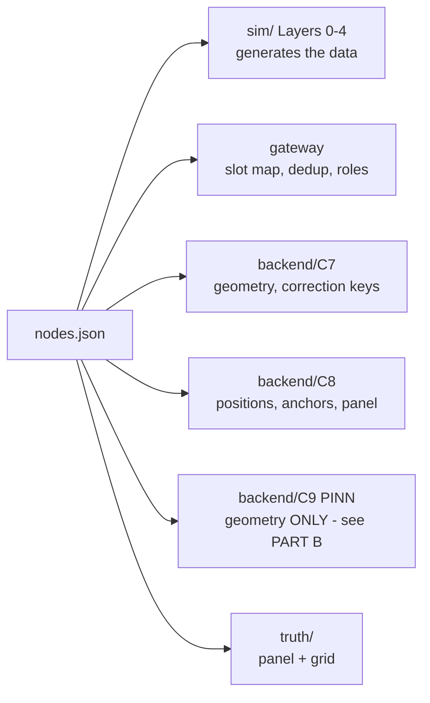
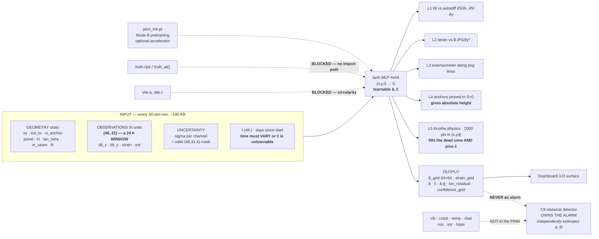

# 03 — `nodes.json` in Full, and the PINN That Reads It

> **This file owns:** the complete `nodes.json` schema — every block, field, type, unit, range and consumer — and the exact contract for the PINN: what it is, what it receives, what it must never receive, how it trains, and how it turns 31 numbers into a 64×64 terrain.
>
> **This file does NOT own:** ground physics derivations (→ 01), radio behaviour (→ 02, which owns the `mesh` block), telemetry files (→ 04), truth storage (→ 05), the alarm (→ 06).
>
> **v2.0 changes:** V4 fixed (anchors and gateway sit outside `grid`); V9 no longer references deleted range constants; the `sim` block loses the hybrid-cadence fields and gains retention/PINN-window fields; **Part B is substantially rewritten** — the PINN trained on a single epoch, which made `ĉ` mathematically unidentifiable.

---

# PART A — `nodes.json`

## 1. What this file is, in one sentence

**`nodes.json` is the only hand-authored description of the world.** Everything else is either generated from it or measured against it. If you can read this file, you know the entire scenario.

### 1.1 Who reads it



### 1.2 The three golden rules

| # | Rule | Why |
|---|---|---|
| 1 | **Nothing time-varying lives here.** | If it changes with `t`, it is telemetry, not registry. |
| 2 | **Random draws are frozen into the file, never re-drawn at runtime.** | Two people on two laptops must get byte-identical data. A bug is then reproducible by emailing a 40 KB JSON, not a 200 MB dataset. |
| 3 | **`a` and `c` are in this file but the PINN must never read them.** | They are the answer key for the physics loss. See §17. |

---

## 2. Top-level structure

```jsonc
{
  "meta":   { ... },   // provenance and version
  "site":   { ... },   // ground physics constants
  "panel":  { ... },   // the extracted rectangle
  "grid":   { ... },   // where output surfaces are drawn
  "mesh":   { ... },   // radio config — OWNED BY FILE 02
  "sim":    { ... },   // cadence, seeds, retention, determinism
  "nodes":  [ ... ]    // exactly 31 entries
}
```

---

## 3. `meta` — provenance

| Field | Type | Example | Meaning | Required |
|---|---|---|---|---|
| `schema_version` | string | `"2.0.0"` | bump on **any** field addition, removal or rename | ✅ |
| `scenario_id` | string | `"sih-demo-40d"` | human name for this scenario | ✅ |
| `author` | string | `"part1"` | who wrote it | ✅ |
| `created_iso` | string | `"2026-09-01T00:00:00Z"` | authoring timestamp | ✅ |
| `start_iso` | string | `"2026-03-01T00:00:00Z"` | UTC instant of `t = 0` | ✅ |
| `duration_days` | float | `40.0` | scenario length | ✅ |
| `generator_sha256` | string | filled at generation | hash of the generator source, so a dataset traces to code | ✅ |
| `notes` | string | free text | never parsed | ❌ |

---

## 4. `site` — ground physics

| Field | Type | Units | Value | Read by | PINN sees it? |
|---|---|---|---|---|---|
| `H` | float | m | 150.0 | surface, PINN | ✅ **fixed** — real mine-plan input |
| `tan_beta` | float | — | 2.0 | surface, PINN | ✅ **fixed** — regional geology constant |
| `m_seam` | float | m | 3.0 | surface, PINN | ✅ **fixed** — known from the mine plan |
| `a` | float | — | 0.65 | **surface only** | ❌ **LEARNED** — this is what the sensors are for |
| `c` | float | /day | 0.01414 | **surface only** | ❌ **LEARNED** |
| `B` | float | m | 24.0 | surface, PINN | ✅ **fixed, must match exactly** |
| `datum_z` | float | m | 0.0 | surface | reference elevation |

**Derived at load, never stored:**

```
r     = H / tan_beta = 75.0 m
S_max = a · m_seam   = 1.95 m       ← sim only; the PINN builds its own from â
```

> ⚠️ **If the simulator and the PINN hold different values of `B`, loss 2 will never converge and it will look like a training bug for a full day.** Import both from `sim/constants.py`.

---

## 5. `panel` and `grid`

### 5.1 `panel`

| Field | Type | Units | Value | Meaning |
|---|---|---|---|---|
| `x1`, `y1`, `x2`, `y2` | float | m | 100, 100, 700, 300 | extracted rectangle corners |
| `t0_day` | float | day | 0.0 | day extraction completed |
| `panel_id` | int | — | 0 | reserved for multi-panel |

**Today `panel` is a single object.** Making it an array and adding `panel_id` to each node is a **data change, not a code change** — the truth basis already carries a `K` axis (file 05). Leave the door open; do not walk through it.

### 5.2 `grid`

| Field | Type | Units | Value | Meaning |
|---|---|---|---|---|
| `x_min`, `x_max` | float | m | 25, 775 | = panel ± `r` |
| `y_min`, `y_max` | float | m | 25, 375 | = panel ± `r` |
| `nx`, `ny` | int | — | 64, 64 | output resolution |

**The grid is not arbitrary.** It is `panel + r` on all four sides, because subsidence extends exactly `r` beyond the panel edge and nothing outside that can move. Derivation in file 02 §2.1.

> ⚠️ **`grid` bounds the *output surface*, not the node set.** Both anchors and the gateway sit at `x = 860`, deliberately outside it — that is the entire point of an anchor. **v1.4's validation V4 asserted every node was inside `grid` and could therefore never pass.** See §10.

---

## 6. `mesh`

**Owned entirely by file 02 §10.** Not repeated here. It contains band, bandwidth, presets, router, superframe timings, escalation policy, ACK mode, retention-adjacent buffer sizes, the link model, and the parent/relay selection weights.

---

## 7. `sim` — cadence, seeds, retention, determinism

| Field | Type | Value | Meaning |
|---|---|---|---|
| `sample_s` | int | 60 | how often a node reads its sensors |
| `transmit_s` | int | 60 | baseline transmission cadence. **Uniform — the v1.4 hybrid 600 s cadence is deleted** |
| `retention_h` | int | **36** | hours held in `nodes.csv` before eviction to archive (file 04 §4.8) |
| `baseline_window_h` | int | 24 | C8 rolling-median window — **this sets `retention_h`'s floor** |
| `pinn_window_h` | int | **24** | how far back the PINN trains. **Without this `ĉ` is unidentifiable** |
| `pinn_window_slices` | int | **48** | 30-minute subsampling of that window |
| `pinn_epoch_s` | int | 1800 | how often the PINN re-fits (30 sim-min) |
| `master_seed` | int | 20260901 | **one** seed; every stream derives from it |
| `rng_streams` | array | see below | named, never shared |
| `chunk_days` | int | 40 | time-axis chunk size for memory management |

```jsonc
"rng_streams": ["weather","cloud","ou_bias","white","shadow","pdr","ack","event_jitter"]
```

> **Rule 5, and chunking depends on it.** Noise arrays are generated for the **full time span** from the master seed and then sliced. A chunked run must be byte-identical to a single run. Chunking without this rule silently corrupts the second half and you will not notice.

> **Deleted in v2.0: `hot_window_s`, `hot_window_pad_h`.** They existed to shrink `nodes.csv` by dropping the routine cadence to 600 s in quiet periods — which directly contradicted file 02's entire duty-cycle derivation and its statement that 600 s is "wildly over-conservative." File size is now controlled by **retention**, which is the right lever, and the cadence stays 60 s everywhere.

---

## 8. `nodes[]` — every field, grouped by purpose

Exactly 31 entries. Grouped by **what the field is for**, which is also the order to author them in.

### 8.1 Identity

| Field | Type | Example | Meaning | Required |
|---|---|---|---|---|
| `id` | int | 17 | stable, 0–30, never reused | ✅ |
| `name` | string | `"T-400-175"` | human label: group-x-y | ✅ |
| `role` | enum | `field` \| `anchor` \| `gateway` | what the node **is for** | ✅ |
| `group` | enum | `transverse` \| `longitudinal` \| `offaxis` \| `anchor` \| `gateway` | which survey construct it belongs to | ✅ |

> `role` and `radio_role` are **different fields**. `role` = purpose. `radio_role` = on-air behaviour. **An anchor can be a relay.**

### 8.2 Geometry

| Field | Type | Units | Range | Meaning | Required |
|---|---|---|---|---|---|
| `x`, `y` | float | m | field nodes inside `grid`; anchors/gateway outside | position | ✅ |
| `z0` | float | m | 0.0 | initial surface elevation | ✅ |
| `has_ext` | bool | — | — | extensometer fitted? | ✅ |
| `ext_to` | [float,float] \| null | m | — | far peg position; `null` if `has_ext` false | ✅ |
| `ext_len_m` | float | m | 10.0 | nominal wire span | if `has_ext` |
| `antenna_h_m` | float | m | 1.5 field, **10.0 gateway** | antenna height | ✅ |

**Validation rule:** `has_ext == (ext_to != null)`. If they disagree the loader must raise, not warn.

### 8.3 Radio — owned by file 02

| Field | Type | Meaning |
|---|---|---|
| `radio_role` | enum | `leaf` \| `relay` \| `direct` \| `gateway` \| `wired` |
| `parent` | int \| null | primary next hop |
| `backup_parent` | int \| null | failover next hop |
| `cluster` | int \| null | 1–5, or null |
| `hop_depth` | int | 1 nominal, 2 in failover |
| `slot` | int | static slot index **0–53** |
| `backup_slot` | int | reserved direct slot **38–53** |

### 8.4 Personality — the frozen random draws

**This is why the 31 nodes are not clones.** Drawn once at authoring time, written into the file, never re-drawn.

| Field | Type | Units | Range | Feeds | Why it exists |
|---|---|---|---|---|---|
| `shade_s` | float | — | 0.30–1.00 | insolation → `T_chip`, `vbat` | a node under a tree runs cooler and charges worse |
| `temp_offset_c` | float | °C | −2.0…+2.0 | `T_chip` | enclosure and mounting differences |
| `k_solar` | float | °C per unit I | 6.0–12.0 | `T_chip` | how much sun heats *this* box |
| `crack_theta_c_ue` | float | µε | 1350–1650 | crack latch | soil differs from spot to spot |
| `bias0_tilt_x` | float | µrad | −10…+10 | OU stage 2 initial value | factory offset |
| `bias0_tilt_y` | float | µrad | −10…+10 | OU stage 2 | |
| `bias0_strain` | float | µε | −2…+2 | OU stage 2 | |
| `bias0_ext` | float | µm | −20…+20 | OU stage 2 | |
| `sigma_scale` | float | — | 0.80–1.30 | multiplies `σ_w` for this node | some units are just noisier |
| `battery_wh` | float | Wh | 8.0–12.0 | SOC integration | cell tolerance and age |
| `panel_w` | float | W | 1.5–2.5 | SOC integration | solar panel rating |
| `shadow_seed` | int | — | any | per-link shadowing draw | freezes this node's RF luck |

### 8.5 Health and schedule

| Field | Type | Meaning |
|---|---|---|
| `install_day` | float | day this node came online (0.0 for all today) |
| `firmware_version` | string | `"2.0.0"` |
| `enabled` | bool | **authored** kill switch. Distinct from runtime `alive`, which lives in telemetry |

### 8.6 A complete node entry, for copy-paste

```jsonc
{
  "id": 17,
  "name": "T-400-175",
  "role": "field",
  "group": "transverse",

  "x": 400.0, "y": 175.0, "z0": 0.0,
  "has_ext": true,
  "ext_to": [400.0, 165.0],
  "ext_len_m": 10.0,
  "antenna_h_m": 1.5,

  "radio_role": "leaf",
  "parent": 9,
  "backup_parent": 21,
  "cluster": 2,
  "hop_depth": 1,
  "slot": 7,            // C2 owns 6-11.  v1.4's example said 5, which is C1's block.
  "backup_slot": 41,    // backup slots are now 38-53, not 32-71

  "shade_s": 0.82,
  "temp_offset_c": -0.41,
  "k_solar": 9.3,
  "crack_theta_c_ue": 1487.0,
  "bias0_tilt_x": 3.1,
  "bias0_tilt_y": -6.4,
  "bias0_strain": 0.7,
  "bias0_ext": -11.2,
  "sigma_scale": 1.06,
  "battery_wh": 10.4,
  "panel_w": 2.1,
  "shadow_seed": 918273,

  "install_day": 0.0,
  "firmware_version": "2.0.0",
  "enabled": true
}
```

---

## 9. What `nodes.json` must NOT contain

| Excluded | Why | Where it lives instead |
|---|---|---|
| Any time-varying value | it is telemetry, not registry | `nodes.csv` |
| Runtime `alive` | changes every cycle | `nodes.csv` |
| `alert_sent`, siren state | alerts are **actions**, not measurements; adding them breaks the sim/backend seam | nowhere in the file set |
| Any truth field | quarantine | `truth.npz`, and only there |
| Event schedules | events are their own file so the detector can open them separately | `events.csv` |
| `reliable_range_m` | **deleted in v2.0** — it was a second source of truth that contradicted the link model by 6× | derived at load from `mesh` link constants |

---

## 10. Load-time validation — 12 assertions

Run these before anything else. Every one has caught a real bug in a comparable system.

| # | Assertion |
|---|---|
| V1 | Exactly 31 entries; `id` values are 0–30 with no gaps or repeats |
| V2 | Exactly 2 nodes with `role == "anchor"`, exactly 1 with `role == "gateway"` |
| V3 | Every anchor is more than `r` metres outside the panel rectangle |
| **V4** | **Every `role == "field"` node lies inside `grid`; every anchor and the gateway lies OUTSIDE the influence rectangle.** *v1.4 asserted all 31 were inside `grid`, which all three x=860 nodes violate — the check could never pass* |
| V5 | `has_ext == (ext_to != null)` for every node |
| V6 | No two nodes share a `slot`; no two share a `backup_slot`; every `slot` ∈ [0,53] |
| V7 | Every `parent` and `backup_parent` refers to an existing `id` with `radio_role == "relay"` or `"gateway"` |
| V8 | No parent cycles (following `parent` always terminates at the gateway) |
| **V9** | **Every hop distance is within the range *derived* from the `mesh` link model** — leaf→relay at SF7/ground clutter, relay→gateway at SF8/masted clutter. *v1.4 compared against the deleted `reliable_range_m` constants* |
| V10 | Every personality value lies inside its declared range |
| V11 | `schema_version` matches what the loader expects |
| V12 | `sum(cluster sizes) + directs + wired + gateway == 31`; every cluster size ≤ `k_max = 6` |

---

# PART B — The PINN

## 11. What the PINN actually is — read this before anything else

### 11.1 The mental model that is wrong

Most machine learning looks like this: gather a big dataset, train once, get a model, freeze it, deploy it, and from then on the model *predicts* things it has never seen. Train/test split, generalisation, a final artefact.

**That is not what this is, and expecting it will make everything downstream confusing.**

### 11.2 The mental model that is right

**The PINN is not a predictor. It is a fitter.**

Its 13 000 weights *are* the ground surface at this moment. They are storage, not learned knowledge. It is much closer to a curve fit than to a classifier — the only reason it is a neural network rather than a polynomial is that a network gives you **exact second derivatives by autograd**, which is what the strain channel needs and what a scattered-point interpolator cannot supply.

| | Ordinary ML model | **Our PINN** |
|---|---|---|
| What the weights hold | general knowledge about a domain | **one surface, right now** |
| Trained on | a large historical dataset | **the last 24 hours of this mine's sensors** |
| Generalises to | unseen inputs | **nothing — there is nothing to generalise to** |
| Train/test split | essential | **meaningless here** |
| Frozen after training? | yes | **no — it re-fits every 30 sim-minutes, forever** |
| Analogy | learning to recognise cats | **drawing the smooth curve through today's dots** |

> **ELI5.** Give a child 31 dots on a page and say "draw the dish these dots sit on." They could draw anything. Now add: "it must be a smooth bowl, deepest in the middle, flat at the edges, and it must look like the ones geology produces." Suddenly 31 dots is plenty. That extra sentence is the physics loss, and it is worth hundreds of sensors.

### 11.3 Why it re-fits instead of freezing

Between one 30-minute epoch and the next, the ground moved about **0.02 mm**. The surface barely changed. So the previous epoch's weights are already a near-perfect answer, and the fit **warm-starts from them** — roughly 400 Adam steps instead of the several thousand a cold start needs.

Freezing the weights would mean freezing the surface, which means the dashboard stops updating. There is no version of "final model" that makes sense for an object whose entire job is to track something that changes.

### 11.4 But your pretraining idea is real — and it is the right optional accelerator

There *is* a legitimate "train it many times first" step, and it is worth building if there is time.

| Mode | What it is | When it runs | Do we ship it? |
|---|---|---|---|
| **A — continuous re-fit** | warm-started fit every 30 sim-min, on the last 24 h of data | live, forever | ✅ **yes, this is the system** |
| **B — physics pretraining** | offline, train on synthetic Knothe bowls spanning `a ∈ [0.4, 0.9]`, `c ∈ [0.005, 0.03]`, all times, no sensor data at all. Save the weights as `pinn_init.pt` | once, at build time | ⬜ optional, do it if time allows |

Mode B is what "training multiple times before making it a final model" correctly means here. It does not produce a model that answers questions — it produces a **good initialisation**, a network that already knows the *shape family* before it ever sees a sensor. First-epoch convergence drops from ~2000 steps to ~80.

**It changes no contract.** Mode B never sees `nodes.json`'s true `a` or `c` — it sees a *range* of them, which is exactly the physics prior stated once, offline, instead of every epoch. And it never sees `truth.npz`.

> **On stage:** *"We pretrain on the family of shapes geology permits, and then at each timestep we fit the specific member of that family the sensors are actually describing."* That is a clean, honest, and technically precise sentence.

### 11.5 The one thing that was mathematically broken in v1.4

v1.4 said the PINN receives *"the C7 dict"* for one epoch and trains on that. **That cannot work, and the reason is not subtle.**

```
S(x,y,t) = â · m_seam · P(x) · Q(y) · (1 − e^(−ĉ·t))
                                       └──── g(t) ────┘
```

At a single value of `t`, `g(t)` is one scalar. So the data only ever sees the product `â · g(t)` — **one number.** You cannot separate a factor from a time constant when you have one sample of time. `â` and `ĉ` are **not separately identifiable from a single time slice**, and v1.4's test T19 (`c_hat` within 25%) would have failed every run. The `t` input to the network would have been dead weight, and `∂S/∂t` completely unconstrained.

**The fix: train over a window of time, not an instant.**

```
training window   = last 24 h
subsampled to     = 48 slices, one every 30 min
observations      = 48 × 31 = 1488 points   (was 31)
collocation points= 2000, sampled uniformly in (x, y, t) across the SAME window
```

Is 24 h enough spread? Check it against the noise:

```
at t = 20 d:   g(20) = 0.2464,  g(21) = 0.2568       →  Δg = 0.0104
peak strain:   12 649 × 0.0104 = 132 µε of change across the window
σ_strain    ≈  1.4 µε
                                    →  94σ of signal.  Comfortably identifiable.
```

Over 30 minutes it would have been ~3σ — marginal, which is why v1.4's design would have limped rather than failed loudly.

**Cost of the fix: 1488 forward passes instead of 31.** Trivial. Test **T36** asserts the window spans ≥ 12 h of distinct `t`.

### 11.6 Report `â·ĝ` as the headline, `â` and `ĉ` separately with honest bands

Even with a 24 h window, early in the run `â` and `ĉ` remain **correlated** — a slightly larger factor with a slightly slower time constant looks almost the same over one day. They separate as the run lengthens and `g` traverses more of its curve.

So the dashboard should show:

| Quantity | Determined | Show as |
|---|---|---|
| `â · ĝ(t)` — current subsidence amplitude | **immediately, tightly** | the headline number |
| `â` — subsidence factor | slowly, tightening over the run | value + confidence band that **visibly narrows** |
| `ĉ` — time constant | slowest | value + band |

**That widening-then-narrowing band is a feature, not an embarrassment.** It is a live, honest picture of a system learning, and it is far more persuasive than a single confident number that was never uncertain.

---

## 12. What the PINN receives

### 12.1 Static, loaded once from `nodes.json`

| Name | Shape | dtype | Units | Source field |
|---|---|---|---|---|
| `xy` | (31, 2) | f32 | m | `nodes[].x`, `nodes[].y` |
| `ext_to` | (31, 2) | f32 | m | `nodes[].ext_to`, NaN where absent |
| `has_ext` | (31,) | bool | — | `nodes[].has_ext` |
| `is_anchor` | (31,) | bool | — | `nodes[].role == "anchor"` |
| `panel` | (4,) | f32 | m | `panel.x1, y1, x2, y2` |
| `H`, `tan_beta`, `m_seam`, `B` | scalars | f32 | m, —, m, m | `site.*` |
| `grid_x`, `grid_y` | (64,) each | f32 | m | `grid.*` |

### 12.2 Per epoch — **a window, not an instant**

Every 30 simulated minutes, C7 hands over the **last 48 half-hourly slices**:

| Name | Shape | Units | Produced by |
|---|---|---|---|
| `t` | **(48,)** | days since `start_iso` | epoch counter |
| `obs_tilt_x`, `obs_tilt_y` | **(48, 31)** | **radians** | C7 step 5 |
| `obs_strain` | **(48, 31)** | **dimensionless** | C7 step 5 |
| `obs_ext` | **(48, 31)** | **metres** | C7 step 5 |
| `sigma_tilt_x`, `sigma_tilt_y` | (48, 31) | rad | C7 step 7b |
| `sigma_strain`, `sigma_ext` | (48, 31) | —, m | C7 step 7b |
| `valid` | **(48, 31, 4)** | bool | C7 step 8 |

Total payload ≈ **190 KB per epoch** (was 4 KB for a single slice). Still nothing.

**Unit conversions C7 performs. The ML owner never does these:**

| Wire | → SI | Factor |
|---|---|---|
| `tilt_x`, `tilt_y` (2 µrad LSB) | radians | `× 2e-6` |
| `strain_ue` | dimensionless | `× 1e-6` |
| `ext_delta_10um` | metres | `× 1e-5` |
| `temp_dc` | °C | `× 0.1` — **consumed by C7, not forwarded** |

> **`valid`'s last axis is 4, not 1.** A node can send a good tilt and a garbage strain in the same packet. Masking per node throws away good data. Channel order is `[tilt_x, tilt_y, strain, ext]` and it never changes.

---

## 13. What the PINN must NEVER receive

| Withheld | Why |
|---|---|
| `truth.npz` / `truth_at()`, any part | it is the answer key. One import and the system becomes a playback device that still looks like it works |
| `site.a`, `site.c` | **the circularity trap — §17.** These are what the sensors are for |
| `vib_rms`, `vib_peak`, `vib_fdom` | transients do not constrain a surface that moves over days → these go to C8 |
| `status_flags` / crack bits | derived from strain; feeding them double-counts the same evidence → C8 |
| `temp_dc` | already consumed at C7 step 4; pass it again and the net re-learns a correction already applied |
| `vbat_mv` | already consumed at C7 step 3 |
| `rssi`, `snr`, `hops`, `parent_id` | link quality is not ground physics. It belongs in **σ**, not in the network |
| Raw uncorrected values | the net will fit thermal drift and confidently call it subsidence |

> **The one-line rule:** the PINN sees **geometry, corrected physics, and honesty about uncertainty**. Nothing else.

---

## 14. The network

| Property | Value | Why this and not something else |
|---|---|---|
| Input | `(x, y, t)`, each normalised to ≈ [−1, 1] | it is a coordinate MLP; normalisation is not optional for PINNs |
| Output | `S`, scalar, metres, **down positive** | one surface, one number |
| Shape | 4 hidden layers × 64 units ≈ 13 k params | tiny; trains on a CPU in seconds |
| Activation | **`tanh`** | you need `∂²S/∂y²`. **ReLU's second derivative is zero everywhere and the strain loss silently dies** — no error, just a loss that never moves. Test T35 |
| Derivatives | autograd on the net's own output | exact, not finite-differenced |
| Optimiser | Adam, ~400 steps per epoch (~80 with Mode B init) | |
| Warm start | **always**, from the previous epoch's weights | the surface barely moved in 30 minutes |
| Learnable extras | `â` (init 0.5), `ĉ` (init 0.008) | §17 |

---

## 15. The five losses

| # | Loss | Compares | Weight | Evaluated at | What it constrains |
|---|---|---|---|---|---|
| 1 | **Tilt** | net `∂S/∂x`, `∂S/∂y` vs `obs_tilt_x/y` | `1/σ²` | 31 positions × 48 times | local slope |
| 2 | **Strain** | net `B·∂²S/∂y²` vs `obs_strain` | `1/σ²` | 31 × 48 | local curvature |
| 3 | **Extensometer** | net's implied peg-to-peg length change vs `obs_ext` | `1/σ²` | node → `ext_to` lines × 48 | integrated movement |
| 4 | **Anchor** | net `S` vs `0` | high, fixed | the 2 anchors × 48 | **absolute height** |
| 5 | **Physics** | net `S` vs the Knothe form built from `â`, `ĉ` | moderate | **2000 points resampled in (x, y, t) every epoch** | global shape **and the time constant** |

### 15.1 Loss 4 does enormous work for one line

Losses 1–3 constrain **shape only**. None of them constrains **height**. Without anchors you get a perfectly shaped bowl floating at an arbitrary depth — the mathematics genuinely cannot distinguish 5 mm from 5 m, because tilt and strain are derivatives and derivatives lose the constant.

**Anchors convert relative shape into absolute millimetres.** One loss term, two nodes, and the entire output becomes meaningful. Test T34 proves it by turning the term off and watching the surface drift.

### 15.2 Loss 5 fills the dead zone — and now also pins time

Where a Kill Cluster removed six nodes, losses 1–3 contribute **nothing** in that region and loss 4 is far away. Loss 5 is still fully present, and it says: *whatever is here must be a smooth Knothe bowl consistent with the edges.*

**That is a defensible reconstruction, not a guess** — and it is the answer to the question judges will ask the moment you press the button.

**New in v2.0:** because the 2000 collocation points now sample `t` across the 24 h window as well as `(x, y)`, loss 5 also constrains the *rate* of deepening. That is what makes `ĉ` learnable rather than decorative.

---

## 16. One epoch, walked through end to end

This is the loop, in the order to write it.

```
ONCE, at startup
 1. Load nodes.json. Run V1-V12.
 2. Build static tensors: xy, ext_to, is_anchor, panel, H, tan_beta, m_seam, B, grid_x, grid_y.
 3. Initialise the MLP — from pinn_init.pt if Mode B was run, else Xavier.
    Initialise â = 0.5, ĉ = 0.008 as learnable scalars.
 4. Precompute normalisation ranges from `grid` and `duration_days`.

EVERY PINN EPOCH (30 simulated minutes)
 5. Receive the C7 window: t (48,), obs_* (48,31), sigma_* (48,31), valid (48,31,4).
 6. Warm-start: keep last epoch's weights, â, ĉ. Do NOT reinitialise.
 7. Sample 2000 fresh collocation points uniformly in (x, y, t) across the window.
 8. For ~400 Adam steps:
      a. forward pass at the 31 node positions × 48 times      -> S_nodes (48,31)
      b. autograd -> dS/dx, dS/dy, d2S/dy2 at those points
      c. loss1 = Σ valid[...,0:2] · (net_tilt − obs_tilt)² / σ_tilt²
      d. loss2 = Σ valid[...,2]   · (B·net_curv − obs_strain)² / σ_strain²
      e. loss3 = Σ valid[...,3]   · (net_extΔ − obs_ext)²      / σ_ext²
      f. loss4 = Σ_anchors,times  net_S²                        × high weight
      g. loss5 = Σ_2000 ( net_S − Knothe(x,y,t; â, ĉ) )²        × moderate weight
      h. backprop through weights AND â, ĉ
 9. Evaluate the trained net on the 64×64 grid at t_now       -> S_grid.
10. Autograd on the grid -> tilt_x_grid, tilt_y_grid, strain_grid.
11. Leave-one-out: for each node i, estimate the residual it would have had
    if it had been held out                                   -> loo_residual[i].
12. Emit outputs. Store weights for the next warm start.
```

### 16.1 Cost control for step 11

Full LOO is 31 retrains and is too slow at demo speed. **Use a cheap approximation:** train once with all nodes, then for each node compute the residual it would have had under a single-step influence-function correction. Full LOO runs **only** on the frames you show — after a Kill Cluster and at the final frame. **Say which one you did.**

---

## 17. The circularity trap — the single most important section

Loss 5 says "S must obey the Knothe form."

**If you hand the network the true `a` and `c` from `nodes.json`, loss 5 alone fully determines the answer.** The network reconstructs a perfect surface **without reading a single sensor**, and your demo becomes an elaborate way of re-plotting a formula you typed in yourself.

**It will look like it works.** That is what makes it dangerous.

| Parameter | Fixed or learned | Init | True value | Why |
|---|---|---|---|---|
| `x1, y1, x2, y2` | **fixed** | true | — | the mine plan is a genuinely known input |
| `H` | **fixed** | true | 150 m | known from the mine plan |
| `tan_beta` | **fixed** | true | 2.0 | regional geology constant |
| `B` | **fixed** | true | 24.0 m | derived from `r`, must match the simulator |
| `a` subsidence factor | **LEARNED** | 0.5 | 0.65 | **this is what the sensors are for** |
| `c` time constant | **LEARNED** | 0.008 | 0.01414 | ditto — and see §11.5, it needs a time window to be learnable at all |

Now loss 5 constrains only the **family** of shapes, and the sensors must pick which member is real.

> **Bonus deliverable:** the converged values are themselves a result. Put *"estimated subsidence factor: 0.63 ± 0.04"* on the dashboard next to the true 0.65. That single line proves the network learned something rather than replaying it.
>
> **And there is a free cross-check nobody has mentioned:** C8's step-2 bowl fit (file 06) independently estimates `a_fit` by classical Levenberg–Marquardt, from the same sensors, with no neural network involved. **Two independent estimators of the same physical parameter agreeing is much stronger evidence than either one alone** — and if they diverge, something is wrong and you want to know.

---

## 18. What the PINN produces

| Name | Shape | Units | Goes to | Cadence |
|---|---|---|---|---|
| `S_grid` | (64, 64) | m, down positive | 3-D dashboard surface | 30 min |
| `tilt_x_grid`, `tilt_y_grid` | (64, 64) | rad | contour overlay | 30 min |
| `strain_grid` | (64, 64) | — | tension heat-map | 30 min |
| `a_hat`, `c_hat`, **`a_hat·g_hat(t)`** | scalars | —, /day, m | "estimated parameters" panel | 30 min |
| `loo_residual` | (31,) | per-channel σ | **the live accuracy number** | 30 min |
| `confidence_grid` | (64, 64) | — | coverage zoning overlay | 30 min |
| `weights` | — | — | warm start for the next epoch | 30 min |

### 18.1 Why `loo_residual` is the most valuable output

Hide node 17, reconstruct from the other 30, predict what 17 *should* read, compare to what it did.

**It needs no ground truth.** Which means it is the **only accuracy metric that survives into a real deployment**, where there is no `truth.npz` and never will be. Every other team's accuracy number dies the moment they leave the simulator.

Put it on the dashboard, live, as a number that visibly widens when you press Kill Cluster. **That honesty is more persuasive than a smaller error bar.**

### 18.2 `confidence_grid`

Per grid cell, interpolate `loo_residual` weighted by distance to each contributing live node. Cells far from any live node get a wide band. Render as transparency or hatching on the 3-D surface, so the judge can literally **see where the model is guessing** — including inside the 358 m blind spot from file 02 §2.7.

---

## 19. The rule that makes an AI component acceptable in a safety system

> ## **The PINN draws. It never decides.**

Alarms are owned entirely by C8 — classical bowl fit plus blast-log cross-check (file 06). **C8 never reads C9's output.** Routing a learned surface into a safety decision, even indirectly, would launder a neural network into the alarm path through the back door.

No language model anywhere in the safety loop.

---

## 20. The handoff flowchart



---

## 21. Gates this file owns

| Test | Asserts |
|---|---|
| **V1–V12** | the `nodes.json` load-time validations in §10 |
| **T32** | grepping `backend/C9/` finds no reference to `site.a`, `site.c`, `S_MAX`, `C_KNOTHE`, or anything under `truth/` |
| **T33** | after 40 simulated days, `â·ĝ(t)` is within 10% of truth, `â` within 15% of 0.65, `ĉ` within 25% of 0.01414 |
| **T34** | with the anchor loss disabled, `S_grid` mean offset drifts by more than 10 cm — proving loss 4 does the work claimed for it |
| **T35** | switching the activation to ReLU makes the strain loss constant — proving the `tanh` requirement is real, not folklore |
| **T36** | the training window spans ≥ 12 h of distinct `t` values. **Without this `ĉ` is unidentifiable and T33 cannot pass** |

**T34, T35 and T36 are worth writing** because they turn three design claims into **demonstrated** facts, and a judge can watch you run them. T36 in particular is the test that would have caught the v1.4 design flaw in five minutes.
