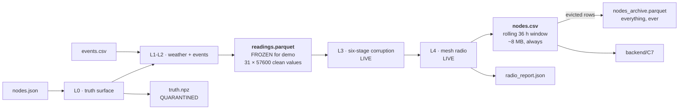

# 04 — `nodes.csv` and `events.csv`: The Wire, The Log, The Retention Model, and The Script

> **This file owns:** the exact **23-byte** packet layout, the exact `nodes.csv` columns, **how the file stays a fixed size forever**, how the mesh writes each row, the `readings.parquet` intermediate, and the complete `events.csv` schema.
>
> **This file does NOT own:** why the values have those magnitudes (→ 01), why the mesh behaves that way (→ 02), the registry (→ 03), truth (→ 05), correction and alarming (→ 06).
>
> **v2.0 changes:** the packet is **23 bytes**, because without `epoch_lo` store-and-forward silently corrupts every replayed row; `nodes.csv` becomes a **bounded rolling window** with a parquet archive; the hybrid 600 s cadence is **deleted** because it contradicted file 02 and the retention model replaces it.

---

## 1. Naming decision, stated once

The event script is **`events.csv`, not `events.json`.**

| Reason | Detail |
|---|---|
| It is a table | one row per event, fixed columns. JSON would be a list of near-identical dicts |
| A judge can open it | double-click, it opens in Excel. That matters during a demo |
| It mirrors the real artefact | the DGMS blast register at a real mine **is a table**. Our file has the same shape as the thing it will be replaced by |
| The detector opens it separately | C8 reads it as an independent evidence source, not as part of telemetry |

---

## 2. The four data artefacts and how they differ

| Artefact | Layer | What it is | Who reads it | Frozen for the demo? |
|---|---|---|---|---|
| `readings.parquet` | end of **Layer 2** | every node's clean value at every 60 s epoch, **before** the radio exists | the simulator's Layer 3 | ✅ **yes** — this is the demo freeze point |
| **`nodes.csv`** | end of **Layer 4** | **the last 36 hours** of what actually arrived at the gateway | `backend/C7` only | ❌ no — regenerated live |
| **`nodes_archive.parquet`** | end of Layer 4 | everything that ever arrived, compressed | `scripts/score.py`, forensics | ❌ no |
| `truth.npz` | Layer 0 | the answer key | `scripts/score.py` only, after the demo | ✅ frozen, and quarantined (file 05) |



**Why freeze at Layer 2 and not later.** Freezing there means Kill Cluster, blast injection and radio degradation all remain **genuinely live overlays** a judge can trigger, while the 40 days of ground physics — the slow, boring, expensive part — is precomputed. It also resolves the demo clock problem: at 14 400× speedup, 30 sim-minutes is 0.125 real seconds and a PINN refit takes 1–3 seconds. Precompute the baseline reconstructions; trigger a **real live refit only after a Kill Cluster or blast**. Judges then watch a genuine refit at exactly the moment it matters.

---

## 3. The 23-byte packet — exact byte map

This is what physically travels over the air. **23 bytes, not 21.** Everything about the cadence descends from this number.

| Offset | Bytes | Field | Type | Encoding | Decoded range |
|---|---|---|---|---|---|
| 0 | 1 | `node_id` | uint8 | as-is | 0–255 |
| 1 | 2 | `seq` | uint16 LE | as-is | 0–65535 |
| **3** | **2** | **`epoch_lo`** | **uint16 LE** | **`epoch mod 65536`** | **see §3.1 — NEW in v2.0** |
| 5 | 2 | `tilt_x` | int16 LE | × 2 µrad | ±3.75° |
| 7 | 2 | `tilt_y` | int16 LE | × 2 µrad | ±3.75° |
| 9 | 2 | `strain_ue` | int16 LE | × 1 µε | ±32 767 µε |
| 11 | 2 | `ext_delta_10um` | int16 LE | × 10 µm | ±327.6 mm |
| 13 | 2 | `temp_dc` | int16 LE | × 0.1 °C | −3276 → +3276 °C |
| 15 | 2 | `vbat_mv` | uint16 LE | × 1 mV | 0–65 535 mV |
| 17 | 1 | `status_flags` | uint8 | bitfield, §3.2 | — |
| 18 | 2 | `vib_rms_x100` | uint16 LE | × 0.01 mm/s | 0–655 mm/s |
| 20 | 2 | `vib_peak_x100` | uint16 LE | × 0.01 mm/s | 0–655 mm/s |
| 22 | 1 | `vib_fdom_hz` | uint8 | × 1 Hz | 0–255 Hz |
| | **23** | **TOTAL** | | | |

### 3.1 Why `epoch_lo` exists — the bug that broke store-and-forward

**In v1.4 `epoch` was not on the wire at all.** It came from the beacon, and the gateway stamped each arriving frame with the epoch it was currently in. That is correct for live traffic and **completely wrong for everything else.**

> A node buffers frames for up to 72 hours during a gateway outage (file 02 §9.3). When the gateway returns and the node replays 4320 frames, every single one arrives *now*. Under v1.4 the gateway would stamp all 4320 with the current epoch — **4320 upsert collisions on one key, 4319 rows silently overwritten, and every recovered reading assigned a sample time up to three days wrong.**
>
> **Test T11 asserts a relay death loses zero rows. It would have passed. Test T31 is the one that catches this**, and it did not exist.

**The fix, and why it is free.** Put `epoch mod 65536` in the packet. The gateway knows the current epoch and reconstructs the full uint32 by choosing the value congruent to `epoch_lo` nearest to now. Unambiguous as long as the replay horizon is under 32 768 epochs (22.7 days); ours is 4320 (3 days). **Margin 7.6×.**

The cost:

```
21 B app + 16 B Meshtastic header = 37 B on air  →  SF7/125  =  90.4 ms
23 B app + 16 B Meshtastic header = 39 B on air  →  SF7/125  =  90.4 ms
```

**Identical**, because the two extra bytes do not push the frame across a LoRa symbol boundary. A correctness fix for exactly zero airtime. Check for these; they are common and they are free.

### 3.2 `status_flags` — the elegant part

`crack_flags` used a uint8 and needed only 2 bits. Six were free. Rename it `status_flags` and fill them. **No airtime cost. No duty-cycle change.**

| Bit | Name | Meaning | Fixes |
|---|---|---|---|
| 0–1 | `CRACK_LEVEL` | 0–3, existing | — |
| 2 | `SELFTEST_OK` | 1 = sensors passed a liveness check this slot | **Gap 2** |
| 3 | `LAST_GASP` | 1 = node detected impact/freefall; this is its final packet | **Gap 3** |
| 4 | `REBOOT` | 1 = first packet since a restart; `seq` continuity is broken | **Gap 1** |
| 5 | `EXT_PRESENT` | 1 = this node has an extensometer (redundant with `nodes.json`, but self-describing on the wire) | — |
| 6 | `DEGRADED` | 1 = this node's cluster is in relay failover or escalation trade, cadence reduced | file 02 §3.6, §4.3 |
| 7 | `REPLAY` | 1 = this frame came from the buffer, not from this cycle | **helps the radio report separate delayed from live** |

### 3.3 Why those bits exist — the failures they prevent

**Gap 1 — sample time vs arrival time.** `t_iso` is *arrival at the gateway*. The node's own sample time comes from `epoch`. Before `epoch_lo` existed this was inferred from `seq`, which worked right up until a node rebooted and `seq` reset to zero — after which every timestamp for that node was wrong, silently, forever. Brownouts on solar nodes are common.
**Fix:** persist `seq` in ESP32 NVS across reboots, **carry `epoch_lo` on the wire**, and raise `REBOOT` on the first packet after restart so C7 can distinguish "counter jumped" from "packets lost."

**Gap 2 — a stuck sensor looks exactly like perfectly stable ground.** A dead ADC returns a constant. Constant tilt and constant strain is precisely what "nothing is happening" looks like. The system would report a healthy, quiet panel from a node that has been dead for two weeks.
**This is the most dangerous failure in the whole design, because it fails *safe-looking*.**
**Fix:** `SELFTEST_OK`, set by the node from an MPU9250 `WHO_AM_I` readback plus a variance check that the last 10 samples are not bit-identical. Test T43.

**Gap 3 — no last-gasp marker.** A node about to be destroyed fires one final reading with a wild value. With no marker it arrives looking like an ordinary sample containing an outlier — and gets thrown out by the very filter designed to reject bumps.
**Fix:** `LAST_GASP`. C7 routes those packets **past** the outlier filter and straight to C8 with a distinct σ.

---

## 4. `nodes.csv` — the arrival log, and why it stops growing

### 4.1 What it is

**One row per node per successfully delivered epoch, for the last `retention_h` hours.** It is the gateway's live working set. It is the **only** file `backend/` reads for measurements.

> **Critical semantic: a missing row is not a zero. A missing row means "this node's data did not arrive."** Never fill gaps with zeros, means, or interpolation at write time. The absence itself is evidence — file 02 §9.1.

### 4.2 Complete column list

| # | Column | Type | Units | Source | Meaning |
|---|---|---|---|---|---|
| 1 | `t_iso` | string ISO8601 | UTC | gateway clock | **arrival** time. Provenance only |
| 2 | `epoch` | **uint32** | 60 s index | packet `epoch_lo` + gateway reconstruction | **the identity key.** Sample time = `start_iso + epoch × 60 s` |
| 3 | `node_id` | uint8 | — | packet | matches `nodes[].id` |
| 4 | `seq` | uint16 | — | packet | frames produced by this node. **Gaps = loss** |
| 5 | `parent_id` | uint8 | — | gateway slot map | who forwarded it |
| 6 | `hops` | uint8 | — | frame header | 1 = direct, 2 = via relay, 3 = failover chain |
| 7 | `rssi_dbm` | int16 | dBm | gateway PHY | last-hop signal strength |
| 8 | `snr_db` | float32 | dB | gateway PHY | last-hop signal-to-noise |
| 9 | `alive` | uint8 | 0/1 | gateway | 1 if this node has been heard within 3 cycles |
| 10 | `tilt_x` | int16 | 2 µrad LSB | packet | raw, **uncorrected** |
| 11 | `tilt_y` | int16 | 2 µrad LSB | packet | raw |
| 12 | `strain_ue` | int16 | µε | packet | raw |
| 13 | `ext_delta_10um` | int16 | 10 µm | packet | raw |
| 14 | `temp_dc` | int16 | 0.1 °C | packet | **correction key** |
| 15 | `vbat_mv` | uint16 | mV | packet | **correction key** |
| 16 | `status_flags` | uint8 | bitfield | packet | §3.2 |
| 17 | `vib_rms_x100` | uint16 | 0.01 mm/s | packet | |
| 18 | `vib_peak_x100` | uint16 | 0.01 mm/s | packet | |
| 19 | `vib_fdom_hz` | uint8 | Hz | packet | the discriminator |

**19 columns. Nothing else.** Not because 19 is special, but because every additional column is a place where the sim and the backend can drift apart.

### 4.3 What is deliberately NOT a column

| Not present | Why | Where it lives |
|---|---|---|
| Corrected SI values | C7's job. Storing them here would make the raw values un-auditable | C7 output, in memory |
| `sigma_*` | computed by C7 from these columns plus `nodes.json` | C7 output |
| `alert_sent`, siren state | alerts are **actions**, not measurements. Adding a column here quietly breaks the sim/backend seam | nowhere in the file set |
| `x`, `y` | static; joining on `node_id` against `nodes.json` is free | `nodes.json` |
| `S`, subsidence | that is truth. It is not measurable by a node | `truth.npz` |
| `cluster`, `radio_role` | static | `nodes.json` |

### 4.4 Ordering and the two rules people get wrong

**Rule 1: order by `(node_id, epoch)`, never by `t_iso`.**
Replayed buffer frames arrive after live ones, so epoch 3400 can land before epoch 3390. `t_iso` is arrival time — provenance only. **The gap between `t_iso` and `epoch × 60 s` is the mesh latency measurement**, and it belongs on the radio report card.

**Rule 2: the identity key is `(node_id, epoch)`, never `(node_id, seq)`.**
`seq` resets to zero on reboot, so a rebooted node's frame 5 would collide with its pre-reboot frame 5, and the upsert would silently overwrite good data with unrelated good data. No error, no gap, wrong numbers.

> **`seq` measures loss. `epoch` establishes identity.** Keep both.
>
> **Corollary:** `seq` increments **once per frame produced**, never per transmission. Retransmitting frame 1152 sends frame 1152 again, bit for bit. A retry is not a new frame.

### 4.5 How a row is written — the exact path

```
1  Layer 3 produces a corrupted 23-byte frame for node i at epoch e.
2  Node i buffers it as (epoch=e, seq=s), with epoch_lo = e mod 65536 IN THE FRAME.
      IMMUTABLE from this moment.
3  Layer 4 leaf slot: compute link margin to parent -> draw PDR.
      delivered?  -> relay holds it
      not?        -> node keeps the buffer, retries in its cluster's retry sub-slot
4  Relay checks its 64-entry (node_id, epoch) dedup ring.
      already seen? -> set its ACK bit anyway (so the child stops retrying)
                       but DO NOT aggregate
      new?          -> set the ACK bit and add to the aggregate
5  Relay slot: concatenate 5-6 frames -> one packet -> next hop.
      failed? -> the ENTIRE aggregate buffers. Six nodes lost, not one.
6  Gateway receives. Measures rssi_dbm, snr_db, hops from the PHY.
      Reconstructs full uint32 epoch from epoch_lo, nearest-congruent to now.
      Looks up parent_id from the slot map. Sets alive = 1 for this node_id.
7  Gateway upserts:
      INSERT INTO readings (node_id, epoch, ...) VALUES (...)
      ON CONFLICT (node_id, epoch) DO UPDATE SET ...
8  Row appended to nodes.csv.
9  RETENTION SWEEP: rows with epoch < (now - retention_epochs) are moved
      to nodes_archive.parquet and deleted from nodes.csv.
```

**Step 7 is what makes duplicates harmless by construction rather than by vigilance** — the only kind of harmless worth relying on. **Step 9 is what makes the file size a constant.**

### 4.6 The five sources of duplicates

| # | Source | Frequency | Deliberate? |
|---|---|---|---|
| D1 | Relay got the frame, the ACK bitmap didn't reach the leaf, leaf retried | ~1 in 100 | no |
| D2 | Event-plane flood — gateway hears one alert via 3 paths | every alert | **yes, by design** |
| D3 | Store-and-forward replay of frames that did land | after every outage | no |
| D4 | Leaf reporting to two parents during re-election | rare, ≤ 3 cycles | no |
| D5 | Node reboots, `seq` resets | rare | no |

**D2 is different — count it, don't just drop it.** Key alerts on `(node_id, epoch, alert_id)`, keep the **first arrival time** as the latency measurement, and **count the copies**. Three copies means three independent paths carried the alert — the mesh is healthy. One copy means it arrived by a single route and you nearly missed it. **A free measurement of network redundancy, taken exactly when it matters most.**

### 4.7 The problem v1.4 had, stated plainly

```
31 nodes × 40 days @ 60 s, PDR 0.99  =  1.77 M rows  =  ~200 MB
```

Too big to hand around, too big to open, and **it grows without limit** — a 90-day deployment is 450 MB, a year is 1.8 GB.

v1.4's fix was to drop the routine cadence to 600 s outside "hot windows," giving 245 k rows and 27 MB. **That fix was wrong**, for two reasons:

1. **It contradicted file 02 directly.** File 02 derives 60 s as the design cadence and calls 600 s "wildly over-conservative." Two files were describing different systems.
2. **It solved a storage problem with a physics lever.** Sampling rate should be set by what the ground does, not by what fits on a laptop.

### 4.8 The retention model — the actual fix

**`nodes.csv` is a rolling window, not a log.** Four tiers, each bounded by something different:

| Tier | Where | Holds | Bounded by | Size |
|---|---|---|---|---|
| **Frame ring** | node flash | **only un-ACKed frames** | 72 h = 4320 frames × 23 B | **99 KB** |
| **Dedup ring** | relay RAM | 64 × `(node_id, epoch)` keys | 16 cycles | **320 B** |
| **Hot window** | `nodes.csv` | last `retention_h` hours, all nodes | `retention_h` × N | **8.0 MB** |
| **Archive** | `nodes_archive.parquet` | everything, ever | run length | ~45 MB / 40 d |

**Three properties worth stating out loud:**

**The node ring is event-driven, not time-driven.** A frame is deleted **the instant its bit appears in a cluster ACK bitmap** — not after an hour, not on a schedule. The ring only ever holds what has not landed. In healthy operation it holds **zero to two frames.** The 4320-frame figure is the worst case, not the normal case.

**The relay stores no history at all.** It holds one cycle's aggregate (138 B) and a 320-byte dedup ring. That is the whole answer to "how does the relay handle retention": it doesn't, and it doesn't need to, because **the leaf never releases a frame until the network has confirmed it.** Responsibility for a frame stays with its author until delivery is proven. That is a much more robust arrangement than a relay trying to be a store.

**The gateway window has a derived floor.** `retention_h` cannot be chosen freely — it must be at least as long as the longest backward look any backend stage performs:

| Consumer | Looks back |
|---|---|
| C7 `f_gap` | epochs since this node's last delivered row (capped at 10 → ~10 min) |
| C7 MAD outlier test | current epoch only |
| C8 persistence | 3 epochs |
| **C8 rolling baseline median** | **24 h ← the binding constraint** |
| C9 PINN training window | 24 h |

```
retention_h  ≥  baseline_window_h × 1.5  =  36 h

bytes(nodes.csv) ≈ N_nodes × (retention_h × 3600 / transmit_s) × row_bytes
                 = 31 × 2160 × 120 B
                 = 8.0 MB
```

**Independent of run length. Linear in node count.** Day 3: 8.0 MB. Day 300: 8.0 MB. A judge can still open it in a text editor. **Test T30 asserts the bound holds at every epoch.**

| Scenario | `retention_h` | Rows | Size |
|---|---|---|---|
| Demo, 31 nodes | 36 | 66 960 | **8.0 MB** |
| Deployment wanting post-outage back-fill | 96 | 178 560 | 21 MB |
| Field, 100 nodes, 36 h | 36 | 216 000 | 26 MB |

### 4.9 What happens to a frame that arrives after its epoch has been evicted

A frame replayed 40 hours late, with `retention_h = 36`, is outside the window. **It is appended to `nodes_archive.parquet` only**, and counted as `late_beyond_window` in the radio report. It is not lost — it is simply too old to change any live decision, because every backend stage that could have used it has already moved past it.

**That is the honest behaviour and it must be reported, not hidden.** Set `retention_h = 96` if a deployment wants late frames to back-fill the live baselines after an outage; the formula and the knob are both here.

**Test T29 still balances:**

```
rows produced = rows in nodes.csv
              + rows in archive only
              + rows still in node buffers
              + rows lost in the air
              + rows dropped on ring overflow
```

Nothing vanishes unaccounted for.

---

## 5. `events.csv` — the script

### 5.1 What it is

**The authored schedule of everything that is not subsidence.** Two very different audiences read it:

1. The **simulator**, which turns each row into vibration, a node death, or a radio outage.
2. **`backend/C8`**, which opens it as an **independent evidence source** — specifically the blast rows, which stand in for the DGMS register a real mine already keeps.

> **This dual role is the single strongest differentiator in the project.** DGMS Circular 7/1997 already requires every Indian coal mine to keep blast seismograph records. Those records exist, legally, at every target site. Reusing them removes the largest false-positive source **and** removes a sensor from the BOM.

### 5.2 Complete column list

| # | Column | Type | Units | Meaning |
|---|---|---|---|---|
| 1 | `event_id` | string | — | unique, e.g. `"blast-004"` |
| 2 | `kind` | enum | — | see §5.3 |
| 3 | `t_iso` | ISO8601 | UTC | when it starts |
| 4 | `t_day` | float | days | redundant with `t_iso`, but saves parsing in every consumer |
| 5 | `duration_s` | float | s | **empty for instantaneous events.** Fixes the "a blackout has no end" bug |
| 6 | `x_m` | float | m | event location x, empty if not spatial |
| 7 | `y_m` | float | m | event location y |
| 8 | `radius_m` | float | m | affected radius, for cluster kills and blackouts |
| 9 | `charge_kg` | float | kg | explosive charge — **blast only** |
| 10 | `magnitude` | float | varies | generic intensity, per-kind meaning |
| 11 | `node_ids` | string | — | semicolon-separated ids, e.g. `"7;12;18"`, empty if spatial |
| 12 | `logged_in_dgms` | uint8 | 0/1 | **1 = appears in the legal register.** A blast with 0 is an *unlogged* blast — the adversarial case |
| 13 | `notes` | string | — | free text, never parsed |

### 5.3 Event kinds and required columns

**This matrix removes all ambiguity about what to fill in.** ✅ required, ⬜ optional, — must be empty.

| `kind` | `duration_s` | `x_m`,`y_m` | `radius_m` | `charge_kg` | `magnitude` | `node_ids` | `logged_in_dgms` | Exercises |
|---|---|---|---|---|---|---|---|---|
| `blast` | ⬜ | ✅ | — | ✅ | — | — | ✅ | blast veto, f_dom 40–80 Hz |
| `truck_pass` | ✅ | ✅ | — | — | ⬜ speed | — | — | machine veto, f_dom 8–20 Hz |
| `conveyor_on` | ✅ | ✅ | — | — | — | — | — | notch filter, f_dom 50 Hz |
| `conveyor_off` | — | — | — | — | — | — | — | ends the above |
| `microseismic` | ⬜ | ✅ | — | — | ✅ energy | — | — | the only *real* rock cracking, f_dom 100–250 Hz |
| `node_kill` | — | — | — | — | — | ✅ | — | **F1** |
| `cluster_kill` | — | ✅ | ✅ | — | — | ⬜ | — | **F3 — the important one** |
| `relay_kill` | — | — | — | — | — | ✅ | — | **F4** |
| `gateway_down` | ✅ | — | — | — | — | — | — | **F5**, store-and-forward replay |
| `backhaul_down` | ✅ | — | — | — | — | — | — | **F9 — new.** Radio alive, data dies at the gateway |
| `lightning` | — | ✅ | ✅ | — | ⬜ | ⬜ | — | **F10 — new.** The F3 look-alike |
| `radio_blackout` | ✅ | ✅ | ✅ | — | — | ⬜ | — | the *distinguishable* case |
| `reboot` | — | — | — | — | — | ✅ | — | **T13**, `seq` reset with `epoch` intact |

**`backhaul_down` and `lightning` are new in v2.0.** Without them you cannot exercise F9 or F10, and F10 in particular is the one that would fire a false Class-A on a real deployment during monsoon.

### 5.4 The two rules that make events safe

**Rule A — events never touch the truth surface.** A blast perturbs **sensors only**. The ground bowl `S(x, y, t)` is unaffected. This lets you say cleanly: *"our truth surface is pure geology; every disturbance in the data is a sensor artefact we can name."*

> If you ever want a blast to cause a real step in subsidence, that is a Heaviside term — one more basis slice with `c → ∞` at the blast time (file 05). **Flag it loudly if you add it**, because it destroys the clean claim above.

**Rule B — every non-instantaneous event has an end.** `duration_s` is mandatory for anything with a duration. Before this column existed, `radio_blackout` had no matching `_off` kind and no duration, so a blackout was infinitely long. One column, no ambiguity.

### 5.5 The scripted 40-day scenario

| Day | Event | Purpose |
|---|---|---|
| 0–40 | `conveyor_on` at (760, 200), continuous | a permanent 50 Hz floor the notch filter must remove |
| 3, 9, 16, 24, 31, 37 | `blast`, `logged_in_dgms = 1` | routine production blasts. **The alarm must not fire.** T39 |
| **~9** | first `crack_level` latch, unscripted | falls out of the physics: `t_crack = 8.93 d` (file 01 §2.6). **Free demo moment** |
| 12, 27 | `microseismic` inside the panel | real rock cracking |
| 14 | `node_kill` on one node | F1 |
| 19 | `relay_kill` on C4's relay | **F4 — zero rows lost, only delayed. T11, and T22 proves it is not mistaken for F3** |
| **21** | `blast`, **`logged_in_dgms = 0`** | **the adversarial case.** An unlogged blast. T40 |
| 23 | **`lightning`** at (200, 300), radius 150 m | **F10 — kills 3 nodes and must NOT raise Class-A.** New in v2.0 |
| **26** | `cluster_kill`, 6+ nodes within 100 m | **F3 — the Kill Cluster demo button.** T41 |
| 29 | **`backhaul_down`**, `duration_s = 10800` | **F9 — dashboard must show STALE, not healthy.** T46. New in v2.0 |
| 33 | `gateway_down`, `duration_s = 21600` | F5, six-hour outage, full replay. **T31 proves replayed frames keep their original epoch** |
| 36 | `radio_blackout` radius 200 m, 1800 s | the *distinguishable* silence |
| 38 | `reboot` on two nodes | T13 |
| 2, 5, 8, … | `truck_pass` near random nodes | machine noise |

**Day 21 is the one to be proud of.** Every team can demo a system that works. Showing the case where your own veto fails, and explaining that an unlogged blast is exactly why the alarm escalates to a human rather than auto-resolving, is a stronger position than pretending it cannot happen.

**Days 23 and 29 are the two nobody else will have.** Day 23 is a lightning strike that looks exactly like a ground collapse and must not be treated as one. Day 29 is the failure where every light is green and the system is blind.

### 5.6 Example rows

```csv
event_id,kind,t_iso,t_day,duration_s,x_m,y_m,radius_m,charge_kg,magnitude,node_ids,logged_in_dgms,notes
blast-001,blast,2026-03-04T09:15:00Z,3.385,,420,180,,45.0,,,1,routine production round
truck-012,truck_pass,2026-03-06T11:02:00Z,5.460,90,310,200,,,,,,haul road pass
conv-on-1,conveyor_on,2026-03-01T00:00:00Z,0.000,3456000,760,200,,,,,,continuous
relay-kill-1,relay_kill,2026-03-20T04:00:00Z,19.167,,,,,,,9,,C4 relay destroyed - must be F4 not F3
blast-unlogged,blast,2026-03-22T02:40:00Z,21.111,,300,220,,38.0,,,0,ADVERSARIAL - not in register
lightning-1,lightning,2026-03-24T16:20:00Z,23.681,,200,300,150,,,,,strike - kills 3 nodes - must NOT be Class-A
cluster-kill-1,cluster_kill,2026-03-27T13:30:00Z,26.563,,380,260,100,,,,,DEMO BUTTON
backhaul-1,backhaul_down,2026-03-30T08:00:00Z,29.333,10800,,,,,,,,F9 - radio fine, uplink dead
gw-down-1,gateway_down,2026-04-03T00:00:00Z,33.000,21600,,,,,,,,6h full outage
```

### 5.7 Validation — 10 assertions

| # | Assertion |
|---|---|
| E1 | Every `event_id` is unique |
| E2 | `t_day` matches `t_iso` relative to `meta.start_iso` to within 1 s |
| E3 | Every `t_day` lies inside `[0, duration_days]` |
| E4 | Required columns per §5.3 are present; forbidden ones are empty |
| E5 | Every `conveyor_on` has either a `duration_s` or a matching later `conveyor_off` |
| E6 | Every `node_ids` entry refers to an existing node |
| E7 | `relay_kill` targets a node whose `radio_role == "relay"` |
| E8 | No two `gateway_down` windows overlap |
| **E9** | No `lightning` or `backhaul_down` window overlaps a `cluster_kill` window — **otherwise F3 and F10 cannot be told apart even by a human, and the day-26 demo is contaminated** |
| **E10** | Every `cluster_kill` region contains ≥ 3 nodes with pairwise separation < 100 m, or F3 cannot fire and the demo button does nothing |

---

## 6. The generation runbook

Exact order. Each step has a gate; do not proceed past a red gate.

| Step | Action | Output | Gate |
|---|---|---|---|
| 1 | Load `nodes.json`, run V1–V12 (file 03 §10) | in-memory registry | V1–V12 |
| 2 | Load `events.csv`, run E1–E10 | event list | E1–E10 |
| 3 | Build `S_final` and its three derivatives on the 64×64 grid, **once** | truth basis | **T1, T2, T3, T4, T5** |
| 4 | Evaluate `S_final` and derivatives at the 31 node positions; outer-product with `g(t)` | `(31, 57600)` clean arrays | **T9, T10** |
| 5 | Generate weather, insolation, `T_chip`, `V_bat` per node | `(31, 57600)` | anchors < 1 mm in truth (T15) |
| 6 | Apply event PPV laws → `vib_rms`, `vib_peak`, `vib_fdom` | `(31, 57600)` | f_dom bands separable |
| 7 | Run the six-stage corruption chain in fixed order | corrupted arrays | **T6, T7 — if red, STOP** |
| 8 | Downsample 60 s → transmit cadence per §6.1 | `readings.parquet` | row count matches expectation |
| 9 | Pack to 23 bytes; run the Layer 4 mesh loop | `nodes.csv`, `nodes_archive.parquet`, `radio_report.json` | **T11–T14, T16–T31** |
| 10 | Write `truth.npz` with `check_S` and the generator hash | `truth.npz` | **T8, T9, T37, T38** |

### 6.1 The downsample rule in step 8

Not every channel downsamples the same way. Getting this wrong silently destroys the crack and vibration channels.

| Channel | Aggregation | Why |
|---|---|---|
| `tilt_x`, `tilt_y`, `strain_ue`, `ext_delta_10um` | **mean** | slow, smooth; averaging reduces noise |
| `temp_dc`, `vbat_mv` | **mean** | slow |
| `vib_rms_x100` | **mean** | it is already an RMS |
| `vib_peak_x100` | **max** | a peak that gets averaged is not a peak |
| `vib_fdom_hz` | **value at the max-peak sample** | the dominant frequency **of the loudest moment**, not an average frequency |
| `status_flags` crack bits | **max** (latch) | a crack that un-cracks is a bug |
| `status_flags` other bits | **OR** | any occurrence in the window counts |

> Today `sample_s == transmit_s == 60`, so step 8 is an identity. **Write it anyway** — the moment anyone changes the sample rate, these rules are what stop the vibration channel quietly becoming meaningless.

---

## 7. Gates this file owns

| Test | Asserts |
|---|---|
| **T11** | `relay_kill` loses **zero rows** — only delays them |
| **T13** | A `reboot` resetting `seq` produces no upsert collision and no overwritten row |
| **T14** | Every `nodes.csv` row's `node_id` exists in `nodes.json` |
| **T23** | `epoch` is uint32 end to end; a 100-day synthetic run produces no collision |
| **T27** | The 23-byte pack/unpack round-trips exactly for 10 000 random values, including clipping at the wire limits |
| **T28** | No row exists for a node during a `node_kill` window, and the absence is **not** filled with zeros anywhere in the pipeline |
| **T29** | rows written + archived + buffered + lost + dropped-on-overflow = rows produced. **Nothing vanishes unaccounted for** |
| **T30** | `nodes.csv` row count never exceeds `N × retention_h × 60` at any epoch |
| **T31** | A frame replayed 40 h late lands on its **original** epoch. *The test that would have caught the missing `epoch_lo`* |
| **E1–E10** | the `events.csv` validations in §5.7 |

**T29 and T31 are the two to write first.** T29 turns "we think the mesh is lossless under failover" into an arithmetic identity that either holds or does not. T31 catches the class of bug that produces no error, no gap, and wrong numbers.
