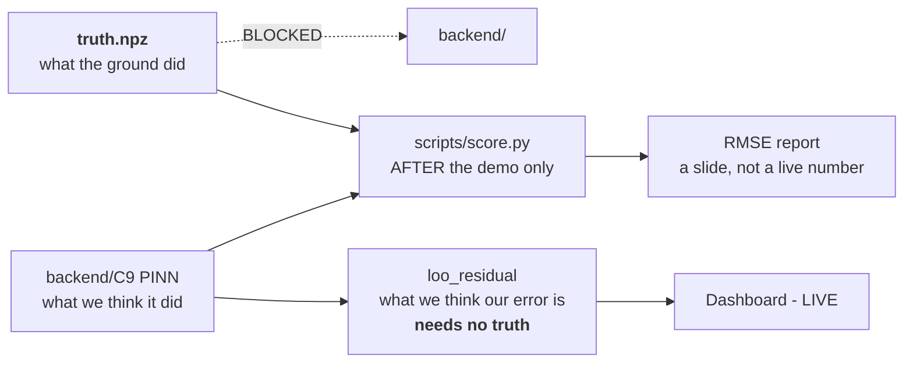
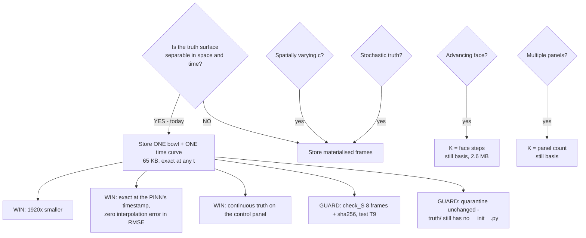
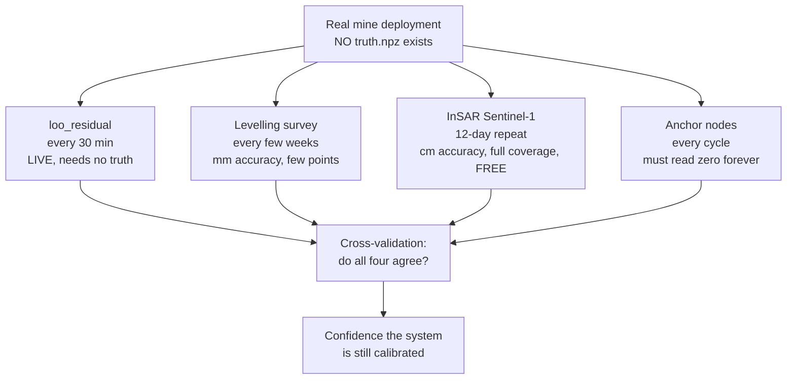

# 05 — `truth.npz`: The Answer Key, The Quarantine, and What Is Real

> **This file owns:** how ground truth is stored, why it is 65 KB instead of 126 MB, the quarantine mechanism, scoring, and the honest map between what exists in simulation and what exists at a real mine.
>
> **This file does NOT own:** the surface derivation (→ 01), the mesh (→ 02), the registry or PINN (→ 03), telemetry files (→ 04), the alarm (→ 06).
>
> **v2.0 changes:** test IDs renumbered to the global register (T37, T38 replace the colliding T25, T26); scoring gains the `â` / `ĉ` separability caveat from file 03 §11.6.

---

## 1. What "truth" means here

**Truth is what the ground actually did.** Not what a sensor said, not what the network delivered, not what the network reconstructed. The exact subsidence at every point at every instant.

**It exists only in simulation.** At a real mine nobody knows it. That asymmetry is the whole subject of §7, and getting it right is what separates a simulator from a demo that fools its own authors.



---

## 2. Why it is 65 KB and not 126 MB

### 2.1 The naive version, and its true cost

The original plan was to photograph the surface every 30 simulated minutes: 1920 frames of a 64×64 grid, four arrays (`S`, `dS/dx`, `dS/dy`, `ε_yy`).

| | Elements | Bytes (f32) |
|---|---|---|
| One array, `(1920, 64, 64)` | 7 864 320 | **31.5 MB** |
| **Four arrays** | 31 457 280 | **125.8 MB** |

> **Correction that survives from v1.4:** an earlier spec stated 31.5 MB for "1920 frames × 4 arrays." That figure is **per array**, not for all four. `np.savez` is uncompressed by default; `savez_compressed` on smooth float32 realistically reaches 40–60 MB, not 32. The real file was roughly **4× larger than documented** — which makes the case below stronger, not weaker.

### 2.2 The collapse

```
S(x, y, t) = S_final(x, y) · g(t)
```

**Space and time are separable.** Frame 1919 is not a new picture. It is frame 0 multiplied by a different scalar. Storing 1920 frames is storing the same 64×64 image 1920 times at 1920 brightness levels.

And separability survives every derivative, because `∂/∂x`, `∂/∂y`, `∂²/∂y²` are **linear operators in space** while `g(t)` is a constant with respect to them:

| Array | Decomposition | Separable? |
|---|---|---|
| `S` | `S_final · g(t)` | ✅ |
| `dS/dx` | `(∂S_final/∂x) · g(t)` | ✅ |
| `dS/dy` | `(∂S_final/∂y) · g(t)` | ✅ |
| `ε_yy` | `B·(∂²S_final/∂y²) · g(t)` | ✅ |

**All four compress by the same factor. Nothing is lost.**

```
125.8 MB  →  4 × 64 × 64 × 4 bytes  =  65.5 KB       a factor of 1920×
```

> **ELI5.** You do not need 1920 photographs of a balloon inflating. You need one photograph of the fully inflated balloon and one number saying how inflated it is right now. Multiply and you have any moment you like — **including moments you never photographed.**

### 2.3 The four assumptions this rests on

Write these into the code as explicit preconditions and **assert them at generation time** (test T38). If any one changes, the answer changes with it.

| # | Assumption | True today? | If it breaks |
|---|---|---|---|
| 1 | **Instantaneous extraction** — the whole panel is mined at `t = 0` | ✅ `panel` has a static rectangle, no face-advance rate | separability dies as a single term → §5, EC-1 |
| 2 | **One panel** | ✅ `panel` is a single object | becomes a sum of K separable terms → §5, EC-2 |
| 3 | **`a` and `c` are constants, not fields** | ✅ | `a(x,y)` still separable (fold into `S_final`); **`c(x,y)` kills it** |
| 4 | **No stochastic component in the truth** | ✅ all randomness lives in Layers 1–3, none in Layer 0 | separability dies → store frames, or store seed + recipe |

---

## 3. What is actually in the file

```
truth.npz                                  ≈ 200 KB total
├── x                 (64,)      f32   grid x ruler, metres
├── y                 (64,)      f32   grid y ruler, metres
├── basis_S           (K,64,64)  f32   settled bowl per extraction step
├── basis_dSdx        (K,64,64)  f32
├── basis_dSdy        (K,64,64)  f32
├── basis_eps_yy      (K,64,64)  f32
├── basis_t0          (K,)       f32   day each step's extraction completed
├── basis_c           (K,)       f32   time constant per step
├── check_t           (8,)       f32   8 arbitrary times, including t=0 and t=40
├── check_S           (8,64,64)  f32   FULLY MATERIALISED — regression guard only
└── meta              json            panel params, seed, generator version,
                                      sha256 of the generator source
```

**Today `K = 1`.** The K axis exists so that face advance and multi-panel are data changes, not code changes.

### 3.1 The evaluator is three lines

```python
def truth_at(t, key="S"):
    """Exact truth field at ANY t, not just 30-minute grid points."""
    g = 1.0 - np.exp(-basis_c * np.maximum(0.0, t - basis_t0))   # (K,)
    return np.tensordot(g, npz[f"basis_{key}"], axes=(0, 0))     # (64,64)
```

Lives in `truth/evaluate.py`. Same folder, same missing `__init__.py`, same quarantine.

---

## 4. The quarantine

### 4.1 The mechanism, exactly

| Layer | Mechanism |
|---|---|
| 1 | `truth/` has **no `__init__.py`**, so `import truth` from `backend/` fails at import time, not at review time |
| 2 | **Test T8** in CI asserts that the import raises. A red CI is louder than a code review |
| 3 | `scripts/score.py` sits **outside** `backend/` and is the only file permitted to import `truth` |
| 4 | Nothing in `backend/` may reference `site.a`, `site.c`, `S_MAX` or `C_KNOTHE` — **test T32** greps for these |

> **The quarantine is structural, not procedural.** It is enforced by a missing file, not by a rule in a document. That distinction is the entire point.

### 4.2 Why the rule survived the size reduction

The rule was **never** "the file is big and scary." It was always "`backend/` must have no import path to the answer key."

One genuine new caution: **cheap-to-compute truth is more *tempting* to reach for at 2 a.m.** than a 126 MB file you have to load. Keep T8 in CI and it does not matter. Discipline fails at 2 a.m.; a failing test does not.

### 4.3 What the quarantine protects against

> **The failure it prevents:** someone adds one import "just to check something," the reconstruction suddenly looks perfect, nobody notices the import survived, and you demo a playback device that still looks like it works. **This failure is invisible from the outside.** Nothing in the demo would look wrong. That is precisely why it needs a mechanical guard rather than a rule.

---

## 5. Edge cases — what breaks this and what to do

**EC-1 — Advancing longwall face. (the important one)**

Real longwall panels are mined progressively, ~3–5 m/day. The extracted area becomes `A(t)`, and each surface point starts settling only once the face passes beneath it:

```
S(x, y, t) = ∫ dS_final(x, y; τ) · (1 − e^(−c(t−τ))) dτ
```

**Not separable as a single term.** But discretise the face advance into `K` daily steps and it becomes a **sum of K separable terms** — which is exactly what the `basis_*` layout already supports.

| Face model | K | Basis size |
|---|---|---|
| Instantaneous (today) | 1 | 65 KB |
| Daily steps, 40 days | 40 | 2.6 MB |
| Hourly steps | 960 | 63 MB — pointless, use daily |

**Ship instantaneous now.** And note this is a *strong* judge answer: *"our truth representation already generalises to a progressive face — here is the axis"* beats *"we assumed it all appears at once."*

> **Connection worth making on stage:** file 02 §2.5 relaxes the longitudinal-line node count precisely *because* the face advances and temporal sampling substitutes for spatial sampling. **Turning on EC-1 is what would make that argument testable rather than merely plausible.** If you have spare time after the build, this is the highest-value thing to add.

**EC-2 — Multiple panels.** Each panel contributes its own separable term with its own `t0`. `K = number of panels`. Handled by the same layout, no new mechanism.

**EC-3 — Blast-triggered sudden roof fall.** Not modelled today: `events.csv` blasts perturb *sensors only*, never the ground. If you ever want a blast to cause a real step in subsidence, that is a Heaviside term — one more basis slice with `c → ∞` and `t0` = the blast time. **Flag it loudly if you add it**, because it destroys the clean claim *"events never touch the truth surface,"* which is currently a nice thing to be able to say.

**EC-4 — Float32 precision at very early times.** At `t = 0.01` day, `g ≈ 1.4e−4`, so `S ≈ 0.3 mm`. Float32 is *relative* precision (~7 digits), so `S_final × g` computed at read time is at least as accurate as a stored frame — in fact slightly better, because it quantises once instead of twice. **Non-issue, provided you never store `S` in a fixed-point or integer format.** Put that in the code comment.

**EC-5 — Scoring alignment. (a win, not a risk)** With 1920 stored frames, scoring a PINN output at `t = 14.237 days` requires interpolating between two frames, and that interpolation error contaminates your headline RMSE. With `truth_at(t)` you score at **exactly** the PINN's own timestamp. **Your RMSE number gets cleaner, not just smaller-on-disk.**

**EC-6 — Audit and reproducibility.** A frozen 126 MB file is evidence you can hash; a function is code that could have quietly changed. This is the one real argument for storing frames, and it is answered by `check_S`: 8 fully materialised frames plus a sha256 of the generator source, stored alongside the basis.

> **Test T9:** `truth_at(check_t[i])` reproduces `check_S[i]` to < 1e-6 for all 8. If someone refactors `S(x,y,t)` and flips a sign, **T9 fails in CI — not on stage.**

**EC-7 — Node-level Layer 0 arrays.** The `(31, 57600)` arrays that feed the sensor chain are separate from the grid truth and stay as they are — transient in RAM, 7.1 MB per channel. Worth noting they are *also* an outer product, `S_final(node_i) ⊗ g(t)`, so the "one numpy call per channel" claim understates it: it is one **outer product**, cheaper still.

**EC-8 — The simulator control panel reads `truth/`.** Under a frame scheme it would show the nearest 30-minute frame, so the truth surface visibly **steps** while node data moves smoothly. Under `truth_at(t)` it is continuous at any speed multiplier. **Better demo, less code.**

**EC-9 — Spatially varying `c`.** Then `g` depends on `(x,y)` and separability genuinely dies with no basis workaround. Fall back to materialising frames. There is currently no physical or PS-driven reason to want this; recorded so nobody discovers it by surprise.

### 5.1 The decision, one flowchart



---

## 6. Scoring — what `scripts/score.py` does

Runs **after** the demo, never during it.

| Metric | Formula | Notes |
|---|---|---|
| Surface RMSE | `√( mean( (S_pinn − truth_at(t))² ) )` over the 64×64 grid | scored at the PINN's exact timestamp |
| Peak subsidence error | `\|max(S_pinn) − max(truth)\|` | the number a mine engineer cares about |
| Trough edge position error | distance between the 10%-of-max contours | where cracking is expected |
| Strain field RMSE | vs `truth_at(t, "eps_yy")` | the channel that drives alarms |
| **`â·ĝ(t)` error** | `\|a_hat·g_hat(t) − a·g(t)\|` | **the honest headline** — see §6.2 |
| `â` error | `\|a_hat − 0.65\|` | did it learn, or replay? |
| `ĉ` error | `\|c_hat − 0.01414\|` | expect this to converge last |
| **LOO calibration** | correlation between `loo_residual` and actual per-node error | **the important one — §6.1** |
| **`a_fit` vs `â` agreement** | `\|a_fit − a_hat\|` | **two independent estimators, one classical one learned. New in v2.0** |
| Alarm confusion matrix | C8 decisions vs the event script | TP / FP / TN / FN, per event kind |
| Dead-zone RMSE | RMSE restricted to the `cluster_kill` region | how well loss 5 filled the hole |
| **F3/F4/F10 confusion** | did a relay death or a lightning strike ever raise Class-A? | **T22, and the day-23 lightning case** |

### 6.1 Why LOO calibration is the metric that matters

Everything above needs `truth.npz`, so none of it survives deployment. `loo_residual` does.

**But `loo_residual` is only useful if it is honest** — if it says "±3 mm" it must actually be ±3 mm. Scoring the correlation between `loo_residual` and the true per-node error is how you prove that. Get this right and you can say:

> *"Our live accuracy estimate was within 12% of the true error across 1920 frames, and it required no ground truth. That number will still be computable on day 400 at a real mine."*

**No other team will have a number that survives leaving the simulator.**

### 6.2 Score `â·ĝ` as well as `â` and `ĉ` — and expect them to converge at different rates

File 03 §11.6 explains why: over a short observation window `â` and `ĉ` are **correlated**, because a slightly larger subsidence factor with a slightly slower time constant looks nearly identical. Only their product `â·ĝ(t)` — the current amplitude — is tightly determined early.

**So score all three, and plot them against time.** The expected picture is `â·ĝ` accurate from the first day, `â` tightening over the first week, `ĉ` last. **That plot is a better demonstration of a working estimator than three final numbers**, and it pre-empts the obvious question about why `ĉ` was wrong on day 2.

### 6.3 The cross-check nobody else will have

C8's step-2 bowl fit estimates `a_fit` by classical Levenberg–Marquardt from the same sensors, **with no neural network anywhere in it**. C9's PINN estimates `â` by gradient descent with a physics prior.

**Two structurally independent estimators of the same physical parameter.** If they agree, that is far stronger evidence than either alone. If they diverge, something is wrong and you want to know before a judge does. Put both on the dashboard, side by side.

---

## 7. Simulation vs real life — the honest map

The single most important table in this file. **Read it before writing any deck slide.**

| Thing | In our simulation | At a real mine | Gap and how we close it |
|---|---|---|---|
| **Ground surface `S(x,y,t)`** | Knothe closed form, exact, known | Unknown. Never directly observed | Knothe is a **century-old, widely-validated** empirical model, not our invention. It is what mine surveyors already use to predict subsidence |
| **`a`, `c` parameter values** | Chosen by us: 0.65, 0.01414 | Site-specific, estimated from history or **learned from sensors** | Our PINN learns them, and C8's classical fit learns them independently. That is the actual product feature, not a simulator artefact |
| **Sensor readings** | Generated by corrupting truth in 6 stages | Read from real ADCs | Our corruption constants come from datasheets. Real noise will differ; C7's σ absorbs the difference by design |
| **Thermal and battery keys** | Modelled from weather + insolation | Measured directly on the node | **Identical mechanism.** The real system also carries `temp_dc` and `vbat_mv` in the same packet |
| **Radio delivery** | Log-distance path loss + shadowing + PDR draw | Real RF | `n` and `L_clutter` are **calibrated, not derived**. Validate against Meshtasticator and report the disagreement. *v1.4 claimed they were calibrated and they were not — see 02 §3.1* |
| **Duty cycle and bandwidth** | Modelled to GSR 564(E) limits | Same law, same band | **Zero gap on bandwidth.** On duty cycle we are *stricter* than the law requires, deliberately |
| **Blast register** | `events.csv` rows with `logged_in_dgms` | **Legally mandated DGMS records that already exist** | ⭐ **Zero gap.** This is the strongest part of the design. The real artefact is *already there* |
| **Lightning register** | `lightning` event rows | **Blitzortung / IMD, free and public** | ⭐ **Zero gap.** Same pattern as the blast register |
| **Node deaths** | Scripted `node_kill` / `cluster_kill` | Vandalism, cattle, flooding, lightning, ground failure | Mechanism is identical: a node stops arriving. The *cause* is what we correctly refuse to infer |
| **Truth for scoring** | `truth.npz` | **Does not exist** | Replaced by: `loo_residual` (live), periodic levelling survey (weeks), InSAR Sentinel-1 (12-day repeat, cm-scale), anchors (every cycle) |

### 7.1 What we will say on stage

> *"Everything the backend sees is what a real deployment would produce: twenty-three-byte packets, arrival provenance, gaps where the radio failed, and the mine's own blast register. The only thing that exists here and not at a real mine is the answer key — and we deliberately gave the backend no way to reach it, enforced by a test in continuous integration rather than by a promise. The accuracy number on the dashboard is the one that still works when the answer key goes away."*

### 7.2 What we will NOT say

| Do not say | Because |
|---|---|
| "Our model is 98% accurate" | 98% against **our own simulator**. State the scope every time |
| "This is real data" | It is a simulation asset, framed transparently. **Simulator transparency is a strength** — letting judges break it live is more impressive than hiding it |
| "The mesh delivers 99.9% of packets" | Only under our calibrated path-loss model. Say "under our link model, validated against Meshtasticator, we measured…" |
| "1% duty cycle is Indian law" | **It is not.** GSR 564(E) specifies power and bandwidth only. See 00 §3.4.1 |
| "We detect subsidence" | We detect **anomalous surface deformation consistent with a subsidence bowl**, and escalate to a human. The distinction is what makes it deployable |
| "We'll catch anything that opens up" | **We publish `d_committed = 358 m`.** Say the number instead |

### 7.3 What replaces truth at a real mine



**The anchors are the cheapest of the four and run every cycle.** They sit outside the influence zone, so by construction they must read zero subsidence forever. **If an anchor reports movement, your sensors are drifting, not the ground.** Instant drift detection, no ground truth required, at the cost of two nodes.

---

## 8. Gates this file owns

| Test | Asserts |
|---|---|
| **T8** | `import truth` from anywhere under `backend/` raises `ModuleNotFoundError` |
| **T9** | `truth_at(check_t[i])` reproduces `check_S[i]` to < 1e-6, for all 8 check times |
| **T15** | Both anchors read `\|S\| < 1 mm` in truth at every check time. *Measured: 8.7e−5 mm and 7.9e−6 mm* |
| **T37** | `meta.generator_sha256` in `truth.npz` matches the actual hash of the generator source at load |
| **T38** | The four separability preconditions in §2.3 are asserted at generation time and raise if violated |

*(v1.4 numbered the last two T25 and T26, which collided with the mesh tests. The global register in 00 §6 is now the only source of test numbering.)*

---

## 9. Six lines to say out loud

> The ground truth is not a recording, it is an analytic field — so we store the field, not nineteen hundred photographs of it, and we can score at any instant rather than only at the frames we happened to save. That is sixty-five kilobytes instead of a hundred and twenty-six megabytes, and it makes our error number *cleaner*, because there is no interpolation between frames to contaminate it. The backend has no import path to that file, enforced by a missing `__init__.py` and a test in continuous integration rather than by a promise, because the failure it prevents — a system that quietly replays the answer key while still looking correct — is invisible from the outside. We estimate the two unknown geology parameters twice, once with a classical least-squares fit and once with the neural network, and we show you both, because two independent estimators agreeing is worth more than one estimator being confident. And we are explicit that at a real mine this file does not exist at all: what survives is the leave-one-out residual, the levelling survey, free Sentinel-1 InSAR, and two anchor nodes that must read zero forever. Those four are what a real deployment cross-checks against, and our accuracy claim is built to survive on them alone.
