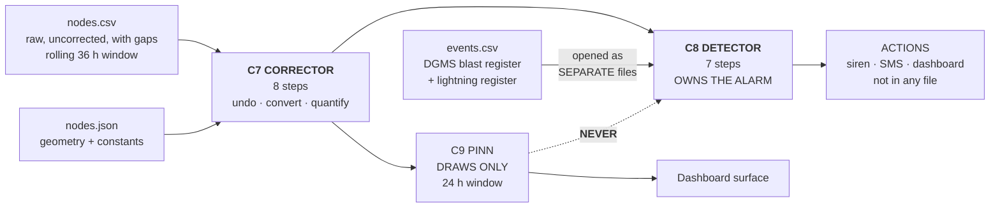
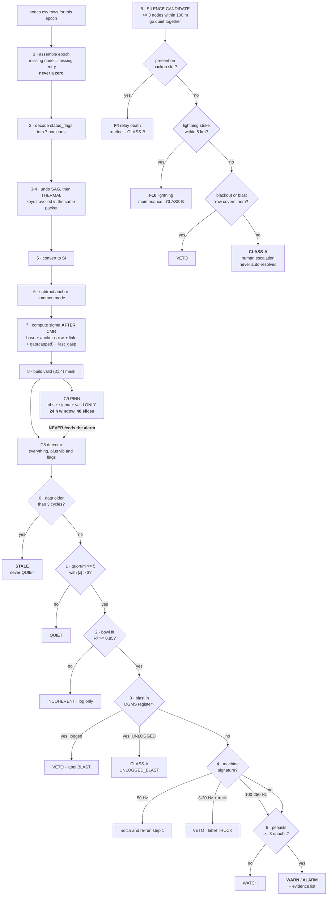

# 06 — The Backend: C7 the Corrector and C8 the Alarm

> **This file owns:** the eight C7 correction steps, the exact σ formula, the `valid` mask rules, and the C8 alarm pipeline.
>
> **This file does NOT own:** the PINN (→ 03), telemetry format (→ 04), truth (→ 05).
>
> **v2.0 changes:** the step table is reordered so it agrees with the code (v1.4's table said thermal-then-sag and the paragraph below it said the opposite); σ is now computed **after** common-mode rejection, because CMR injects the anchors' own noise into every node; `f_gap` is **capped**, because uncapped it multiplied σ by 1297 after an outage; C8 gains the F3/F4/F10 discriminators and an F9 staleness rule; peak/σ ratios recomputed against the corrected magnitudes.

---

## 1. Where this sits



**One sentence each.** C7 turns damaged integers into honest physics with error bars. C8 decides whether those error bars mean anybody should be woken up.

---

## 2. C7 — the corrector, eight steps in fixed order

Runs once per epoch. Input: all `nodes.csv` rows for that epoch, plus `nodes.json`. Output: one dict consumed by C8, and a **rolling 48-slice window** of the same dicts handed to C9 every 30 sim-minutes (file 03 §12.2).

### 2.1 The eight steps — **table order now matches code order**

| Step | Action | Detail |
|---|---|---|
| **1** | **Assemble the epoch** | Gather all rows with this `epoch`. **Missing node ⇒ missing entry, never a zero.** Record which node ids are absent |
| **2** | **Decode `status_flags`** | Split into 7 booleans: `crack_level`, `selftest_ok`, `last_gasp`, `reboot`, `ext_present`, `degraded`, `replay` |
| **3** | **Undo battery sag** | `v ← v × V_nom / (vbat_mv × 1e-3)` — **this is stage 4 of the corruption chain, so it is undone first** |
| **4** | **Undo thermal drift** | `v ← v − k_T,ch · (temp_dc × 0.1 − T_ref)` — stage 1, undone second |
| **5** | **Convert to SI** | `tilt × 2e-6` → rad · `strain × 1e-6` → dimensionless · `ext × 1e-5` → m |
| **6** | **Common-mode rejection** | Subtract the mean anchor tilt from every field node's tilt. **The cheapest SNR gain in the system** |
| **7** | **Compute σ per channel** | §2.3 — **after CMR, not before. See §2.4** |
| **8** | **Build the `valid` mask** | §2.5 |

### 2.2 Why steps 3 and 4 are in that order and no other

The corruption chain applied thermal **first** and sag **fourth** (file 01 §4.1). **Inverting an ordered chain means reversing the order:** undo sag, then thermal.

> ⚠️ **v1.4 had this as a footnote contradicting its own table.** The table said "3 · undo thermal drift, 4 · undo battery sag" and the paragraph underneath said "in code, undo sag first, then thermal." Somebody was always going to implement the table. It is fixed above.

If you undo thermal before sag, the sag multiplier scales a value that has already had an additive term removed, leaving a residual of:

```
error = k_T · (T − T_ref) · (V_nom/V − 1)
```

At `T − T_ref = 15 °C` and `V = 3.5 V`: `250 × 15 × (3.70/3.50 − 1) = 214 µrad`. Small, systematic, and it will look like a physics bug for a day.

**Correct code order:**
```python
v = v * V_NOM / (vbat_mv * 1e-3)                    # undo stage 4 first
v = v - K_T[ch] * (temp_dc * 0.1 - T_REF)           # then undo stage 1
v = v * SI_FACTOR[ch]                               # then convert
```

> **Test T7 lives here:** apply the above with the *true* `T_chip` and `V_bat` from the simulator and confirm the residual sits inside the white-noise band. **If T7 fails, stop. Nothing downstream can work.**

### 2.3 The σ formula — stated explicitly, once

Every other document references σ and none defines it. Here it is.

**Base variance, per channel `ch`, per node `i`:**

```
σ_base²  =  (σ_w[ch] · sigma_scale_i)²        white-noise floor        (stage 3)
         +  (LSB[ch]² / 12)                    quantisation             (stage 5)
         +  σ_b[ch]²                           residual OU bias walk    (stage 2)
         +  (k_T[ch] · σ_temp_resid)²          residual thermal         (stage 1 leftover)
         +  (v · σ_vbat_resid / V_nom)²        residual sag             (stage 4 leftover)

σ_temp_resid = 0.1 / √12 = 0.029 °C            (temp quantisation)
σ_vbat_resid = 1e-3 / √12 = 0.29 mV            (vbat quantisation)
```

**Then the common-mode term (§2.4), then inflate for delivery quality:**

```
σ_cmr²  = σ_base²  +  σ_anchor_mean²        tilt channels only

f_link  = 1 + 0.5·(hops − 1) + 0.5·max(0, −snr_db / 5)
f_gap   = min( 1 + 0.3·(epochs since this node's last delivered row − 1),  10.0 )
f_flag  = 5.0 if last_gasp else 1.0

σ_final = σ_cmr · f_link · f_gap · f_flag
```

**Why each factor exists:**

| Factor | Reason |
|---|---|
| `f_link` | a frame that came 3 hops through a poor link is more likely to be a corrupted-but-CRC-passing frame |
| `f_gap` | a reading from a node you have not heard from in 8 epochs is stale — the ground may have moved since |
| `f_flag` | a last-gasp packet is real evidence but wildly untrustworthy in magnitude. **Widen the bar, do not discard the reading** |

> ⚠️ **`f_gap` must be capped, and v1.4 did not cap it.** After a 72 h gateway outage a node's gap is 4320 epochs, giving `f_gap = 1297`. Every reading from every recovered node would arrive with σ inflated a thousandfold, the quorum gate would never fire, and **the detector would be silently deaf for the entire recovery window.** The cap of 10 is the point past which "stale" stops meaning anything more. Test **T45**.

**Sanity anchors, day 20, healthy node — recomputed against the corrected peaks (00 §3.6):**

| Channel | σ_final | Peak at day 20 | Peak/σ |
|---|---|---|---|
| tilt | ~11.2 µrad → 1.12e-5 rad | 6 400 µrad | 570:1 — but thermal residual dominates in the far field |
| strain | ~1.4 µε → 1.4e-6 | 3 117 µε | **2 200:1 — this is why strain is the primary channel** |
| ext | ~16.1 µm → 1.61e-5 m | 31 mm | 1 900:1 |

> These are *peak-to-noise* ratios and they flatter the system. **The number that matters for detection is the z-score of the change against the 24 h baseline**, which is what C8 actually uses. Quote the ratio for intuition, quote the z-score for the alarm.

### 2.4 Why σ is computed after common-mode rejection — a v2.0 correction

v1.4 computed σ at step 6 and did CMR at step 7. That is backwards, and it under-reports uncertainty on every tilt channel in the network.

**Subtracting the anchor mean does not remove noise. It removes a shared systematic and adds the anchors' own random noise to every node.**

```
tilt_corrected_i = tilt_i − mean(tilt_anchor_1, tilt_anchor_2)

Var(corrected) = Var(tilt_i) + Var(anchor mean)
               = σ_base²     + σ_anchor² / 2
```

With two anchors of comparable quality, `σ_anchor²/2 ≈ σ_base²/2`, so **CMR inflates tilt variance by about 50%** — σ rises by ~22%. That is a completely acceptable price for removing a 7 500 µrad seasonal common mode, but it must be *accounted for*, not ignored.

> **The general rule, worth stating:** any operation that combines measurements propagates their uncertainty. Compute σ **after** the last operation that touches the value, never before.

### 2.5 The `valid` mask — the rules, complete

`valid` is `(N, 4)` per epoch — per node, **per channel**. Channel order `[tilt_x, tilt_y, strain, ext]`, and it never changes. For C9 it is stacked into `(48, 31, 4)` across the window.

A channel is marked **invalid** if **any** of these hold:

| # | Condition | Rationale |
|---|---|---|
| V-a | No row arrived for this node this epoch | absence, not zero |
| V-b | `selftest_ok == 0` | **the stuck-sensor case.** A dead ADC returns a constant, which looks exactly like perfectly stable ground. **The most dangerous failure in the design, because it fails *safe-looking*** |
| V-c | Raw value is clipped at the wire limit | the true value is unknown, only bounded |
| V-d | Channel is `ext` and `ext_present == 0` | node has no extensometer |
| V-e | Value fails a MAD outlier test vs the 5 nearest neighbours **on that channel** — **unless `last_gasp` is set** | F8 Byzantine quarantine. The last-gasp exception is essential: the outlier filter would otherwise discard the single most important packet the node ever sends |
| V-f | `reboot == 1` **and** this is the first packet after restart | `seq` continuity is broken; the value itself is fine, but treat the first one cautiously |
| **V-g** | **Node is an anchor and this is a tilt channel being used for CMR** | do not correct the anchors against themselves — that zeroes them by construction and destroys the drift check |

> **`valid` is (N, 4), not (N,).** A node can send a good tilt and a garbage strain in the same packet. Masking per node throws away good data — and with 28 field nodes doing the work of hundreds, you cannot afford to throw away good data.

### 2.6 What C7 outputs

| To | Contents | Cadence |
|---|---|---|
| **C9 (PINN)** | `t`, `obs_tilt_x/y`, `obs_strain`, `obs_ext`, `sigma_*`, `valid` — **as a 48-slice, 24 h window**. **Nothing else** (file 03 §13) | every 30 sim-min |
| **C8 (alarm)** | all of the above for the current epoch **plus** `vib_*`, the 7 status booleans, `alive`, `seq` gaps, `rssi`, `snr`, `hops` | every epoch |

**C7 forwards `temp_dc` and `vbat_mv` to neither.** They were consumed at steps 3–4. Passing them on would let the PINN re-learn a correction already applied.

### 2.7 Baselines

`baseline_strain` and friends are **24-hour rolling medians per node per channel**, computed by C7 and held in a ring buffer. **This 24 h window is what sets `retention_h = 36` in file 04 §4.8** — the backend cannot look further back than the file holds.

**Median, not mean** — a single wild reading must not shift the baseline it is being compared against. That is a circularity trap of the same family as the PINN's `a`/`c` problem: let outliers into the baseline and the detector slowly re-normalises to the disaster it is meant to detect.

---

## 3. C8 — the alarm

### 3.1 There is no alarm neural network, and that is the feature

The alarm is a **deterministic classical detector**. Not a neural network, not a classifier, not a language model.

**This is a frozen decision and it is a selling point, not a limitation.** An alarm you can hand-trace at 3 a.m. is the only kind a mine safety officer will accept, and DGMS will ask how the decision was made.

**The PINN's output is not an alarm input either.** Routing a learned surface into a safety decision would launder a neural network into the alarm path through the back door. **C8 reads sensors and external registers. Nothing else.**

### 3.2 C8's complete input list

| Input | Source | Shape |
|---|---|---|
| `obs_strain`, `obs_tilt_x/y`, `obs_ext` + `sigma_*` + `valid` | C7 | (31,), (31,4) |
| `xy`, `panel`, `is_anchor` | `nodes.json` | static |
| `alive`, `seq` gaps, **backup-slot presence** | telemetry | (31,) |
| `crack_level`, `selftest_ok`, `last_gasp`, `reboot`, `degraded`, `replay` | decoded flags | (31,6) |
| `vib_rms`, `vib_peak`, `vib_fdom` | telemetry | (31,3) |
| `rssi`, `snr`, `hops`, `parent_id` | telemetry | (31,4) — **for σ and F2 only** |
| Blast register | **`events.csv`, opened as a separate file** | rows |
| **Lightning register** | **`events.csv` / Blitzortung / IMD, separate source** | rows |
| **Uplink watchdog age** | gateway | scalar seconds |

### 3.3 The seven-step pipeline

```
0  STALENESS GATE                                  ← NEW in v2.0 (F9)
      if newest epoch in the working set is older than 3 cycles
      →  emit STALE.  DO NOT emit QUIET.
      Rationale: absence of an alarm is not the same as an all-clear.
      A dead backhaul with a live radio makes every light look green
      while the system is completely blind.

1  QUORUM GATE
      count nodes with valid[:, 2] and |z_strain| > 3
      z = (obs_strain − baseline_strain) / sigma_strain
      if count < 5  →  QUIET, stop
      Rationale: one node cannot alarm alone. F8 Byzantine nodes are
      STRUCTURALLY unable to trigger, not merely unlikely to.

2  BOWL FIT
      Levenberg-Marquardt over (a, c) with the panel rectangle FIXED
      fit against strain + tilt at all valid nodes, weighted by 1/sigma^2
      → R², residual, a_fit
      if R² < 0.85  →  INCOHERENT: log it, no alarm
      Rationale: real subsidence has a shape. Scattered anomalies that
      do not fit a bowl are sensor problems, not ground problems.
      NOTE: a_fit is an INDEPENDENT estimate of the same parameter the
      PINN learns as â. Publish both. Divergence is a warning sign.

3  BLAST VETO                                      ⭐ THE DIFFERENTIATOR
      for each blast row in events.csv:
          if |t_event − t_now| < 120 s
             and distance(node, blast) < 500 m
             and vib_fdom in [40, 80] Hz
             and the anomaly decays within 3 epochs
          →  VETO, label BLAST, log the vetoing row id
      if logged_in_dgms == 0 for the matching blast
          →  DO NOT VETO. Escalate with label UNLOGGED_BLAST.
      Rationale: an unlogged blast is a compliance failure at the mine
      and must reach a human, not be silently absorbed.

4  MACHINE VETO
      vib_fdom in [49.5, 50.5]  →  narrow-band conveyor. Notch, subtract, re-run step 1.
      vib_fdom in [8, 20] and a truck_pass row is active  →  VETO, label TRUCK.
      vib_fdom in [100, 250]    →  microseismic. DO NOT veto. This is real rock.

5  SILENCE RULE                                    ⭐ BYPASSES 1-4
      candidate: >= 3 nodes with pairwise separation < 100 m
                 all went alive=0 within one 10-minute window

      then DISCRIMINATE — all three checks, all free:            ← NEW in v2.0
        a) BACKUP SLOT.  are they present on their backup_slot by cycle N+3?
              yes  →  F4, relay death.  Re-elect.  NOT an alarm.
        b) LIGHTNING.    strike logged within 5 km in the last 10 min?
              yes  →  F10.  Maintenance Class-B.  NOT a ground alarm.
        c) BLACKOUT/BLAST. radio_blackout or blast row covering them?
              yes  →  VETO.
        d) PRECURSOR.    rising z-scores on the 5 nearest surviving
                         neighbours over the last 30 min?
              yes  →  strengthens F3.

      if silent on primary AND backup, for 3 consecutive cycles,
         with no lightning, no blackout, no blast
      →  CLASS-A, regardless of steps 1-4.

      Rationale: the failure mode we detect destroys sensors. A system
      that interpolates over that gap will interpolate over a collapse.
      But a relay battery failure has the SAME raw signature, and would
      have fired a false Class-A on day 19 of our own scenario.

6  PERSISTENCE
      the anomaly must hold for >= 3 consecutive epochs
      EXCEPTIONS that skip persistence entirely:
         - any node with last_gasp set
         - step 5 having fired
         - crack_level increasing on >= 3 nodes
      else  →  WATCH

7  LEVEL AND EVIDENCE
      emit level + the full evidence list
```

### 3.4 The F3 discriminator, in one table

This is the single most important change to C8 in v2.0, and it is worth memorising.

| | Silent on primary | Present on backup slot | Lightning logged | Precursor on survivors | → Verdict |
|---|---|---|---|---|---|
| Relay battery dies | ✅ | **✅** | ✗ | ✗ | **F4** — re-elect, no alarm |
| Lightning strike | ✅ | ✗ | **✅** | ✗ | **F10** — maintenance Class-B |
| Radio blackout | ✅ | ✗ | ✗ | ✗ | vetoed by the blackout row |
| **Ground collapse** | ✅ | ✗ | ✗ | **✅** | **CLASS-A** |

**Cost: F3 detection latency goes from 3 cycles to 6 cycles — six minutes.** State that honestly. It is still an order of magnitude faster than a human notices, and it is the difference between an alert people act on and an alert people mute after the third false one.

> **Silence with a precursor is an event. Silence without a precursor is a fault.** Put that on a slide.

### 3.5 Output levels

| Level | Meaning | Action |
|---|---|---|
| `QUIET` | nothing above threshold, **and the data is fresh** | log only |
| **`STALE`** | **data older than 3 cycles — F9** | **dashboard banner. Explicitly NOT an all-clear** |
| `WATCH` | quorum met but persistence not yet | dashboard highlight |
| `WARN` | persistent, bowl-coherent, not vetoed | SMS to the shift supervisor; cluster moves to P2 escalation |
| `ALARM` | WARN plus rising trend or crack confirmation | siren + SMS + dashboard takeover |
| `CLASS-A` | discriminated clustered silence, or an unlogged blast | **human escalation, never auto-resolved** |
| `CLASS-B` | lightning or relay death affecting several nodes | maintenance ticket, no siren |

### 3.6 Why `STALE` is a separate level and not just "no alarm"

F9 — backhaul dead, radio alive — is the failure where the LoRa network is perfectly healthy, every node is transmitting, beacons are flowing, nobody buffers anything, **and the data never leaves the gateway.**

From the dashboard's point of view, nothing is wrong. No alarm has fired. Every indicator is green. **And the system has been blind for six hours.**

> **A system that cannot tell "nothing is happening" from "I cannot see" is worse than no system**, because it manufactures confidence. The staleness gate runs *before* the quorum gate for exactly this reason: C8 must be structurally incapable of emitting `QUIET` on stale data. Test **T46**.

The gateway buffers to local storage during F9 — 31 × 23 B × 1440/day = **1.03 MB/day**, 3.1 MB for 72 h — so nothing is lost, only delayed. But the operator must know they are looking at the past.

### 3.7 The output record — every alarm is traceable

```jsonc
{
  "epoch": 28800,
  "t_iso": "2026-03-21T00:00:00Z",
  "level": "WARN",
  "data_age_epochs": 1,
  "quorum_n": 7,
  "bowl_r2": 0.912,
  "a_fit": 0.631,
  "vetoed_by": null,
  "evidence": [
    {"node_id": 17, "channel": "strain", "z": 6.4, "contribution": 0.22},
    {"node_id": 18, "channel": "strain", "z": 5.9, "contribution": 0.19},
    {"node_id": 12, "channel": "tilt_y", "z": 4.1, "contribution": 0.11}
  ],
  "silent_nodes": [],
  "silent_on_backup_too": [],
  "blast_rows_checked": ["blast-004"],
  "lightning_rows_checked": [],
  "latency_ms": 340
}
```

> **`evidence` is the field that matters.** Every alarm names the nodes and channels that caused it, with their contributions. A safety officer can walk to those exact pegs. **No neural network output appears anywhere in this record.**

`silent_on_backup_too` is the field that makes the F3/F4 distinction auditable after the fact — you can prove why the system did or did not raise Class-A.

---

## 4. Why the external-register pattern is the strongest thing in the project

**DGMS Circular 7/1997 requires every Indian coal mine to keep blast seismograph records.** Those records exist, legally, at every target site, today, whether or not anybody deploys our system. Lightning strike data is free and public from Blitzortung and IMD.

| Consequence | Detail |
|---|---|
| Removes the two largest false-positive sources | blasts are the dominant transient in a working mine; lightning is the dominant cause of correlated node death in monsoon |
| Removes sensors from the BOM | no blast-detection hardware, no lightning sensor |
| Zero deployment gap | unlike every other input, the real artefacts **already exist** |
| Makes the fast alarm plane affordable | **you can afford a sub-second alarm precisely because you have registers to veto it against.** Speed and the blast log are one story, not two |
| Nobody else will have read the circular | it is a compliance document, not an engineering paper |

> **We do not add sensors to remove false positives. We add records that already exist and that somebody else is already required to keep.**

Say that sentence on stage.

---

## 5. Actions are not data

The alert chain — siren, GSM SMS, email, dashboard push, SD-card buffering — produces **actions**, not measurements. **Nothing about it belongs in any of the data files.**

State this explicitly so nobody adds an `alert_sent` column to `nodes.csv` and quietly breaks the sim/backend seam. `nodes.csv` is a record of what the ground and the radio did. **It is not a record of what the operator did about it.**

---

## 6. The whole backend, one flowchart



---

## 7. Gates this file owns

| Test | Asserts |
|---|---|
| **T7** | Undoing sag then thermal with true `T_chip`, `V_bat` leaves the residual inside the white-noise band |
| **T39** | On the day-3 logged blast, C8 emits `vetoed_by = BLAST` and **no** alarm |
| **T40** | On the day-21 **unlogged** blast, C8 emits `CLASS-A / UNLOGGED_BLAST` |
| **T41** | On the day-26 `cluster_kill`, C8 emits `CLASS-A` within one epoch via step 5, **regardless** of what steps 1–4 concluded |
| **T42** | Injecting a single Byzantine node with a 20σ strain value produces **no** alarm — the quorum gate holds |
| **T43** | A node with `selftest_ok = 0` reporting a perfectly constant value is marked invalid and **excluded from the quorum count** |
| **T44** | `grep -r "C9\|pinn\|S_grid" backend/C8/` returns nothing |
| **T45** | `f_gap` never exceeds 10, even after a 72 h simulated outage |
| **T46** | During the day-29 `backhaul_down`, C8 emits `STALE` and **never** `QUIET` |

**T42 and T43 are the two to write first.** T42 proves a lying node cannot trigger a siren. T43 proves a *dead* node cannot report "all clear" — and that is the failure that would actually kill someone.

**T46 is the one nobody thinks to write**, and it is the difference between a system that knows it is blind and one that reports green while seeing nothing.
