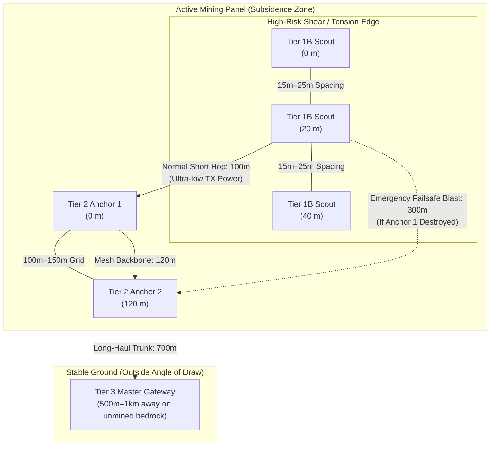

## Scope and Core Thesis

> **This file owns:** the geological and electromagnetic rationale governing physical sensor placement across the mine panel, resolving the fundamental difference between **Geotechnical Grid Spacing** (physics of ground displacement) and **LoRa Radio Range** (wireless link margin and self-healing).
>
> **This file interfaces with:**
> - 3-Tier Hardware Specification & Node BOM → [[hierarchical-3tier-lora-mesh]]
> - Sizing Engine, Nyquist Sampling Scale, & TDMA Timetable → [[mesh-network-architecture]]
> - Master Knothe Subsidence Formulas & Strain Equations → [[sensors-and-formulas]]
> - Master System Charter & Boundaries → [[projects/subsidence-monitoring/overview]]
> - Author Profile → [[people/dnyanad]]

---

## 1. The Fundamental Architectural Duality

When designing an underground coal mine subsidence monitoring system, two diametrically opposed physical domains must be separated:

1. **Geotechnical Grid Spacing:** How close sensors *must* be physically placed to detect localized soil failure, tension fractures, and macro-subsidence curves.
2. **LoRa Radio Range:** How far the wireless transceivers *can* communicate through free space and industrial mine topography.

```
+-----------------------------------------------------------------------------------------+
|                  GEOTECHNICAL SPACING vs. WIRELESS RADIO RANGE DUALITY                   |
+--------------------------+------------------------------+-------------------------------+
| Tier                     | Geotechnical Grid Spacing    | Nominal LoRa Transmit Range   |
+--------------------------+------------------------------+-------------------------------+
| Tier 1A/B/C: Scout Nodes | 15 m to 25 m (Targeted)      | 1,000 m to 3,000 m (SX1262)   |
| Tier 2: Anchors          | 100 m to 150 m (Panel Grid)  | 1,000 m to 3,000 m (SX1262)   |
| Tier 3: Master Gateway   | 500 m to 1,000+ m (Bedrock)  | Up to 10,000 m (Masted SX1302)|
+--------------------------+------------------------------+-------------------------------+
```

> **The Guiding Principle:** In this architecture, **sensor spacing is dictated strictly by geology, not by wireless transmission limits.** The massive surplus in radio range is exploited as a fault-tolerant self-healing power margin.

---

## 2. Geotechnical Grid Spacing by Tier



### 2.1 Tier 1 Scouts (Modular): 15 to 25 Meters Apart
- **Physical Deployment:** Scout nodes are installed every 15 to 25 meters across high-risk zones, utilizing **specific modular sub-SKUs** tailored to the location:
  - **Tier 1B (Fissure & Tension):** Placed exactly over the **shear and tensile strain zones** (typically within distance $2r$ centered on the panel perimeters).
  - **Tier 1A (Tilt & Seismic):** Placed in the interior flat zones to resolve the macro-bowl and detect microseismics, where tensile cracks will never form.
- **Geotechnical Rationale:** Ground deformation and brittle failure are highly localized phenomena:
  - If tensile ground stress exceeds soil shear capacity, fissures open abruptly over narrow zones.
  - A 2-meter-wide tension chasm can open midway between sensors placed 100 meters apart without tilting or deflecting the distant sensor housings.
  - As derived in [[mesh-network-architecture#22-the-sampling-scale-derived-from-the-profile-itself|mesh-network-architecture §2.2]], the spatial spectrum of ground curvature $K(x)$ dictates a Nyquist boundary $\Delta_{edge} \le r/2.86 \approx 25\text{ m}$ (where $r = 75\text{ m}$).
- **Sensor Mechanical Span Limits:** The physical crack-displacement meters on the Tier 1B nodes span only 1 to 3 meters across active tension cracks. Close spacing ensures that developing surface cracks physically intersect the instrumented array. Because cracks only form at the edges, placing these sensors in the center of the panel (Tier 1A) would be a waste of hardware.

### 2.2 Tier 2 Anchors: 100 to 150 Meters Apart
- **Physical Deployment:** Tier 2 Anchors (both 2A Standard Routers and 2B Geotechnical Loggers) are arranged in a regular grid every 100 to 150 meters across the active mine panel.
- **Geotechnical Rationale:**
  - The overarching **subsidence bowl** (the trough depression generated by total extraction in longwall or bord-and-pillar mining) is a macro-scale geometric feature spanning hundreds of meters ($600\text{ m} \times 200\text{ m}$).
  - In the interior flat extraction zone, high-frequency shear derivatives approach zero ($\partial^2 S / \partial x^2 \approx 0$), meaning high spatial sensor density is redundant and economically wasteful.
  - Spacing high-precision ADXL355 inclinometers at 100 m–150 m provides an exact mathematical reconstruction of the macro-settlement bowl while maintaining frugal hardware deployment costs.

### 2.3 Tier 3 Master Gateway: 500+ Meters Away
- **Physical Deployment:** Exactly 1 (or 2 for spatial redundancy) Master Gateway per mining sector, sited 500 meters to 1,000+ meters away from the active mining panel.
- **Geotechnical Rationale (Outside the Angle of Draw):**
  - The Master Gateway houses the **u-blox ZED-F9P RTK-GNSS** base station providing the absolute geodetic ground-truth reference.
  - To establish a true spatial datum, the base station must be positioned on immovable, undisturbed bedrock that will never undergo settlement.
  - In mining geology, the **Angle of Draw** ($\gamma_d$ or $\beta = 63.4^\circ$) defines the outermost envelope where underground extraction induces surface displacement. Placing the gateway $\ge 500\text{ m}$ away guarantees it remains permanently outside this subsidence boundary.

---

## 3. The "Superpower" of LoRa Radio Range Margin

The divergence between close geological spacing and long-distance wireless physics creates an enormous architectural advantage for edge reliability:

### 3.1 Actual Semtech SX1262 LoRa Range
- Inside each Tier 1 Scout and Tier 2 Anchor, the Semtech SX1262 transceiver running at IN865 (865–867 MHz, BW125, SF7/SF8) exhibits a line-of-sight communication range of **1 to 3 kilometers** in typical open-cast or surface terrain, and up to **10 kilometers** when communicating with an elevated gateway mast.

### 3.2 Battery Conservation in Nominal Operation
- Because a Tier 1 Scout sits only 15–25 meters from neighboring Scouts and 80–120 meters from its primary Anchor, it operates at minimum RF output power (e.g., +2 dBm to +10 dBm instead of the +22 dBm maximum).
- This drastically curtails instantaneous current draw during TX cycles (down to ~15–25 mA), allowing the node to operate indefinitely on a single 18650 cell paired with a compact 1W solar panel.

### 3.3 Dynamic Self-Healing & Emergency Blast
- If a sudden geological collapse, sinkhole, or heavy mining vehicle destroys or swallows Anchor A:
  1. The orphan Scout recognizes multiple unacknowledged transmissions.
  2. Because the Scout possesses a 2,000+ meter link capability, it simply steps up its power amplifier (PA) output to maximum (+22 dBm / 160 mW) or shifts spreading factor from SF7 to SF8.
  3. The Scout effortlessly reaches **Anchor B** (located 250 m–300 m away on an adjacent grid line) or bounces packets across neighboring Scouts via gradient hop-count routing, completely circumventing the physical destruction.

```
Nominal Link:
[Scout S1] ---- 20 m (Low TX Power: +5 dBm) ----> [Anchor A]

Failover Link (Anchor A Destroyed by Sinkhole):
[Scout S1] ================= 280 m (RF Power Blast: +22 dBm) ================> [Anchor B]
```

---

## 4. SIH Evaluation Pitch Summary

When presenting to SIH judges and Ministry of Coal evaluators, articulate this dual-layer strategy:

1. **Why so many edge sensors?** We do not space nodes to satisfy wireless communication limits; we space them at 15–25 meters because **geology and rock mechanics are localized**. Tensile ground rupture cannot be felt across 100-meter gaps.
2. **Why not use expensive commercial stations everywhere?** Placing ₹50,000 commercial loggers every 20 meters would bankrupt a mine. Our ₹1,000 Scout nodes make dense geological sampling economically viable.
3. **How does the system achieve industrial self-healing?** By keeping physical node spacing (20 m) at less than **2% of the radio's absolute link capability (1,500 m)**, the network possesses an immense link budget margin (30+ dB), guaranteeing that localized ground collapses cannot sever wireless data delivery.

---

## 5. Related Specifications & Architecture Documents

- 3-Tier Hardware Specification & Node BOM: [[hierarchical-3tier-lora-mesh]]
- TDMA Superframe Timetable & Link Margin: [[mesh-network-architecture]]
- Ground Physics, Knothe Radius, & Derivatives: [[sensors-and-formulas]]
- Author Profile: [[people/dnyanad]]
- Project Overview: [[projects/subsidence-monitoring/overview]]
