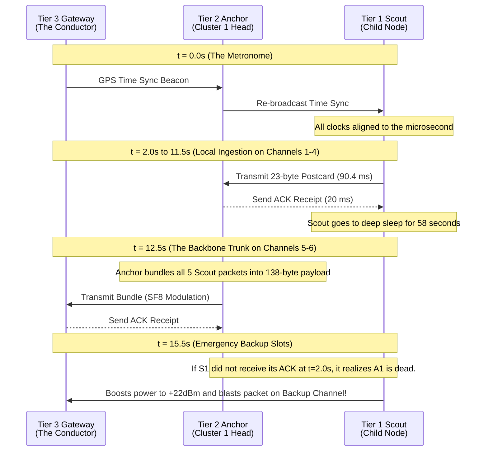

	
## Scope and Purpose

> **This file owns:** the comprehensive master explanation of the SIH 3-Tier LoRa network. It covers the physical deployment strategy, the logical radio mesh, the underlying LoRa physics in the IN865 band, the strict 23-byte data constraints, and the 60-second TDMA superframe. 

---

## 1. The Core Philosophy: Why Not a Standard Mesh?

When people hear "Mesh Network," they usually think of smart home devices (like Zigbee) where you turn them on, and they automatically find each other based on proximity. We **did not** build that kind of network.

### The Analogy: The Cocktail Party vs. The Orchestra
- **Standard Mesh (The Cocktail Party):** Everyone enters a room and starts talking at once. People try to find the person closest to them to pass a message. If it gets too loud, they shout louder (collisions). People constantly have to listen to see if someone is talking to them, which is exhausting (battery drain).
- **Our 3-Tier DAG (The Orchestra):** We pre-calculated the entire symphony before the concert started. Every musician (node) is given a piece of sheet music (`nodes.json`). They do not look around the room to decide who to talk to. They watch the conductor (the Master Gateway), and when it's their exact millisecond to play, they play their note (transmit their 23-byte packet) and immediately go back to sleep.

---

## 2. Physical and Radio Positioning (Geotechnical vs. Radio Range)

The physical arrangement of the nodes is designed strictly around the **geology of the mine panel**, not the limits of the radios. 

### The Geotechnical Grid (Physical Placement)
- **Tier 1A & 1B (Scouts): 15m to 25m apart.** Ground failure is highly localized. A 2-meter wide crack can open up in the ground, and a sensor 50 meters away might not feel it. Tier 1B nodes are placed exactly over the high-tension shear edges, while Tier 1A nodes map the flat interior subsidence bowl.
- **Tier 2 (Anchors): 100m to 150m apart.** Deployed in a regular grid to reconstruct the macro-shape of the subsidence bowl and act as local cell towers for the Scouts.
- **Tier 3 (Master Gateway): 500m to 1,000m+ away.** Placed on immovable bedrock outside the geological "Angle of Draw" to provide an absolute true-north RTK-GPS reference.

### The "Superpower" Margin
Because the physical nodes are placed only 20 meters apart for geological reasons, but the SX1262 LoRa radios can transmit up to **3,000 meters**, the network possesses massive redundancy. If a sinkhole swallows an Anchor, the nearby Scouts simply blast their radio power to maximum and connect to an Anchor 300 meters away, totally bypassing the physical destruction.

---

## 3. The Logical Arrangement: Multi-Frequency DAG

Logically, the nodes form a **Multi-Frequency Directed Acyclic Graph (DAG)**. Instead of every node talking to every other node (which causes chaotic collisions), the mesh is strictly hierarchical:

1. **The Leaves (Tier 1 Scouts):** They act as end-devices. They wake up exactly when it's their turn, fire their packet to their assigned Tier 2 Anchor on a local frequency (Channels 1-4), and go back to sleep.
2. **The Relays (Tier 2 Anchors):** The network is divided into 5 Clusters. Each Anchor is the "head" of a cluster. It listens to its 5 or 6 Scout children, bundles their packets into a single 138-byte payload, and transmits that bundle to the Gateway using the high-power backbone frequencies (Channels 5-6). 
3. **The Sink (Tier 3 Gateway):** Collects the cluster bundles and pushes the data to the cloud via Cellular.

---

## 4. Radio Physics and the 23-Byte Limit

The network operates in the license-free Indian **IN865 (865-867 MHz)** band. Under GSR 564(E), bandwidth is capped at 200 kHz, so the network strictly uses **125 kHz LoRa modulation**.

### The 1% Legal Duty Cycle Limit
In India, no device can transmit for more than 1% of the time. If a node talks too long, the hardware legally locks up.

### The Analogy: The Bicycle Courier
LoRa radio waves are like a bicycle courier. They can travel very far, but they travel very slowly.
- The absolute hardware limit of the SX1262 radio is 255 bytes. But giving 255 bytes to LoRa is like giving a 200lb package to the bicycle courier. It takes so long to deliver that the courier legally has to stop working for the rest of the day (violating the 1% duty cycle limit).
- Instead, we shrink our sensor data into exactly **23 bytes**. This is a postcard. At Spreading Factor 7 (SF7), the courier can deliver it in just **90.4 milliseconds**. It fits perfectly into our 250ms timeslots, ensuring we never break the law.

---

## 5. The 60-Second TDMA Superframe

To prevent collisions, the network uses a perfectly synchronized 60-second timetable. Every node's clock is aligned to the microsecond using the **Flooding Time Synchronization Protocol (FTSP)**, triggered by a GPS beacon from the Gateway at t=0.

---

## 6. Pre-Calculated Self-Healing (Gradient Routing)

In our network, even emergencies are strictly orchestrated. Because we use the `nodes.json` registry to dictate the network, we don't just tell a Scout who its primary parent is; we also tell it exactly who its **Backup Parent** is. 

If S1 transmits at t=2.0s and never receives an ACK, it knows its Anchor is dead. It waits for the designated **Backup Slots** at t=15.5s, cranks its radio transmitter to absolute maximum power (**+22 dBm / 160 mW**), switches to its pre-calculated Backup Frequency, and bounces its packet to a neighboring Anchor to bypass the destruction.
