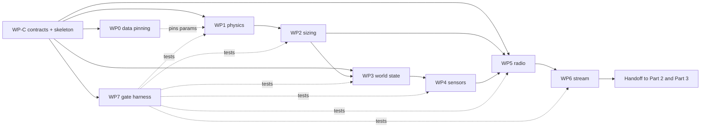

# 10 — Build Order v1

## 0. How to read this document

This is the **master plan**. It says what gets built, in what order, by whom, and what "done" means.

It does not contain interface details. Those live in `11-interface-contracts-v1.md`, which is the single source of truth for every function signature, file schema and data format. **Contracts win over prose.** If this document and the contracts file disagree, the contracts file is right.

Each work package has its own file in `work-packages/`. Every one of those files is self-contained: hand `WP3-world-state-engine.md` plus `11-interface-contracts-v1.md` to a fresh agent with no other context and it can start.

### Changes to the baseline since `09-network-and-layout-baseline-v1.md`

| Change | Effect |
|---|---|
| **Budget cap removed.** A22 is deleted. | §4 sizing loop condition drops `and cost <= cap`. Relaxation path K fires only on radio-link failure. G12 becomes a reporting requirement, not a pass/fail gate. |
| **Spacing set to 50 m** (was 40 m). | 30 Scouts (14 transverse + 17 longitudinal − 1 shared), 5 Anchors at 6 children each, 1 Gateway. Worst subsidence sampling error 32.6 mm, peak tilt error 1.9%. Cost ≈ ₹82,100, now informational only. |
| **Real data sourced.** | New WP0 sits ahead of everything. A1/A2/A6 promoted to SOURCED; A3/A4 flagged BROKEN pending repin. |

---

## 1. The one thing that changed the plan

Published field data exists for **the exact panel this system is modelled on**.

**Ramalingeswarudu, Dundra, Sastry & Murty (2022)**, *Journal of Mines, Metals and Fuels* 70(9):484–491, DOI `10.18311/jmmf/2022/32099`. Open access, CC BY-NC.

Adriyala longwall panel no. 1: 250 m face, 2333 m gate roadway, monitored for 12 months with survey monuments every 30 m along 80 transverse paths and 13 longitudinal paths, elevations recorded at 30-day intervals, one transverse path analysed out to 690 days. Maximum measured subsidence **1.267 m, or 19.5% of seam height**. An MPBX at the panel centre gives roof bed-separation correlated against the surface readings.

Two consequences:

1. **The survey layout is the node layout.** SCCL monitors with a transverse line plus a longitudinal line of fixed-spacing points. That is §3.2's travelling profile cross, derived independently from the Knothe sampling-error curve. Put this on a slide.
2. **A3 and A4 are wrong.** Measured `S_max / m = 0.195`. The baseline pair (`m = 3.0 m`, `a = 0.6`) predicts 1.63 m and implies `S_max/m = 0.54`. Both cannot be true. Table 1 of the paper carries the real extraction height. Until it is read, every synthetic value generated is off by a factor the team cannot quantify.

That is why WP0 blocks the acceptance of WP1, and why nothing gets trained on output generated before WP0 lands.

### Assumption register deltas

| Tag | Was | Now | Source |
|---|---|---|---|
| A1 panel 250 × 2500 m | OPEN | **SOURCED** | Two Adriyala panels of 250 m × 2500 m completed; 250 m face is the first that wide in Indian longwall. Open Decision 2 is closed — discard 750 × 350 permanently. |
| A2 depth 375 m | OPEN | **SOURCED** | Adriyala Longwall Project operates at 375 m with a 2×1152T powered support system. One source states 410 m for LW1; note the conflict, proceed with 375. |
| A6 advance 4.0 m/day | OPEN | **SOURCED** | Measured face advance at Adriyala LW1 varied between 2.7 and 4.8 m/day. |
| A3 seam 3.0 m | OPEN | **BROKEN — repin in WP0** | Inconsistent with measured 1.267 m at 19.5% of seam height. |
| A4 factor a = 0.6 | OPEN | **BROKEN — repin in WP0** | Same. |
| A22 budget cap | SOURCED | **DELETED** | Team decision, 2026-09-13. |

### Known model limitation, declare it rather than hide it

The Adriyala seam is inclined ~10° toward the tailgate, and the field profile shows a **higher angle of draw on the dip side**. The Knothe formulation in WP1 is symmetric and assumes a flat seam. Expect a systematic residual on one flank. Do not fudge it — report it in WP0's fit summary and list asymmetric draw as a v2 item.

### Why not InSAR

Rejected as the pinning source on physics, not effort. Sentinel-1 is C-band, ~2.8 cm of line-of-sight motion per fringe at a 6–12 day repeat. Adriyala's active trough moves ~1.27 m in a year, so the centre crosses multiple fringes between acquisitions and unwrapping fails exactly where the alarm matters. The literature agrees that mine subsidence detection is now mainly constrained by phase discontinuities from large deformation and temporal decorrelation, and that longwall mining produces large rapid displacements that cause loss of measurement points above the panels. Survey monuments do not wrap. InSAR is a v2 regional-context layer.

---

## 2. Repository layout

```
mine-sim/
├── AGENTS.md                       # repo invariants — every agent reads this first
├── pyproject.toml
├── config/
│   ├── assumptions.yaml            # every A-tag, one file, no number hardcoded elsewhere
│   └── mines/
│       ├── adriyala_lw1.yaml
│       └── illinois_lw.yaml
├── data/
│   ├── real/                       # digitised field measurements  (WP0)
│   └── fitted/                     # fitted parameter sets + residuals  (WP0)
├── src/minesim/
│   ├── config.py                   # WP1
│   ├── physics.py                  # WP1  ← the only S(x,y,t) in the repo
│   ├── fitting.py                  # WP0
│   ├── sizing.py                   # WP2
│   ├── world.py                    # WP3
│   ├── sensors.py                  # WP4
│   ├── provenance.py               # WP4
│   ├── packet.py                   # WP5
│   ├── radio.py                    # WP5
│   ├── stream.py                   # WP6
│   └── run.py                      # orchestrator
├── tests/
│   ├── gates/test_g01.py … test_g15.py
│   └── unit/
└── out/                            # nodes.csv, terrain_state, terrain_changes
```

---

## 3. Work packages

| WP | Name | Owner | Depends on | Blocks |
|---|---|---|---|---|
| **WP-C** | Contracts and skeleton | Claude (chat) + Adarsh | — | everything |
| **WP0** | Data pinning | Adarsh + Claude (chat) | WP-C | WP1 acceptance |
| **WP1** | Core physics `S(x,y,t)` | Claude Code | WP-C | WP2, WP3 |
| **WP2** | Sizing algorithm | Claude Code | WP1 | WP3, WP5 |
| **WP3** | World-state engine | Antigravity | WP-C (stubs) | WP4 |
| **WP4** | Sensor models + provenance | Antigravity | WP3 | WP5 |
| **WP5** | TDMA radio simulation | Antigravity | WP-C (stubs) | WP6 |
| **WP6** | Stream and output layer | Antigravity | WP5 | Part 3 handoff |
| **WP7** | Gate harness G1–G15 | Claude Code | WP-C | release |

### Dependency graph



The dotted WP0 edge is the point of the whole exercise: WP1's *code* does not wait on WP0, but WP1's *acceptance* does. Build against defaults, accept against real data.

### Parallel lanes after WP-C lands

| Lane | Packages | Agent | Runs independently because |
|---|---|---|---|
| **A** | WP0 | Adarsh + Claude (chat) | Pure data work, no repo code |
| **B** | WP1 → WP2 → WP7 | Claude Code | Maths-heavy and correctness-critical |
| **C** | WP3 → WP4 | Antigravity | Consumes WP1/WP2 through contract stubs |
| **D** | WP5 → WP6 | Antigravity | Radio sim needs only `Layout` and `Reading` shapes |

Lanes C and D are separate Antigravity workspaces. They must not both write `src/minesim/` files outside their own package list.

---

## 4. Schedule

Ten working days, `D0` is the day contracts land.

| Day | Lane A | Lane B | Lane C | Lane D |
|---|---|---|---|---|
| D0 | — | **WP-C: contracts + skeleton merged** | — | — |
| D1 | WP0 paper read, Table 1 → repin A3/A4 | WP1 physics | WP3 world state | WP5 packet + schedule |
| D2 | WP0 digitisation | WP1 + unit tests | WP3 delta log | WP5 loss model |
| D3 | WP0 Knothe fit, residual report | WP2 sizing | WP3 replay (G6) | WP5 failover (G10, G11) |
| D4 | **WP0 gate: G0 passes** | WP2 relaxation path | WP4 sensor models | WP5 duty check (G8, G9) |
| D5 | — | WP7 harness G1–G5 | WP4 provenance (G4, G5) | WP6 CSV writer |
| D6 | — | WP7 harness G6–G15 | WP4 noise + drift | WP6 WebSocket |
| D7 | **Integration day — all lanes merge, full run end-to-end** | | | |
| D8 | Repin from second dataset, prove mine-independence | | | |
| D9 | **Freeze. Handoff packets to Part 2 and Part 3.** | | | |

Integration on D7 is not optional and not movable. Four lanes that have never run together will not work together; find out on D7, not D9.

---

## 5. Gates

The fifteen gates from `09-network-and-layout-baseline-v1.md` §12 stand, with two amendments and one addition.

| Gate | Assertion | Owner |
|---|---|---|
| **G0** | **NEW.** Every A-tag marked BROKEN is repinned from a real dataset, and `data/fitted/*.json` records the fit residual | WP0 |
| G1 | Exactly one implementation of `S(x,y,t)` exists in the repository | WP1 |
| G2 | Sizing algorithm accepts no node-count input parameter | WP2 |
| G3 | Sizing algorithm emits a cost breakdown with every layout | WP2 |
| G4 | Every row in `nodes.csv` carries a provenance tag | WP4 |
| G5 | No `synthetic` value is generated from anything other than observed data behaviour | WP4 |
| G6 | Replaying `terrain_changes` from t=0 to T reproduces terrain at T bit-identically | WP3 |
| G7 | Dedup uses `(node_id, epoch)`; no use of `seq` as a key | WP5 |
| G8 | Anchor duty cycle ≤ 1% at the configured backbone SF | WP5 |
| G9 | Scout radio is in receive < 0.5 s per superframe | WP5 |
| G10 | Emergency sub-slot derives from child index, not node ID modulo | WP5 |
| G11 | No two children of one Anchor share an emergency sub-slot, under any ID assignment | WP5 |
| **G12** | **AMENDED.** Sizing emits a total cost with every layout. No cap comparison. Never fails on cost | WP2 |
| G13 | `z0` is never written after t=0; live Z comes only from the world-state engine | WP3 |
| G14 | No PINN output feeds any alarm decision | WP7 |
| **G15** | **AMENDED.** Changing any A-tag in `config/assumptions.yaml` re-runs sizing without a code change, and changing the mine file swaps mines without a code change | WP2 |

Gates live in `tests/gates/test_gNN.py`, one file per gate, each independently runnable. A gate that needs three other packages to be finished before it can run is a badly written gate — stub the dependency.

---

## 6. Locked decisions, restated

Carried unchanged from `09` §2. No agent may reverse these; if a package appears to require it, stop and escalate to Adarsh.

1. The world-state engine owns terrain truth, including the live Z of every node.
2. There is no PINN in this build.
3. No neural network in the safety path. The classical Knothe-fit detector is the only thing that raises an alarm.
4. Exactly one implementation of `S(x,y,t)` exists in the repository.
5. Node count is an output, never an input.
6. Every emitted value carries a provenance tag — `real`, `pinned`, or `synthetic`.
7. Synthetic values are generated only from the behaviour of data that exists.
8. The system is mine-independent. Adriyala is one example input, not a baseline.

---

## 7. Out of scope for Part 1

Do not build these, and do not let an agent drift into them.

| Not ours | Whose |
|---|---|
| ML model architecture, loss functions, training | Part 2 |
| Alarm thresholds and detector tuning | Part 2 |
| React dashboard, 3D rendering, camera controls | Part 3 |
| Firmware, PCB, procurement | Hardware, post-hackathon |
| Operator interventions — node kill, blast injection, collapse trigger | v2 |
| Environment knobs — rainfall, temperature, seasonality | v2 |
| InSAR regional context layer | v2 |
| Asymmetric angle of draw for inclined seams | v2 |

---

## 8. Open decisions still live

Each has a working default so nothing blocks.

1. **Travelling window vs fixed layout.** Default: travelling, 30 Scouts. Fixed across the full 2500 m roughly triples the count. With the budget cap gone, the only remaining argument for travelling is physical relocation effort. Needs a human call.
2. **Unit costs (A21).** Still estimates. Now informational only, so no longer urgent.
3. **Sensor baselines (A8 10 m rod, A9 30 m wire).** Still guesses. These set the strain integration length in WP4, so real values change output numbers, not architecture.
4. **GSR 564(E) duty cycle text.** A14 asserts the notification regulates power and bandwidth, not duty cycle, and that the 1% figure is a self-imposed engineering ceiling from LPWAN practice. One team member should read the actual notification before judging day.
5. **Depth conflict.** 375 m vs 410 m for Adriyala LW1 across two sources. Using 375. Resolve from the JMMF paper's Table 1 during WP0.
