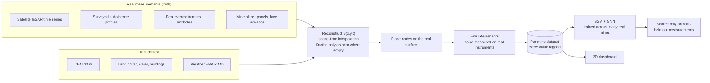

# Real-Mine Data Plan: from "maths makes the ground" to "measurements make the ground"

**Status:** PROPOSAL for Adarsh. Nothing here is built yet. Decisions are in §9.
**Date:** 2026-09-15 · **Author:** Claude Code (planner/checker)
**Read before this:** `../08-data-driven-terrain-simulator-concept.md` (old repo, 12 Sep). This plan is that concept, made concrete and scaled up.

---

## 1. What the old repo (`sih26/`) was, and what it believed

| Part | Where | What it did |
|---|---|---|
| Physics sandbox | `simulation/sandbox/` (5.9k lines) | Knothe influence **convolution** over an extraction mask (not the erf shortcut, so a moving face works), analytic derivative kernels for tilt/strain/curvature, real SRTM tile for Adriyala, 33 nodes, 6-stage sensor corruption, FastAPI + WS, React/Three.js 3D view |
| Multi-mine generator | `ml_dataset_generator/minegen/` (1.9k lines) | 100 **structurally different** synthetic mines (1.9 GB parquet): 6 node tiers, Poisson-disc placement biased per tier, anchor capacity ≤ 6, 60 s TDMA cadence, collapse events, **per-tick survival labels** |
| ML | `ml_dataset_generator/training/` | SSM (Mamba-style) + spatial GNN + hazard head, discrete-time survival loss, leakage guard (`truth_*` columns banned), three silent bugs already found and fixed. Pipeline verified, **never trained to convergence** |
| System | `backend/`, `dashboard_electron/`, `scripts/` | 6-box stack: sim → MQTT + Postgres → Express WS → Electron HMI (Leaflet map, sparklines, alarms, 90-day replay), C7 corrector + C8 deterministic alarm engine |

**The ideology, in eight lines:**
1. Many different mines, not one mine many times, so the GNN learns a function of position and neighbours, not one graph.
2. One latent ground surface; every channel is a derivative of it (tilt = ∂S, strain = ∂²S), never generated independently.
3. Things the ground cannot explain (trucks, weather, conveyor, blasts) get separate generators, so the model must separate them.
4. Classical detector owns the alarm; no neural net in the safety decision path.
5. Null ≠ zero: an absent channel is NULL, with a presence bit.
6. No leakage: noise-free truth is for debugging only, never a feature.
7. Placement by geology (tension band, fault corridor), then checked against radio.
8. **Its own final verdict (08 concept, §2):** all of this is a closed loop. Knothe makes the truth, sensors read Knothe, ML learns Knothe. It grades its own homework. **Real data must drive the terrain.**

## 2. What `sih-26-finale` became, honestly

- The "real data" is **283 points digitised from one paper** (JMMF 2022, one survey line S, 6 epochs) at **one mine**. Those fit 6 Knothe numbers, and then **Knothe generates everything else**: 690 days, 414,000 rows. The provenance tags are honest (only ~9% `pinned`), but the ground is still maths.
- Scale went **down**: from 100 mines (old) to 1 mine.
- The SSM+GNN survival model, the multi-mine generator, the dashboard and the alarm engine were all left behind.
- Wednesday's steps W1–W9 (blast, sinkhole, railway, pipe what-ifs) add **more invented scenarios on top of the maths**. They move away from real data, not towards it.

What is worth keeping from finale: `provenance.py` (real/pinned/synthetic tags), `fitting.py` (fitting a model to real profiles), `sizing.py`, `radio.py`, `stream.py`, the `config/mines/*.yaml` idea (one file per mine), CI, `run-simulation.sh`, 129 tests.

## 3. The one rule of the new build

> **Measured ground motion is the truth. Maths may only fill the gaps *between* measurements, and every filled value says so.**



## 4. Real data that actually exists (what gives scale)

Nothing public gives surface tilt/strain sensor readings from an Indian mine. Scale therefore comes from satellite ground motion and published survey data, and sensor behaviour comes from real instruments. Every row below is marked **[VERIFY]** until the Phase 0 spike downloads it.

| # | Source | What it gives | Scale | Use |
|---|---|---|---|---|
| R1 | **Copernicus EGMS** (European Ground Motion Service), Ortho L3 + Calibrated L2b | Real vertical + east-west displacement time series, ~6-day cadence, 2018→2023, free API | **Every active longwall in Upper Silesia (PL), Ostrava-Karviná (CZ), Ruhr/Saar (DE, post-mining), UK coalfields.** Hundreds of real subsidence bowls | **Main truth source at scale** |
| R2 | **EPISODES / IS-EPOS platform** (e.g. Upper Silesian Coal Basin / Bobrek mine episode) | Mining-induced seismic catalogue **plus mining progress** and ground-motion data, for the same mine | A few mines, but complete | Face-advance driver (old open decision #1) + real "event" labels |
| R3 | **Sentinel-1 InSAR over Indian coalfields**: COMET LiCSAR/LiCSBAS frames, ASF HyP3 on-demand | Real LOS displacement time series | Jharia, Raniganj, Godavari Valley (Adriyala), Talcher, Singrauli | India-specific truth; coherence in monsoon is the risk |
| R4 | **NSW (Australia) longwall end-of-panel subsidence reports** (public planning documents: Tahmoor, Dendrobium, Metropolitan, Hunter Valley mines) | Surveyed subsidence, tilt and strain along real survey lines, panel by panel | Dozens of panels, high precision (mm) | **Real strain and tilt**, which satellites cannot give; calibrates the tilt/strain derivation |
| R5 | Published profiles (Adriyala JMMF 2022, already have; Illinois/NIOSH; Chinese PS-InSAR + levelling papers) | Digitised profiles | Tens of panels | Pinning and validation; the finale digitising workflow scales here |
| R6 | **Your own hardware node** logging 24–48 h on a table, then outdoors | True MPU-6050 / ADXL355 noise, drift vs temperature, packet loss | The real thing | Replaces every `OPEN — guess` in `assumptions.yaml` |
| R7 | USGS landslide monitoring sites; Nevada Geodetic Lab GNSS series | Real extensometer, pore-pressure, soil-moisture, GNSS time series with rain | Many sites, years | Real noise, drift and rain response for 1C/2B/Gateway channels |
| R8 | Copernicus GLO-30 DEM, ESA WorldCover, JRC water, OSM buildings/roads, ERA5 | Terrain and exposure | Global | Terrain, placement exclusions, temperature/rain drivers |
| R9 | Polish mining-area geoportal (MIDAS), global mining polygons datasets | Mine and concession outlines | National/global | Find where the bowls are; mine IDs |

**Honest limits** (carried from 08 concept §6.3, still true):
- InSAR loses the fast bowl centre and vegetated ground. It is best on the slow edges, which is where the tension band is. Treat gaps as gaps.
- EGMS L3 is a 100 m grid: too coarse for a 57 m strain band. Use L2b points (denser) for strain, and R4 survey lines to check how much strain the grid smooths away.
- North-south motion is not measured. Strain in that direction is derived, and tagged `pinned` or `synthetic`.
- Real collapse or failure events are rare. The ML target has to change (§6.4).

## 5. What to copy, file by file

| From | File(s) | Verdict | Change needed |
|---|---|---|---|
| old | [surface.py](../simulation/sandbox/surface.py) convolution + analytic derivative kernels | **Keep** | Becomes the *prior* (gap-filler) and the tool that turns a displacement field into tilt/strain. No longer the truth |
| old | [dem.py](../simulation/sandbox/dem.py), [hypsometry.py](../simulation/sandbox/hypsometry.py) | **Adapt** | Load Copernicus GeoTIFF for any mine instead of one JSON tile |
| old | [sensors.py](../simulation/sandbox/sensors.py) NodePersonality + corruption chain | **Keep structure** | Every coefficient comes from R6/R7, not guesses |
| old | [minegen/layout.py](../ml_dataset_generator/minegen/layout.py) Poisson-disc, tier bias, anchor capacity | **Keep** | Tier zones come from the *measured* strain/tilt map of that mine |
| old | [minegen/labels.py](../ml_dataset_generator/minegen/labels.py), [SCHEMA.md](../ml_dataset_generator/SCHEMA.md) parquet-per-mine layout | **Keep** | Add `provenance` + `source_id` columns; labels from measurements (§6.4) |
| old | [training/](../ml_dataset_generator/training/) SSM + GNN survival, leakage guard | **Keep whole** | Retarget labels; split by mine; hold out real points |
| old | [docs/06 C7 corrector + C8 alarm](../docs/06-backend-c7-corrector-and-c8-alarm.md) | **Keep** | Thresholds checked against R4 real strain |
| old | `dashboard_electron/`, `simulation/frontend/` (TerrainMesh, terrainSampler) | **Keep for UI** | Mine picker; colour by provenance |
| old | `backend/` + Postgres + MQTT | **Later** | DEC-16 said no DB for Part 1. Bring it back only for the live/field phase |
| old | [minegen/field.py](../ml_dataset_generator/minegen/field.py), [collapse.py](../simulation/sandbox/collapse.py) | **Drop as truth** | field.py survives only as the tagged `synthetic` fallback; collapse.py (shape-fitting constants) goes |
| finale | `provenance.py`, `fitting.py`, `sizing.py`, `radio.py`, `stream.py`, `config/mines/*.yaml`, CI | **Keep** | `fitting.py` generalised from 1 line at 1 mine to N mines |
| finale | `steps/W1`–`W9` what-if scenarios | **Park** | Invented events. Not part of the real-data build |

## 6. Algorithms

### 6.1 Find real bowls (scale step, R1 + R9)
1. Download EGMS L3 vertical tiles for a coal basin.
2. Cumulative displacement map; mark cells below −30 mm/yr [tunable]; connected components.
3. For each component: fit an oriented rectangle as a candidate panel footprint, check it lies inside a mining area polygon, record its time of onset.
4. Each accepted component becomes a mine bundle `config/mines/<basin>_<id>.yaml` with `source: EGMS`.

Result: dozens to hundreds of **real** mines/panels without inventing geometry.

### 6.2 Reconstruct the truth surface S(x, y, t)
- **Data:** InSAR points (irregular in space, ~6–12 days in time), survey profiles.
- **Method:** space-time Gaussian-process (kriging) interpolation. Its mean function is a Knothe bowl **fitted to that mine's own data** (finale `fitting.py`), so where data is dense the measurements win, and where it is empty the fitted shape fills in.
- **Provenance per cell and time:** `real` (within a point's footprint and date), `pinned` (GP posterior std below a threshold), `synthetic` (prior dominates). The GP posterior std is stored too, so the ML side knows how sure the ground is.
- **Time between acquisitions:** interpolate to the 60 s sensor cadence with a monotone-in-subsidence spline, tagged `pinned`. Never invent motion faster than the data allows.
- **Tilt/strain:** convolve with old `surface.py` analytic kernels, or differentiate the GP analytically. Validate against R4 surveyed strain, reporting the smoothing loss as a number.

### 6.3 Emulate sensors from real behaviour
- Ground signal = reconstructed S and its derivatives at the node position.
- Noise, drift vs temperature, dropout = **fitted from R6 (our node) and R7 (USGS/NGL)**, with temperature from ERA5 at that mine and date. No datasheet guesses once R6 exists.
- Trucks, conveyor and blast vibration are kept as separate generators (old ideology #3), tagged `synthetic`.

### 6.4 ML target: labels that come from measurements
Invented collapses cannot be the label. Two targets, both computable from real data:
1. **Forecast:** at time t predict S at t + Δ (Δ = 6, 12, 24 days, matching InSAR revisits). Scored only against `real` values that arrive later.
2. **Exceedance survival:** time until the measured tilt/strain at a node first exceeds the DGMS limit (5.3 mm/m tensile). The old survival head and per-tick countdown labels work unchanged, but the event now comes from measured ground.
3. Where R2 gives real tremor catalogues: a third head, "time to next M ≥ x event".

**Evaluation:** split by **mine** (leave-basin-out: train Silesia, test on Czech or Indian mines), loss weighted real > pinned > synthetic, plus the checks already agreed in 08 concept §9 (delayed truth, leave-one-node-out, physics sanity, calibration).

## 7. Dataset

Old per-mine parquet layout, extended:

```
dataset/<mine_id>/
  metadata.json        # source bundle, DOIs/URLs, fit quality, coverage %, date range
  surface.zarr         # S, sigma_S, tilt, strain on a grid over time + provenance mask
  nodes.parquet        # node_id, tier, x, y, lat, lon, placement_reason
  readings.parquet     # node_id, epoch, channels..., provenance, source_id
  real_points.parquet  # raw measurements untouched (the only scoring truth)
  labels.parquet       # forecast targets + exceedance countdown, from real data
  events.parquet       # real tremors/sinkholes where available
```

Targets (to confirm in Phase 0): **3 mines** in Phase 1, **≥ 50 real panels** in Phase 2, versus 1 mine now and 100 synthetic mines in the old repo.

## 8. Phases

| Phase | Goal | Output | Done when |
|---|---|---|---|
| **0: Feasibility spike** (1–2 days) | Download a real sample from R1, R2, R3, R4 over one area each | Feasibility table replacing every [VERIFY] | Real files on disk and a coverage % per source |
| **1: Three real mines** | Adriyala (digitised + LiCSBAS attempt), one Silesian EGMS panel, one NSW surveyed panel | 3 bundles, reconstruction, provenance maps | Reconstruction validates against held-out real points; strain checked vs NSW survey |
| **2: Scale** | Bowl finder over a whole basin | ≥ 50 panels in the dataset format | Automated, CI builds a 2-mine subset |
| **3: Sensors from reality** | Log our node (R6), fit noise from R6/R7 | `assumptions.yaml` with no `OPEN — guess` lines for noise | Emulated noise PSD matches the logged PSD |
| **4: Train** | Old SSM+GNN retargeted | Leave-basin-out scores | Beats persistence and fitted-Knothe baselines on real held-out points |
| **5: Dashboard + live** | Old Electron/3D UI with mine picker and provenance overlay; bring back MQTT/DB for field | Demo on real mines | A judge can click any value and see its source |

## 9. Decisions needed from Adarsh

1. **Timeline:** does this replace the Tue/Wed sprint (T1–T4, W1–W9), or start after tonight's demo?
2. **Non-Indian data:** OK to train on Polish/Czech/Australian real mines and test on Indian ones? That is the only way to get real data at scale.
3. **ML target:** switch from invented-collapse survival to forecast + measured-exceedance survival (§6.4)?
4. **Hardware logging (R6):** can the team run one node for 24–48 h this week?
5. **Accounts:** Copernicus/EGMS and NASA Earthdata (for ASF HyP3) sign-ups are needed by a person. Who?
