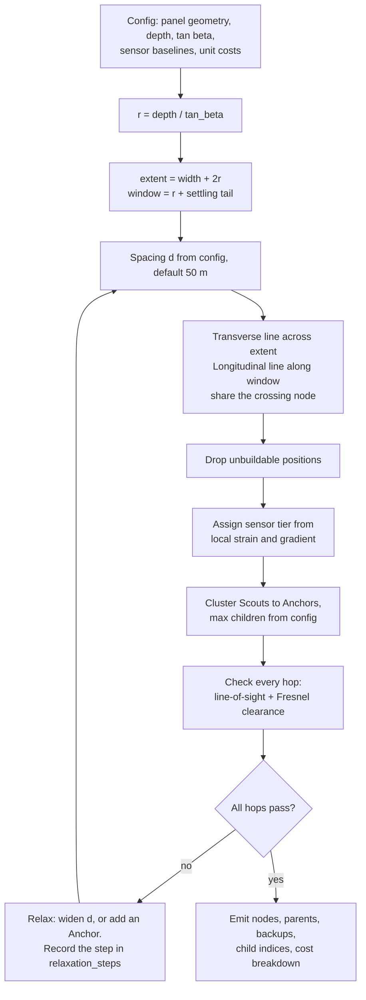

# WP2 — Sizing Algorithm

| | |
|---|---|
| **Owner** | Claude Code (Lane B) |
| **Depends on** | WP1 |
| **Blocks** | WP3, WP5 |
| **Days** | D3–D4 |
| **Gates** | G2, G3, G12, G15 |

## Goal

Given a mine, compute where the nodes go, how many there are, what sensor each carries, which Anchor each reports to, and what it all costs. **Node count is an output.** Feed it a different mine file and it produces a different, correct network with no code change.

## Files owned

```
src/minesim/sizing.py
tests/unit/test_sizing.py
tests/gates/test_g02.py
tests/gates/test_g03.py
tests/gates/test_g12.py
tests/gates/test_g15.py
```

## Signature

```python
def size_network(cfg: Config) -> Layout
```

**One argument.** No `n_nodes`, no `target_count`, no `max_nodes`, not even with a default value — G2 is a signature inspection test and a defaulted parameter still fails it. If you find yourself wanting one, the sizing logic is incomplete.

## Algorithm



**The loop condition is radio only.** The budget cap (A22) is deleted, so there is no `and cost <= cap` branch and no cost-driven relaxation. Cost is still computed and still emitted with every layout — it is reporting, not a constraint. That is the G12 amendment.

### Expected output at the current baseline

Spacing 50 m, extent 625 m, window 787.5 m:

| | |
|---|---|
| Transverse line | 14 Scouts |
| Longitudinal line | 17 Scouts |
| Shared at crossing | −1 |
| **Total Scouts** | **30** |
| Anchors | 5, at 6 children each |
| Gateway | 1 |
| Worst subsidence sampling error | 32.6 mm |
| Peak tilt error | 1.9% |
| Total cost | ≈ ₹82,100, informational |

For context, the spacing sensitivity that set this choice:

| Spacing | Worst subsidence error | Peak tilt error |
|---|---|---|
| 25 m | 18.0 mm | 1.5% |
| 40 m | 21.2 mm | 1.5% |
| **50 m** | **32.6 mm** | **1.9%** |
| 60 m | 46.5 mm | 7.1% |
| 100 m | 117.7 mm | 10.9% |

Nothing meaningful is gained below 40 m and error climbs sharply past 50 m. With the cap removed, 50 m is a deliberate simplicity choice rather than a cost-forced one — be ready to say so.

### Tier assignment

Placed by what the ground does there, not uniformly. Evaluate `physics.strain` and `physics.tilt` at each position at the time of maximum gradient, then:

| Tier | Sensor | Placed where |
|---|---|---|
| 1A | MPU-6050 tilt only | Flat trough bottom and far edges — low gradient, secondary vote only |
| 1B | Foil strain gauge on 10 m rod + slide potentiometer | Mid-slope band, high subsidence gradient |
| 1C | Wire extensometer, 30 m baseline | Peak-strain band near the inflection point |

Thresholds between bands come from percentiles of the computed strain field, not from hardcoded numbers — a different mine has a different strain magnitude and the split must follow it.

### Anchor clustering and IDs

Gateway is node 0. Anchors are 1–99. Scouts are 100+.

Each Scout gets `parent_id`, `backup_parent_id` and `child_index` (0 to `max_children_per_anchor - 1`). **`child_index` is unique within a parent by construction** and is what WP5 uses for emergency sub-slots. Never derive behaviour from the numeric value of a `node_id`.

### Link check

Treat a link as a fat invisible tube between antennas, not a thin line — ground intruding into the tube kills the signal even with clear visual line of sight.

| Hop | First Fresnel radius at midpoint | Height to clear 60% |
|---|---|---|
| 40 m | 1.86 m | 1.11 m |
| 150 m | 3.60 m | 2.16 m |
| 1000 m | 9.30 m | 5.58 m |
| 3000 m | 16.11 m | 9.67 m |

So "3 km range" is real only from a ~10 m mast, which is why the Gateway gets one. Scouts and Anchors at 2.0 m clear their short hops comfortably — the 40 m hop has 86 dB of margin over SF7 sensitivity, the 150 m hop has 74 dB.

At 865 MHz rain and dust are practically irrelevant; **vegetation and terrain are what matter**. Do not write a dust attenuation term, and do not let the pitch claim the link punches through dust — it survives on margin.

For v1 the terrain is flat, so the link check will pass trivially. Implement it properly anyway: it is the relaxation trigger, and on a real site it is the only thing that fires.

## Tests

| Test | Assertion |
|---|---|
| Count | 30 Scouts, 5 Anchors, 1 Gateway at 50 m spacing |
| Spacing sensitivity | 40 m yields 37 Scouts; 60 m yields fewer than 30 |
| Coverage | Transverse line spans the full 625 m extent |
| Child index | Unique within each parent; range 0 to max−1 |
| Backup parent | Every Scout has one, and it differs from its primary |
| Tier mix | 1C nodes sit nearer the inflection point than 1A nodes |
| Cost | Breakdown sums to the total; every tier present in the layout appears |
| Determinism | Same config in, identical layout out |

### Gate tests

- **G2** — `inspect.signature(size_network)` has exactly one parameter, and no parameter name matches `/node|count|n_|num/i`.
- **G3** — every `Layout` returned carries a non-empty `CostBreakdown`.
- **G12** — cost is emitted; **and** a config with absurdly high unit costs still returns a valid layout rather than failing. Cost never fails the algorithm.
- **G15** — mutate a spacing value in `assumptions.yaml`, re-run, get a different node count with no code change. Then swap `mine:` to `illinois_lw` and get a valid different layout. Both without touching `src/`.

## Definition of done

- [ ] All tests above pass
- [ ] G2, G3, G12, G15 pass
- [ ] `relaxation_steps` records every spacing change with its reason
- [ ] Running against a second mine file produces a valid layout with no code change
- [ ] No numeric constant from the assumption register appears in the file

## Do not

- Accept a node count, in any form, under any name.
- Reintroduce a budget cap or any cost-based failure branch.
- Hardcode tier-assignment thresholds.
- Derive sub-slot, channel or any behaviour from `node_id` arithmetic.
- Implement node relocation as the face advances. The travelling-window-versus-fixed question is Open Decision 1 and the default is travelling; relocation logistics are not Part 1's problem.
