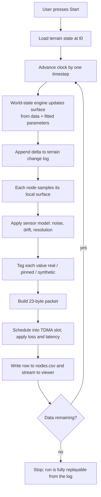

# WP6 — Stream and Output Layer

| | |
|---|---|
| **Owner** | Antigravity (Lane D) |
| **Depends on** | WP5 |
| **Blocks** | handoff to Part 2 and Part 3 |
| **Days** | D5–D6 |
| **Gates** | supports G4, G6 |

## Goal

Write the three artefacts that let a run be replayed and inspected at any point in time, and stream frames live to the Part 3 dashboard.

This is the only package that touches disk and network. Everything upstream returns objects.

## Files owned

```
src/minesim/stream.py
src/minesim/run.py
tests/unit/test_stream.py
```

## The three artefacts

| File | Contents |
|---|---|
| `out/nodes.csv` | One row per node per superframe: readings, provenance, radio outcome |
| `out/terrain_state.npz` | Full terrain surface at t = 0 |
| `out/terrain_changes.jsonl` | Ordered log of surface deltas, one line per timestep |

Replaying the change log from t=0 up to any time T reconstructs the exact terrain at T. That is the mechanism for scrubbing backwards and forwards in the 3D view, and the reproducibility guarantee for Part 2's A/B tests.

### `nodes.csv`

Column order is binding — Part 2 parses positionally.

```
epoch,t_s,node_id,tier,x_m,y_m,z0_mm,subsidence_mm,subsidence_prov,
tilt_x_urad,tilt_y_urad,tilt_prov,strain_ustrain,strain_prov,
disp_mm,disp_prov,battery_mv,rssi_dbm,parent_used,delivered,via_emergency
```

Empty string for sensor fields a tier does not carry. **Every value column has a paired `_prov` column** — not optional, that is G4.

**Rows are written for undelivered packets too**, with `delivered=false`. A missing row is indistinguishable from a node that never existed; an explicit `delivered=false` row tells Part 2 a reading was attempted and lost. Gaps are a normal operating condition, not an error case.

Write incrementally, flushing per epoch. A 690-day run at 60 s frames is ~993,600 frames × 30 nodes — do not build the whole thing in memory.

### `terrain_changes.jsonl`

One JSON object per line, one line per timestep, in strict order.

```json
{"epoch": 1, "t_s": 3600.0, "cells": [[120, 44, -3], [120, 45, -4]]}
```

Integer millimetres, straight from WP3's `Delta`. Do not reformat, round or compress the values — G6's exact-replay guarantee depends on these integers surviving the round trip unchanged. A zero-motion timestep writes a line with an empty `cells` array, never no line.

### `terrain_state.npz`

Grid origin, cell size, shape, and the `int32` elevation array at t=0. This plus the change log is the complete state.

## WebSocket

FastAPI, endpoint `/ws/run`. One message per simulated superframe.

```json
{
  "type": "frame",
  "epoch": 1,
  "t_s": 3600.0,
  "sim_days": 0.042,
  "face_x_m": 4.0,
  "deltas": [[120, 44, -3]],
  "nodes": [
    {"node_id": 100, "subsidence_mm": -3.2, "prov": "pinned",
     "tilt_urad": [1.1, -0.4], "strain_ustrain": null,
     "delivered": true, "rssi_dbm": -37.0}
  ]
}
```

Client control messages: `{"type": "start", "from_day": 0}`, `{"type": "pause"}`, `{"type": "seek", "to_day": 120}`.

### There is no click-to-subside

The client can start, pause and seek. It **cannot deform the ground**. Deformation is driven by data and fitted parameters, never by operator clicks. If Part 3 asks for a "trigger collapse" button, the answer is that it is a v2 operator-intervention feature and it does not go in the physics path.

Seeking works by replaying the change log from t=0 to the target, which is exactly why G6's bit-identical guarantee matters.

## Run loop

`run.py` orchestrates. This is the loop from `09-network-and-layout-baseline-v1.md` §9, unchanged:



Pressing Start begins replay from a chosen date and runs forward to wherever the data ends. The terrain deforms continuously, like video, and the user rotates and inspects in 3D throughout.

## Handoff artefacts

At the end of a run, write `out/run_summary.json`:

- Config hash, mine name, fitted-parameter source DOI
- Node count by tier, total cost
- Total frames, total packets, delivery rate
- **Provenance breakdown: counts and percentages of `real` / `pinned` / `synthetic`**
- Duty cycle achieved per tier
- Fit residual carried through from `data/fitted/*.json`

That provenance breakdown is the number that goes in the pitch. It will show a small `real` fraction. Report it anyway — a simulator claiming 100% real data is lying, and a judge who asks will respect the honest answer.

## Tests

| Test | Assertion |
|---|---|
| Column order | Header matches the contract exactly |
| Paired provenance | Every value column has a populated `_prov` neighbour |
| Undelivered rows | Forcing 100% packet loss still writes a full row set |
| Round trip | `terrain_changes.jsonl` parsed back reproduces the deltas exactly |
| Zero-motion line | A timestep with no movement still writes a line |
| Memory | A long run does not accumulate frames in memory |
| WebSocket | A test client receives frames in epoch order with no gaps |
| Seek | Seeking to day 120 yields the same terrain as running to day 120 |

## Definition of done

- [ ] Three artefacts written in the contract's formats
- [ ] WebSocket streams frames and handles start / pause / seek
- [ ] `run_summary.json` written with the provenance breakdown
- [ ] 690-day run completes without memory growth
- [ ] Part 3 can connect and render from the stream alone
- [ ] No numeric constant from the assumption register in the file

## Do not

- Round, reformat or compress `dz_mm` values.
- Skip rows for undelivered packets.
- Buffer a whole run in memory.
- Add a collapse trigger, blast injection or node-kill endpoint. All v2.
- Filter or smooth readings before writing. Part 2 wants the raw mess.
- Add authentication, deployment config or hosting concerns. Out of scope for Part 1.
