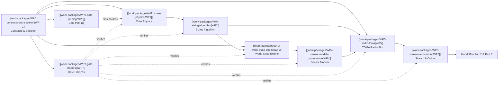

# Master Build Order & Work Distribution

Master coordination plan for the SIH 2025/26 Mine Subsidence Simulator (Part 1 Build). Defines the work package allocations, dependency structure, 10-day execution schedule, and acceptance gates.

---

## 1. Key Baseline Decisions

| Change | Impact | Technical Rationale |
|---|---|---|
| **Budget Cap Removed** (A22 Deleted) | §4 sizing loop condition drops `and cost <= cap`. Relaxation path fires only on RF link failure. | Sizing is strictly dictated by ground physics and radio Fresnel clearance. [[gates/G12-cost-reporting-without-budget-cap\|Gate G12]] becomes an informational cost output. |
| **Grid Spacing Set to 50 m** (was 40 m) | Yields **30 Scouts** (14 transverse + 17 longitudinal − 1 shared), 5 Anchors (6 children each), 1 Gateway. | Sampling error is $32.6\text{ mm}$ and peak tilt error is $1.9\%$. Total cost $\approx ₹82,100$. |
| **Real Field Data Sourced** | Adriyala LW1 field survey paper sourced (`10.18311/jmmf/2022/32099`). | A1, A2, A6 promoted to SOURCED. A3 ($m$) and A4 ($a$) flagged BROKEN pending repinning in [[work-packages/WP0-data-pinning\|WP0]]. |

---

## 2. Empirical Ground Truth Discovery

Field data published in **Ramalingeswarudu et al. (2022)** (*JMMF* 70(9):484–491, DOI `10.18311/jmmf/2022/32099`) provides the exact parameters for Adriyala Longwall Panel 1:
- Face width: $250\text{ m}$; Gate roadway: $2333\text{ m}$.
- Monitored for 12 months with survey monuments every $30\text{ m}$ along 80 transverse and 13 longitudinal paths.
- **Maximum measured subsidence:** **$1.267\text{ m}$, or $19.5\%$ of seam height**.
- **Critical Contradiction:** Pre-WP0 baseline pair ($m = 3.0\text{ m}, a = 0.6$) predicted $1.63\text{ m}$ ($54\%$ of seam height). Real field data proves this is wrong by nearly $3\times$. WP0 repins these values before acceptance of WP1.
- **Convergent Layout Validation:** SCCL monitors panels with a transverse line plus a longitudinal line of monuments — identical to the travelling profile cross derived from our Knothe error curves.

---

## 3. Work Package Dependency Matrix

---

## 4. Parallel Work Lanes

| Lane | Packages | Agent / Owner | Isolation & Decoupling Strategy |
|---|---|---|---|
| **Lane A** | [[work-packages/WP0-data-pinning\|WP0]] | [[people/adarsh-agarwala\|Adarsh]] + Claude Chat | Pure empirical data digitisation and curve-fitting; touches no `src/minesim/` code. |
| **Lane B** | [[work-packages/WP1-core-physics\|WP1]] $\to$ [[work-packages/WP2-sizing-algorithm\|WP2]] $\to$ [[work-packages/WP7-gate-harness\|WP7]] | [[people/claude-code\|Claude Code]] | Maths-heavy, correctness-critical. Owns `physics.py`, `sizing.py`, and test harness. |
| **Lane C** | [[work-packages/WP3-world-state-engine\|WP3]] $\to$ [[work-packages/WP4-sensor-models-provenance\|WP4]] | [[people/antigravity\|Antigravity]] | Consumes Lane B types via frozen stubs. Owns integer mm grid, delta log, and provenance. |
| **Lane D** | [[work-packages/WP5-radio-tdma\|WP5]] $\to$ [[work-packages/WP6-stream-and-output\|WP6]] | [[people/antigravity\|Antigravity]] | Consumes `Layout` and `Reading` dataclass shapes. Owns LoRa scheduler and CSV/WS output. |

---

## 5. Ten-Day Master Schedule

| Day | Lane A (Data) | Lane B (Physics & Sizing) | Lane C (World & Sensors) | Lane D (Radio & Stream) |
|---|---|---|---|---|
| **D0** | — | **[[work-packages/WPC-contracts-and-skeleton\|WP-C]]: Scaffolding & Stubs Merged** | — | — |
| **D1** | Read JMMF Table 1, repin A3/A4 | WP1 Physics implementation | WP3 World-state grid setup | WP5 Packet & superframe schedule |
| **D2** | WebPlotDigitizer on Figs 6 & 7 | WP1 Unit tests & derivatives | WP3 Delta log accumulation | WP5 Channel loss & airtimes |
| **D3** | Knothe least-squares fit script | WP2 Sizing layout algorithm | WP3 Replay engine (`G06`) | WP5 Failover & dedup (`G10`, `G11`) |
| **D4** | **Gate [[gates/G00-data-pinning\|G00]] Passes** | WP2 Fresnel & relaxation | WP4 Sensor noise models | WP5 Duty ceiling (`G08`, `G09`) |
| **D5** | — | WP7 Harness (`G01`–`G05`) | WP4 Provenance tags (`G04`, `G05`) | WP6 CSV streaming writer |
| **D6** | — | WP7 Harness (`G06`–`G15`) | WP4 Thermal drift simulation | WP6 WebSocket live server |
| **D7** | **Integration Day — All lanes merge; 690-day end-to-end simulation run** | | | |
| **D8** | Secondary mine fitting (Illinois) | Bug fixes & performance tuning | Performance audit (<60s run) | Client test script verification |
| **D9** | **Freeze. Handoff datasets and streams to Part 2 and Part 3.** | | | |

---

## 6. Scope Boundaries (Part 1 Exclusions)

The following items are strictly out-of-scope for the Part 1 simulator:

| Excluded Feature | Responsible Party | Reason |
|---|---|---|
| ML architecture, loss functions, PINN training | Part 2 Team | Forbidden by Invariant 2 & 3. |
| Alarm thresholds, classifier tuning | Part 2 Team | Classical Knothe fit detector is in Part 2. |
| React UI, Three.js 3D rendering, camera controls | Part 3 Team | Downstream visual consumers. |
| PCB design, firmware, procurement | Hardware Team | Post-hackathon deployment. |
| Operator interventions (blast injection, manual collapse) | v2 Release | Prevents ungrounded deformation. |
| Environmental dynamics (rainfall, seasonal groundwater) | v2 Release | Deferred to future InSAR layers. |
| Asymmetric draw angle for inclined seam | v2 Release | Documented as known residual. |

---

## 7. Open Decisions Register

1. **Travelling Window vs Fixed Layout:** Default: travelling window (30 Scouts). A fixed layout across 2500 m triples node count.
2. **Unit Costs (A21):** Informational estimates (cap removed).
3. **Sensor Integration Baselines (A8, A9):** Rod (10 m) and wire (30 m) set finite difference intervals in WP4.
4. **GSR 564(E) Regulatory Text:** Notification restricts power/bandwidth; 1% duty cycle is self-imposed engineering limit.
5. **Adriyala Depth Ambiguity:** 375 m vs 410 m across literature; using 375 m per JMMF Table 1.

---

## 8. Proposed Scope Change — Sprint 2026-09-14 (Claude Code)

§6 excludes "React UI, Three.js 3D rendering" from Part 1. `files/RECOMMENDATIONS.md` proposes a Part 1-owned **Consequence Renderer** ([[work-packages/WP8-consequence-renderer|WP8]]). If DEC-5 is ratified in [[projects/subsidence-simulator/decisions]], that exclusion narrows to "the full operator/planner/regulator dashboard (Part 3)". WP8 stays a read-only consumer outside `mine-sim/`. The ten-day schedule in §5 is superseded in practice by the three-day sprint recorded in [[changelog/2026-09-13-claude-code-three-day-sprint-plan]]; this note keeps the original schedule as the spec record.
