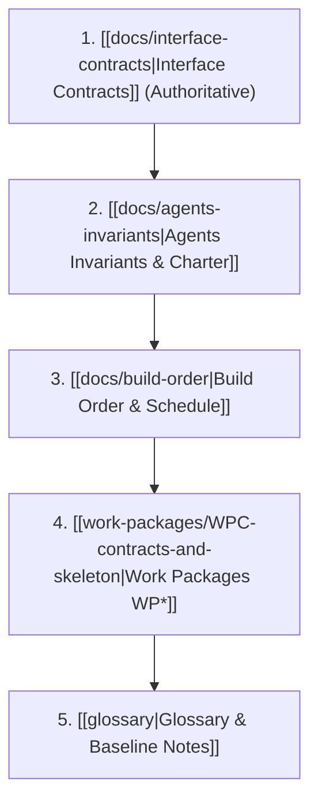

# Start Here — Part 1 Build Plan & Kickoff Guide

Everything needed to start development on the **SIH 2025/26 Mine Subsidence Early-Warning System (Part 1 Simulation & Synthetic Data Generation)**, split across four parallel lanes.

> [!TIP]
> **Explainer Guides for Humans & Judges:**
> - 📘 **[[docs/master-process-explainer|Master Process Explainer]]**: The big-picture overview, 4-stage simulator pipeline, and file-by-file guide with simple analogies.
> - 🔬 **[[docs/wp0-data-pinning-guide|WP0 Field Data Guide]]**: The Adriyala mine 3x error, Ramalingeswarudu (2022) data extraction, and fitting workflow.
> - ⚖️ **[[docs/architectural-decisions-and-analogies|Architectural Decisions & Analogies]]**: Why no PINNs, why integer millimeters, dedup keys, and collision-free emergency slots.

---

## 1. Specification Precedence Hierarchy

When questions or conflicts arise during implementation, the following precedence order is absolute:

> [!IMPORTANT]
> **Contracts Win Over Prose Everywhere.** If a work package description, build order prose, or concept note disagrees with `[[docs/interface-contracts]]`, the contracts file is right.

---

## 2. Order of Operations

1. **D0 — WP-C Scaffolding (Together):** Run `[[work-packages/WPC-contracts-and-skeleton|WP-C]]`. Nothing else starts until the directory skeleton, config loader, dataclasses, and function stubs are merged.
2. **D1–D4 — Split Four Ways (Independent Parallel Lanes):**
   - **Lane A:** `[[work-packages/WP0-data-pinning|WP0]]` (Data Pinning) — Adarsh + Claude Chat.
   - **Lane B:** `[[work-packages/WP1-core-physics|WP1]]` (Core Physics) $\to$ `[[work-packages/WP2-sizing-algorithm|WP2]]` (Sizing) — Claude Code.
   - **Lane C:** `[[work-packages/WP3-world-state-engine|WP3]]` (World State) $\to$ `[[work-packages/WP4-sensor-models-provenance|WP4]]` (Sensors) — Antigravity.
   - **Lane D:** `[[work-packages/WP5-radio-tdma|WP5]]` (TDMA Radio) $\to$ `[[work-packages/WP6-stream-and-output|WP6]]` (Stream Output) — Antigravity.
3. **D4 — G0 Checkpoint:** `[[gates/G00-data-pinning|Gate G0]]` must pass. Until it passes, no simulated output may be used for Part 2 training.
4. **D5–D6 — Harness & Validation:** `[[work-packages/WP7-gate-harness|WP7]]` implements Gate G14, collects G1–G15, and runs unit batteries.
5. **D7 — Integration Day (Mandatory):** All four lanes merge into `main`. Full 690-day simulation executed end-to-end.
6. **D9 — Freeze & Handoff:** Package outputs frozen and delivered to Part 2 (Forecasting ML) and Part 3 (React 3D Dashboard).

---

## 3. Kickoff Prompts for Parallel Agents

Copy these prompts verbatim when initializing an agent session:

### Lane B: Claude Code
> Attached: `[[docs/agents-invariants]]`, `[[docs/interface-contracts]]`, `[[work-packages/WP1-core-physics]]`, `[[work-packages/WP2-sizing-algorithm]]`, `[[work-packages/WP7-gate-harness]]`.
>
> You own Lane B of a mine subsidence simulator. Build WP1, then WP2, then WP7, in that order. Read `[[docs/agents-invariants]]` first — the eight invariants are not negotiable. `[[docs/interface-contracts]]` is authoritative: if a work package and the contract disagree, the contract wins.
>
> Only edit the files listed under "Files owned" in your work packages. Three other lanes are building in parallel against the same contracts, and a helpful fix outside your files costs more than it saves. If a contract cannot be implemented as written, stop and explain why rather than changing its shape.
>
> Note that the Knothe parameters `subsidence_factor` and `seam_thickness_m` are `null` in the config until WP0 lands. Build against temporary values, but never commit a default that substitutes for them — `load_config()` raising `UnpinnedParameterError` is the intended behaviour, not a bug to work around.
>
> Start with WP1. Show me the physics module and its tests before moving to WP2.

### Lane C: Antigravity
> Attached: `[[docs/agents-invariants]]`, `[[docs/interface-contracts]]`, `[[work-packages/WP3-world-state-engine]]`, `[[work-packages/WP4-sensor-models-provenance]]`.
>
> You own Lane C of a mine subsidence simulator. Build WP3, then WP4. Read `[[docs/agents-invariants]]` first — the eight invariants are not negotiable. `[[docs/interface-contracts]]` is authoritative.
>
> Only edit the files listed under "Files owned". Lane B owns `physics.py` and `sizing.py` — import them, never edit them. They may still be `NotImplementedError` stubs when you start; build against their signatures and type annotations.
>
> The single most important decision in WP3 is that the accumulating terrain grid is `int32` millimetres, not floats. Gate G6 asserts bit-identical replay over a 690-day run, and float accumulation will fail it.
>
> Start with WP3. Show me `world.py` and the G6 replay test before moving to WP4.

### Lane D: Antigravity
> Attached: `[[docs/agents-invariants]]`, `[[docs/interface-contracts]]`, `[[work-packages/WP5-radio-tdma]]`, `[[work-packages/WP6-stream-and-output]]`.
>
> You own Lane D of a mine subsidence simulator. Build WP5, then WP6. Read `[[docs/agents-invariants]]` first — the eight invariants are not negotiable. `[[docs/interface-contracts]]` is authoritative.
>
> Only edit the files listed under "Files owned". You depend on Lane B and Lane C only through the `Layout` and `Reading` dataclass shapes, so you can build the entire radio simulation against stubs without waiting for them.
>
> WP5 exists to not have three specific bugs: the dedup key must be `(node_id, epoch)` and never `seq`; the emergency sub-slot must come from `child_index` and never `node_id % 16`; and per-device ACKs must not exist. Gates G7, G10 and G11 test all three, and G11 is exhaustive over adversarial ID assignments.
>
> Start with WP5. Show me `radio.py` with G7, G10 and G11 passing before moving to WP6.

---

## 4. Three Fatal Risks That Will Kill This Build If Ignored

1. **Floating-point Accumulation in Terrain Grid:** Floats drift over ~16,500 hourly accumulations per cell, causing `[[gates/G06-bit-identical-terrain-replay|Gate G6]]` to fail on D7 when there is no time to refactor. The grid MUST use `np.int32` millimetres.
2. **Contract Drift:** If any lane quietly modifies a field name, adds an argument, or alters a dataclass, three other lanes break silently at integration.
3. **Late WP0 Data Pinning:** Building against guessed Knothe parameters ($a=0.6, m=3.0\text{ m}$) generates data that is wrong by a factor of three ($S_{max}/m = 0.195$ measured at Adriyala). WP0 must pass `[[gates/G00-data-pinning|Gate G0]]` by D4.

---

## 5. Master Links & Resources

- **Governance Rules:** [[RULES]]
- **Full Architecture & Interfaces:** [[docs/interface-contracts]]
- **Detailed Build Order:** [[docs/build-order]]
- **Invariants & Working Rules:** [[docs/agents-invariants]]
- **Assumptions:** [[docs/assumption-register]]
- **Test Gate Registry:** [[docs/gates-registry]]
- **Project Charter:** [[projects/subsidence-simulator/overview]]
- **People Profiles:** [[people/adarsh-agarwala]], [[people/claude-code]], [[people/antigravity]]
