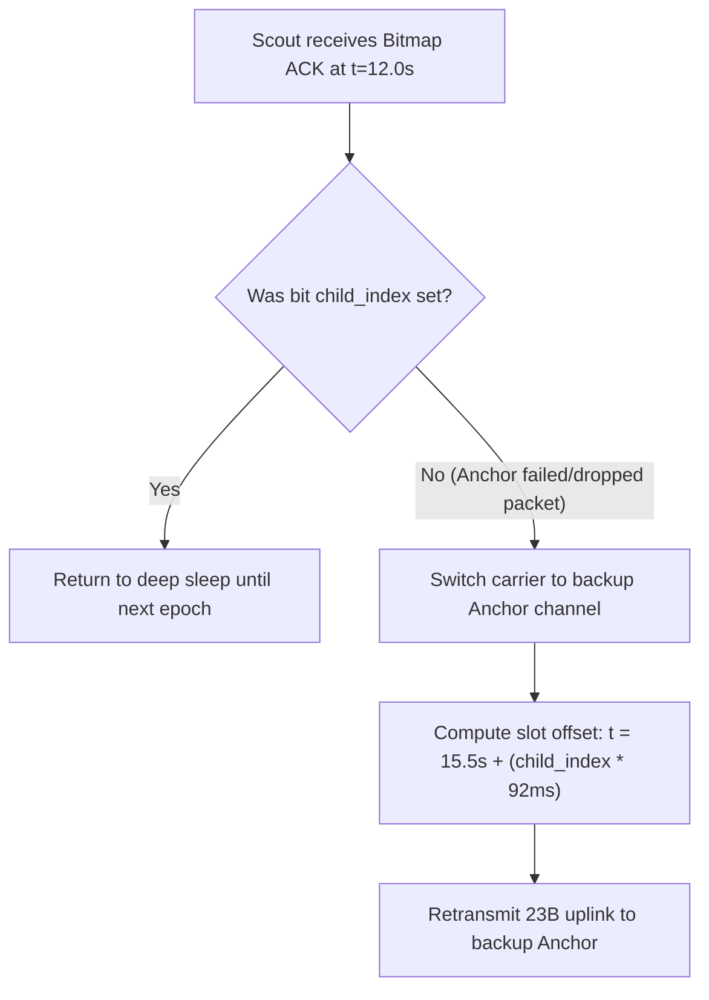

# Emergency Failover, Bitmap ACKs & Deduplication

Deep-dive into the error-recovery and deduplication mechanisms implemented in `src/minesim/radio.py` to prevent data corruption and RF congestion during node or relay failures.

---

## 1. Bitmap Acknowledgement Architecture

Instead of transmitting individual per-device ACKs (which would consume $6 \times 36.1\text{ ms} = 216.6\text{ ms}$ and push Anchors beyond the $1.0\%$ duty cycle ceiling):
- At $t = 12.0\text{ s}$, the Anchor broadcasts a single **6-byte Bitmap ACK** at SF7 ($36.1\text{ ms}$).
- Payload structure:
  - 2 Bytes: Anchor ID & Epoch number.
  - 1 Byte: Received bitmap (Bit $k=1$ indicates Scout with `child_index=k` was successfully received).
  - 1 Byte: Channel hop / schedule directive.
  - 2 Bytes: CRC16.
- Scouts wake on timer at $t=12.0\text{ s}$, inspect bit `child_index`. If bit is 0, Scout triggers emergency failover.

---

## 2. Emergency Failover Sub-Slot Allocation

Because emergency slots are parameterized by `node.child_index` ($0..7$), all siblings in a cluster transmit in distinct, orthogonal time offsets, completely preventing hash collisions (enforced by [[gates/G10-emergency-slot-from-child-index|Gate G10]] and [[gates/G11-no-emergency-subslot-collisions|Gate G11]]).

---

## 3. The Reboot-Safe Deduplication Invariant (Gate G07)

> [!CAUTION]
> **Why Sequence Numbers (`seq`) Fail in Field Sensor Networks:**
> When a micro-controller reboots due to power brownouts or electrostatic discharges, its volatile memory resets `seq = 0`. If a gateway or upstream database uses `(node_id, seq)` to detect duplicate packets, subsequent post-reboot packets are dropped as historical duplicates.
>
> **The Binding Rule:**
> Deduplication is keyed strictly on:
> $$\text{Key} = (\text{node\_id}, \text{epoch})$$
> Epoch is derived globally from the Gateway beacon, remaining strictly monotonic regardless of local node reboot cycles.

---

## 4. Cross-References

- **Implementation Package:** [[work-packages/WP5-radio-tdma]]
- **Gate G07:** [[gates/G07-dedup-by-node-and-epoch]]
- **Gate G10:** [[gates/G10-emergency-slot-from-child-index]]
- **Gate G11:** [[gates/G11-no-emergency-subslot-collisions]]
