# LoRa TDMA Superframe & Airtime Physics

Detailed reference on the physical layer timing, Semtech airtime formulas, and superframe allocation implemented in `src/minesim/radio.py` ([[work-packages/WP5-radio-tdma|WP5]]).

---

## 1. Semtech LoRa Airtime Formula

Under LoRa modulation, airtime is the sum of preamble duration $T_{preamble}$ and payload duration $T_{payload}$:

$$T_{sym} = \frac{2^{SF}}{BW}$$
$$T_{preamble} = (n_{preamble} + 4.25) \cdot T_{sym}$$

$$n_{payload} = 8 + \max\left( \left\lceil \frac{8PL - 4SF + 28 + 16CRC - 20IH}{4(SF - 2DE)} \right\rceil (CR + 4), 0 \right)$$
$$T_{payload} = n_{payload} \cdot T_{sym}$$

For IN865 band: $BW = 125\text{ kHz}$, $CR = 4/5$ ($CR=1$), $CRC = 1$, $IH = 0$ (explicit header), $n_{preamble} = 8$.

---

## 2. Corrected Airtimes Breakdown

| Message Type | Payload ($PL$) | SF | Symbol Time ($T_{sym}$) | Total Airtime ($T_{packet}$) |
|---|---|---|---|---|
| **Scout Uplink** | 23 Bytes | **SF7** | $1.024\text{ ms}$ | **$61.70\text{ ms}$** |
| Scout Uplink | 23 Bytes | SF8 | $2.048\text{ ms}$ | $113.15\text{ ms}$ |
| **Anchor Bundle** | 98 Bytes | **SF8** | $2.048\text{ ms}$ | **$297.47\text{ ms}$** |
| Anchor Bundle | 98 Bytes | SF7 | $1.024\text{ ms}$ | $169.22\text{ ms}$ |
| **Bitmap ACK** | 6 Bytes | **SF7** | $1.024\text{ ms}$ | **$36.10\text{ ms}$** |
| **Gateway Beacon** | 16 Bytes | **SF8** | $2.048\text{ ms}$ | **$82.43\text{ ms}$** |

> [!WARNING]
> Historical notes cited $90.4\text{ ms}$ for Scout uplink and $20\text{ ms}$ for ACK. Both figures are mathematically impossible under valid LoRaWAN PHY standards. $61.7\text{ ms}$ and $36.1\text{ ms}$ are binding.

---

## 3. Superframe Schedule Breakdown (60s Cadence)

```mermaid
gantt
    title 60-Second TDMA Superframe Timeline
    dateFormat X
    axisFormat %s s
    section Time Slots
    Gateway Beacon (SF8)          :active, 0, 1
    Scout Uplink Window (4 ch)    :crit, 2, 12
    Anchor Bitmap ACK (SF7)       :active, 12, 13
    Anchor Backbone Bundle (SF8)  :crit, 13, 15
    Emergency Failover Window     :warn, 15, 17
    Network-Wide Deep Sleep       :done, 17, 60
```

- **Slot Width:** $91.7\text{ ms}$ ($61.7\text{ ms}$ airtime + $30.0\text{ ms}$ guard time).
- **Channel Capacity:** 4 orthogonal local channels support up to $4 \times 103 = 412$ slot opportunities, providing $>13\times$ headroom over the 30 deployed Scouts.
- **Sleep Window:** $16.5\text{ s}$ to $60.0\text{ s}$ ($43.5\text{ s}$ deep sleep, $72.5\%$ of superframe period).

---

## 4. Cross-References

- **Implementation Package:** [[work-packages/WP5-radio-tdma]]
- **Duty Cycle Gate:** [[gates/G08-anchor-duty-cycle-under-one-percent]]
- **Scout Sleep Gate:** [[gates/G09-scout-receive-under-half-second]]
- **Topology & Routing:** [[notes/mesh-and-radio/mesh-routing-and-relay-topology]]
