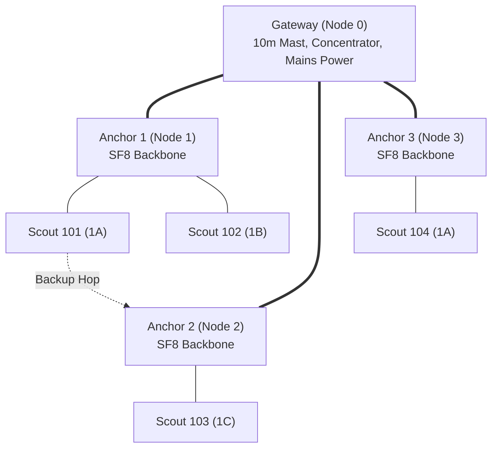

# Mesh Routing, Clustering & Relay Topology

Architectural overview of the 3-tier hierarchical star-of-stars LoRa network topology deployed over the active longwall mining panel.

---

## 1. Network Hierarchy & Role Separation

- **Scout Nodes (Tier 1):** Low-cost, battery-powered surface sensors. Transmit directly to assigned Anchor at SF7.
- **Anchor Nodes (Tier 2):** Intermediate aggregation relays. Receive up to 8 Scout uplinks, issue bitmap ACK, assemble 98 B backbone bundle, and transmit to Gateway at SF8.
- **Gateway (Base Station):** Central receiver with LTE/SCADA backhaul, broadcasts master time synchronization beacons at $t=0.0\text{ s}$.

---

## 2. Clustering & Child Index Discipline

During sizing execution in `src/minesim/sizing.py` ([[work-packages/WP2-sizing-algorithm|WP2]]):
- Scouts are assigned to the geographically nearest Anchor satisfying line-of-sight and Fresnel clearance.
- **Max Children per Anchor:** $\le 8$ nodes (Assumption `layout.max_children_per_anchor`).
- **`node.child_index`:** Index ($0..7$) within the parent cluster. Drives collision-free emergency retransmission slots ([[gates/G10-emergency-slot-from-child-index|Gate G10]]).
- **`node.backup_parent_id`:** Secondary Anchor assigned to receive emergency transmissions if primary Anchor fails.

---

## 3. Fresnel Zone & RF Obstruction Verification

Between every node pair $(i, j)$, sizing calculates first Fresnel zone radius $F_1$:
$$F_1 = 17.32 \sqrt{\frac{d_{km}}{4 \cdot f_{GHz}}} \approx 8.66 \sqrt{\frac{d_{km}}{0.865}} \text{ metres}$$
Where the ground surface deforms dynamically, antenna heights ($2.0\text{ m}$ for Scout/Anchor, $10.0\text{ m}$ for Gateway) guarantee $60\%$ clearance above maximum expected subsidence trough slopes.

---

## 4. Cross-References

- **Sizing Algorithm:** [[work-packages/WP2-sizing-algorithm]]
- **Superframe Timing:** [[notes/mesh-and-radio/lora-tdma-superframe-and-timing]]
- **Failover & Emergency:** [[notes/mesh-and-radio/emergency-alert-and-dedup]]
