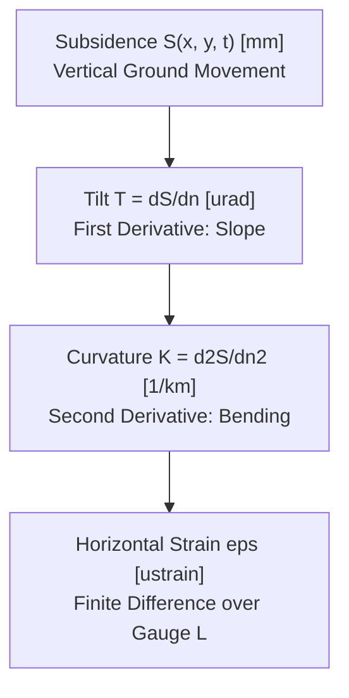

# Subsidence Kinematic Derivatives, Tilt & Strain

Technical reference on how spatial derivatives of subsidence are calculated numerically in `src/minesim/physics.py` to drive sensor telemetry while preserving [[gates/G01-single-physics-implementation|Gate G01]].

---

## 1. Physical Significance of Ground Derivatives

| Kinematic Variable | Mathematical Form | Units | Structural Damage Mechanism |
|---|---|---|---|
| **Subsidence ($S$)** | $S(x, y, t)$ | $\text{mm}$ | Foundation settlement, pipe shear. |
| **Tilt ($T$)** | $\nabla S = \left(\frac{\partial S}{\partial x}, \frac{\partial S}{\partial y}\right)$ | $\mu\text{rad}$ | Tower lean, machinery misalignment. |
| **Curvature ($K$)** | $\left(\frac{\partial^2 S}{\partial x^2}, \frac{\partial^2 S}{\partial y^2}\right)$ | $1/\text{km}$ | Beam bending, masonry cracking. |
| **Strain ($\epsilon$)** | $\Delta L / L$ | $\mu\epsilon$ | Tensile cracking (outer), compressive buckling (inner). |

---

## 2. Numerical vs Closed-Form Invariant (Gate G01)

To prevent drift between analytical formulas and the master subsidence code:
- **Tilt:** Evaluated using central finite differences:
  $$\frac{\partial S}{\partial y} \approx \frac{S(x, y + \Delta y) - S(x, y - \Delta y)}{2\Delta y}$$
  where $\Delta y = 0.1\text{ m}$.
- **Curvature:** Evaluated using central second difference:
  $$\frac{\partial^2 S}{\partial y^2} \approx \frac{S(x, y + \Delta y) - 2S(x, y) + S(x, y - \Delta y)}{\Delta y^2}$$

---

## 3. Finite Difference Strain over Hardware Baselines

Mathematical point derivatives ($\partial u / \partial x$) fail to capture what field instruments physically experience across non-linear strain gradients. In `physics.strain()`, strain is computed as a finite difference over the instrument baseline:

$$\epsilon(x, y, \text{baseline}) = \frac{S(p + \text{baseline}/2) - S(p - \text{baseline}/2)}{\text{baseline}}$$

- **Tier 1B (Invar Rod):** Baseline $L = 10.0\text{ m}$ (Assumption A8).
- **Tier 1C (Wire Extensometer):** Baseline $L = 30.0\text{ m}$ (Assumption A9).

Over the high-gradient inflection zone, a 30 m wire smooths over a broad baseline while a 10 m rod captures sharper peak strains.

---

## 4. Cross-References

- **Master Physics Engine:** [[work-packages/WP1-core-physics]]
- **Sensor Models:** [[work-packages/WP4-sensor-models-provenance]]
- **Knothe Formulations:** [[notes/physics/knothe-time-dependent-model]]
