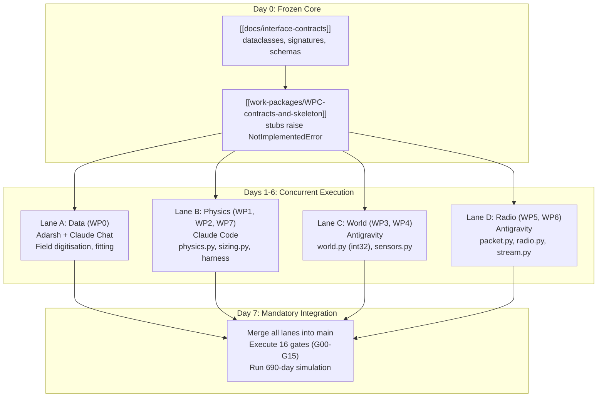

# Four-Lane Parallel Development Protocol

Operational methodology enabling four autonomous coding agents (Claude Code and Antigravity) to develop complex simulation modules concurrently without merge conflicts or cross-package drift.

---

## 1. Decoupling Through Frozen Interfaces

Parallel development breaks down if agents negotiate interface shapes dynamically. The core principle of the four-lane protocol:
- **D0 Scaffolding Freeze:** `[[docs/interface-contracts]]` is frozen prior to lane split.
- **Strict Package Ownership:** Each agent is granted write permissions strictly to its owned files.
- **Cross-Lane Imports via Stubs:** Lanes C and D import type annotations and function stubs implemented in [[work-packages/WPC-contracts-and-skeleton|WP-C]], allowing full type-checking without waiting for peer logic.

---

## 2. Lane Boundaries & Ownership

| Lane | Assigned Work Packages | Owned Files | Blocked By / Dependencies |
|---|---|---|---|
| **Lane A** | [[work-packages/WP0-data-pinning\|WP0]] | `data/real/*`, `data/fitted/*`, `config/mines/adriyala_lw1.yaml` | Depends only on WP-C stubs. Blocks WP1 acceptance. |
| **Lane B** | [[work-packages/WP1-core-physics\|WP1]], [[work-packages/WP2-sizing-algorithm\|WP2]], [[work-packages/WP7-gate-harness\|WP7]] | `src/minesim/physics.py`, `src/minesim/sizing.py`, `tests/gates/*`, `scripts/run_gates.py` | Depends on WP-C. Accepted against WP0 data. |
| **Lane C** | [[work-packages/WP3-world-state-engine\|WP3]], [[work-packages/WP4-sensor-models-provenance\|WP4]] | `src/minesim/world.py`, `src/minesim/sensors.py`, `src/minesim/provenance.py` | Imports `physics` and `sizing` stubs. |
| **Lane D** | [[work-packages/WP5-radio-tdma\|WP5]], [[work-packages/WP6-stream-and-output\|WP6]] | `src/minesim/packet.py`, `src/minesim/radio.py`, `src/minesim/stream.py`, `src/minesim/run.py` | Imports `Layout` and `Reading` dataclasses. |

---

## 3. Communication & Dispute Protocol

- If an agent discovers an unworkable contract signature, it **must not modify the contract locally**.
- It halts and escalates to Adarsh.
- Any contract change requires updating `[[docs/interface-contracts]]` and notifying all active lanes.

---

## 4. Cross-References

- **Master Plan:** [[docs/build-order]]
- **Agent Rules:** [[docs/agents-invariants]]
- **Governance:** [[RULES]]
