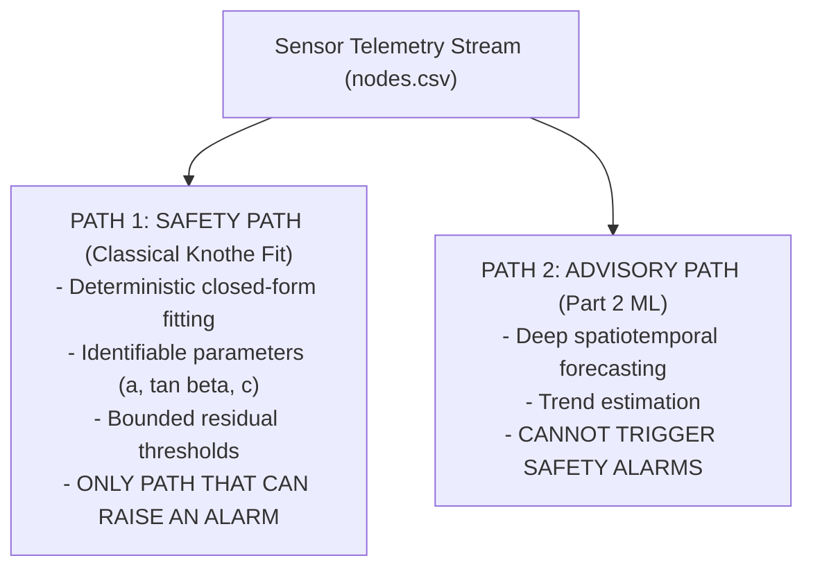

# Safety Rationale: Why PINNs are Forbidden from Safety Alarms

Architectural defense of **Invariant 2** (*"There is no PINN in this build"*) and **Invariant 3** (*"No neural network in the safety path"*).

---

## 1. Historical Context: The Early PINN Architecture

In initial project iterations (files 00–07), a Physics-Informed Neural Network (PINN) was proposed to learn surface subsidence equations while training against sensor streams.

During rigorous architectural audit, two fatal flaws were discovered:
1. **Identifiability Failure:** Training a PINN on a single epoch or limited spatial window left governing parameters (such as settling rate $\hat{c}$) mathematically unidentifiable.
2. **Safety Certification Barrier:** Deep neural networks are black-box approximators with unquantifiable worst-case tail risks, hallucination tendencies under out-of-distribution noise, and an inability to provide strict mathematical guarantees under DGMS (Directorate General of Mines Safety) statutory requirements.

---

## 2. The Final Dual-Path Architecture

- **Classical Detector (Safety Critical):** Computes least-squares residuals against the analytical Knothe equation. If measured ground deformation exceeds physical safety bounds ($S > 10\text{ mm}$ with positive curvature), an alarm is raised deterministically.
- **Forecasting ML (Advisory Only):** Part 2 trains forecasting models to assist human planning, but possesses zero authorization to suppress or trigger physical evacuation alarms.

---

## 3. Enforcement in Codebase (Gate G14)

[[gates/G14-no-pinn-in-alarm-path|Gate G14]] enforces this separation:
- Prohibits importing deep learning frameworks in `src/minesim/`.
- Scans AST to ensure no `predict()`, `pinn`, or neural network classes exist.
- Verifies that Part 1 contains zero alarm triggering logic (it generates physical telemetry only).

---

## 4. Cross-References

- **System Invariants:** [[docs/agents-invariants]]
- **Gate G14:** [[gates/G14-no-pinn-in-alarm-path]]
- **Physics Implementation:** [[work-packages/WP1-core-physics]]
- **Governance:** [[RULES]]
