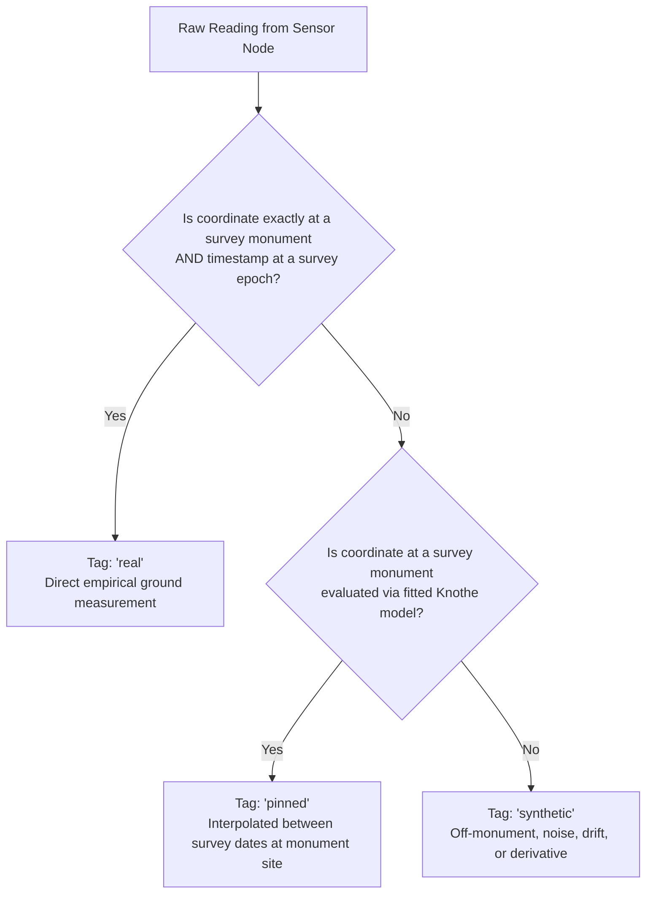

# Sensor Provenance Tagging & Loss Weighting

Detailed architectural guide on the three-tier provenance tagging taxonomy (`real`, `pinned`, `synthetic`) and how it prevents downstream machine learning models in Part 2 from overfitting to simulator artifacts.

---

## 1. Why Provenance is Load-Bearing Infrastructure

When a machine learning model is trained on simulator telemetry without provenance tags:
- The model treats every row in `nodes.csv` as ground truth.
- Synthetic noise, sensor drift, and spatial interpolations are learned as if they were true geological laws.
- The model learns the **simulator's bugs**, not the **ground's physics**.

With strict provenance tagging:
$$\mathcal{L}_{total} = w_{real} \mathcal{L}_{real} + w_{pinned} \mathcal{L}_{pinned} + w_{synth} \mathcal{L}_{synth}$$
where $w_{real} \gg w_{pinned} \gg w_{synth}$. This allows Part 2 to heavily penalize errors on empirical survey monuments while treating sensor noise as regularization.

---

## 2. The Three-Tag Invariant (Gate G04)

> [!IMPORTANT]
> **No Fourth Option:** Emitting an empty string, `null`, or `'unknown'` violates Invariant 6 and immediately raises `ProvenanceError`.

---

## 3. Why Derivatives are Always Synthetic

In longwall mining field practice, mines monitor surface subsidence via levelling monuments (measuring vertical $Z$). No mine maintains a dense grid of continuous surface strain gauges or inclinometers.

Therefore:
- **Vertical Subsidence ($S$):** Can be `real`, `pinned`, or `synthetic` depending on node location.
- **Tilt ($T_x, T_y$):** Always `synthetic`.
- **Horizontal Strain ($\epsilon$):** Always `synthetic`.
- **Horizontal Displacement ($U$):** Always `synthetic`.

This distinction is stated clearly in the technical presentation rather than allowing judges to assume field strain data exists.

---

## 4. Cross-References

- **Implementation Package:** [[work-packages/WP4-sensor-models-provenance]]
- **Gate G04:** [[gates/G04-provenance-tags-on-every-row]]
- **Gate G05:** [[gates/G05-synthetic-grounded-in-observed-data]]
- **Sensor Noise Modeling:** [[notes/sensors/sensor-noise-and-corruption-chain]]
