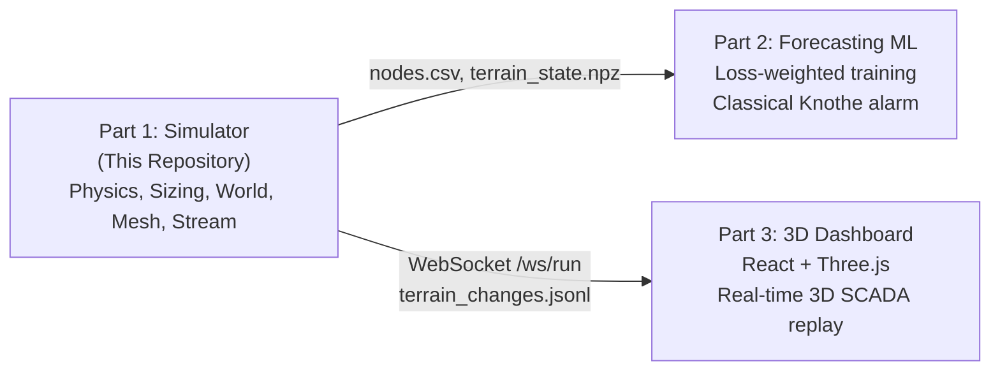

# Project Charter: Mine Subsidence Simulator (Part 1)

System charter, architecture overview, and handoff criteria for the **AI-Enabled Mine Subsidence Early-Warning System (Part 1 Simulation & Synthetic Data Generation)** for Smart India Hackathon 2025/26 (Problem Statement 26025, Coal India / Ministry of Coal).

---

## 1. Executive Summary

This system generates realistic terrain deformation from empirical fitted longwall mining data, simulates an autonomous LoRa sensor mesh monitoring that terrain, and streams provenance-tagged telemetry to:
1. **Part 2 (Forecasting ML):** Multi-modal spatiotemporal deep learning models predicting ground movements 24–72 hours in advance.
2. **Part 3 (3D SCADA Dashboard):** Three.js / Electron real-time 3D mine visualization displaying subsidence heatmaps, node telemetry, and alarm vectors.

---

## 2. Key Architecture Pillars

- **Physics-Grounded Ground Movement:** Powered by the analytical Knothe influence equation over a subcritical rectangular longwall panel ($250\text{ m} \times 2500\text{ m}$ at $375\text{ m}$ depth).
- **Zero PINN in Safety Path (Invariants 2 & 3):** No neural network output triggers physical safety alarms. Evacuation decisions belong strictly to classical least-squares Knothe curve fitting.
- **Dynamic Node Sizing:** Sensor count is an output of terrain deformation physics and RF Fresnel clearance, deploying 30 Scouts across a travelling profile cross.
- **Bit-Identical Integer Replay (Gate G06):** Terrain grid is accumulated using `int32` millimetres, eliminating floating-point drift over 690-day simulation runs.
- **Provenance Transparency (Gate G04):** Every data point is tagged as `real`, `pinned`, or `synthetic`, enabling Part 2 to train on empirical field data while penalizing simulator noise.
- **LoRa TDMA Mesh Simulation:** True physical-layer airtime modeling ($61.7\text{ ms}$ uplinks), 60-second superframe schedule, duty cycle ceiling $\le 1.0\%$, and reboot-safe deduplication.

---

## 3. Core Milestone Deliverables

| Day | Milestone Target | Verification Gate |
|---|---|---|
| **D0** | Core scaffolding, frozen contracts, and function stubs merged | [[work-packages/WPC-contracts-and-skeleton\|WP-C]] |
| **D4** | Real field survey data repins Knothe parameters ($a, m$) | [[gates/G00-data-pinning\|Gate G00]] |
| **D7** | **Mandatory Integration Day:** 4 lanes merged; 690-day run executes end-to-end | [[work-packages/WP7-gate-harness\|WP7]] |
| **D8** | Secondary mine dataset (Illinois) verified to prove mine-independence | [[gates/G15-config-driven-mine-independence\|Gate G15]] |
| **D9** | **System Freeze:** Datasets and streaming endpoints delivered to Parts 2 & 3 | [[docs/build-order\|Build Order]] |

---

## 4. Master Documentation Links

- **Governance Charter:** [[RULES]]
- **Interface Contracts:** [[docs/interface-contracts]]
- **Agent Rules & Invariants:** [[docs/agents-invariants]]
- **Build Plan & Schedule:** [[docs/build-order]]
- **Test Gate Registry:** [[docs/gates-registry]]
- **System Glossary:** [[glossary]]
- **Decisions Log:** [[projects/subsidence-simulator/decisions]]

---

## 5. Scope Update — Consequence Renderer and Team Checklists (Claude Code, 2026-09-14, proposed)

The team's PS 26025 build now has four sub-teams. Their checklists live outside the vault as working documents in `files/`: `HARDWARE-CHECKLIST.md`, `SOFTWARE-CHECKLIST.md`, `RECOMMENDATIONS.md`, and this segment's `SIMULATOR-CHECKLIST.md`.

- **Proposed addition to Part 1:** [[work-packages/WP8-consequence-renderer|WP8 Consequence Renderer]]. It draws simulator terrain and ML forecasts at panel scale under explicit `SIMULATED` / `LIVE (MEASURED)` / `FORECAST (PREDICTED)` / `SCENARIO (HYPOTHETICAL)` labels. It is a pure consumer with no alarm path. Pending DEC-5.
- **New boundary interface:** [[docs/interface-ml-to-renderer]] (draft), covering forecast format, uncertainty, missing regions and the sign convention.
- **Corrections to §2 above:** "deploying 30 Scouts" is the pre-WP0 figure. Real counts come from `size_network` on pinned parameters (DEC-2). The empirical fit quality of the pinned Knothe parameters is R² 0.82, not 0.986 (see [[gates/G00-data-pinning]]).
