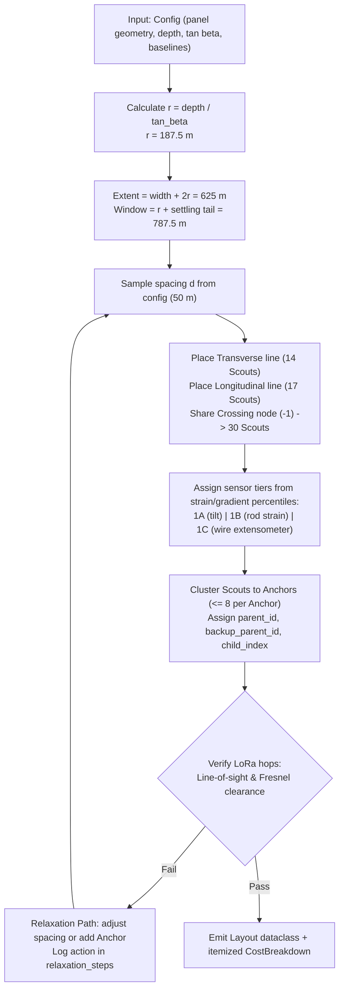

# WP2 — Sizing Algorithm

| Field | Details |
|---|---|
| **Owner** | [[people/claude-code\|Claude Code]] (Lane B) |
| **Depends on** | [[work-packages/WP1-core-physics\|WP1]] |
| **Blocks** | [[work-packages/WP3-world-state-engine\|WP3]], [[work-packages/WP5-radio-tdma\|WP5]] |
| **Days Scheduled** | D3–D4 |
| **Enforces Gates** | [[gates/G02-no-node-count-parameter\|G02]], [[gates/G03-cost-breakdown-emitted\|G03]], [[gates/G12-cost-reporting-without-budget-cap\|G12]], [[gates/G15-config-driven-mine-independence\|G15]] |

---

## 1. Goal

Given a mine configuration, deterministically calculate node coordinates, sensor tier assignments, Anchor cluster assignments, backup routes, child indices, and an itemized cost breakdown.

> [!IMPORTANT]
> **Node Count is an Output (Gate G02):** `size_network(cfg: Config) -> Layout` accepts **only** the configuration object. It accepts no `node_count`, `target_nodes`, or similar parameter.

---

## 2. Files Owned

```
src/minesim/sizing.py
tests/unit/test_sizing.py
tests/gates/test_g02.py
tests/gates/test_g03.py
tests/gates/test_g12.py
tests/gates/test_g15.py
```

---

## 3. Algorithm Workflow



---

## 4. Baseline Geometry & Expected Output (50 m Spacing)

- **Transverse Profile:** 14 Scouts spanning $625\text{ m}$ extent.
- **Longitudinal Profile:** 17 Scouts spanning $787.5\text{ m}$ active travelling window.
- **Crossing Node:** Shared at $(0, 0)$.
- **Total Scouts:** **30 nodes** (14 + 17 − 1).
- **Anchors:** 5 Anchors, each supporting 6 children.
- **Gateway:** 1 central Gateway located at panel boundary.
- **Sampling Fidelity:** Worst-case subsidence error is $32.6\text{ mm}$; peak tilt error is $1.9\%$.
- **Cost Output:** $\approx ₹82,100$ (purely informational; budget cap A22 is deleted per [[gates/G12-cost-reporting-without-budget-cap|Gate G12]]).

---

## 5. Node ID & Child Index Hierarchy

- **Gateway:** Node ID `0`.
- **Anchors:** Node IDs `1` through `99`.
- **Scouts:** Node IDs `100` and above.
- **Child Index (`node.child_index`):** Each Scout assigned $0..7$ unique within its primary parent. This index directly sets the Scout's emergency transmission sub-slot in [[work-packages/WP5-radio-tdma|WP5]] (Gates [[gates/G10-emergency-slot-from-child-index|G10]], [[gates/G11-no-emergency-subslot-collisions|G11]]).
