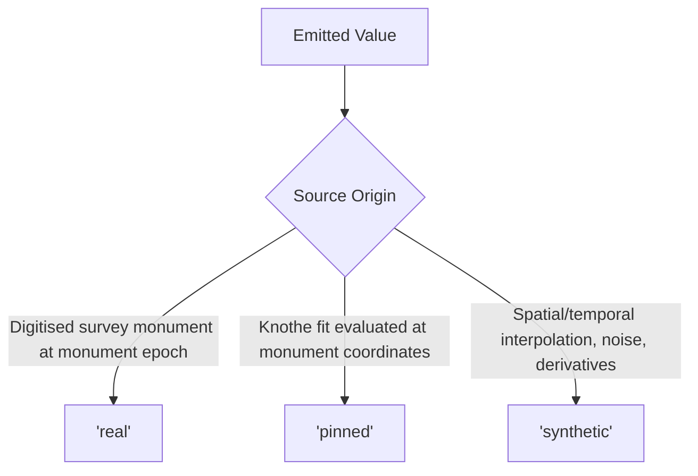

# WP4 — Sensor Models and Provenance

| Field | Details |
|---|---|
| **Owner** | [[people/antigravity\|Antigravity]] (Lane C) |
| **Depends on** | [[work-packages/WP3-world-state-engine\|WP3]] |
| **Blocks** | [[work-packages/WP5-radio-tdma\|WP5]] |
| **Days Scheduled** | D4–D6 |
| **Enforces Gates** | [[gates/G04-provenance-tags-on-every-row\|Gate G04]], [[gates/G05-synthetic-grounded-in-observed-data\|Gate G05]] |

---

## 1. Goal

Transform clean mathematical surface kinematics into noisy, quantized physical sensor telemetry from low-cost field hardware (Tiers 1A, 1B, 1C), tagging every emitted scalar with immutable provenance (`real`, `pinned`, or `synthetic`).

---

## 2. Files Owned

```
src/minesim/sensors.py
src/minesim/provenance.py
tests/unit/test_sensors.py
tests/gates/test_g04.py
tests/gates/test_g05.py
```

---

## 3. Provenance Architecture (Gate G04)

Downstream forecasting models in Part 2 must not treat synthetic interpolations or sensor noise as empirical ground truth. Provenance tags guide loss weighting during model training:



> [!IMPORTANT]
> **Zero Unprovenanced Values:** Every reading in `Reading` and every row in `nodes.csv` must have an explicit paired `_prov` tag. Tagging a value as `unknown` or leaving it empty raises `ProvenanceError`.
>
> **Derivatives are Always Synthetic:** Because no empirical tilt, strain, or displacement time series exists for Adriyala, **100% of tilt, strain, and displacement values are tagged `synthetic`**.

---

## 4. Hardware Sensor Models & Noise Pipeline

Applied sequentially for each sensor reading:
$$\text{Ideal Value} \longrightarrow \text{Quantisation} \longrightarrow \text{Constant Bias} \longrightarrow \text{Temperature Drift} \longrightarrow \text{Gaussian Noise}$$

| Sensor Tier | Primary Hardware | Measures | Noise & Drift Characteristics |
|---|---|---|---|
| **Tier 1A** | MPU-6050 3-Axis Accel / Gyro | Tilt $T_x, T_y$ ($\mu\text{rad}$) | **Dominant Thermal Drift:** MEMS tilt drifts with diurnal temperature swings by more than the subsidence signal. Secondary signal only. |
| **Tier 1B** | Invar Rod (10 m) + Foil Strain Gauge + Potentiometer | Strain $\epsilon$ ($\mu\epsilon$), Displacement $U$ (mm) | Finite difference over 10 m baseline. High SNR across mid-slope zone. |
| **Tier 1C** | Multi-Point Wire Extensometer (30 m) + LVDT | Strain $\epsilon$ ($\mu\epsilon$) | Finite difference over 30 m baseline. Placed in maximum tension/compression zones. |

---

## 5. Reproducibility Guarantee

All random draws across noise and drift generation use `cfg.sim.rng_seed` via `numpy.random.Generator`. Running the same configuration twice reproduces byte-identical `nodes.csv` output, guaranteeing valid A/B evaluation in Part 2.
