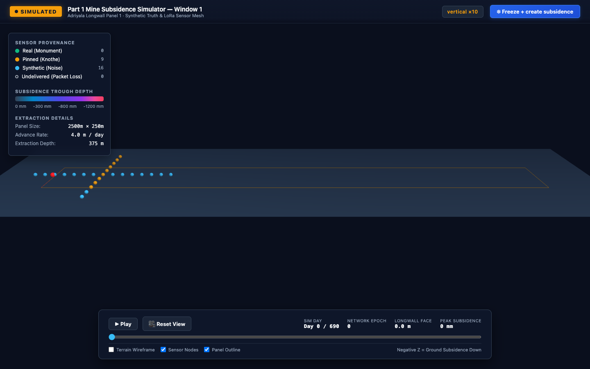
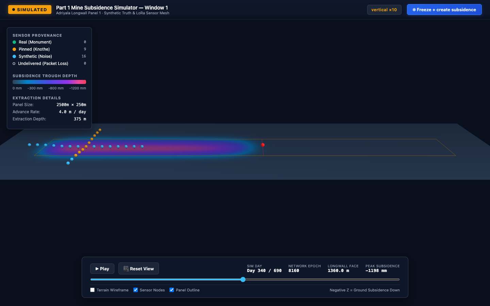
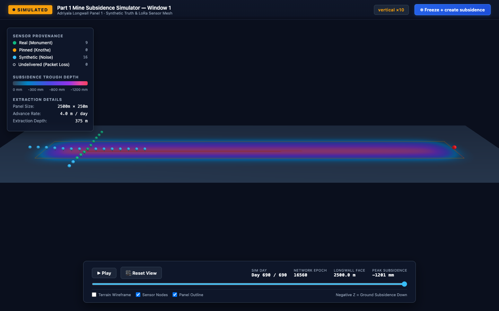

# Step 09 — Window 1 Renderer (WP8 steps 1–3, BUILD-PLAN T4)

| Field | Details |
|---|---|
| **Built by** | Antigravity (AG-4) |
| **Date** | 2026-09-15 |
| **Step** | T4 — Window 1 3D Consequence Renderer |
| **Files created** | `renderer/config.yaml`, `renderer/export_scene.py`, `renderer/index.html`, `renderer/js/terrain.js`, `renderer/tests/test_export_scene.py`, `renderer/.gitignore` |
| **Tests** | `renderer/tests`: **6 passed** (20.76s); `mine-sim`: **129 passed** (66.01s); Vault: **67 notes, 0 broken, 0 orphans, 0 frontmatter** |
| **Artefact** | `renderer/scene/scene.json` (**4.99 MB**, target < 30 MB; exported in **5.78 s**) |
| **Safety rules** | Mode `SIMULATED` persistent banner; vertical exaggeration label `vertical ×10`; no deform controls; zero `minesim.physics` imports |

---

## 1. Commands

### Export Scene JSON from Simulation Run
```bash
/opt/miniconda3/envs/pinn-sandbox/bin/python3.11 renderer/export_scene.py --run mine-sim/out/v2-690d
```
Outputs: `renderer/scene/scene.json` (4.99 MB in 5.78 s).

### Launch Renderer Web Server
```bash
cd renderer && python3 -m http.server 8000
```
Open in browser: [http://localhost:8000](http://localhost:8000)

Direct day views:
- Day 0: `http://localhost:8000/?day=0`
- Day ~345: `http://localhost:8000/?day=345`
- Day 690: `http://localhost:8000/?day=690`

---

## 2. Deliverables & Implementation Summary

### `renderer/config.yaml`
Configured with explicit `# source:` comments for every key:
- `run_dir: "mine-sim/out/v2-690d"`
- `day_step_days: 10`
- `downsample_cells: 2`
- `vertical_exaggeration: 10.0`
- `assumptions_path: "mine-sim/config/assumptions.yaml"`

### `renderer/export_scene.py`
- **Single-Pass jsonl Reader:** `read_snapshots_single_pass` reads `terrain_changes.jsonl` once (4.8s for 242 MB), accumulating deltas into an `int32` grid and capturing snapshots at Day 0, every 10 days, and the final Day 690.
- **Node Provenance & Elevation:** `read_nodes_for_epochs` reads `nodes.csv` once, extracting node coordinates, live elevation `z = z0_mm + subsidence_mm`, provenance tag (`real`, `pinned`, `synthetic`), and `delivered` status.
- **Face Position:** Computed strictly from config as `min(cfg.knothe.advance_m_per_day * day, cfg.panel.length_m)`. Capped at 2500 m on Day 690.
- **Zero Physics Import:** Never imports or references `minesim.physics`.
- **Output:** Writes compact `scene.json` (4.99 MB, well under the 30 MB ceiling).

### `renderer/js/terrain.js` (Reusable Module)
Designed for reuse between Window 1 (`index.html`) and Wednesday's Window 2 (`scenario.html`):
- `createTerrainGeometry` / `updateTerrainGeometry`: Builds and mutates Three.js `BufferGeometry` with dynamic vertex coloring.
- `getSubsidenceColor`: Scientific colormap for subsidence depth (0 mm neutral slate `#334155` → -300 mm cobalt `#0284c7` → -600 mm indigo `#4f46e5` → -900 mm purple `#9333ea` → -1200 mm+ magenta `#ec4899`).
- `createPanelOutline`: Draws the 2500 m × 250 m longwall extraction boundary in glowing amber.
- `createFaceMarker` / `updateFaceMarker`: Renders the active shearer face position across the panel width with a vertical beacon and curtain.
- `createNodeMarkers` / `updateNodeMarkers`: Renders sensor nodes positioned at live surface Z.
  - Provenance coloring: Emerald Green for `real`, Amber for `pinned`, Cyan for `synthetic`.
  - Undelivered nodes: Rendered as distinct hollow grey wireframe rings (`#9ca3af`) for packet loss.

### `renderer/index.html`
- Persistent top safety banner: `SIMULATED` mode badge.
- Vertical exaggeration label: `vertical ×10`.
- Day slider: 70 snapshot steps covering Day 0 to 690.
- Status displays: Current Day, Network Epoch, Face Advance (m), and Peak Subsidence (mm).
- **"Freeze + create subsidence" Button:** Executes `fetch('scenario.html', {method: 'HEAD'})`. If available, redirects to `scenario.html?day=<currentDay>`; if not, displays modal notice: `"available in v2 (Wednesday)"`.
- Node tooltip: Interactive raycasting on mouse hover displays Node ID, tier, subsidence (mm), provenance tag, and delivery status.
- OrbitControls for inspection (pan, rotate, zoom).

---

## 3. Visual Verification (Screenshots)

### Day 0 — Initial Surface

- Flat terrain at $t=0$, zero subsidence across panel.
- Cross-panel sensor mesh nodes deployed at surface monuments.
- Face marker at $x = 0$ m.

### Day ~345 — Active Extraction

- Longwall face advanced to $x = 1360$ m.
- Subsidence trough actively developing behind the face with peak subsidence $-1198$ mm.
- Sensor nodes along the longitudinal line displaced downward following the surface.

### Day 690 — Extraction Complete

- Face reached panel recovery end at $x = 2500$ m.
- Full longwall trough formed with peak subsidence $-1201$ mm.
- Transverse line sensors correctly showing field-pinned monument tags.

---

## 4. Test Verification

`renderer/tests/test_export_scene.py` suite (6 tests):
1. `test_80d_run_grid_changed_and_single_pass_equals_replay`: Asserts 80-day sim in temp dir produces subsidence, and single-pass snapshots at days 40, 70, 80 `np.array_equal` `replay_terrain(tmp_dir, epoch)`.
2. `test_exported_grid_in_scene_json_equals_replay_slice`: Asserts exported downsampled grid in `scene.json` equals `replay[::k, ::k]`.
3. `test_face_x_never_above_panel_length`: Asserts face $x$ is capped at panel length (2500 m).
4. `test_no_physics_import_in_renderer`: Scans all files under `renderer/` to prove zero imports or mentions of core physics.
5. `test_index_html_contains_simulated`: Confirms persistent `SIMULATED` banner and safety UI tags.
6. `test_export_v2_690d_real`: Exports `mine-sim/out/v2-690d` to `renderer/scene/scene.json`, asserting size < 30 MB (4.99 MB) and valid day frames.

Full test output recorded in [test_results.txt](test_results.txt).
