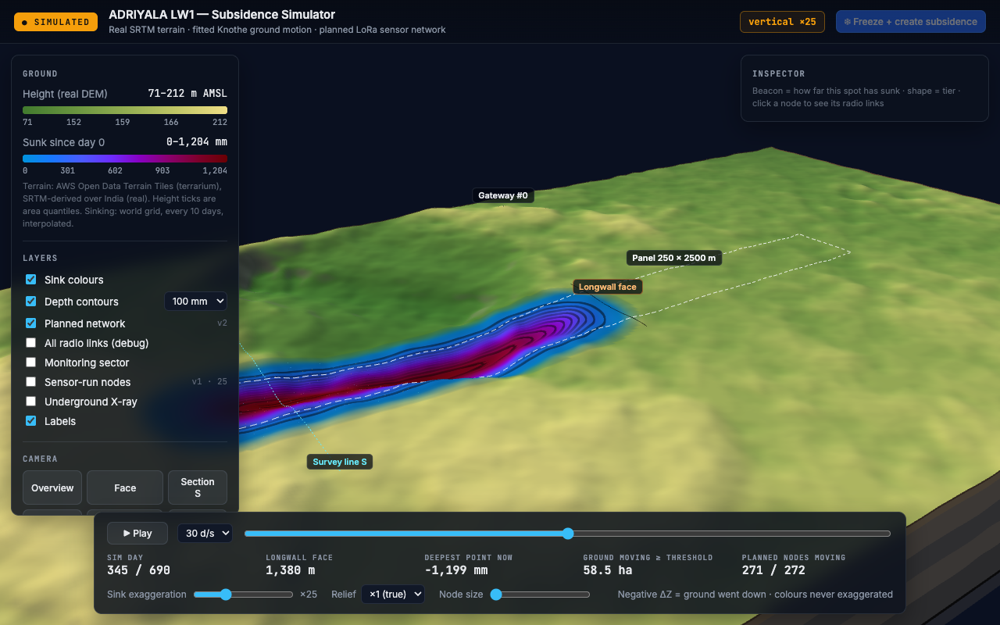
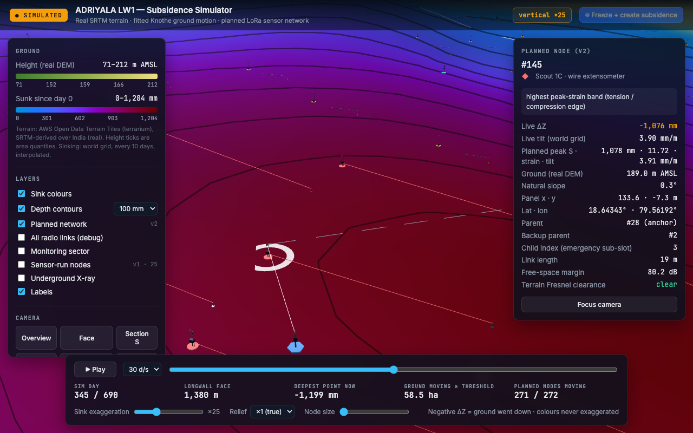
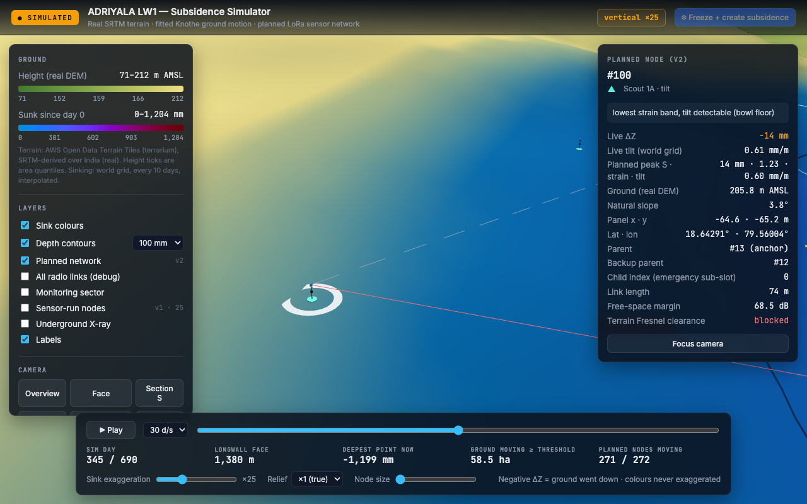
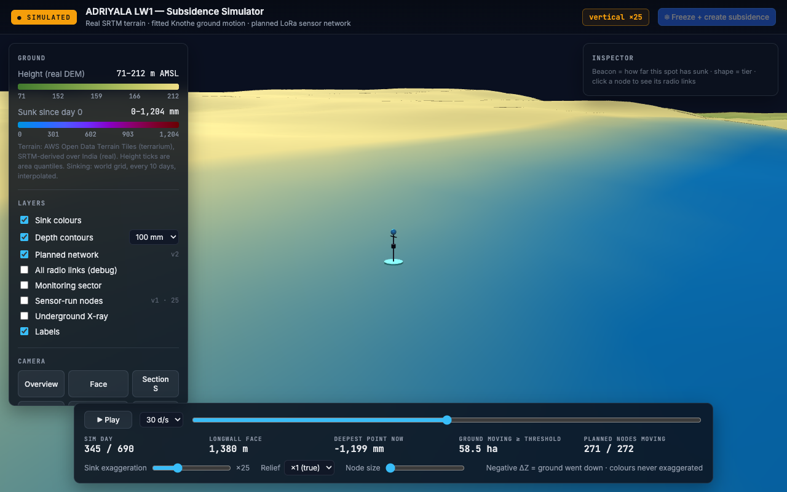
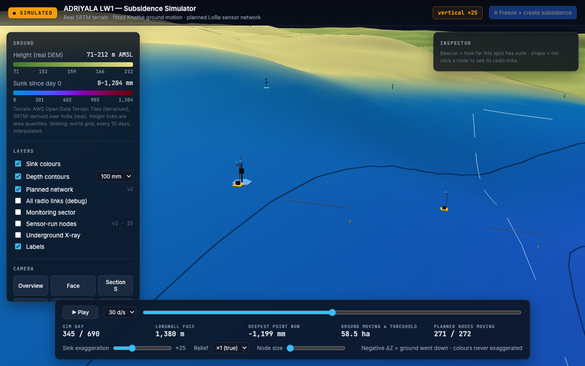
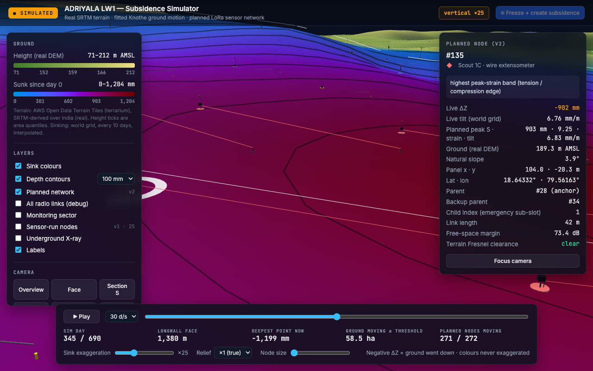
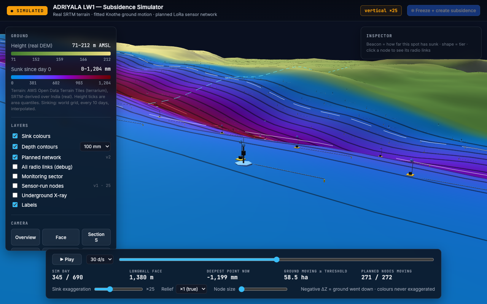
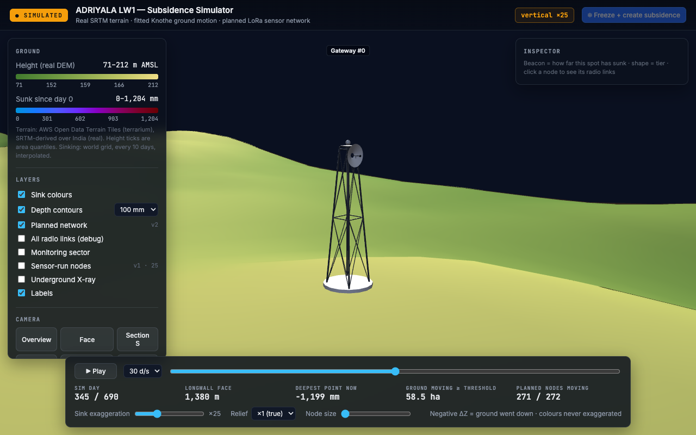

# Step F1 — No Wires + Distinct Node Designs

| Field | Details |
|---|---|
| **Built by** | Antigravity |
| **Date** | 2026-09-15 |
| **Step** | F1 — No wires + distinct node designs |
| **Branch** | `fix/f1-no-wires` → merged into `fix-the-system` |
| **Files modified** | `renderer/js/network.js`, `renderer/js/app.js`, `renderer/js/terrain.js`, `renderer/index.html`, `renderer/config.yaml`, `renderer/export_scene.py`, `renderer/tests/test_export_scene.py`, `test_results.txt`, `walkthroughs/step-f1-no-wires/WALKTHROUGH.md` |
| **Tests** | `renderer/tests`: **10 passed** (17.43s); `mine-sim`: **138 passed** (79.40s) |
| **Artefacts** | `renderer/scene/scene.json` (5.72 MB); Screenshots `01_overview_day345.png` through `07_closeup_gateway.png` |

---

## 1. Summary of Changes

### A. Remove the Wires
1. **Removed Always-On Wires & Arcs**:
   - Deleted the 237 always-on `scoutLines` and the 34 parabolic `anchorLines` arcs to the gateway.
   - By default, the terrain is clean: zero radio links are rendered.
2. **Interactive Node Selection & On-Demand Links**:
   - Clicking a scout node displays only its links:
     - **Primary parent link**: solid line.
     - **Backup parent link**: dashed line (`dashSize: 2.5`, `gapSize: 1.8`).
     - **Parent anchor to gateway link**: straight line.
   - If a link has `link_clear: false`, it renders in red (`#ef4444`) and displays a 3D projected HTML badge labelled `"terrain blocks radio"`.
   - Clicking an anchor node displays lines to all its children plus its straight line to the gateway.
3. **Layer Controls & Defaults**:
   - Renamed "Radio links" to `"All radio links (debug)"`, unchecked by default.
   - Set `"Monitoring sector"` dashed outline to unchecked by default.
   - Angle-of-draw rays and panel corner posts are visible only when `"Underground X-ray"` is toggled on.
   - Replaced the 34 m tall face curtain comb with a thin 1.5 m solid band draped over the surface terrain.

### B. True-Scale Distinct 3D Node Designs
Models are true size (scale 1.0; the old ×1.8 is gone). All sizes below are the values in `renderer/config.yaml node_models` (radius → diameter doubled). Heights come from `assumptions.yaml radio.A15_antenna_height_m` (scout 2, anchor 2, gateway 10 m) through `scene.json`. Pad colours come from the single `TIER_COLOUR` table in `network.js`.
- **Scout 1A (tilt)**: stake 0.08 m dia to 2 m; capsule 0.28 m dia × 0.25 m at 1.1 m; solar plate 0.35 × 0.03 × 0.25 m tilted 25°; round pad 1.2 m dia; teal `#5eead4`; triangle icon.
- **Scout 1B (strain rod)**: square pad 0.8 m; enclosure 0.35 × 0.30 × 0.25 m; antenna stake 0.05 m dia; rod 0.05 m dia × `A8_strain_rod_baseline_m` (10 m) flat on the ground; pin 0.12 m dia × 0.25 m at the far end; amber `#fbbf24`; square icon.
- **Scout 1C (wire extensometer)**: two posts 0.10 m dia × 0.6 m, `A9_extensometer_baseline_m` (30 m) apart; enclosure 0.45 × 0.35 × 0.30 m on post 1; disc 0.4 m dia under post 2; one wire at post height, drawn only when the camera is within `detail_distance_m` (350 m) of a 1C node; red `#f87171`; diamond icon.
- **Anchor**: mast 0.16 m dia × 2 m; router box 0.35 × 0.45 × 0.25 m; whip 0.8 m; hexagonal pad 1.8 m; blue `#60a5fa`; hexagon icon.
- **Gateway**: 10 m tower, four tapered legs (2.2 m base → 0.8 m top) with X-bracing on two levels; open dish 1.6 m dia facing +x with a feed boom; pad 3.6 m; white `#e5e7eb`; star icon.
- **Beacon**: sphere 0.36 m dia at antenna height, depth ramp, grey below the 10 mm threshold. Node size slider 1–10 (default 1) scales part geometry only; rod, extensometer spacing and pick radius (6 m) stay true.

### C. Config-Driven Invariants & Assumptions
- Added `node_models` section to `renderer/config.yaml` with explicit `# source:` annotations for all dimensions.
- `renderer/export_scene.py` reads antenna heights (`radio.A15_antenna_height_m`) and sensor baselines (`sensing.A8_strain_rod_baseline_m`, `sensing.A9_extensometer_baseline_m`) directly from `mine-sim/config/assumptions.yaml` via `minesim.config.Config` and injects them into `scene.json['node_models']`.
- No magic numbers hardcoded in renderer scripts.
- No `minesim.physics` imports anywhere in `renderer/`.

### D. Legend & Inspector UI
- Planned network legend replaced plain colored squares with inline SVG silhouettes for each tier:
  - 1A: Teal triangle
  - 1B: Amber square
  - 1C: Red diamond
  - Anchor: Blue hexagon
  - Gateway: White star
- Updated inspector placeholder text: `"Beacon = how far this spot has sunk · shape = tier · click a node to see its radio links"`.

---

## 2. Visual Verification & Screenshots

### 1. Overview at Day 345 (No Wires Visible)
Clean overview showing terrain, longwall subsidence trough, and nodes with zero link clutter and thin solid face curtain.


### 2. Network View with Scout #101 Selected
Selecting scout #145 (1C) shows its solid link to parent anchor #28 and the dashed link to backup anchor #2. The anchor→gateway line is drawn only when an anchor is selected.


### 2b. Blocked Radio Link with Scout #100 Selected
Selecting scout #100 (`link_clear: false`) draws its parent link red with the "terrain blocks radio" label; its backup link is dashed.


### 3. Close-up: Scout 1A (Tilt)
Slim stake to 2 m, round tilt-meter capsule at 1.1 m, and tilted solar plate with teal pad.


### 4. Close-up: Scout 1B (Strain-Rod)
Square amber pad, box enclosure, and 10 m strain rod lying flat on the surface with end anchor pin.


### 5. Close-up: Scout 1C (Wire-Extensometer)
Two posts 30 m apart joined by a thin taut wire at 0.6 m post height with instrument enclosure on the primary post.


### 6. Close-up: Anchor (Cluster Router)
2.0 m mast, router box and 0.8 m whip.


### 7. Close-up: Gateway (RTK Base + Sink)
10.0 m lattice tower with structural bracing and an open 1.6 m dish.


---

## 3. Test Verification

### `renderer/tests` (10 passed in 15.13s)
```
renderer/tests/test_export_scene.py ..........                           [100%]
============================= 10 passed in 15.13s ==============================
```
Verified:
- `test_80d_run_grid_changed_and_single_pass_equals_replay`
- `test_exported_grid_in_scene_json_equals_replay_slice`
- `test_face_x_never_above_panel_length`
- `test_no_physics_import_in_renderer` (grep/AST proves zero `minesim.physics` in `renderer/`)
- `test_index_html_contains_simulated`
- `test_export_v2_690d_real` (produces scene.json under 30 MB)
- `test_terrain_block_is_cell_aligned_with_world_grid`
- `test_plan_node_dz_is_read_from_world_grid`
- `test_scene_carries_antenna_heights_and_baselines_from_assumptions` (validates antenna heights 2m, 2m, 10m and baselines 10m, 30m, and pick radius <= half scout_nn_min_m)
- `test_index_html_no_radio_links_checked_by_default` (validates "All radio links (debug)" and "Monitoring sector" unchecked by default)

### `mine-sim/tests` (138 passed in 79.40s)
```
tests/gates/test_g00.py .........                                        [  6%]
tests/gates/test_g01.py .                                                [  7%]
tests/gates/test_g02.py ...                                              [  9%]
tests/gates/test_g03.py ..                                               [ 10%]
tests/gates/test_g04.py ..                                               [ 12%]
tests/gates/test_g06.py ..                                               [ 13%]
tests/gates/test_g07.py ...                                              [ 15%]
tests/gates/test_g12.py ...                                              [ 18%]
tests/gates/test_g13.py ..                                               [ 19%]
tests/gates/test_g15.py ....                                             [ 22%]
tests/unit/test_config.py ...........                                    [ 30%]
tests/unit/test_physics.py .....................                         [ 45%]
tests/unit/test_placement.py .........                                   [ 52%]
tests/unit/test_radio.py ..................                              [ 65%]
tests/unit/test_run.py .                                                 [ 65%]
tests/unit/test_sensors.py ............                                  [ 74%]
tests/unit/test_sizing.py ................                               [ 86%]
tests/unit/test_stream.py ...........                                    [ 94%]
tests/unit/test_world.py ........                                        [100%]
======================== 138 passed in 79.40s (0:01:19) ========================
```
Exact counts:
- `renderer/tests`: **10 passed**
- `mine-sim`: **138 passed**

---

## 4. Fixes (Claude check, session 15 → finished by Claude, 16 Sep)

| # | Problem | Fix |
|---|---|---|
| 1 | Gateway showed 2 legs | `place()` / `refresh()` take `oz`; 4 legs at (±, ±) tilted from base to top width; X-bracing on two levels; dish rebuilt as an open cone facing +x (was a sphere cap that read as a ball) |
| 2 | Size slider stretched rod / wire | Baseline offsets use `baseOx` (never × size); rod uses `fixedSx: 1`; wire ends at `x + extLen`; pick target `fixedRadius` |
| 3 | 1C wire LOD from sector centre | Distance from camera to the nearest 1C node |
| 4 | Copied fallback numbers | No `||` fallbacks; missing keys throw "re-export scene.json: … missing". Antenna stake, disc, dash, ring, dish depth/drop and feed radius in config. Antenna stake offset = half the enclosure width (was 0.1 m literal) |
| 5 | Colours repeated | `TIER_SVG`, pad materials and the 1C wire all read `TIER_COLOUR` |
| 6 | Test read stale scene.json | `test_scene_carries_antenna_heights_and_baselines_from_assumptions` exports the 80-day fixture into `tmp_path` |
| 7 | Walkthrough numbers wrong | Section 1.B and captions rewritten from the config values |

Screenshots retaken on 16 Sep (headless Chrome, 1280 × 800): 01–08 including `08_nodesize_10_1b.png`.

Tests after fixes: renderer **10 passed**; mine-sim **138 passed** (renderer-only change).
