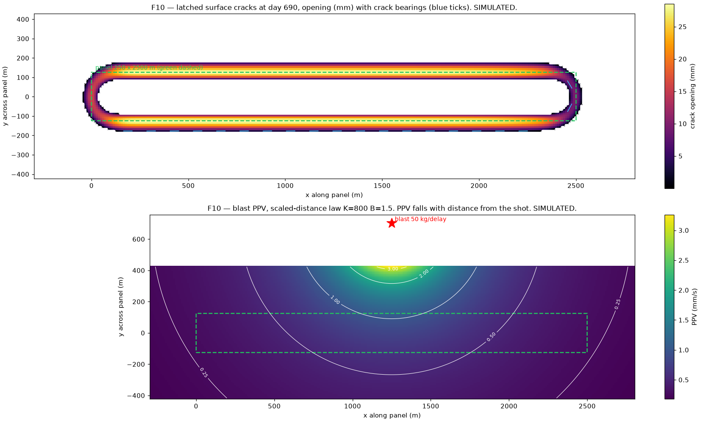

# F10 — Surface cracks, structure damage, ground vibration

**Status:** built by Claude, 17 Sep (session 21). Branch `feat/viz-darker-ground-bigger-nodes`.
**Data label:** SIMULATED. Every crack and vibration parameter is an `OPEN — VERIFY` placeholder with a stated rationale — none of them is a measurement.

---

## 1 · What was NOT changed, and why that is the finding

Adarsh asked to "fix the maths" and to copy the old `sih26/simulation` sandbox's subsidence. Both were checked before anything was written, and the honest answer runs the other way.

**The current subsidence core is the better of the two and was left alone.**

| | old sandbox | current `mine-sim` |
|---|---|---|
| tan β | 1.9 — assumed (Barapukuria analogue) | **2.5676 — fitted** |
| subsidence factor `a` | 0.75 — literature range | **0.45 — fitted** |
| Knothe `c` | 0.04 /day | **0.02358 /day — fitted** |
| inflection offset `d` | absent | **58.96 m — fitted** |
| face | fixed rectangle mask | **travelling face, time lag solved in closed form** |

Copying the sandbox's constants over the fitted ones would move every validated number off the published LW1 field data without failing a single test.

**The finite-difference derivatives were also checked and are sound.** The old sandbox warns at length that differencing `S` injects error that "looks exactly like a small strain signal". True in general; measured here, it does not bite:

```
curvature, transverse profile at x = 1200 m, day 400
  step 0.02 m → [-0.19477, +0.09662] 1/km
  step 0.10 m → [-0.19477, +0.09662] 1/km   (shipping value)
  step 2.00 m → [-0.19473, +0.09660] 1/km
curvature across the advancing face, y = 0, day 400
  step 0.02 … 2.00 m → identical to 5 significant figures
```

Stable over two decades of step size, and the largest second difference between adjacent transect points is 0.000279 1/km — no spike at the `clip`/`max(0,·)` boundaries. Cost is not a problem either: on the full 309 × 84 grid, subsidence 1.6 ms, tilt 5.9 ms, curvature 7.5 ms, strain 12.3 ms per day. So `tilt`, `curvature` and `strain` were not touched.

---

## 2 · The one real maths gap, closed

`physics.curvature()` returned `∂²S/∂x²` and `∂²S/∂y²` and nothing else. With `U = B ∇S` the strain tensor is `ε_ij = B ∂²S/∂x_i∂x_j`, so a missing `∂²S/∂x∂y` means no principal strain and therefore **no crack direction**.

Added:
- `physics.curvature_xy` — the mixed derivative, same 0.1 m step.
- `physics.principal_strain` → `(e1, e2, θ)` via Mohr's circle on `B ×` the curvature tensor.
- `physics.horizontal_displacement_factor` — one definition of `B`, now shared with `displacement()` instead of duplicated.

Measured behaviour at day 690:

| point | e1 (µε) | e2 (µε) | θ | crack bearing |
|---|---|---|---|---|
| (1200, 0) trough floor | −0.4 | **−13225** | 0° | — (compression) |
| (1200, 120) over the rib | **+6473** | −0.1 | 90.00° | 180° — parallel to the rib |
| (2441, 66) panel corner | **+3268** | −3810 | **40.65°** | **130.65° — off-axis** |

The corner rotation is the whole reason the cross-derivative was needed; the corners are where field crews record the worst cracking. Trace invariant `e1 + e2 == B(κx + κy)` holds to 3.4e-13.

### `B` is the one unfitted constant, and cracks are linear in it
`B = r/√(2π) = 0.3989 r = 58.27 m`; the old sandbox used `0.35 r`. Both sit in the usual 0.3–0.4 r spread and differ by 14 %. **`B` cannot be fitted from the JMMF data** — that is vertical subsidence only, and fitting `B` needs measured horizontal movement between pegs. So `cracks.width_sensitivity()` reports the band instead of pretending to a single number. Measured at day 690: max opening **22.05 mm at 0.35 r → 28.63 mm at 0.40 r**, a 30 % spread.

---

## 3 · What was added

- **`minesim/cracks.py`** — latched crack field, opening from principal tensile strain over an explicit crack spacing, NCB change-of-length damage grading, the claimed DGMS tensile line, `B` sensitivity.
- **`minesim/vibration.py`** — blast (scaled-distance law), caving/periodic weighting driven by face advance, machinery floor, DGMS frequency-banded limits, and one narrow crack-trigger coupling.
- **`scripts/export_cracks.py`** — writes `out/cracks/` (see §5 for why this is a separate file).

### Two numbers from the old sandbox that were deliberately not copied
- `opening = max(0, strain_x) * 1000.0 * 2.0` — the bare `2000` silently asserts a **2 m** crack spacing and no threshold. Replaced by explicit `crack_spacing_m` (8.0, `OPEN — VERIFY`) and `tensile_strain_threshold_ue` (3000.0, `OPEN — VERIFY`).
- `strain_ue > 4000 → flag 1`, `> 5300 → flag 2` — one ladder of raw-strain flags doing the work of three separate questions. Split into three: does the ground crack (a µε threshold), is the structure damaged (NCB change of length, where a 10 m frontage is already "very severe" long before 4000 µε), and is a statutory line crossed.

  **Correction to an earlier reading of this file.** The `5300` is not a bare magic number. The old sandbox calls 5.3 mm/m a *"DGMS tensile limit"* in four places (`tests/test_strain_calibration.py:46, :124`; `tests/test_render_placement.py:251, :329`), so it is a **claimed regulatory threshold**. The claim is unsourced — no circular is cited, and while DGMS certainly publishes blast PPV limits, a statutory tensile *strain* limit is plausible but unconfirmed. It is carried across as `cracks.dgms_tensile_strain_limit_ue` with that warning attached, rather than dropped. Do not quote it in a demo until someone has read the circular.

### What was kept, because it was right
- The **latch** — a fissure that closes is strain, not a fissure.
- **Vibration never touches `S`** — blasting does not cause subsidence.
- The **frequency bands** — truck 8–20, conveyor 49–51, blast 40–80, microseismic 100–250 Hz.

### The vibration defect that was fixed
The old `apply_vibration` set **one** PPV that every node reported regardless of where it stood. That makes the channel useless for locating anything — and locating things is the entire reason there are 375 nodes. PPV now attenuates: `PPV = K (D/√W)^−B` for blasts, an inverse-power law normalised at 100 m for caving, with 3-D slant distance so a caving event at 375 m depth can never be nearer than 375 m to the surface.

---

## 4 · Results at day 690



```
cracked area                46.75 ha
max crack opening           28.49 mm
B sensitivity (max opening) 22.05 mm (0.35r) … 28.49 (shipping) … 28.63 (0.40r)
damage grades (10 m frontage)  negligible 21586 · very slight 3347 · slight 1417 · nothing worse
caving events               124, first at day 10 (40 m advance ÷ 4 m/day)
blast 50 kg/delay at (1250, 700)   PPV 3.261 mm/s max, 0.180 min, 60 Hz
                                   DGMS domestic limit at 60 Hz = 15 mm/s → 0 cells over
```

**The shape is the check.** Cracks form a closed **ring** — both rib lines plus a wrap around each panel end — with the trough floor uncracked, because the floor is in compression. Measured: 3849 cracked cells over the ribs (100 < |y| < 220 m) against 122 on the centre-line strip (|y| < 40 m), and those 122 are at the panel ends, where the ground genuinely is in tension. A filled trough would have meant an inverted sign.

**One physical consequence worth knowing:** with the threshold at 3000 µε the *travelling* tensile zone ahead of the face peaks at about 2264 µε and never cracks — cracking is confined to the rib lines and the panel ends. Drop the threshold to ~2000 µε and the face wave starts cracking too. That behaviour rests entirely on an `OPEN — VERIFY` value, which is exactly why it is labelled one.

---

## 5 · Stopped short of one thing, on purpose

The step called for fissure and vibration channels on tiers 1A/1B/1C in the telemetry. **They were not added to `out/nodes.csv`.**

`files/11-interface-contracts-v1.md` §7.1 says of that file: *"Column order is binding; Part 2 parses positionally."* `stream.NODES_CSV_HEADER` is exactly that frozen list. Adding channels to it is a **contract amendment**, and by RULES.md §0.6 the contract wins over any step's prose. That is Adarsh's call, not a side effect of this step.

So the new fields go to `out/cracks/` via `scripts/export_cracks.py`, and the contract is untouched. **Decision needed:** amend §7.1 to append the crack/vibration columns (appending keeps positional parsing of the existing 21 columns valid), or leave them in their own file permanently.

---

## 6 · Tests

```
tests/unit/test_cracks.py       15 passed   (new)
tests/unit/test_vibration.py    16 passed   (new)
tests/unit/test_physics.py      28 passed   (21 before + 7 new tensor tests)
full mine-sim suite            194 passed, 1 skipped, 2 xfailed   (157 passed, 1 skipped before)
```

The two load-bearing ones:
- `test_latch_holds_and_the_floor_is_never_broken` / `test_partial_closure_when_the_face_passes_underneath` — a crack that quietly closes is strain, not a fissure.
- `test_two_nodes_at_different_distances_read_different_ppv` — asserts directly against the old sandbox's defect.

The two xfails are **not** from this step: `max_children_per_anchor` was amended 8 → 5 concurrently (session 22), which makes `illinois_lw` unplannable and disables both `test_g15_second_mine_gives_valid_different_layout` and `test_mine_without_site_plans_on_flat_ground`. Two claims the repo made are currently unevidenced. See `project-updates/2026-09-17.md`.
