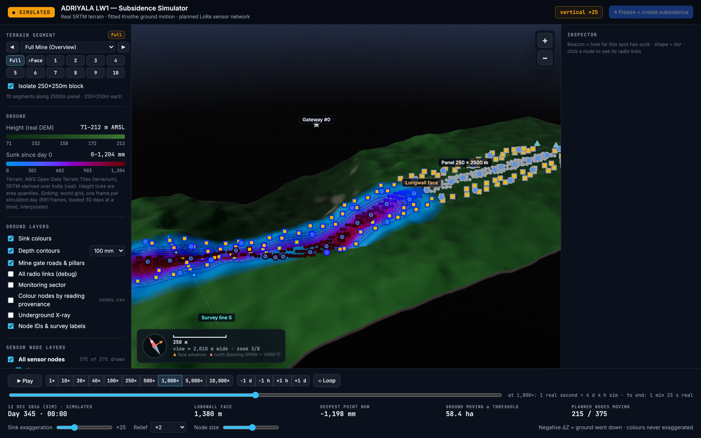
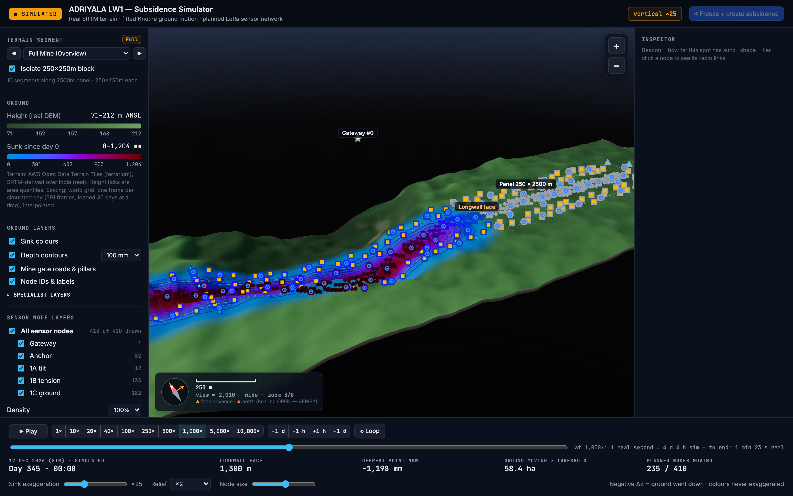
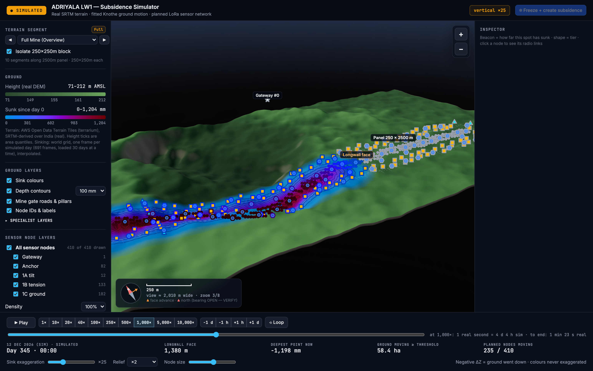

# F12 — View cleanup: lighter green, no survey line, trimmed terrain, shorter rail

**Status:** built by Claude, 17 Sep (session 22). Branch `feat/viz-darker-ground-bigger-nodes`.
**Source:** Adarsh's list of 17 Sep. Six items, each answered with a measurement rather than by eye.

---

## 1 · "We have a list of what nodes what, so it should show only that and not extra"

**Checked, and the view was already right.** Measured live in the page:

| | value |
|---|---|
| `plan.counts` | gateway 1 · anchor 47 · 1A 12 · 1B 133 · 1C 182 |
| tiers counted from `plan.nodes` | gateway 1 · anchor 47 · 1A 12 · 1B 133 · 1C 182 |
| `plan.nodes.length` | 375 |
| on-screen counter | `375 of 375 drawn` |

One icon per planned node, one layer per tier, no cluster badges (`#badges` holds 0 elements). Nothing
extra was being drawn.

What *was* duplicated is the **list itself**: the left rail showed the same five tier counts twice — once
in *Sensor node layers* next to the switches, once in *Planned network* as read-only rows. The second
copy is gone. Cost and the checks stay in *Planned network*, because those are the numbers only that box
reports.

---

## 2 · "Why is the extra terrain there — padding could be a bit, not the full"

Three extents, measured:

| | extent | area |
|---|---|---|
| world grid (the only ground that moves) | 3.09 × 0.84 km | 2.6 km² |
| drawn mesh, old symmetric 250 m margin | 3.59 × 1.34 km | **4.81 km²** |
| drawn mesh, new 100 m margin | 3.29 × 1.04 km | **3.42 km²** |

`context_margin_m` 250 → **100**. A longwall trough is a narrow strip — panel 250 m wide, ±146 m of
influence radius, so 542 m of moving ground inside a mesh that was 1340 m wide.

### The margin is now per side, because a symmetric one could not work

The gateway stands at **y = 1097.9 m** — 423 m *beyond* the old 250 m margin. It was floating in the
void, and trimming to 100 m would have pushed it 573 m out. New keys in `renderer/config.yaml`:

- `cover_planned_nodes: true` — widen only the sides that need it, so no planned node stands off the
  drawn ground.
- `node_ground_pad_m: 60.0` — ground kept beyond the outermost node, so it stands on land, not on the rim.

Every other side still trims to 100 m. Widening is clipped to the DEM exactly as before, so this can
never sample past real data.

### Rendered both, and left the covering OFF

| | drawn | gateway inside the mesh | look |
|---|---|---|---|
| `cover_planned_nodes: false` | **3.42 km²** | no | tight frame, the trough is the subject |
| `cover_planned_nodes: true` | 5.56 km² | yes | an empty north lobe larger than the trough |

Covering it costs **2.1 km² of ground that never moves** — and it does **not** fix the thing it was meant
to fix. With the mesh drawn underneath it, the gateway marker still reads as floating above the horizon,
because what lifts it is the **×25 vertical exaggeration** applied to its antenna height, not a missing
mesh. Paying 2.1 km² for no visible gain is the wrong trade, so the default is `false` and the flag stays
for the case where a node must genuinely stand on drawn ground.

**Still open:** the gateway marker's apparent float is a *marker height* problem, not a terrain one.
Fixing it means not exaggerating antenna height, which is a separate change.

---

## 3 · "Reduce the darkness of green to 6 if this is 10"

Solved on the CIE L\* schedule the file demands, not by picking hexes. Three ramps have been on screen:

| | L\* schedule | verdict |
|---|---|---|
| pre-16 Sep | 46.0 → 88.0 | Adarsh: "light green", rejected |
| 16 Sep | 14.8 → 45.7 | Adarsh, 17 Sep: too dark |
| **17 Sep** | **27.3 → 62.6** | 40 % of the way back toward the rejected ramp |

"10 → 6" read as **40 % less dark**, interpolated between the two ramps that had actually been on screen
rather than against an invented absolute darkness scale. Hue angle and chroma of every stop carried over
unchanged, so it is the same green — only L\* moves.

**Correction found on the way:** the 16 Sep comment in `ramps.js` claimed that ramp was L\* 24 → 52.
Measured against D65 it was **14.8 → 45.7**. The comment was wrong by about 9 L\*; it now records the
measured values.

---

## 4 · "What is this line on the terrain, and why — remove it"

**Survey line S.** A cyan dashed line at `geometry.survey_line_x_m` = 258 m, drawn across the full width
plus 2r on both sides, so it crossed the whole frame including ground that never moves. It read as a
fault or a pipeline rather than as a measurement transect.

Removed from the surface view, with its label. **The value is untouched**: `survey_line_x_m` still drives
the angle-of-draw lines in the Underground X-ray view and the real-anchored dataset in
`scripts/build_anchored_dataset.py`, which is where the JMMF field measurements are actually compared.
Nothing about the fit or its provenance changes.

---

## 5 · "Make it much cleaner, the UI has a lot of things"

| removed | why |
|---|---|
| the 12-button segment grid | chose the same segment as the dropdown and the arrows directly above it — three controls, one choice. The dropdown names the chainage, which numbered buttons could not, so it stayed. |
| the duplicate tier list | §1 above |
| four specialist toggles | radio-link debug, monitoring sector, provenance colouring and X-ray folded into a collapsed `Specialist layers` disclosure. |
| two long paragraphs | trimmed to one line each. |

`app.js` binds `.seg-btn` through `querySelectorAll`, so an empty set is a no-op and nothing needed
rewiring; `#tierRows` was bound **unguarded**, so its writer was removed with it.

### One thing added, not removed

*Planned network* now shows **"Closest two anchors — N m (need 80.0)"**, green or red. That check existed
in the plan JSON and was silently violated for two sessions; §6 is why it is worth showing.

---

## 6 · The algorithm defect behind that row

`min_anchor_spacing_m` (80 m) was enforced on cluster **centres**, but `placement.site_anchors` then chose
each anchor's ground independently within `min_node_spacing_m` (20 m) of its own centre. Two centres at
exactly 80 m could each drift 20 m toward the other, so anchors were installed **42.4 m** apart while the
reported check still read 80.

`site_anchors` is now greedy in centre order and rejects any candidate closer than `min_anchor_spacing_m`
to an anchor already sited, widening its search ring until it finds one. Measured:

| ring | worst pair |
|---|---|
| 20 m (old) | 41.2 m |
| 80 m | 72.1 m |
| **120 m** | **80.0 m — clean** |

`max_anchor_offset_m: 120.0`. Cost is path length only: max scout link 150 m, median 36 m, against
43.7 dB of margin. `test_sited_anchors_honour_min_anchor_spacing` asserts the **sited** positions, not
the centres, and that the reported check agrees with the geometry it describes.
