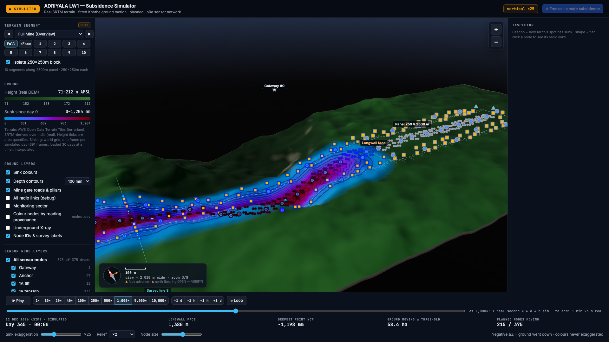
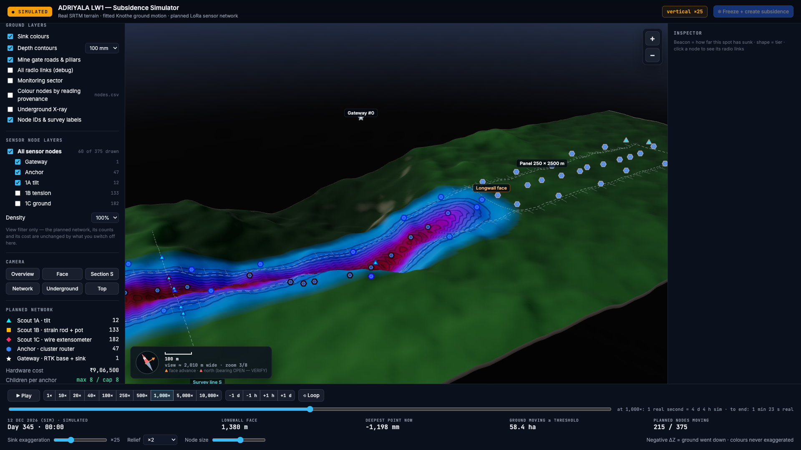

# F9 — Docked shell + per-tier node layer control

**Status:** built by Claude, 17 Sep (session 21). Branch `feat/viz-darker-ground-bigger-nodes`. Renderer only — no simulation re-run.
**Verified headlessly** (Playwright + ANGLE/Metal), not by eye: every claim below has a measured number behind it.

---

## 1 · The problem, measured

Every control panel was `position: fixed`, floating over a canvas that filled the whole window:

| element | before |
|---|---|
| `#left` | `fixed; top:70px; left:14px; width:292px` |
| `#right` | `fixed; top:70px; right:14px; width:318px` |
| `#bottom` | `fixed; left:50%; translateX(-50%); bottom:14px; width:min(1040px, 100vw-28px)` |
| `#zoomCtl` | `fixed; top:70px; **right:346px**` |
| `#scaleBox` | `fixed; left:14px; **bottom:190px**` |

The `346px` and `190px` are the tell: they are layouts computed by hand to dodge `#right` (318 + 14 + 14 = 346) and `#bottom`. About 610 px of window width was permanently under glass, with the map still being drawn and lit underneath it.

---

## 2 · The shell

`<body>` is now a CSS grid — three columns, three rows, the 3D view in the hole in the middle:

```
grid-template-columns: var(--railL) 1fr var(--railR);   /* 300px  1fr  320px */
grid-template-rows:    var(--barH)  1fr auto;           /* 56px   1fr  dock  */
```

`header` spans row 1; `#left` / `#viewport` / `#right` are row 2; `#bottom` spans row 3. Nothing is `position: fixed` any more, and both magic offsets are gone — the scale bar and zoom control moved *inside* `#viewport` as absolute overlays at a single `--mapPad`, because a scale bar and a north arrow belong on the map (cartographic convention), not in a rail.



### The part that silently breaks if skipped

The canvas no longer fills the window, so **ten** sites that read `window.innerWidth/innerHeight` had to read `#viewport`'s own box instead — renderer size, camera aspect, two picking handlers, two label projections, the scale bar's metres-per-pixel, the resize handler, and the LOD call. They now all route through one cached `vRect`.

The failure this defends against is a **constant 300 px horizontal offset on every click and every label**. Measured after the change:

```
viewport box [300, 56, 1300, 865]   canvas box [300, 56, 1300, 865]   match: true
clicks on node icons nearest the left rail edge:
  (325,638) -> #117   (325,734) -> #114   (367,750) -> #120   (388,626) -> #138
  5/5 hit the node actually under the cursor
```

`window.addEventListener("resize")` was replaced by a **ResizeObserver on `#viewport`**, because a window resize event does *not* fire when a rail collapses or a drawer opens, but the canvas must re-fit for both.

### Two bugs found and fixed during verification
1. `renderer.setSize(w, h, false)` left the canvas's CSS box at its previous size — the canvas measured 868 px tall inside an 865 px cell. `updateStyle` must stay on.
2. **The relocated scale bar swallowed clicks.** Sitting at the map's bottom-left corner it intercepted every pointer event in its rectangle, so clicking there left the inspector showing whichever node was selected before. Fixed with `pointer-events: none` — it is read-only furniture. Re-verified that the zoom buttons, which are interactive, still work (`view ≈ 2,010 m · zoom 3/8` → `1,000 m · zoom 4/8`).

### Responsive
The old rule was `@media (max-width: 1100px) { #right { display: none } }` — with no way to get the inspector back. Now a rail collapses into an overlay drawer with a tab to reopen it. Measured at 1000 px wide: `{rightHidden: true, rightIsDrawer: true, tabVisible: true}`, and clicking the tab reopens it.

---

## 3 · Too many nodes

A hide-everything toggle already existed (`#tPlan`). What was missing was switching off *part* of the network. Counts come from `scene.json` → `plan.counts`, never hardcoded:

```
gateway 1 · anchor 47 · 1A 12 · 1B 133 · 1C 182   (375 total)
```

Tier 1C alone is 48 % of every marker on screen. The new **Sensor node layers** box gives one checkbox per tier plus a density select (100 % / 50 % / 25 %, from `display.density_steps`).



With 1B and 1C off, **60 of 375 drawn** — the trough, its contours and the ground underneath become readable.

```
all on            375 of 375 drawn   ·  "planned nodes moving" 215 / 375
1C off            193 of 375 drawn   ·  "planned nodes moving" 215 / 375   (unchanged)
density 25%       131 of 375 drawn   ·  "planned nodes moving" 215 / 375   (unchanged)
1B + 1C off        60 of 375 drawn
```

**It is a view filter and nothing else.** It never touches `scene.json`, `plan.counts`, the hardware cost, or the bottom-dock statistics — verified above, the reported "planned nodes moving" is identical in every case. If hiding a node changed a reported number we would be lying about the network.

Three details that matter:
- A hidden node loses its icon, its 3D model, its **pick target** and its label together. `Network.shown` folds into `iconHidden` (which icons and `pickScreen` already honour) and zeroes the instance scale in `refresh()`, which also removes it from `this.hit` — the invisible cylinder the raycaster picks against. A hidden node that is still clickable would be worse than no filter.
- **Gateway and anchors are never thinned by the density control.** They are the mesh backbone; hiding them is not decluttering, it is a wrong picture. Only 1A/1B/1C thin out.
- Thinning is deterministic (rank by `node_id` within each tier), so the same nodes are drawn on every reload, and the choice persists in `localStorage` inside `try/catch`.

---

## 4 · Files changed

```
renderer/index.html    grid shell, overlays moved inside #viewport, Sensor node layers box
renderer/js/app.js     viewport rect helper + 10 call sites, ResizeObserver, layer control, drawers
renderer/js/network.js Network.shown / setShown, folded into iconHidden and the instance scale
renderer/config.yaml   display.density_steps
```

`renderer/tests` — **19 passed**. Nothing under `mine-sim/` was touched.

---

## 5 · Hand checks for Adarsh

1. `./run-simulation.sh view`. Drag the window narrower and wider — the 3D view resizes with the grid cell and never slides under a rail.
2. **Click a node right next to the left rail.** The inspector must fill for *that* node. This is the thing most likely to be silently wrong; it is verified above but worth seeing.
3. Turn off 1C. 182 markers go; "Planned nodes moving" in the dock must **not** change.
4. Shrink below 1100 px. The inspector must still be reachable from its tab.
5. Reload — your layer choice should still be set.

## 6 · Still open (not F9's job)
- The depth ramp is still the blue→magenta rainbow normalised to the running peak. That is **F7**, not yet built.
- The gateway at y ≈ 1098 m still sits outside the drawn terrain collar.
