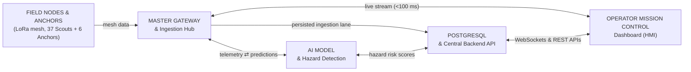
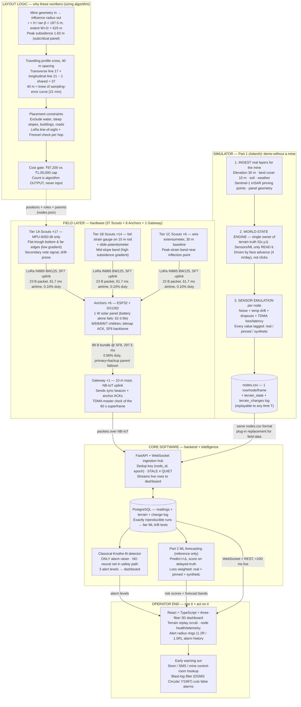

# Tech Work Flowchart — Mine Subsidence System (for PPT team)

Purpose: one end-to-end picture combining **hardware (field) + software (tech)** so the PPT team can place it next to the hardware slides. Mine-independent (Adriyala is just the example input). Two versions below: **compact (1 slide)** and **full-depth (2–3 slides or appendix)**.

---

## VERSION A — Compact (one PPT slide)

Covers the whole story in 6 boxes. Matches `mine_subsidence_hld.drawio`.

**One-line subtitle for the slide:** Ground moves → sensors read → LoRa mesh carries → gateway ingests → backend stores → detector alarms + ML forecasts → 3D dashboard shows → early warning goes out.

---

## VERSION B — Full-depth (explanatory, 2–3 slides)

Each box below carries its key numbers so a viewer understands *why*, not just *what*.

### How to split Version B across slides

| Slide | Subgraphs to show | Caption |
|---|---|---|
| B1 — Sense & place | FIELD + LAYOUT | "37 smart nodes placed by algorithm, not by hand — travelling cross follows the mining face" |
| B2 — Simulate & ingest | SIM + CORE (API + DB) | "Real data builds the terrain; every value tagged real/pinned/synthetic; one backend owns truth" |
| B3 — Decide & act | CORE (DET + ML) + OUT | "Classical detector raises alarms, ML forecasts ahead, dashboard replays everything, warnings go out" |

---

## Box-by-box PPT mapping (both versions)

| PPT box | What it is | Key number to print on the slide | Owned by |
|---|---|---|---|
| Field nodes & anchors | 37 Scouts + 6 Anchors, travelling profile cross, 40 m spacing | 40 m = error knee (21 mm); 86 dB link margin | Hardware team |
| Master gateway & ingestion | 10 m mast, NB-IoT, TDMA master, bitmap ACKs | 60 s superframe; anchor duty 0.56% ≤ 1% | Tech + hardware |
| Layout logic | Sizing algorithm: geometry → extent → spacing → tiers → cost | ₹97,200 vs ₹1,00,000 cap | Adarsh (tech) |
| Simulator (Part 1) | Data-driven terrain that evolves itself; no click-to-subside | Face advance 4 m/day; peak 1.63 m | Adarsh (tech) |
| PostgreSQL + backend API | Readings + terrain snapshots + change log (fully replayable) | Dedup `(node_id, epoch)` | Tech |
| AI model + hazard detection | Classical detector alarms; ML only forecasts | No neural net in safety path | Tech (ML teammate) |
| Mission control dashboard | 3D replay, node health, 3 alert levels | <100 ms live stream | Tech (frontend) |
| Early warning out | Siren/SMS/control-room; blast-log false-alarm filter | DGMS Circular 7/1997 | Hardware + mine |

## Notes for whoever draws the PPT

- Version A is the opener slide; Version B (B1–B3) is the deep-dive or appendix.
- Keep hardware boxes (field, gateway) visually grouped — that half merges with the hardware slides.
- The simulator box is the "demo without a mine" story: identical `nodes.csv` format, so downstream works before deployment.
- Safety line for judges: **no neural network in the alarm path** — classical detector owns alarms; ML only predicts.
- Provenance tags (`real` / `pinned` / `synthetic`) stop the ML from "learning the simulator instead of the ground".
