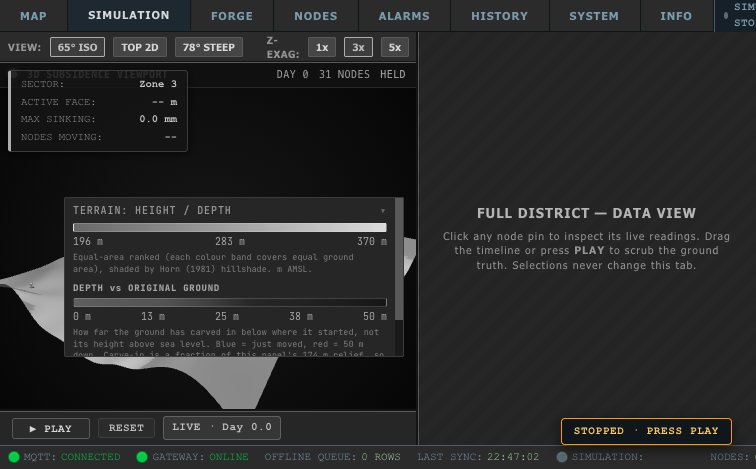
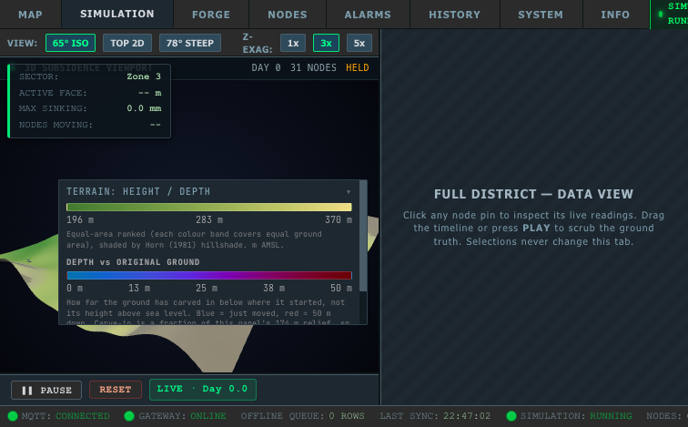
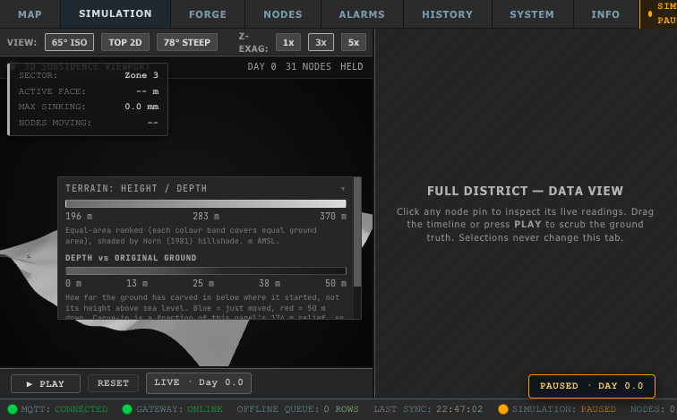

# A3 Walkthrough · SIM Tab PLAY/PAUSE + RESET, Engine Idle Until PLAY, Clean Start on Launch

## Overview
Implemented step **A3** per `docs/plans/2026-09-26-forge-v2-live-and-scripted.md`:
1. **Engine idle until PLAY**: Removed embed arm-on-connect effect from `simulation/frontend/src/App.tsx` and reconnect re-arm for embed instances so the engine remains `STOPPED` until an operator presses `PLAY`.
2. **SIM tab toolbar controls**: Added `#sim-play-btn` ("▶ PLAY" / "❚❚ PAUSE") and `#sim-reset-btn` ("RESET") into the bottom SIM live toolbar next to `#sim-live-day-badge`.
3. **Dedicated controls module**: Handlers are isolated in `dashboard_electron/renderer/js/sim/sim-controls.js`, ensuring `sim-tab.js` (FORGE) never touches `/control`.
4. **Engine state tracking**: Button labels and states track actual engine state via `/api/simulation/status` and WebSocket `simulation_status` broadcasts.
5. **Paused / stopped visual styling**: Applied `body.sim-paused` with `filter: grayscale(1)` on live tabs (`#tab-map`, `#tab-sim`, `#tab-nodes`, `#tab-alarms`) and a floating status chip (`#sim-paused-chip`), while leaving `FORGE`, `HISTORY`, `SYSTEM`, and `INFO` in full colour.
6. **Clean start on launch**: Added `bootReset()` in `dashboard_electron/main.js` running at `app.whenReady()` only when `SIH_BOOT_RESET === '1'` (resetting the engine on `:8000` and truncating PostgreSQL tables via backend).

---

## Launch Scripts with `SIH_BOOT_RESET=1`

### 1. `package.json` (root)
```json
"electron": "cd dashboard_electron && SIH_BOOT_RESET=1 npx electron .",
```

### 2. `dashboard_electron/package.json` (`start`)
```json
"start": "SIH_BOOT_RESET=1 electron .",
```

### 3. `dashboard_electron/package.json` (`dev`)
```json
"dev": "SIH_BOOT_RESET=1 electron . --dev",
```

> **Note**: Test runners spawn the Electron or Node binary directly without `SIH_BOOT_RESET=1`, ensuring automated tests never wipe or alter the live stack.

---

## Headless Screenshots of SIM Tab States

### 1. STOPPED State (`sim-tab-stopped.png`)
Engine is idle at Day 0, button reads `▶ PLAY`, status chip reads `STOPPED · press PLAY`, and live tab styling has `filter: grayscale(1)`.



### 2. RUNNING State (`sim-tab-running.png`)
Operator clicks `PLAY`; engine transitions to `RUNNING`, button toggles to `❚❚ PAUSE`, day advances smoothly, and greyscale filter is removed.



### 3. PAUSED State (`sim-tab-paused.png`)
Operator clicks `PAUSE`; engine transitions to `PAUSED`, button toggles to `▶ PLAY`, simulation time holds static, and greyscale styling re-applies.



---

## Verification & Check Outputs

### 1. TypeScript Check
```
$ cd simulation/frontend && npx tsc --noEmit -p tsconfig.app.json
(exit 0, zero errors)
```

### 2. `verify_sim_controls.js` (Isolated Engine :8023 + Backend :8089)
```
=====================================================
[TEST] SIM TAB CONTROLS AND LIFECYCLE (A3)
=====================================================

[STEP 1] Starting isolated engine on 127.0.0.1:8023...
  PASS  Isolated engine running on http://127.0.0.1:8023
[STEP 2] Starting isolated backend on 127.0.0.1:8089...
  PASS  Isolated backend running on http://127.0.0.1:8089
  PASS  Initial engine status confirmed STOPPED via backend
[STEP 3] Launching headless browser...
[STEP 4] Waiting for dashboard boot...
[STEP 5] Checking fresh load state (waiting 10 s to confirm engine remains idle)...
  PASS  Fresh load: engine reports STOPPED, day held at 0, button reads "▶ PLAY", body.sim-paused is true, chip reads "STOPPED · press PLAY"
  [SCREENSHOT] Saved sim-tab-stopped.png (74 KB)
[STEP 6] Testing PLAY button...
  Waiting 3s for simulation day to advance...
  PASS  PLAY: engine is RUNNING, button reads "❚❚ PAUSE", t_sim_seconds advanced to 60.00
  [SCREENSHOT] Saved sim-tab-running.png (111 KB)
[STEP 7] Testing PAUSE button and 10 s hold...
  Engine paused at t_sim_seconds = 60. Waiting 10 s to verify hold...
  PASS  PAUSE held day static for 10 s (60 s)
  [SCREENSHOT] Saved sim-tab-paused.png (75 KB)
[STEP 8] Testing PLAY (resume)...
  PASS  PLAY (resume): engine RUNNING, advanced from 60 to 120.00
[STEP 9] Testing RESET button...
  PASS  RESET: engine STOPPED at day 0; readings count = 0, alarms count = 0
[STEP 10] Switching away to MAP and reopening SIM tab 3 times...
  PASS  SIM tab reopened 3 times: engine stayed STOPPED at day 0 with zero auto-start
[STEP 11] Verifying clean start boot reset behavior...
  PASS  Without SIH_BOOT_RESET=1: DB rows preserved (1 rows)
  PASS  With SIH_BOOT_RESET=1: engine reset and DB rows wiped to 0

=====================================================
ALL SIM CONTROLS VERIFICATION CHECKS PASSED
=====================================================
```

### 3. `verify_forge_isolation.js`
```
=== 1. FORGE dashboard modules never address the live system ===
  PASS  sim-embed.js has no :8000 (engine) address
  PASS  sim-embed.js has no :8080 (backend) address
  PASS  sim-embed.js has no /control call
  PASS  sim-tab.js has no :8000 (engine) address
  PASS  sim-tab.js has no /control call
  PASS  sim-tab.js backend :8080 path is strictly /api/simulation/status
  PASS  sim-tab.js has no :8080 path other than /api/simulation/status
  PASS  sim-tab.js uses only GET toward :8080
  PASS  sim-embed.js has no :8020 address
  PASS  sim-tab.js has no :8020 path other than /forge/frame, /forge/range, /forge/seed, /health
  PASS  sim-tab.js forge endpoints are strictly /forge/frame, /forge/range, /forge/seed, /health

=== 2. App.tsx guards every engine write on engineReadOnly ===
  PASS  engineReadOnly derives from isEngineReadOnly(embedParams)
  PASS  App.tsx FORGE slot ignores live ticks
  PASS  sendWsAction returns early for FORGE (covers start/pause/apply_*/reset/stop)
  PASS  on-connect set_speed is skipped for FORGE
  PASS  on-connect start re-arm is skipped for FORGE
  PASS  close-everything (engine stop + DB wipe) is a no-op for FORGE
  PASS  FORGE arms locally instead of auto-starting the engine

=== 3. No unguarded engine writes in App.tsx ===
  PASS  exactly 3 socket sends (set_speed, start re-arm, sendWsAction) — found 3
  PASS  exactly 1 POST /control (inside sendWsAction) — found 1

ALL CHECKS PASSED
```

### 4. Full Dashboard Test Suite Status
- `node test/verify_sim_controls.js`: **PASS**
- `node test/verify_forge_isolation.js`: **PASS**
- `node test/verify_forge_timeline.js`: **PASS**
- `node test/verify_forge_cavein.js`: **PASS**
- `node test/verify_forge_close.js`: **PASS**
- `node test/verify_sandbox.js`: **PASS**
