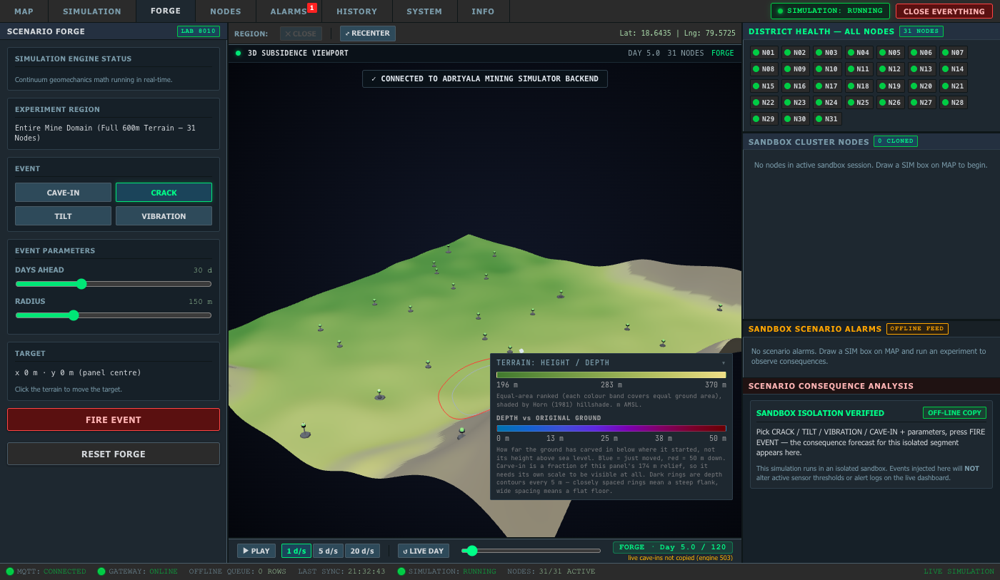
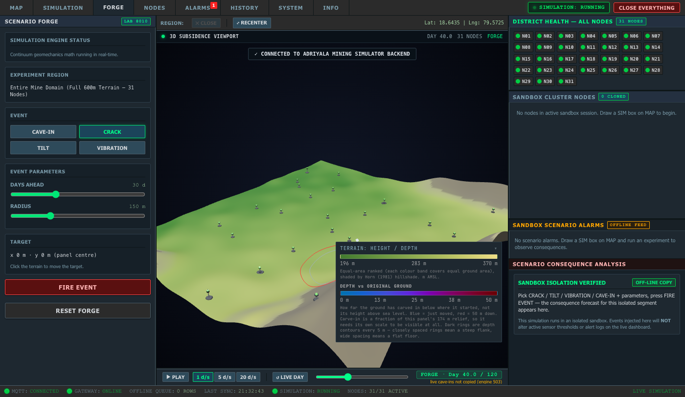
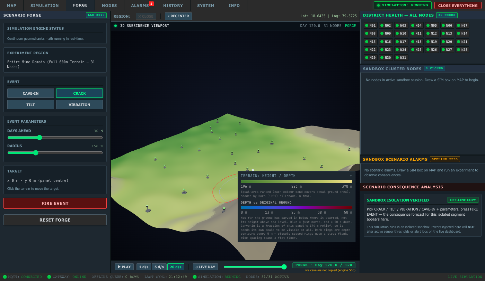

# B2b · FORGE timeline driven by :8020 frames

Commit: `feat(forge): independent FORGE timeline driven by the :8020 math`

Started by Antigravity (stopped mid-step on quota); finished, reviewed and verified by Claude.

## What changed

- **App.tsx / embed.ts**
  - New parent command `forge-frame {frame}`. In the FORGE slot it applies `t_sim`, `t_days`, `time_scalar`, `perturbations` and `nodes` through the same setters the live tick uses (`setTDays`, `setTimeScalar`, `setPerturbations`, `setNodeTelemetry`). There is no second render path.
  - FORGE slot ignores live tick payloads (`if (data.t_sim !== undefined) { if (engineReadOnly) return; …`) and never fetches packets (`packet_available` and `/simulation/packets/latest` are skipped). `init` is still handled. The SIM slot is unchanged.
  - After applying a frame, the slot posts `forge-frame-applied {t_days, perturbations, max_amp, time_scalar}`.
  - In the FORGE slot, the viewport header shows the frame's day (`DAY 40.0`) and `FORGE` instead of the embed-URL day and `LIVE/HELD`.
  - Removed the unused `embedSlotRef` so the real type check is clean (see Check d).
  - **embed.ts:** the uncommitted `terrain-target` child-event type from before this step is committed in this commit, together with the `forge-frame` / `forge-frame-applied` types. B2c uses `terrain-target`.
- **index.html / sim-tab.css:** FORGE centre toolbar with ▶ PLAY / ⏸ PAUSE, 1 / 5 / 20 d/s, ↺ LIVE DAY, a day slider from 0 to END, the badge `FORGE · Day N.N / END`, and a small note under the badge.
- **sim-tab.js:** FORGE state is `{ day, events, endDay, playing, speed }`.
  - All :8020 calls go through `callForgeApi` (2 s AbortController timeout). The base URL is one constant, `FORGE_API_BASE` (default `http://127.0.0.1:8020`; a `?forge_port=` query param overrides it for tests).
  - Seeding (first FORGE open and ↺ LIVE DAY) calls `GET /forge/seed`. If that fails, FORGE uses the live day from the same `GET :8080/api/simulation/status` the LIVE badge reads, with no events, and shows `live cave-ins not copied (<reason>)`. If that also fails, or `/forge/range` fails, it shows `FORGE offline: start :8020` and disables PLAY. It never makes up a day or END.
  - Then `POST /forge/range` sets END, FORGE starts paused, and it requests that day's frame.
  - At most one frame request is in flight; only the newest waiting day is kept.
  - PLAY advances `speed × wall-seconds` per delivered frame, stops at END, and restarts from 0 if pressed at END. Leaving the FORGE tab pauses it. There is one loop, driven by frame replies.
- **sim-embed.js:** `sendForgeFrame(frame)` posts to the FORGE slot only. It records `forge-frame-applied`.
- **verify_forge_isolation.js:** new checks: sim-embed.js has no :8020 address; sim-tab.js's `/forge/*` paths are only frame / range / seed / health; App.tsx's FORGE slot returns before applying live ticks. All existing checks are kept.
- **verify_forge_timeline.js** (new): see Check a.

## Notes

- **Test harness:** like `verify_sandbox.js` and `acceptance_s3.js`, the timeline test drives headless Chrome over CDP against the dashboard page served on :8085. It does not start its own Electron process.
- **Test :8020 server:** the test **starts its own** FORGE server on **:8022** from the working tree and kills it at the end (`FORGE_PORT` overrides). The prompt suggested 8021, but on this Mac 8021 is held by launchd (`netstat` shows `127.0.0.1.8021 LISTEN launchd:1`), so uvicorn cannot bind it.
- **Live seed:** the running :8000 predates `/interventions`, so `/forge/seed` returns 503. FORGE opens on the real live day (2.9 at test time) with no cave-ins and says `live cave-ins not copied (engine 503)`. That is the expected path until :8000 is restarted.
- **Type check:** `simulation/frontend/tsconfig.json` is `"files": []` plus project references, so a plain `npx tsc --noEmit` type-checks **nothing**. That includes the earlier "clean" results in B2a. The real check is `npx tsc --noEmit -p tsconfig.app.json`, which surfaced two errors. Both are fixed: the `frame.nodes` type was cast to `NodeTelemetry[]`, and `embedSlotRef` (unused at HEAD too) was removed.

## Checks

### a) verify_forge_timeline.js

```
=====================================================
[TEST] FORGE TIMELINE DRIVEN BY :8020 MATH
=====================================================

[STEP 1] Starting forge math server on port 8022...
  PASS  Forge math server running on http://127.0.0.1:8022
[STEP 2] Launching headless browser...
[STEP 3] Booting dashboard and installing request/event hooks...
[STEP 4] Opening FORGE tab...
  Badge text: FORGE · Day 3.0 / 120
  Badge note: "live cave-ins not copied (engine 503)"
  FORGE events after seed: 0
  PASS  FORGE opened: badge shows a day and END = 120

[STEP 5] Scrubbing slider to day 10...
  Day 10 frame: applied { t_days: 10, time_scalar: 0.32968, perturbations: 0, max_amp: 0 }
  Day 10 direct:  { t_days: 10, time_scalar: 0.32968, perturbations: 0, max_amp: 0, max_subsidence_m: 0.6584 }
  PASS  Day 10 applied frame matches direct :8022 math

[STEP 6] Scrubbing slider to day 60...
  Day 60 frame: applied { t_days: 60, time_scalar: 0.90928, perturbations: 0, max_amp: 0 }
  Day 60 direct:  { t_days: 60, time_scalar: 0.90928, perturbations: 0, max_amp: 0, max_subsidence_m: 1.8159 }
  PASS  Day 60 applied frame matches direct :8022 math

[STEP 7] Capturing screenshots (day 5, day 40)...
  [SCREENSHOT] Saved forge-day-5.png (341 KB)
  [SCREENSHOT] Saved forge-day-40.png (341 KB)

[STEP 8] Testing PLAY at 20 d/s from day 100 with PAUSE hold...
  Starting PLAY from day 100...
  Advancing: current day is 102.54 (playing: true)
  Clicking PAUSE mid-way...
  Paused at day 102.54. Waiting 3 seconds to verify it holds...
  After 3s hold: day is 102.54
  PASS  PAUSE held day static for 3 s
  Resuming PLAY to END (120)...
  Stopped at END: day=120.0 / 120, btn="▶ PLAY"
  PASS  PLAY at 20 d/s advanced smoothly and auto-stopped at END
  [SCREENSHOT] Saved forge-day-end.png (339 KB)

[STEP 9] Verifying backend request isolation...
  Request summary during test: {
  to8000Control: 0,
  to8080Forbidden: 0,
  to8080Status: 1,
  forbiddenList: []
}
  PASS  Zero requests to :8000/control and strictly zero non-status requests to :8080/api/simulation/*

[STEP 10] Switching to MAP tab and observing for 5 s...
  Initial /forge/frame count: 56. Sleeping 5 seconds...
  /forge/frame count after 5s on MAP: 56
  PASS  Zero /forge/frame requests for 5 s while away on MAP tab

=====================================================
ALL FORGE TIMELINE VERIFICATION CHECKS PASSED
=====================================================

```

The day 10 / 60 frames match the direct `POST /forge/frame` on `t_days`, `time_scalar` (which scales the bowl), perturbation count and max_amp. With no cave-ins yet, both perturbation counts are 0. B2c's test covers cave-in depth.

### b) verify_forge_isolation.js

```

=== 1. FORGE dashboard modules never address the live system ===
  PASS  sim-embed.js has no :8000 (engine) address
  PASS  sim-embed.js has no :8080 (backend) address
  PASS  sim-embed.js has no /control call
  PASS  sim-tab.js has no :8000 (engine) address
  PASS  sim-tab.js has no /control call
  PASS  sim-tab.js backend :8080 path is strictly /api/simulation/status
  PASS  sim-tab.js has no :8080 path other than /api/simulation/status
  PASS  sim-tab.js uses only GET toward :8080
  PASS  sim-embed.js has no :8020 address
  PASS  sim-tab.js has no :8020 path other than /forge/frame, /forge/range, /forge/seed, /health
  PASS  sim-tab.js forge endpoints are strictly /forge/frame, /forge/range, /forge/seed, /health

=== 2. App.tsx guards every engine write on engineReadOnly ===
  PASS  engineReadOnly derives from isEngineReadOnly(embedParams)
  PASS  App.tsx FORGE slot ignores live ticks
  PASS  sendWsAction returns early for FORGE (covers start/pause/apply_*/reset/stop)
  PASS  on-connect set_speed is skipped for FORGE
  PASS  on-connect start re-arm is skipped for FORGE
  PASS  close-everything (engine stop + DB wipe) is a no-op for FORGE
  PASS  FORGE arms locally instead of auto-starting the engine

=== 3. No unguarded engine writes in App.tsx ===
  PASS  exactly 3 socket sends (set_speed, start re-arm, sendWsAction) — found 3
  PASS  exactly 1 POST /control (inside sendWsAction) — found 1

ALL CHECKS PASSED

```

### c) Full dashboard test set

```
acceptance_s3: FAIL(1): ❌ S3 ACCEPTANCE FAILED: Error: FAIL: #sim-gate-banner is not visible when gated!
verify_forge_close: PASS
verify_forge_isolation: PASS
verify_forge_timeline: PASS
verify_sandbox: FAIL(1): ❌ [TEST FAILURE] Error: CAVE-IN did not post a trigger to the FORGE slot!
```

Only the two known failures, both unchanged: acceptance_s3 (gate banner, fixed by A3) and verify_sandbox STEP 5 CAVE-IN (fixed by B2c).

### d) Type check

```
$ npx tsc --noEmit -p tsconfig.app.json
exit 0
$ npx tsc --noEmit
exit 0
```

### e) Screenshots

Day 5:



Day 40:



END (day 120):


