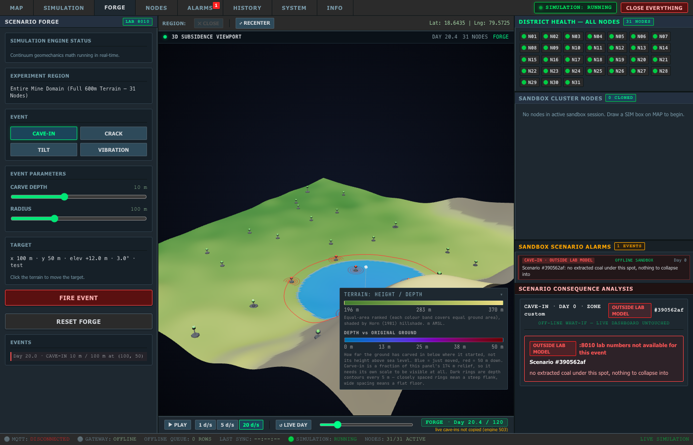
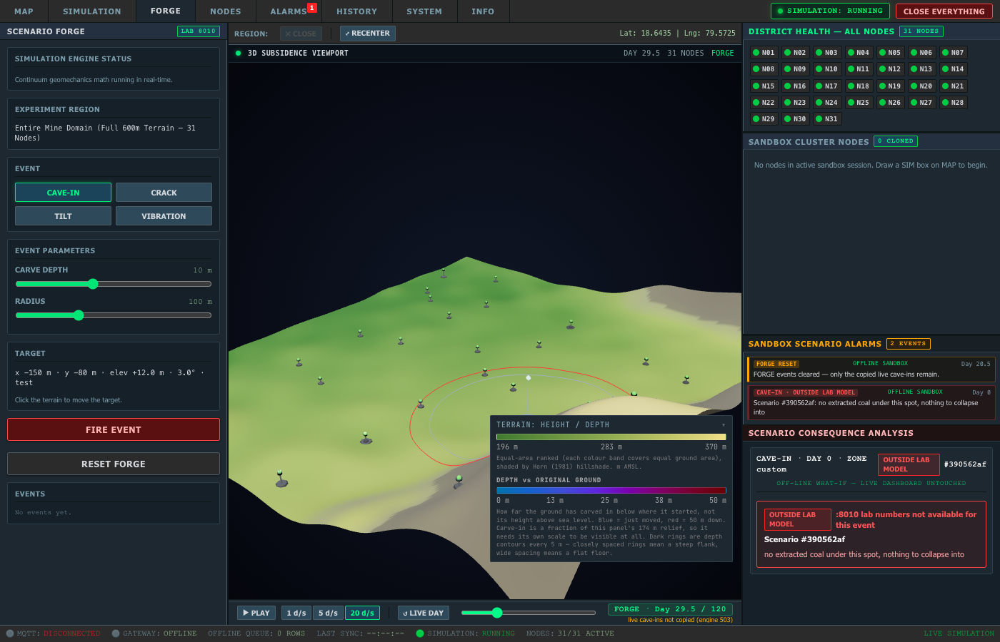
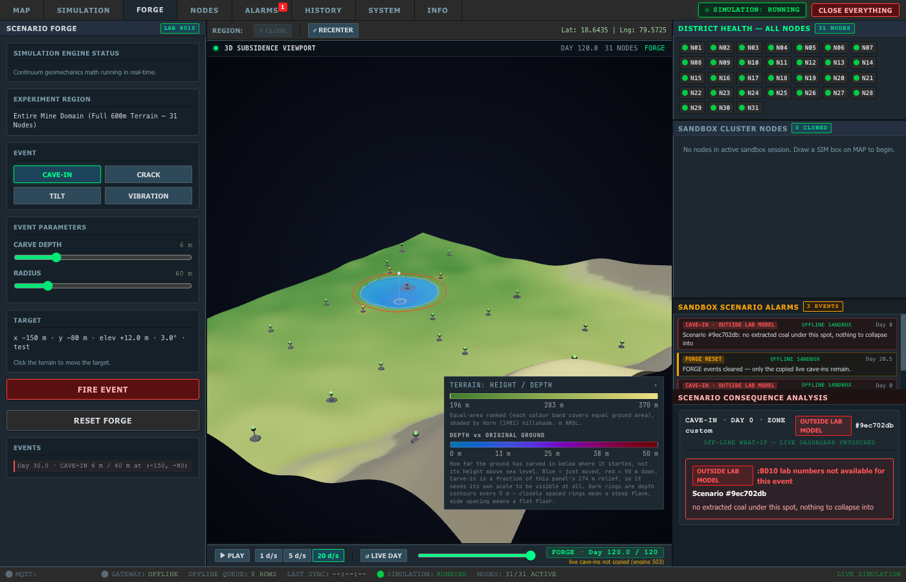

# B2c · Click-to-target and CAVE-IN as a FORGE timeline event

Commit: `feat(forge): click-to-target cave-in as a timeline event`

## What changed

- **Click-to-target** (App.tsx): in the FORGE slot, a terrain click places the beacon as before and posts `terrain-target {x, y, elev, slopeDeg, zoneName}`. sim-embed.js routes it to `simTab.setForgeTarget`, which fills the left TARGET readout.
  - Before any click the readout reads `x 0 m · y 0 m (default)`.
  - `elev` is height above the mesh datum, so the readout shows `elev +N m`, the same number the sim's own panel shows as "+N m". It is not AMSL.
- **FIRE with CAVE-IN** (sim-tab.js `fireForgeCaveIn`): pushes `{type:"cave_in", x, y, radius_m, depth_m, day: FORGE day, duration_h}` onto FORGE's events.
  - depth and radius come straight from the CARVE DEPTH / RADIUS sliders. No fallbacks: if either is missing, nothing fires.
  - `duration_h` = **4.8, the engine default** (`apply_collapse(duration_hours=4.8)`). There is no duration control.
  - It then calls `POST /forge/range` for the new END and starts PLAY.
  - This happens before the :8010 lab call, so the cave-in works even when the lab is down or says no.
- **Effects** (App.tsx): new command `forge-effect {type:"cave_in", cx, cy, rad, depth}`, FORGE slot only.
  - It moves the beacon onto the event (as `trigger` does) and plays the dust burst, camera shake and toast from `handleTriggerEvent`.
  - It never calls `globalGeomechanics.triggerCollapse` and never touches `perturbations`. The ground comes only from :8020 frames.
  - The dust and shake helpers were lifted out of `handleTriggerEvent` unchanged, so the SIM slot and the standalone app behave as before.
- **fireForgeTrigger**:
  - The `!data.possible` early return is gone, so :8010 numbers are extra info only.
  - When the lab says not possible, the result card and notification say **OUTSIDE LAB MODEL** (it used to say REFUSED / "rejected by safety gate"). CRACK / TILT / VIBRATION still fire their FORGE preview.
  - CAVE-IN no longer sends `trigger`, because its ground is the timeline's.
  - CRACK, TILT and VIBRATION are otherwise unchanged; B2d–B2f replace them.
- **Event list** (index.html left column, under the controls): one line per event, e.g. `Day 20.0 · CAVE-IN 10 m / 100 m at (100, 50)`; seeded live events get ` (live)`.
- **RESET FORGE**: clears FORGE's own events and keeps `source:"live"` ones. It then recomputes END via `/forge/range`, clamps the day to END and reloads that day's frame.
- **Isolation**: node colours in FORGE come only from the frame. Nothing goes to the global bus, ALARMS, MAP or the main banner. The in-tab sandbox notifications are FORGE-only, as before.
- **verify_sandbox.js STEP 5**: rewritten. It fires CAVE-IN in FORGE and asserts that:
  - the event is in FORGE's events,
  - a `/forge/frame` request carrying it follows,
  - the slot applies a frame with `perturbations ≥ 1`,
  - `forge-effect` was sent.

  The SIM slot must get no `trigger` / `set-cracks` / `forge-effect` / `forge-frame`. Its other steps are unchanged.
- **verify_forge_cavein.js** (new): see Check a.

## Notes

- **Test setup:** verify_forge_cavein.js uses the same headless-Chrome and :8085 harness as the other dashboard tests. It starts its **own** FORGE server on **:8022** (8021 is held by macOS launchd).
  - It opens the page on 127.0.0.1, so the FORGE iframe (127.0.0.1:5173) is same-site and its JS context can be evaluated directly.
  - It pins the viewport to 1400×900 with `Emulation.setDeviceMetricsOverride`, because a `/json/new` tab ignores `--window-size`. Without that, the page rendered at 756×469 with a 74 px-wide FORGE view.
- **triggerCollapse spy:** the test imports `/src/utils/geomechanicsEngine.ts` inside the FORGE iframe, which is the same Vite module instance App.tsx uses, and wraps `globalGeomechanics.triggerCollapse`. The last check proves the spy is live: an old-style `trigger` collapse moves it 0 → 1. So the 0 during both CAVE-INs is real.
- **Target in the test:** the (100, 50) and (-150, -80) targets are posted as `terrain-target` from inside the FORGE iframe, because a click can't hit exact metres. The real click path is tested separately (step 1: a CDP mouse click on the terrain fills the readout).
- **Lab numbers:** at both test spots the :8010 lab answers "no extracted coal under this spot", so the right column shows OUTSIDE LAB MODEL. The lab request still uses the old day (`sandboxSession.day` / `currentDay`, 0 here), not the FORGE day. I left this alone because it is outside this step; B2d–B2f touch that path.
- **":8020 running" precondition:** verify_sandbox.js STEP 5 needs a FORGE server on :8020 (the page default). It used the one already running (pid 14944, started 21:03, after the B2a-fix commit).

## Checks

### a) verify_forge_cavein.js

```
=====================================================
[TEST] FORGE CAVE-IN AS A TIMELINE EVENT (B2c)
=====================================================

[SETUP] Started own FORGE server on http://127.0.0.1:8022

[1] Target readout
  before click: "x 0 m · y 0 m (default)"
  PASS  before any click the target is (0, 0) (default)
  after real click: "x -71 m · y -32 m · elev +7.9 m · 2.3° · PIT_BASIN"
  PASS  a real terrain click posts terrain-target and fills the readout
  after terrain-target (100, 50): "x 100 m · y 50 m · elev +12.0 m · 3.0° · test"
  PASS  readout shows the posted target (100, 50)

[3] FIRE CAVE-IN 10 m / 100 m at (100, 50) on day 20
  [SCREENSHOT] forge-cavein-a-before.png
  event list: ["Day 20.0 · CAVE-IN 10 m / 100 m at (100, 50)"]
  event: {"type":"cave_in","x":100,"y":50,"radius_m":100,"depth_m":10,"day":20,"duration_h":4.8}
  PASS  event list has "Day 20.0 · CAVE-IN 10 m / 100 m at (100, 50)"
  PASS  event carries the slider values, the target and the FORGE day (duration_h = engine default 4.8)
  PASS  PLAY started after FIRE
  PASS  a /forge/frame request carrying the new event followed FIRE
  stopped at day 120 / END 120
  PASS  PLAY stopped at END by itself
  [SCREENSHOT] forge-cavein-a-after.png
  [SCREENSHOT] forge-cavein-a-during.png

[4] Depth at END and before the event
  END applied: {"event":"forge-frame-applied","t_days":120,"perturbations":1,"max_amp":10,"time_scalar":0.99177,"source":"r4-sim-viewport"}
  PASS  max_amp at END ≈ 10 m (±10%): 10
  day 19 applied: {"event":"forge-frame-applied","t_days":19,"perturbations":0,"max_amp":0,"time_scalar":0.53233,"source":"r4-sim-viewport"}
  PASS  day 19: perturbations = 0

[5] Node states at day 20.5
  day 20.5 applied: {"event":"forge-frame-applied","t_days":20.5,"perturbations":1,"max_amp":9.363620667976129,"time_scalar":0.55957,"source":"r4-sim-viewport"}
  within 1.2R: N02,N03,N05,N06,N23,N24 | CRITICAL in frame: N02,N03,N05,N06,N23,N24
  PASS  every node within 1.2 × 100 m of (100, 50) is CRITICAL in the FORGE frame

[9] Second spot: RESET FORGE, then 6 m / 60 m at (-150, -80) on day 30
  PASS  RESET FORGE cleared FORGE's own events (left: 0 live)
  [SCREENSHOT] forge-cavein-b-before.png
  [SCREENSHOT] forge-cavein-b-after.png
  [SCREENSHOT] forge-cavein-b-during.png
  spot B END applied: {"event":"forge-frame-applied","t_days":120,"perturbations":1,"max_amp":6,"time_scalar":0.99177,"source":"r4-sim-viewport"}
  PASS  spot B max_amp at END ≈ 6 m: 6

[7] globalGeomechanics.triggerCollapse in the FORGE slot
  PASS  triggerCollapse calls during both CAVE-INs: 0

[6] MAP node states and ALARMS count
  ALARMS before/after: 1 / 1
  PASS  MAP node states unchanged (31 nodes)
  PASS  ALARMS count unchanged

[8] Requests
  page: {"control":0,"forbidden":[],"status":1} | FORGE iframe fetches: []
  PASS  page: zero :8000/control and zero :8080/api/simulation/* other than GET status
  PASS  FORGE iframe: zero /control and /api/simulation/* requests
  PASS  spy control: an old-style 'trigger' collapse moves the spy (0 → 1)

=====================================================
ALL FORGE CAVE-IN CHECKS PASSED
=====================================================
```

### b) verify_sandbox.js (STEP 5 now passes)

```
[STEP 5] FORGE slot ready. Running CRACK...
[STEP 5] Commands after CRACK: {
  forge: [
    'forge-frame',
    'set-day',
    'set-bounds',
    'set-day',
    'recenter',
    'set-cracks'
  ],
  sim: [ 'recenter' ]
}
[STEP 5] Running CAVE-IN...
[STEP 5] CAVE-IN on the FORGE timeline: {"events":[{"type":"cave_in","x":0,"y":0,"radius_m":60,"depth_m":2,"day":3.1,"duration_h":4.8}],"effects":["cave_in"],"frameWithEvent":true,"maxAppliedPerturbations":1}
[STEP 5] Post-Scenario State: {
  forge: [
    'forge-frame',  'set-day',     'set-bounds',
    'set-day',      'recenter',    'set-cracks',
    'forge-effect', 'forge-frame', 'set-cracks',
    'forge-frame',  'forge-frame', 'forge-frame',
    'forge-frame',  'forge-frame', 'forge-frame',
    'forge-frame',  'forge-frame', 'forge-frame',
    'forge-frame',  'forge-frame', 'forge-frame',
    'forge-frame',  'forge-frame', 'forge-frame',
    'forge-frame',  'forge-frame', 'forge-frame',
    'forge-frame',  'forge-frame', 'forge-frame',
    'forge-frame',  'forge-frame', 'forge-frame',
    'forge-frame',  'forge-frame', 'forge-frame'
  ],
  sim: [ 'recenter' ],
  sessionExists: true,
  nodeCount: 4,
  dashCenter: { lat: 18.64165238925744, lng: 79.57499389593801 },
  dashZoom: 16
}
✓ PASS: Experiments ran FORGE-only; session persists; dashboard map never moved.

[STEP 6] Testing live system reset...
[STEP 6] Post-Reset State: {
  sessionSurvived: true,
  nodeCount: 4,
  bannerVisible: true,
  dashCenter: { lat: 18.64165238925744, lng: 79.57499389593801 },
  dashZoom: 16
}
✓ PASS: Live system reset ignored by sandbox; clone persists; dashboard map never moved.

=====================================================
✓ ALL SPECIFICATION CHECKS & VERIFICATIONS PASSED!
=====================================================

```

### c) verify_forge_isolation.js and verify_forge_timeline.js

```
  PASS  FORGE arms locally instead of auto-starting the engine

=== 3. No unguarded engine writes in App.tsx ===
  PASS  exactly 3 socket sends (set_speed, start re-arm, sendWsAction) — found 3
  PASS  exactly 1 POST /control (inside sendWsAction) — found 1

ALL CHECKS PASSED


  PASS  Forge math server running on http://127.0.0.1:8022
  PASS  FORGE opened: badge shows a day and END = 120
  PASS  Day 10 applied frame matches direct :8022 math
  PASS  Day 60 applied frame matches direct :8022 math
  PASS  PAUSE held day static for 3 s
  PASS  PLAY at 20 d/s advanced smoothly and auto-stopped at END
  PASS  Zero requests to :8000/control and strictly zero non-status requests to :8080/api/simulation/*
  PASS  Zero /forge/frame requests for 5 s while away on MAP tab
ALL FORGE TIMELINE VERIFICATION CHECKS PASSED
```

### d) Full dashboard test set

```
acceptance_s3: FAIL(1): ❌ S3 ACCEPTANCE FAILED: Error: FAIL: #sim-gate-banner is not visible when gated!
verify_forge_cavein: PASS
verify_forge_close: PASS
verify_forge_isolation: PASS
verify_forge_timeline: PASS
verify_sandbox: PASS
```

Only acceptance_s3 fails (gate banner, fixed by A3), as allowed. verify_sandbox's STEP 5, carried as a known failure since B0, now passes.

### e) Type check

```
$ npx tsc --noEmit -p tsconfig.app.json
exit 0
$ npx tsc --noEmit
exit 0
```

(`tsconfig.json` has no files of its own; the `-p tsconfig.app.json` run is the one that checks App.tsx / embed.ts. See B2b.)

### f) Screenshots

**Spot A:** 10 m / 100 m at (100, 50), fired on day 20.

Before (day 19.5):


During (day 20.43, inside the collapse window):



After (END, day 120):


**Spot B:** 6 m / 60 m at (-150, -80), fired on day 30 after RESET FORGE.

Before (day 29.5):



During (day 30.43):


After (END):


